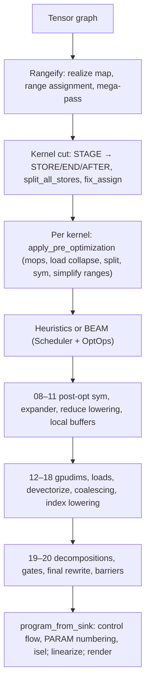

# The Codegen Pipeline

A tensor expression reaches the hardware through four pieces of code, all in the `svod-schedule` crate except the last step:

| Piece | Entry point | Input → output |
|-------|-------------|----------------|
| Rangeify | `rangeify_with_map` (`rangeify/transforms.rs`) | Tensor graph with movement ops → graph of `STAGE` / `INDEX` / `REDUCE` with explicit `RANGE`s |
| Kernel cut | `try_get_kernel_graph` (`rangeify/kernel.rs`) | `STAGE` → `STORE`/`END`/`AFTER`, split into one `CALL` per kernel |
| Per-kernel optimization | `optimize_kernel_with_naming` / `beam_search_cached_remote` (`optimizer/`) | Kernel AST → optimized kernel AST (`apply_pre_optimization`, the heuristics or BEAM, `apply_post_optimization_configured_with_capture`) |
| Program boundary | `program_from_sink` + `do_linearize` (`svod-codegen`, `program_pipeline.rs`) | Kernel AST → control-flow edges → linear instruction list → source / binary |

`tensor/src/realize.rs` chains them: `rangeify_with_map` → `try_get_kernel_graph` → per kernel `optimize_kernel_with_naming` (or BEAM) → `program_from_sink` → `do_linearize` → `do_render` → compile.

Every pass is a `graph_rewrite` over a `patterns!` matcher (see [the pattern engine](../optimizations/pattern-system.md)); the handful of exceptions (`memory_coalescing`, `merge_register_read_ends`, `linearize`) are plain graph walks. Matchers run to a fixpoint, then the next pass starts.

## Vocabulary

- **UOp** — one hash-consed node (`Arc<UOp>`): an op, a dtype, sources. Identical subtrees are the same pointer, so `Arc::ptr_eq` is structural equality.
- **RANGE** — a loop variable `[0, end)`. Its `AxisType` says how it executes: `Weak` (not yet classified), `Loop`, `Global`/`Thread` (grid / CPU core), `Warp`, `Local` (workgroup), `GroupReduce`, `Reduce`, `Upcast`, `Unroll`, `Device` (bound at launch). `AxisType::priority()` orders them outer to inner: Device −2, Weak/Loop −1, Global/Thread 0, Warp 1, Local/GroupReduce 2, Upcast 3, Reduce 4, Unroll 5 (`ir/src/types.rs`).
- **END(x, ranges)** closes ranges; **AFTER(buf, deps)** orders a buffer read after `deps`; **STAGE(compute, ranges, opts)** is "materialize this into a buffer" before the kernel cut decides whether to.
- **STACK** collects lanes into a shaped value; **INDEX(STACK(..), c)** selects one. There is no separate vector op.
- **WeakInt** is the index dtype until `pm_lower_index_dtype` commits it to `i32`/`i64`.
- **Invalid** (`UOp::invalid_marker()`) is the out-of-bounds sentinel; validity rides inside the index as `WHERE(valid, idx, Invalid)` until the late gate pass moves it onto LOAD/STORE.

## Pass map

The numbers are the labels `apply_post_optimization_configured_with_capture` prints under `SVOD_PER_STAGE_UOPS=1`; they match `SVOD_DUMP_STAGE=<prefix>`. Passes before the optimizer have no number — they appear in `tracing` output and `scripts/extract-ir.sh`.

| Label | Matcher / function | Page |
|-------|--------------------|------|
| — | `multi_pm`, `add_tags_patterns`, `resolve_calls`, `movement_op_patterns + early_rewrites + split_reduceop_patterns` (bottom-up) | [Rangeify](./rangeify.md) |
| — | `run_rangeify` (`pm_generate_realize_map`, `assign_ranges`, `apply_rangeify_patterns`) | [Rangeify](./rangeify.md) |
| — | mega-pass: `symbolic + pm_reduce_simplify + movement_op_patterns + buffer_folding + dead_axis_removal + pm_remove_bufferize` | [Rangeify](./rangeify.md) |
| — | `kernel_graph_pre_cut` (`pm_add_buffers_patterns`, `pm_flatten_range`), `split_all_stores`, `fix_assign` | [Rangeify](./rangeify.md) |
| — | `apply_pre_optimization`: `movement_op_patterns` (bottom-up), `pm_load_collapse`, `pm_split_ranges + pm_flatten_range`, `sym + pm_fold_cast_const + pm_flatten_range`, `pm_flatten_range + pm_simplify_ranges` | [Rangeify](./rangeify.md) |
| — | `hand_coded_optimizations` or BEAM | [Kernel search](../optimizations/kernel-search.md) |
| `08-post_opt_sym` | `POST_OPT_SYM = sym + pm_move_where_on_load + pm_flatten_range + pm_reduce_unparented` | [Expander](./expander.md) |
| `09-pre_expand` | `expander2 + pm_flatten_range + mop_cleanup_patterns` | [Expander](./expander.md) |
| `10-pm_reduce` | `movement_cleanup_patterns + pm_reduce_local` | [Expander](./expander.md) |
| `11-local_buffers` | `pm_add_local_buffers` | [Expander](./expander.md) |
| `12-pm_add_gpudims` | `pm_lower_device_ranges`, then `pm_add_gpudims` if `has_local || has_threads` | [Devectorizer](./devectorizer.md) |
| `13-pm_add_loads` | `symbolic_simple + pm_expand_broadcast + pm_add_loads` | [Devectorizer](./devectorizer.md) |
| `14-devectorize` | `symbolic_simple + devectorize_patterns + bool_storage_patterns + indexing_simplify` | [Devectorizer](./devectorizer.md) |
| `15-early_symbolic` | `sym` | [Devectorizer](./devectorizer.md) |
| `16-memory_coalescing` | `memory_coalescing` (graph walk) | [Devectorizer](./devectorizer.md) |
| `17-bottom_up_ew_image` | `symbolic_simple + no_vectorized_alu + pm_simplify_add_image` (bottom-up) | [Devectorizer](./devectorizer.md) |
| `16-extra_symbolic` | `sym + indexing_simplify` | [Devectorizer](./devectorizer.md) |
| `17-pm_lower_index_dtype` | `symbolic_simple + pm_fold_cast_const + pm_lower_index_dtype + indexing_simplify` | [Devectorizer](./devectorizer.md) |
| `18-final_symbolic` | `symbolic` | [Devectorizer](./devectorizer.md) |
| `19-cast_float_alu` | `pm_cast_float_alu` | [Linearizer](./linearizer.md) |
| `19b-early_decompositions` | `early_decomposition_patterns(supported_ops)` | [Linearizer](./linearizer.md) |
| `19c-dtype_decompositions` | `pm_dtype_decomp_commit` (FP8 / f16 / bf16 / i64 emulation) | [Linearizer](./linearizer.md) |
| `19d-late_decompositions` | `early + get_late_rewrite_patterns + get_transcendental_patterns (+ renderer.decomposition_matcher)` | [Linearizer](./linearizer.md), [Strength reduction](../optimizations/strength-reduction.md) |
| `19e-move_gates_from_index` | `pm_move_gates_from_index`, `pm_scalarize_register_stack_index_preserve_deps`, `merge_register_read_ends`, `demote_unsupported_floats` | [Linearizer](./linearizer.md) |
| `20-final_rewrite` | `pm_commit_weak + pm_cast_weak + pm_decomp (+ extra_matcher) + pm_split_ends`, then `pm_remove_invalid`, `add_implicit_barriers` | [Linearizer](./linearizer.md) |
| — | `add_control_flow`, `number_params`, `pre_isel_matcher`/`isel_matcher`, `linearize`, `line_rewrite_cleanups` | [Linearizer](./linearizer.md) |

Two labels repeat (`16`, `17`): the diagnostic uses the names above verbatim, so `SVOD_DUMP_STAGE=16` prints both `16-memory_coalescing` and `16-extra_symbolic`.

:::tip[Where the stage numbers come from]
The labels follow Tinygrad's `codegen/__init__.py` stage list for cross-referencing. They are not contiguous and are not the order of the pages: `10-pm_reduce` lowers reductions *before* `11-local_buffers`, and index lowering is `17`, not `15`.
:::

## Dumping IR

| Switch | Effect |
|--------|--------|
| `SVOD_PER_STAGE_UOPS=1` | Print `[per-stage] <label> : node_count=N` after each post-opt stage |
| `SVOD_DUMP_STAGE=<prefix>` | Also print `UOp::tree()` for every label starting with the prefix (`09`, `19`, or empty for all) |
| `SVOD_DUMP_CANONICAL_STAGE=<prefix>` | Same prefix match, allocation-independent canonical JSON (parity tooling) |
| `SVOD_DUMP_LINEAR=<dir>` | Write `tree_<id>.txt` / `linear_<id>.txt` from `do_linearize` |
| `RUST_LOG=svod_schedule::optimizer=debug` (JSON subscriber) | The same trees as `tracing` fields; `scripts/extract-ir.sh <test> -p <crate>` collates rangeify, pre-opt and post-opt trees into one file |
| `SVOD_SPEC=0` | Skip the `spec` type verification at the pre-opt, final-symbolic and program boundaries |

`UOp::tree()` prints `[id] OP : dtype shape=[..]` with `├── `/`│   `/`└── ` glyphs and `[id] → (see above)` for a node already printed — hash consing makes shared subtrees visible. The [worked example](./worked-example.md) shows the full output for one kernel.
