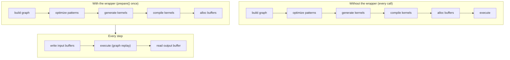

# JIT Graphs

A streaming ASR pipeline calls the same encoder hundreds of times. Building
the tensor graph, optimizing it, generating kernel source, compiling it through
the backend's [JIT loader](../backends/jit-loader.md), and allocating device buffers on
every call wastes work that does not depend on the input.

The `jit_wrapper!` macro turns that build-once / run-many pattern into **a
typed Rust struct**. You declare the inputs and the graph; the macro generates
a wrapper that compiles the graph once during `prepare()` and replays it on
every `execute()` with the device buffers held in place.



The wrapper is a thin layer over `Tensor::prepare_batch_with` and the
`ExecutionPlan` it returns (see the [Execution Pipeline](./pipeline.md)); the
[pattern engine](./optimizations/pattern-system.md) runs at `prepare()` time and
the [JIT loader](../backends/jit-loader.md) turns the kernels into machine code.
This page covers the wrapper and what `execute()` replays.

---

## The `jit_wrapper!` DSL

A wrapper declaration names the struct, the model type the build closure
receives, the inputs the wrapper exposes, optional symbolic shape variables,
and a `build` block that constructs the graph:

```rust
jit_wrapper! {
    MyModelJit(MyModel) {
        input1: Tensor,
        input2: Tensor,

        vars {
            b: (1, model.config.max_batch),
            t: (1, model.config.max_time),
        }

        build(input1, input2, b, t) {
            model.forward(input1, input2, &b, &t)
        }
    }
}
```

| Section | Meaning | Required |
|---|---|---|
| `WrapperName<generics>(ModelType) { ... }` | name of the generated struct (generic parameters allowed, e.g. `RnntBlockJit<const W: usize>`) and the type of the model the build closure receives | yes |
| `name: Tensor` / `name: [Tensor; N]` lines | one per input the wrapper exposes; the type annotation is informational, `N > 0` | optional (usually one or more) |
| `inputs { ... }` | the same slots inside a block, where `#[unbatched]` is also allowed | optional |
| `vars { name: (min, max), ... }` | symbolic shape variables with bounds; the bound expressions run inside `new(model)` and may read `model` | optional |
| `batch_var name: (min, max)` | a var that also shrinks every batched input's dim 0 to it | optional |
| `state { name, ... }` | inputs the plan also writes, recycled in place between calls; requires an `outputs` block | optional |
| `outputs { name, ... }` | one named buffer accessor per output; the `build` closure then returns a tuple of that many tensors, in this order | optional |
| `build(args...) { ... }` | closure that builds the output tensor(s) from inputs, state and vars; `model` is in scope | yes |

The macro rejects, at expansion time, a `build` argument that names nothing
declared, duplicate names across inputs / state / outputs / vars, an output named
after a generated method, `#[unbatched]` on state or without a `batch_var`, and
`state` without `outputs`. Inside the block, each input or state slot is a
`&Tensor` — or a `[&Tensor; N]` for an array slot — backed by a zero-initialized
placeholder the macro allocates on the default device when `prepare()` runs;
each var is a `svod_tensor::BoundVariable` already bound to its upper bound —
pass it on as `&name`; and `model` is a shared reference to the wrapper's owned
model value. The closure returns `Result<Tensor, E>` for any
`E: std::error::Error + Send + Sync + 'static`; failures surface as
`JitError::Build`. The whole build runs under
`OriginScope::label("WrapperName")`, which is why profiles attribute its kernels
to the wrapper's name.

Without an `outputs` block the closure returns a single `Tensor`, reachable
through `output()`. With one, it returns a tuple of exactly that many tensors
and each gets its own named `&Buffer` accessor, positioned by declaration
order. If the scheduler fused or elided one of them the positional accessors
would silently misalign, so `prepare()` fails with
`JitError::OutputCountMismatch` instead.

---

## Array slots, batch variables and state

The block forms of the declaration add three things a streaming model needs.
All of them are optional; a wrapper written against the older flat form keeps
working unchanged.

```rust
jit_wrapper! {
    StepJit(StepModel) {
        inputs {
            x: Tensor,
            #[unbatched] bias: Tensor,
            taps: [Tensor; 3],
        }
        batch_var b: (1, 4),
        state { h: Tensor, tail: [Tensor; 2] }
        outputs { emitted }

        // returns (emitted, h, tail): declared outputs first, then state
        build(x, bias, taps, h, tail) {
            model.step(x, bias, taps, h, tail)
        }
    }
}
```

**`[Tensor; N]` slots** put N buffers behind one name: `prepare` takes
`[InputSpec; N]`, the build closure receives `[&Tensor; N]`, and the generated
accessors take a leaf index — `jit.taps_view_mut::<f32>(1)?`. Outputs may be
arrays too. An input index out of range is `JitError::InputBufferNotFound`; an
output index out of range panics.

**`batch_var b: (min, max)`** declares a symbolic variable *and* shrinks every
batched input's dim 0 to it once the placeholders are realized, so one plan
serves a range of batch sizes. `#[unbatched]` opts an input out — a shared bias
or a table whose leading axis is not the batch — and state slots are never
shrunk. Bind it per call with the generated `execute_bound(4)`.

**`state { ... }`** slots are inputs the plan also writes. The build tuple
carries a new value for each, the macro assigns it straight back into that
slot's own device-local buffer, and the next `execute()` reads it there — a
recurrence that never round-trips through the host. State slots take their own
`InputSpec` in `prepare()` (after the inputs), have a `<state>_mut()` accessor
but no typed view, are not exposed as outputs, and `reset()` zeros all of them
for a fresh sequence.

The build tuple has one element per declared output slot plus one per state
slot — and no tuple at all when there is exactly one of them.

---

## Symbolic variables

A `vars { ... }` block declares values that participate in the graph as shape
or index expressions but whose exact value is supplied at execute time. They
let one prepared plan serve a range of input shapes without recompiling.

Each entry `name: (min, max)` generates three configuration setters on the
wrapper:

| Setter | Effect |
|---|---|
| `with_<name>_bound(max)` | override only the upper bound; panics if `max < min` |
| `with_<name>_min_bound(min)` | override only the lower bound; panics if `min > max` |
| `with_<name>_fixed(value)` | pin both bounds to `value`, turning the var into a JIT-time constant; panics on `value == 0` |

All three return `Self` (builder style) and must be called before `prepare()`
because the build closure captures the bounds when it runs.

A wider range generates a more general kernel that has to handle every shape
in the range; a tighter range lets the optimizer specialize. Pin a var with
`with_<name>_fixed` when the value never changes, and shrink the upper bound
when an outer caller advertises a smaller maximum than the model's hard
ceiling.

At execute time, pass actual values through `execute_with_vars`, or through
`execute_bound`, which takes one `i64` per declared variable in declaration
order and forwards to it:

```rust
jit.execute_with_vars(&[("b", batch as i64), ("t", time as i64)])?;
jit.execute_bound(batch as i64, time as i64)?;   // same thing, positionally
```

Each pair binds one var; vars not listed keep whatever they hold — their
`prepare()`-time upper bound, or the value a previous `execute_with_vars` left
them at. Bindings are sticky, not per-call. The plan checks every value against
the var's declared `[min, max]` and rejects a value outside it with
`JitError::Runtime` before dispatching anything. Names the plan does not know
are ignored.

---

## Generated runtime API

The macro emits one method group per phase of the wrapper's life cycle:

| Method | Phase | Notes |
|---|---|---|
| `new(model)` | construction | takes the model by value; evaluates the var bounds; no kernels compiled yet |
| `with_<var>_bound` / `with_<var>_min_bound` / `with_<var>_fixed` | between `new` and `prepare` | configure shape envelope |
| `prepare(input1: InputSpec, ..., state1: InputSpec, ...)` | one-time | build graph, run patterns, compile kernels, allocate buffers; reads `PrepareConfig::from_env()` |
| `prepare_with_config(..., &PrepareConfig)` | one-time | same as `prepare` with an explicit config |
| `<input>_mut([i]) -> Result<&mut Buffer>` | per step | raw buffer for each declared input or state slot (`i` for array slots) |
| `<input>_view_mut::<T>([i]) -> Result<ArrayViewMutD<T>>` | per step | typed write view over an input buffer, dtype-checked |
| `output() -> Result<&Buffer>` | per step | the plan's first output |
| `<output>([i])` / `<output>_shape()` / `_view::<T>()` / `_to_vec::<T>()` | per step | named output buffer, its live shape and reads, resolved against the current variable bindings |
| `reset() -> Result<()>` | per step | zero every `state` slot (generated only with `state`) |
| `execute() -> Result<()>` | per step | replay with current input buffers |
| `execute_bound(v1, v2, ...) -> Result<()>` | per step | replay, binding each declared variable positionally (generated only with vars) |
| `execute_with_vars(&[(name, value)]) -> Result<()>` | per step | replay and rebind one or more symbolic variables |
| `execute_profiled` / `execute_with_vars_profiled` | optional | same as the non-profiled variants but return `Vec<KernelProfile>` |
| `execute_profiled_static()` | optional | one profiled run through `ExecutionPlan::profile`, returning the last stage's kernels |
| `copy_output_to_<input>([i,] out_pos, dst_off, src_off, len)` | per step | on-device copy of an output region back into an input buffer; no host round-trip; fails if the two share storage |
| `replicate() -> Result<Self>` | optional | deep-copy a prepared JIT for concurrent execution (below) |

Four lower-level accessors expose plan details for tooling:

| Accessor | Returns |
|---|---|
| `buffers()` | every buffer the plan owns |
| `output_buffers()` | the plan's declared output buffers |
| `input_buffer_ids()` | device buffer ids the wrapper writes to |
| `prepared_kernels()` | the compiled kernels |

Most callers do not need these. Calling any per-step method before `prepare()`
returns `JitError::NotPrepared`.

`replicate()` shares the model (`Arc`) and the compiled kernels, snapshots the
bytes of every input and state buffer, forks the storage the plan writes
(intermediates, outputs) without copying it, re-mints arena views so aliasing is
preserved, and gives the replica a fresh queue, graph and timelines. Replicate
while the source plan is idle: the snapshot is not synchronized with in-flight
work.

---

## `InputSpec`

`InputSpec`, `JitError` and the buffer helpers the macro expands to live in
`svod_tensor::jit`, so a crate hosting a `jit_wrapper!` needs only that
dependency (`svod_model::jit` re-exports them for the historical paths).

`prepare()` takes one `InputSpec` per declared input and state slot — or one
`[InputSpec; N]` per array slot:

```rust
pub struct InputSpec {
    pub shape: Vec<usize>,
    pub dtype: DType,
    /// Allocate the input device-local (no host mapping).
    pub device_local: bool,
}

impl InputSpec {
    pub fn new(shape: &[usize], dtype: DType) -> Self { ... }
    pub fn f32(shape: &[usize]) -> Self { ... }
    pub fn i32(shape: &[usize]) -> Self { ... }
    pub fn i64(shape: &[usize]) -> Self { ... }
    pub fn device_local(mut self) -> Self { ... }
    pub fn numel(&self) -> usize { ... }
}
```

The macro uses the shape and dtype to allocate a zero-initialized placeholder
tensor on the default device before invoking the build closure. Callers do not
construct `Tensor::zeros(...).realize()` placeholders themselves. The shape
becomes the maximum input size; symbolic variables shrink it at execute time
through operations like `try_shrink` — a coding pattern, not a runtime contract
enforced by the wrapper. `InputSpec::device_local()` drops the host mapping for
inputs the host only writes through `copyin` / `copy_from` or refills on-device;
`state` slots are allocated that way automatically. On the output side,
`PrepareConfig::device_local()` is the same idea for the plan's outputs — it is
`from_env()` with `device_local_outputs` set.

---

## Graph capture and replay

`execute()` is `ExecutionPlan::execute()`. On a GPU the plan does not re-walk
its kernels every call: the first `execute()` **captures** the dispatch sequence
into a device graph, and every later call **replays** it, patching only the
kernel arguments that changed since capture (buffer addresses, variable
values). Capture is lazy and per plan; `replicate()` starts with a fresh one.

A plan is captured only if every op is a compiled kernel on the plan's device
with no unbound symbolic variable. Runtime variables, buffer copies and custom
functions all disable it — so every `batch_var` / `vars` wrapper runs through
the fallback path below, while a fixed-shape wrapper (the GigaAM encoder, the
Silero front-end, the Whisper decoder step) replays a graph. Dependencies
inside the graph are read/write hazards over **byte ranges**, because the
memory planner packs intermediates into arena views that alias.

| Backend | Mechanism | Notes |
|---|---|---|
| CUDA | `cuGraphAddKernelNode` DAG, `cuGraphInstantiate`, `cuGraphLaunch` | on by default; `cuGraphExecKernelNodeSetParams` patches only nodes whose arguments changed; a buffer-aliasing change re-captures |
| AMD | one linked HCQ/PM4 command stream with graph-owned kernarg storage, replayed by a single doorbell | AQL queues (multi-XCC parts, or `SVOD_AMD_AQL=1`) capture by default; PM4 capture is opt-in with `SVOD_PM4_GRAPH=1` |
| Metal | `MTLIndirectCommandBuffer` with per-command barriers, one `executeCommandsInBuffer` per replay | declines when any kernel takes scalar arguments or on a virtualized GPU; waits for the previous replay before rebinding |
| CPU | — | no graph factory; kernels are called directly |

**Fallbacks.** When no graph is used, AMD plans — including dynamic-shape ones —
are captured as a *linked plan*: one command stream whose kernel arguments and
launch dimensions are repacked on every replay. Everywhere else the plan walks
its levels in order and submits each kernel to the plan's own queue
(asynchronously on GPUs; `wait` only at the end). `execute_profiled` uses the
graph's profiled variant when one exists, otherwise per-dispatch timestamps.

---

## Recurrent execution

A recurrent model's state stays on the device: declare it in `state { ... }`
and every step is one `execute()`, with no host round trip and no packing
helper.

```rust
jit.reset()?;                                    // zero the state, new sequence
for chunk in chunks {
    for (slot, v) in jit.x_view_mut::<f32>()?.iter_mut().zip(chunk) {
        *slot = v;                               // per-step input, written in place
    }
    jit.execute()?;                              // reads state, writes it back
    let frame = jit.emitted_to_vec::<f32>()?;    // only the emitted head crosses
}
```

:::tip[Read-before-write ordering]
Each state buffer is recycled in place, so a slot must not depend on another
slot's *new* value inside one `build`: the per-buffer ordering is only
unambiguous when every slot advances from the values the step was entered
with. Derive the new values from the inputs and the old state, then return
them all in the build tuple.
:::

The state buffers are allocated device-local, so nothing maps them to the
host. Read back only what the caller actually needs — the declared outputs —
through `<output>_to_vec` or `<output>_view`. In-tree examples:
`RnntBlockJit<const W: usize>` (`state { time, prev, symbols, h, c }`),
`FireRedVadStreamJit` (`state { caches: [Tensor; 8] }`) and `GtcrnStreamJit`.

---

## Example: GigaAM encoder

The GigaAM Conformer encoder is prepared at constant shape. The batch and
mel-frame bounds are computed once at construction and baked into the plan;
shorter chunks are zero-padded into the same buffers:

```rust
jit_wrapper! {
    GigaAmEncoderJit(GigaAm) {
        mel: Tensor,
        lengths: Tensor,

        outputs { frames },

        build(mel, lengths) {
            let out = model.encoder.forward_batch(mel, lengths)?;
            // Permute [B, d_model, T_sub] → [B, T_sub, d_model] on-device: the
            // RN-T decoder consumes frame-major rows, and doing it here turns
            // the host-side strided transpose over the slow mapping into one
            // contiguous copyout.
            Ok::<_, super::error::Error>(out.cast(svod_dtype::DType::Float32).try_permute(&[0, 2, 1])?)
        }
    }
}
```

The wrapper takes a mel-spectrogram input and a per-batch length vector and
produces `frames: [B, T_sub, d_model]`, which the RN-T decoder reads with
`frames()?.copyout_prefix(..)`. (The CTC head uses a sibling, `GigaAmCtcJit`,
whose single output is `log_probs`.) `GigaAmTranscriber` sizes the plan once:
the mel length is rounded up to the next power of two so codegen sees a clean
factorisation and clamped to `config.max_mel_frames`, and the batch is capped so
the live SDPA score tiles stay inside `max_scores_mib` (`SVOD_MAX_SCORES_MIB`,
default 256). The mel input is `InputSpec::f32(..).device_local()` and is filled
on-device from the mel JIT's output with `mel_mut()?.copy_from(..)`; the plan is
prepared with `PrepareConfig::device_local()`. Every chunk then replays the same
plan through `execute()`.

`cast` is infallible, so it needs no `?`, and the model's error type absorbs
the tensor error with a plain `?` — the build closure returns
`Result<_, E>` for any `E: std::error::Error + Send + Sync + 'static`.

The `out.cast(DType::Float32)` is the fp32 boundary between the
encoder and any downstream head. The encoder may run in fp16 or bf16 for
speed, but every consumer (CTC log-softmax, RN-T predictor and joint) sees a
uniform fp32 input. Placing the cast inside the JIT lets it fuse into the
encoder's tail kernels.

---

## Example: Silero VAD

Silero V5 is a recurrent network, but its recurrence is far too small to pay
for a launch per window. The JIT therefore covers only the batched conv
front-end plus the LSTM input projection; the scan itself stays on the host:

```rust
jit_wrapper! {
    SileroVadFeatureJit(SileroVad) {
        chunks: Tensor,

        build(chunks) {
            // [FEATURE_BATCH, CHUNK_LEN] -> [FEATURE_BATCH, 4*HIDDEN] LSTM gate
            // pre-activations (conv features + input projection, biases folded).
            // Fixed batch (not a runtime var): the front-end is row-independent,
            // so partial batches just fill fewer rows and ignore the rest — and
            // a symbolic leading dim trips the reflect-pad lowering.
            model.forward_gates(chunks)
        }
    }
}
```

The leading dimension is a fixed `FEATURE_BATCH` (4096) rather than a var: the
front-end is row-independent, so a partial batch simply fills fewer rows, and a
symbolic leading dim trips the reflect-pad lowering. Preparation asks for a
device-local output, because the 8 MiB gate readback belongs on the copy engine
rather than the host mapping:

```rust
let mut jit = SileroVadFeatureJit::new(vad);
jit.prepare_with_config(
    InputSpec::f32(&[FEATURE_BATCH, CHUNK_LEN]),
    &svod_tensor::PrepareConfig::device_local(),
)?;
```

`VadInference::probs` then walks the waveform in `FEATURE_BATCH`-sized
dispatches — pack `chunks_view_mut::<f32>()`, `execute()`, `copyout_prefix` the
valid rows — and hands the gates to `VadHead::scan`, an LSTM plus sigmoid head
vectorized at the widest SIMD width the host CPU has. That split replaced a
one-tiny-dispatch-per-window path whose round-trip latency dominated the whole
model.

---

## Data-independence contract

The wrapper compiles the graph once and replays it many times. That only
works if the graph topology is fixed at `prepare()` time. Anything that can
change at execute time has to flow through input buffers (via `*_mut`) or
symbolic vars (via `execute_with_vars`). A branch on a tensor value inside
the build closure specializes the graph to that branch; this is a build-time
decision, not a runtime one.

:::note[Pitfalls]
- A `Tensor::full(value).realize()` inside the build closure bakes that value
  into the single prepared plan. Any per-call variation requires re-running
  `prepare()` from scratch — full graph build plus kernel compile. Host-side
  scratch buffers (for example `ndarray::Array3`) are the right choice for
  per-step setup that the JIT does not need to see.
- The idiomatic way to handle a dynamic batch is `batch_var`, which shrinks
  dim 0 of every batched input for you; bind it per call with
  `execute_bound`. ResNet and YOLO26 are both one `images` input, one
  `batch_var b: (1, model.config.max_batch_size)` and one output. For any
  other dynamic axis, `try_shrink` on a maximum-sized input with a var-bound
  length plus `execute_with_vars` at the call site is the manual equivalent.
- A dynamic var costs graph replay: the plan falls back to per-call dispatch
  (or AMD's linked plan). Pin vars with `with_<var>_fixed` when a deployment
  never varies them.
:::

Violating the contract produces one of two failure modes: wrong results,
because the cached plan replays with a stale assumption about a value that
turned out to vary; or silent slowness, because every call ends up in a
recompile path. Diagnose these by re-reading the build closure; kernel output
rarely helps.

---

## Errors

`JitError` covers the runtime failures the wrapper can raise. Most are
unrecoverable and indicate a usage bug rather than a transient condition.

| Variant | Triggered by |
|---|---|
| `NotPrepared` | per-step method called before `prepare`, or output buffer unavailable |
| `InputBufferNotFound` | input index resolution failed inside the prepared plan, or an array-slot index out of range |
| `DuplicateInputBuffer` | two declared inputs map to the same device buffer at `prepare` time |
| `InputAliased` | an input resolved to a foreign plan buffer — a concurrent `prepare` corrupted its graph identity |
| `Build` | the build closure returned `Err`; the inner error is preserved as `Box<dyn Error + Send + Sync>` |
| `Tensor` | tensor op failed during `prepare` or in the build closure |
| `Device` | a device or buffer operation failed |
| `OutputCountMismatch` | a wrapper declared N output plus state slots but the compiled plan kept a different number |
| `DtypeMismatch` | a typed view or read asked for a dtype the buffer does not hold |
| `ViewOutOfBounds` | a live output shape needs more bytes than its buffer holds — the bound variables exceed what the plan was compiled for |
| `InferredOutputDim` | an output shape carried a `-1` dimension, which has no live value to substitute |
| `Runtime` | kernel execution failed, or a variable was bound outside its `[min, max]` |

Configuration mistakes on the symbolic-variable setters (`with_<var>_*`)
panic at the call site instead of returning an error, since they happen
before any plan exists.

---

## Why this matters

**Lifecycle is explicit.** `prepare` is the only way into the prepared state,
and every per-step accessor goes through it. The wrapper holds the plan behind
an `Option`, so calling out of order fails immediately with
`JitError::NotPrepared` rather than reading a half-built plan.

**Replay is cheap.** One graph build, one kernel compile, one set of
allocations — paid once. Every subsequent call is buffer writes plus a graph
launch.

**Contract is local.** The data-independence rule is the single invariant
that lets the wrapper skip the per-call dance safely. Every other guarantee
follows from it.

**Errors are explicit.** Runtime failures surface as `JitError` variants;
only configuration-time misuse on the variable setters still panics.

The wrapper does not invent new primitives. It takes the build / prepare /
execute cycle and gives it a shape that the type system can hold, so
streaming inference runs at the speed of one-shot evaluation without the
per-call overhead.
