# Op Bestiary: A Field Guide to UOp Operations

When debugging Svod IR dumps, you'll encounter operations that aren't obvious from their names. This chapter documents the non-trivial operations with their exact fields (as declared in `ir/src/op.rs`), the metadata structs they carry (`ir/src/types.rs`), and examples.

**What's covered:** Operations that require explanation—loop control, reductions, memory operations, kernel structure, vectorization, tensor cores.

**What's NOT covered:** Trivial ALU operations (`Add`, `Mul`, `Sqrt`, etc.) that work exactly as you'd expect. `Op` has 60 variants; three of them (`Unary`, `Binary`, `Ternary`) carry an op kind, so counted per kind there are about 100 operations.

Node labels in the examples use the `UOp::tree()` spelling: `[id] NAME : dtype`, so `RANGE(R0, Global)` is a renumbered axis `R0` of type `Global`, and `[10] → (see above)` is a shared node printed earlier.

---

## Loop Control: RANGE and END

### RANGE — Loop Scope Opener

```rust
Range {
    end: Arc<UOp>,           // loop bound (exclusive)
    axis_id: AxisId,         // identifier for deduplication
    axis_type: AxisType,     // scheduling behavior
    deps: SmallVec<[Arc<UOp>; 2]>,  // range dependencies
}
```

**Fields:**

| Field | Type | Purpose |
|-------|------|---------|
| `end` | `Arc<UOp>` | Upper bound (exclusive), typically a `CONST` or a symbolic expression |
| `axis_id` | `AxisId` | `Unrenumbered(n)` (printed `U<n>`) before kernel splitting, `Renumbered(n)` (`R<n>`) after; the `UnrenumberedPath` / `RenumberedPath` forms (`U0_1`) identify a range derived structurally from a parent range |
| `axis_type` | `AxisType` | Determines how the loop is scheduled (see below) |
| `deps` | `SmallVec<[Arc<UOp>; 2]>` | Other ranges this range depends on |

**AxisType Hierarchy** (`AxisType::priority()`; `Ord` compares by it, lower values are outer loops):

| Type | Priority | Letter | Lowered to | Purpose |
|------|----------|--------|------------|---------|
| `Placeholder` | -3 | `P` | — | Transient canonical range used during RESHAPE caching |
| `Device` | -2 | `d` | per-device bind at launch | Device-selection dimension of a multi-device tensor |
| `Weak` | -1 | `L` | serial `for` loop | Unparallelized range produced by rangeify; what the optimizer picks from |
| `Loop` | -1 | `L` | serial `for` loop | Explicit regular loop; schedule-level wrappers paired with `END(CALL)` |
| `Global` | 0 | `g` | `gidx` (`SPECIAL`) | GPU grid dimension |
| `Thread` | 0 | `t` | `gidx` (`SPECIAL`) | CPU work-item dimension, dispatched over the thread pool |
| `Warp` | 1 | `w` | leading local dimension | Hardware lane; `mma.sync` fragments address by it |
| `Local` | 2 | `l` | `lidx` (`SPECIAL`) | GPU workgroup dimension |
| `GroupReduce` | 2 | `G` | local dimension + shared-memory stage | Two-stage reduction |
| `Upcast` | 3 | `u` | vector lanes (`STACK`) | Vectorization |
| `Reduce` | 4 | `R` | accumulator loop | Reduction dimension |
| `Unroll` | 5 | `r` | unrolled copies | Loop unrolling |

`is_parallel()` is `Global | Thread | Local | Warp`; `is_reduce()` is `Reduce | GroupReduce | Unroll`. `pm_add_gpudims` turns `Global`/`Thread` ranges into the global `SPECIAL`s and `Local`/`Warp`/`GroupReduce` ranges into the local ones; the CPU renderer has `has_threads` but no `has_local`, so it only ever sees `Thread`. Kernel-boundary framing is structural via `CALL`/`FUNCTION`, not a dedicated axis type. The letters are what kernel names such as `r_128_3_32_4…` are built from.

**Example:**
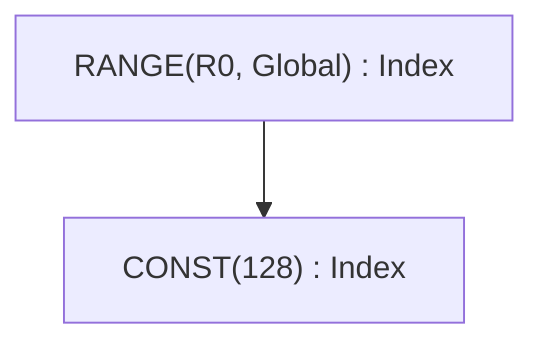

### END — Loop Scope Closer

```rust
End {
    computation: Arc<UOp>,              // value computed inside loop
    ranges: SmallVec<[Arc<UOp>; 4]>,    // ranges being closed
}
```

END closes one or more RANGE scopes and removes them from the active set. Multiple ranges can be closed simultaneously.

**Example:**
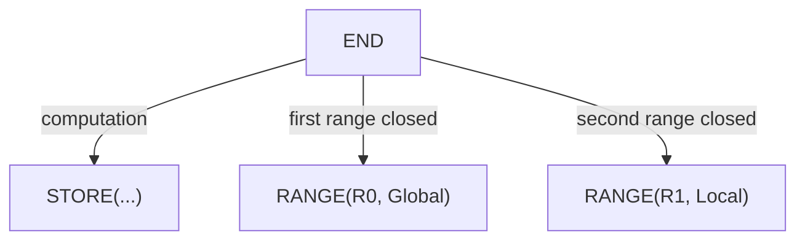

---

## Reduction: REDUCE vs REDUCE_AXIS

Two operations with similar names serve different purposes.

### REDUCE_AXIS — Tensor Dimension Reduction (High-Level)

```rust
ReduceAxis {
    src: Arc<UOp>,           // input tensor
    reduce_op: ReduceOp,     // Add, Mul, Max, Min
    axes: Vec<usize>,        // axes to reduce
}
```

Used **before** rangeify. Operates on tensor dimensions like NumPy's `.sum(axis=0)`.

**Example:**
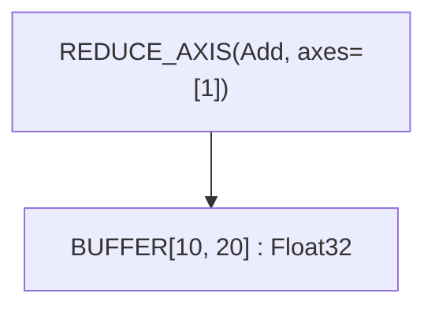

This reduces a `[10, 20]` tensor to `[10]` by summing along axis 1.

### REDUCE — Range Iteration Reduction (Low-Level)

```rust
Reduce {
    src: Arc<UOp>,                      // value to accumulate
    ranges: SmallVec<[Arc<UOp>; 4]>,    // ranges being reduced
    reduce_op: ReduceOp,                // Add, Mul, Max, Min
    num_axes: usize,                    // reduced axes of the shaped source
}
```

Used **after** rangeify. Accumulates values across RANGE iterations and closes the specified ranges. The tree prints it as `REDUCE(Add, num_axes=1, ranges=[30])` with the ids of the ranges it closes.

**ReduceOp Variants:**

| Op | Identity | Operation | Tinygrad |
|----|----------|-----------|----------|
| `Add` | 0 | `acc + value` | ✓ |
| `Mul` | 1 | `acc * value` | ✓ |
| `Max` | -∞ | `max(acc, value)` | ✓ |
| `Min` | +∞ | `min(acc, value)` | Svod-only |

> **Compatibility:** Tinygrad's spec restricts REDUCE_AXIS to `{Add, Mul, Max}`. Svod extends this with `Min`.

**Example:**
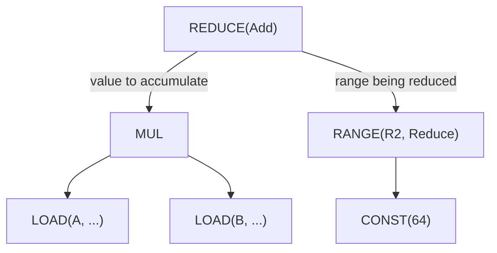

### ALLREDUCE — Cross-Device Reduction

```rust
AllReduce {
    src: Arc<UOp>,           // local partial result
    device: DeviceSpec,      // device specification
    reduce_op: ReduceOp,     // reduction operation
}
```

Performs distributed reduction across multiple devices. Used for multi-GPU training.

---

## Buffer Operations

### BUFFER — Buffer Declaration

```rust
Buffer {
    shape: Arc<UOp>,         // flat storage shape (one element count)
    arg: Box<ParamArg>,      // slot, dtype, address space, device
}
```

Declares a buffer for tensor storage. `ParamArg` is shared with `PARAM`:

| Field | Type | Purpose |
|-------|------|---------|
| `slot` | `usize` | Distinguishes buffers of identical size/device; the kernel argument position for a `PARAM` |
| `dtype` | `DType` | Element type |
| `addrspace` | `Option<AddrSpace>` | `Global` for device memory, `Local` for GPU shared memory (LDS), `Reg` for a register/scratch allocation; `None` for a scalar parameter |
| `device` | `Option<DeviceSpec>` | Device the buffer lives on; `None` for `Local`/`Reg` |
| `name`, `vmin_vmax`, `multiple_of` | `Option<_>` | Scalar-parameter metadata: name and value bounds (`UOp::scalar_param`) |
| `axis` | `Option<usize>` | Shard axis of a multi-device buffer |
| `volatile` | `bool` | Reads must not be hoisted or merged |

### STAGE — Materialization Marker

```rust
Stage {
    compute: Arc<UOp>,                  // computation to materialize
    ranges: SmallVec<[Arc<UOp>; 4]>,    // output dimensions
    opts: Box<BufferizeOpts>,           // address space, device
}
```

Marks where computation should materialize to memory. Triggers kernel splitting.

**BufferizeOpts:**

| Field | Type | Purpose |
|-------|------|---------|
| `device` | `Option<DeviceSpec>` | Target device, `None` for local |
| `local_axis` | `Option<AxisId>` | `GroupReduce` axis that owns a LOCAL staging buffer |
| `addrspace` | `AddrSpace` | `Global` (device) or `Local` (shared) |
| `removable` | `bool` | When `false`, `buffer_removal` is forbidden from inlining this STAGE — used at multi-consumer realize boundaries to keep the buffer fixed across mega-pass fixpoint iterations |

**Example:**
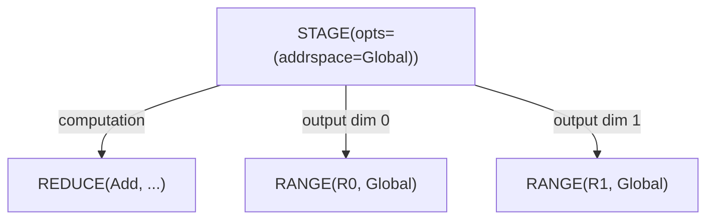

### INDEX — Multi-Dimensional Buffer Access

```rust
Index {
    buffer: Arc<UOp>,                   // BUFFER, PARAM or STACK
    indices: SmallVec<[Arc<UOp>; 4]>,   // index per dimension
}
```

Computes memory address from multi-dimensional indices. Returns element dtype (not pointer). An index can be made conditional with `idx.valid(cond)`, which wraps it in `WHERE(cond, idx, INVALID)` — `INVALID` is the poison constant `CONST(Invalid)` of dtype `Bool`, printed as `INVALID` by the tree. INDEX over a `STACK` selects a lane instead of an address: a constant scalar index folds directly to the stacked source.

**Example:**
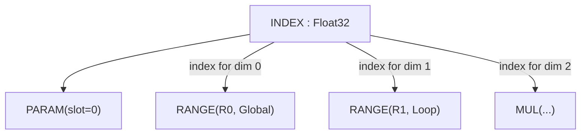

### LOAD — Memory Read

```rust
Load {
    index: Arc<UOp>,         // INDEX op (buffer accessed via the INDEX)
    alt: Option<Arc<UOp>>,   // alternative value for gated loads
    gate: Option<Arc<UOp>>,  // predicate for gated loads
}
```

Read value from buffer at index; there is no separate `buffer` field, the buffer is reached through the INDEX node. For gated loads, `alt` provides the value when `gate` is false (avoiding the memory access entirely). `alt` and `gate` are always set together: a load carries both or neither, the gate is `Bool`, and `alt` may be the `INVALID` marker. Renderers require a single-axis `INDEX`, so multi-index accesses must be flattened before the load reaches code generation.

**Example:**
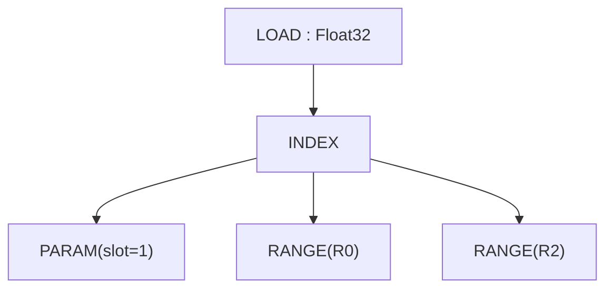

### STORE — Memory Write

```rust
Store {
    index: Arc<UOp>,                    // INDEX op (buffer accessed via index.src[0])
    value: Arc<UOp>,                    // value to write
    gate: Option<Arc<UOp>>,             // predicate for gated stores
}
```

Write value to buffer. The buffer is accessed through the INDEX node (via `index.src[0]`), not a separate field. `Upcast` and `Unroll` remain range axis types through expansion.

For gated stores, `store_gated` sets `gate`; `pm_move_gates_from_index` is what lifts a gate off the address expression onto the LOAD/STORE.

> **Compatibility:** Svod's STORE has no separate `buffer` field—sources are: index=0, value=1. Unlike a STAGE or a REDUCE, a STORE does not close ranges.

**Example:**
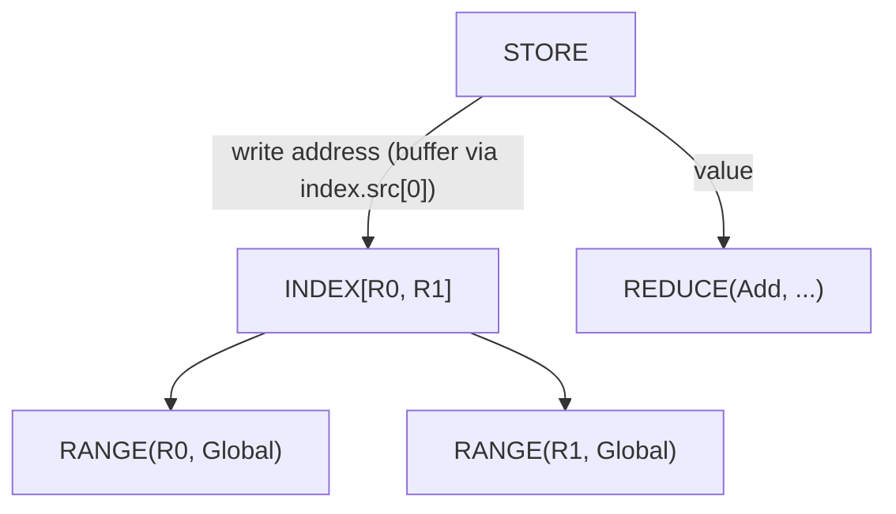

---

## Kernel Structure & Callable IR

Schedule-level work is expressed as a callable IR mirroring tinygrad's
`CALL`/`FUNCTION`/`PROGRAM` model: a `Function` defines a body (typically a
`Sink` of stores) parametrized by arguments, a `Call` invokes it with concrete
arguments, and a `Program` carries the body through the strict
`SINK → LINEAR → SOURCE → BINARY` compilation staging. There is no `KERNEL`
op: a kernel is a `CALL` whose body is a `SINK[KERNEL]` (a SINK carrying
`KernelInfo`).

### CALL — Invoke a Function Body

```rust
Call {
    body: Arc<UOp>,                     // FUNCTION (or its body)
    args: SmallVec<[Arc<UOp>; 4]>,      // concrete argument values
    info: Box<CallInfo>,                // annotations (name, origin, ...)
}
```

Invokes a callable body with arguments. Range-ending: closes any `Range`
operations in `args` (range_start_index = 1; `body=0`, `args=1+`).

`CallInfo` carries cache-key-safe annotations:

| Field | Type | Purpose |
|-------|------|---------|
| `name` | `Option<String>` | Human-readable callable name |
| `grad_tag` | `Option<String>` | Reserved for gradient-callback identity |
| `origin` | `Option<OriginId>` | Origin of the stored value's root — what the kernel is charged to |
| `origins` | `OriginSet` | Every origin reachable in the body before it was stripped |
| `precompile` / `precompile_backward` | `bool` | Eager-compile hints |

The kernel CALL is where a dispatch keeps the attribution the profiler rollups read; see
[Kernel Origins](./kernel-origins.md).

### FUNCTION — Reusable Body

```rust
Function {
    body: Arc<UOp>,                     // computation
    args: SmallVec<[Arc<UOp>; 4]>,      // formal parameters
    info: Box<CallInfo>,
}
```

A reusable callable. Its dtype is always `Void`; bodies that return multiple
values are wrapped in a `Tuple` so the function boundary stays Void. Same
range-ending shape as `Call`.

### TUPLE / GET_TUPLE — Multi-Value Returns

```rust
Tuple { src: SmallVec<[Arc<UOp>; 4]> }
GetTuple { src: Arc<UOp>, index: usize }
```

`Tuple` packs heterogeneous values; its dtype is always `Void`. `GetTuple`
extracts element `index` from a `Tuple` (or from a `Function` whose body is a
`Tuple`); its dtype matches the inner element. Used to thread multiple
outputs through the otherwise-Void function boundary.

### PROGRAM — Compile-Pipeline Container

```rust
Program {
    sink: Arc<UOp>,                     // root SINK
    info: Box<ProgramInfo>,             // name, launch dims, ABI slots, target
    linear: Option<Arc<UOp>>,           // LINEAR (after linearize)
    source: Option<Arc<UOp>>,           // SOURCE (after render)
    binary: Option<Arc<UOp>>,           // PROGRAM_BINARY (after compile)
}
```

Carries a kernel through the `SINK → LINEAR → SOURCE → PROGRAM_BINARY`
staging enforced by `codegen/src/program_pipeline.rs`
(`do_linearize`/`do_render`/`do_compile`/`get_program`). Each stage fills in
the next field. `ProgramInfo` holds `name`, the symbolic `global_size` /
`local_size`, the `vars` the kernel takes, the `globals` / `outs` / `ins`
buffer slots and the `target` device. The C/LLVM renderers expect `Op::Linear`
input and surface `Error::InvalidGraph` via per-context `pending_error` rather
than panicking; a multi-index `INDEX` reaching a renderer is rejected the same
way, so indices must already be flattened to a single axis.

### LINEAR — Linearized Op Stream

```rust
Linear { ops: SmallVec<[Arc<UOp>; 8]> }
```

Flat sequence of ops produced by linearization. Consumers iterate `ops`
directly without re-walking the graph.

### SOURCE / PROGRAM_BINARY — Compilation Artifacts

```rust
Source { code: String, identity: Option<Box<SourceStageIdentity>> }
ProgramBinary { bytes: Vec<u8>, identity: Option<Box<BinaryStageIdentity>> }
```

Terminal stages of the program pipeline. Both are leaves (no children). The
optional `identity` is the semantic proof that binds a stage to the exact
preceding one (`SourceStageIdentity` carries the ABI, target, entry name and
the LINEAR/SOURCE digests; `BinaryStageIdentity` wraps it with the compiler key
and the binary digest), so a cached artifact cannot be reused across a changed
graph. The tree prints the binary as `BINARY(len=…, identity=…)`.

### SINK — Multiple Root Collector

```rust
Sink {
    sources: SmallVec<[Arc<UOp>; 4]>,
    info: Option<Box<KernelInfo>>,      // structural marker for kernel ASTs
}
```

Collects multiple outputs into a single root. A `Function`'s body is
typically a `Sink` of stores. The `info` field is a hash-consed structural
marker that distinguishes kernel-AST SINKs (printed `SINK[KERNEL]`) from
otherwise-identical bare SINKs. `KernelInfo` carries `opts_to_apply`
(`None`: the optimizer chooses; `Some([])`: hand-lowered, leave untouched;
`Some(opts)`: apply exactly these), the `applied_opts`, `dont_use_locals` and
the kernel `name`.

**Example:**
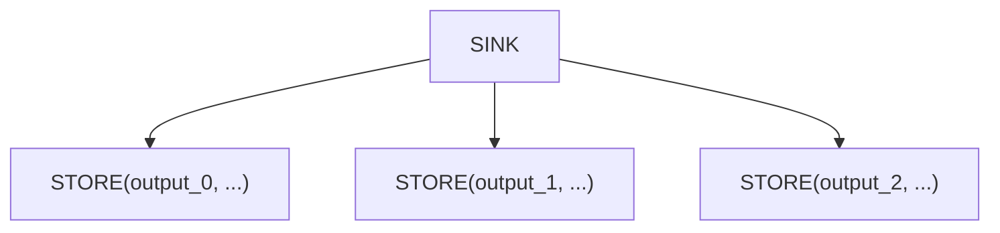

### AFTER — Dependency Marker

```rust
After {
    passthrough: Arc<UOp>,              // value that flows through
    deps: SmallVec<[Arc<UOp>; 4]>,      // operations that must complete
}
```

Expresses execution dependencies between kernels without data dependency. The `passthrough` value is returned unchanged, but only after all `deps` complete.

**Example:**
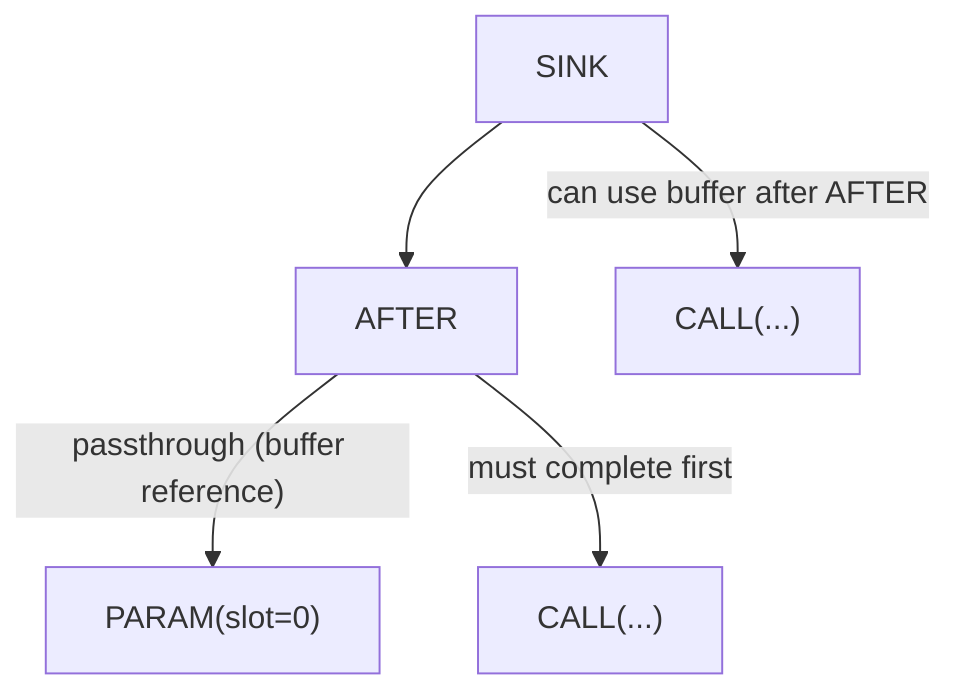

### BARRIER — Synchronization Fence

```rust
Barrier {
    src: Arc<UOp>,                      // value passing through
    deps: SmallVec<[Arc<UOp>; 4]>,      // operations to wait for
}
```

GPU workgroup synchronization. Ensures all threads in a workgroup reach the barrier before continuing.

---

## Vector Operations

### STACK — Build a Shaped Value from Lanes

```rust
Stack {
    sources: SmallVec<[Arc<UOp>; 4]>,
}
```

Combines N values into one shaped value of N lanes. The element dtype stays
scalar — the lane count is carried by the STACK itself, not by widening the
dtype — and sources are cast to the promoted dtype on construction.

**Example:**
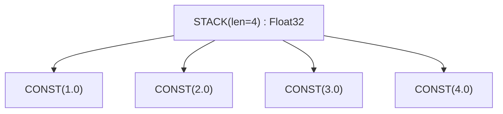

### Lane Selection — INDEX over a STACK

There is no separate extract operation. `INDEX` selects a lane from a `STACK`
exactly as it selects an address from a buffer, and a constant index folds
straight to the stacked source at construction time.

**Example:**
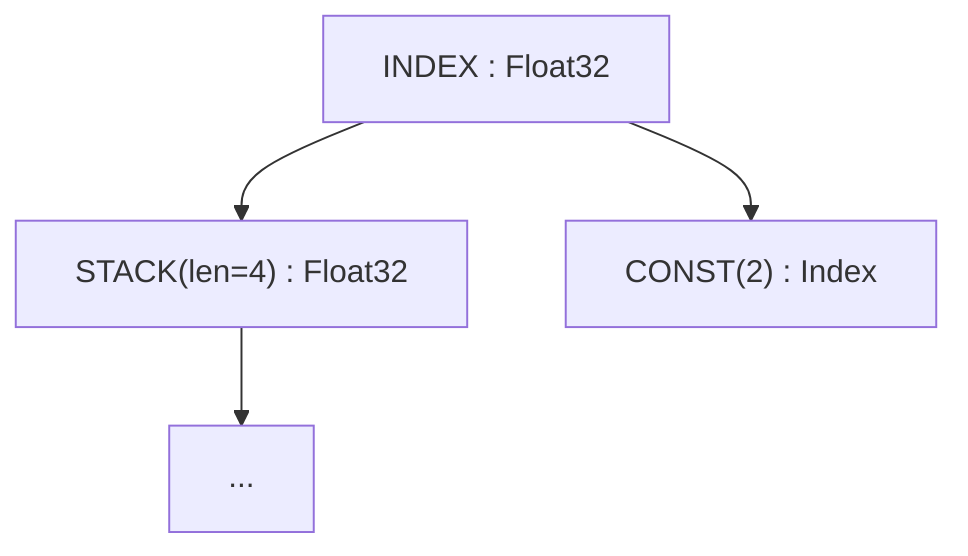

### VConst — Vector Constant

```rust
VConst {
    values: Vec<ConstValue>,
}
```

Vector of compile-time constants. More efficient than a `STACK` of `CONST` nodes.

Lane aggregation uses `STACK`; lane and address selection use `INDEX`. Loop
unrolling is represented by `Range` with `AxisType::Unroll`, not a separate
operation. Tensor-core expansion axes live in `WmmaMetadata`.

---

## Tensor Cores: WMMA

### WMMA — Warp Matrix Multiply-Accumulate

```rust
Wmma {
    a: Arc<UOp>,             // matrix A fragment
    b: Arc<UOp>,             // matrix B fragment
    c: Arc<UOp>,                 // accumulator C fragment
    metadata: Box<WmmaMetadata>, // hardware configuration
}
```

Hardware tensor core operation: `D = A × B + C`. Requires specific matrix shapes and data layouts.

**WmmaMetadata Fields:**

| Field | Type | Purpose |
|-------|------|---------|
| `name` | `String` | Instruction name (e.g., `"__hmma..."`) |
| `dims` | `(N, M, K)` | Matrix dimensions (e.g., `(16, 16, 16)`) |
| `dtype_in` | `DType` | Input matrix precision (e.g., `Float16`) |
| `dtype_out` | `DType` | Output precision (e.g., `Float32`) |
| `device` | `RendererDevice` | Renderer / TC backend that produced this WMMA (`CudaSm80`, `AmdRdna3`, `Metal`, …) |
| `threads` | `usize` | Threads per warp (typically 32) |
| `upcast_axes` | `Option<WmmaUpcastAxes>` | Per-source expansion axes (fields: `a`, `b`, `c`); cleared once `expander2` has shaped the sources and output |
| `reduce_axes` | `Vec<AxisId>` | TC reduce axis IDs, used as `exclude_args` during expansion |

**Example:**
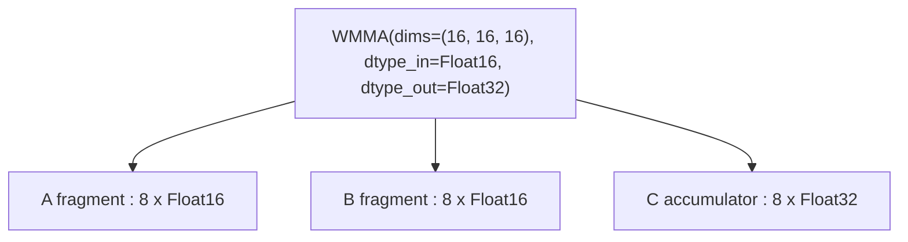

---

## Control Flow

### IF / ENDIF — Conditional Execution

```rust
If {
    condition: Arc<UOp>,                // boolean predicate
    body: SmallVec<[Arc<UOp>; 4]>,      // operations to execute
}

EndIf {
    if_op: Arc<UOp>,         // corresponding IF op
}
```

Execute body only when condition is true. Used for boundary checks and sparse operations.

**Example:**
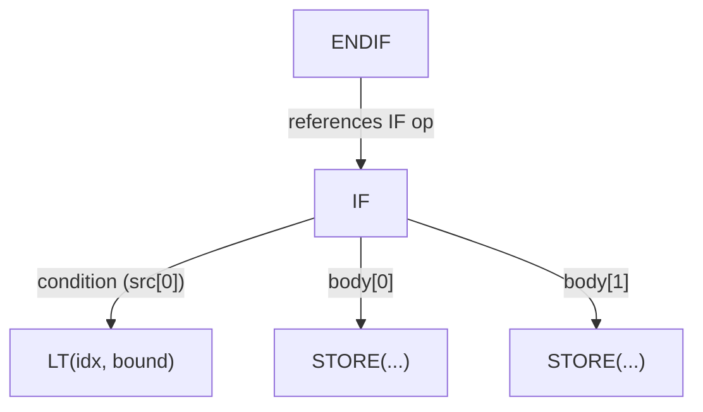

---

## Definition Operations

### CONST — Literal

```rust
Const(ConstValueHash)        // Int(i64), UInt(u64), Float(f64), Bool(bool), Invalid
```

A compile-time scalar. `Invalid` is the poison value every `valid()` gate falls
back to; its dtype is always `Bool`. Constants, like buffers and params, never
carry an origin.

### PARAM — Buffer Parameter

```rust
Param { shape: Arc<UOp>, arg: Box<ParamArg> }
```

Normalized buffer parameter — positional reference to an input/output buffer.
Created by pre-schedule normalization (BUFFER→PARAM) to erase buffer identity,
enabling structural deduplication of identical computations on different buffers.
`arg.slot` is the position in the kernel argument list, `shape` carries the
element count. `ParamArg` also covers scalar parameters (`UOp::scalar_param`),
which carry an optional name and value bounds and no address space.

### Shared Memory and Registers

There is no dedicated `DefineLocal` or `DefineReg` operation. GPU shared memory
(LDS) and register/scratch allocations are `Buffer` nodes whose
`arg.addrspace` is `AddrSpace::Local` or `AddrSpace::Reg`; they carry no device
and are visible only inside a workgroup (LOCAL) or a thread (REG).

### DEFINE_VAR — Symbolic Runtime Variable

```rust
DefineVar {
    name: String,            // variable name
    min_val: i64,            // minimum bound
    max_val: i64,            // maximum bound
}
```

Runtime variable with known bounds. Used for dynamic shapes where bounds are known.

**Example:**
```text
DEFINE_VAR('batch_size', min=1, max=128) : Index
```

### BIND — Variable Binding

```rust
Bind {
    var: Arc<UOp>,           // DEFINE_VAR
    value: Arc<UOp>,         // concrete value
}
```

Binds a symbolic variable to a concrete value at runtime.

---

## Special Operations

### SPECIAL — Hardware-Provided Values

```rust
Special {
    end: Arc<UOp>,           // upper bound for this dimension
    name: String,            // e.g., "gidx0", "lidx1"
}
```

Accesses hardware-provided values (thread/block indices). Not a loop—the hardware provides the value directly.

**Example:**
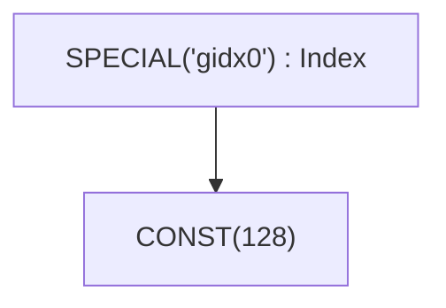

### UNIQUE / LUNIQUE — Identity Markers

```rust
Unique(usize)                // global identity counter
LUnique(usize)               // local-scope identity counter
```

Creates a unique identity for buffer disambiguation. Two buffers with
different `Unique` values are distinct even if otherwise identical. `LUnique`
provides the same disambiguation within a local scope (e.g. inside a
`Function` body) without colliding with the global counter, so callable
bodies can be hash-consed independently of where they're called from.

Devices are not a node of their own: the target is a `DeviceSpec` field on the
operations that need one (`Copy`, `GetAddr`, `AllReduce`, `ParamArg.device`,
`BufferizeOpts.device`, `ProgramInfo.target`).

---

## Movement Operations

High-level tensor shape transformations. These are converted to explicit INDEX operations during rangeify.

| Operation | Signature | Purpose |
|-----------|-----------|---------|
| `Reshape` | `{ src, new_shape }` | Change shape, same elements |
| `Permute` | `{ src, axes: Vec<usize> }` | Transpose/reorder axes |
| `Expand` | `{ src, new_shape }` | Broadcast to larger shape |
| `Pad` | `{ src, begin_pads, end_pads }` | Add padding |
| `Shrink` | `{ src, offsets, sizes }` | Extract sub-region |
| `Flip` | `{ src, axes: Vec<bool> }` | Reverse along axes |

**Example:** RESHAPE
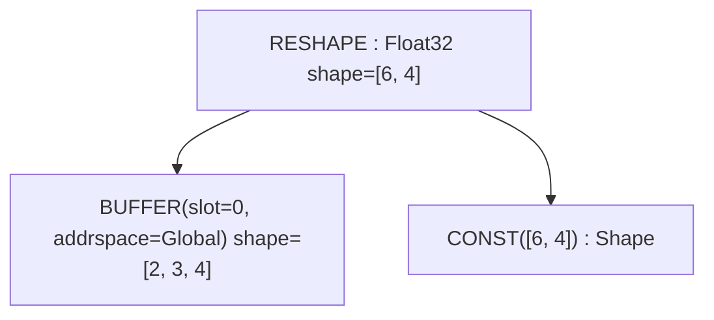

---

## Additional Operations

The following operations exist in the `Op` enum but are either internal or rarely encountered during debugging:

| Operation | Purpose |
|-----------|---------|
| `Copy` | `{ src, device }` - explicit copy of a value to another device; closes every range of its source |
| `Slice` | `{ buffer, offset, size }` - contiguous typed slice metadata over a buffer (offset in source elements); closes every range of its source |
| `GetAddr` | `{ src, device }` - the `UInt64` address of a buffer-like source |
| `MStack` | `{ buffers }` - the per-device buffers of a multi-device tensor |
| `MSelect` | `{ buffer, device_index }` - one device's buffer out of a multi-device tensor |
| `Multi` | `{ src, axis }` - shard marker: the axis a multi-device tensor is split along |
| `Group` | `{ sources }` - groups operations for scheduling |
| `Noop` | Placeholder with no operands and no effect |
| `Detach` | Detach from graph (prevent optimization through) |
| `Contiguous` | `{ src, opts: Vec<ContiguousHint> }` - force materialization into its own buffer, with optional optimizer hints; what `realize()` wraps its root in |
| `ContiguousBackward` | Backward pass for contiguous hint |
| `Precast` | Pre-cast for type conversion |
| `Custom` / `CustomI` | `{ deps, code }` - inline backend code (C or LLVM IR), rendered by both renderers |
| `CustomFunction` | `{ kind, attrs }` - runtime custom-function hook; kinds: `EncDec`, `Graph`, `AllReduce { reduce_op }` |
| `Ins` | `{ sources, arg: InsArg }` - a target instruction (`opcode` plus sorted attributes) selected by an ISA renderer |

---

## Quick Reference

### By Category

| Category | Operations |
|----------|------------|
| **Nullary** | `CONST`, `VCONST`, `UNIQUE`, `LUNIQUE`, `NOOP`, `DEFINE_VAR` |
| **Loop Control** | `RANGE`, `END` |
| **Reduction** | `REDUCE_AXIS`, `REDUCE`, `ALLREDUCE` |
| **Memory** | `BUFFER`, `SLICE`, `STAGE`, `INDEX`, `LOAD`, `STORE`, `GETADDR`, `COPY` |
| **Multi-device** | `MSTACK`, `MSELECT`, `MULTI` |
| **Kernel & Callable** | `SINK`, `GROUP`, `CALL`, `FUNCTION`, `TUPLE`, `GET_TUPLE`, `PROGRAM`, `LINEAR`, `SOURCE`, `PROGRAM_BINARY`, `AFTER`, `BARRIER` |
| **Vector** | `STACK`, `INDEX`, `VCONST` |
| **Expansion** | `RANGE` with `AxisType::Upcast` or `AxisType::Unroll` |
| **Hardware** | `WMMA`, `SPECIAL`, `INS` |
| **Control** | `IF`, `ENDIF` |
| **Definition** | `PARAM`, `DEFINE_VAR`, `BIND`, `UNIQUE`, `LUNIQUE` |
| **Movement** | `RESHAPE`, `PERMUTE`, `EXPAND`, `PAD`, `SHRINK`, `FLIP` |
| **Graph hints** | `CONTIGUOUS`, `CONTIGUOUS_BACKWARD`, `DETACH`, `PRECAST` |
| **Extension** | `CUSTOM`, `CUSTOMI`, `CUSTOM_FUNCTION` |
| **ALU** | `Unary(...)`, `Binary(...)`, `Ternary(...)`, `Cast`, `BitCast` |

### Range-Ending Operations

Operations that close RANGE scopes (`Op::range_ending_src_index`):

| Operation | Range Start Index |
|-----------|-------------------|
| `STAGE` | 1 (compute=0, ranges=1+) |
| `REDUCE` | 1 (src=0, ranges=1+) |
| `WMMA` | 3 (a=0, b=1, c=2) |
| `END` | 1 (computation=0, ranges=1+) |
| `CALL` / `FUNCTION` | 1 (body=0, args=1+) |

`Op::ended_ranges()` adds two indirect cases: `AFTER` ends whatever its `deps` end, and `COPY` / `SLICE` end every range in scope at their source.

### Expandable Operations

Operations that propagate expanded lanes through the computation graph (`Op::is_expandable`):

- ALU: `Unary`, `Binary`, `Ternary`
- Type: `Cast`, `BitCast`
- Shaped values: `Stack`
- Memory: `Load`, `Store`, `Index`
- Control: `Reduce`, `End`, `After`
- Buffer: `Stage`
- Hardware: `Wmma`
