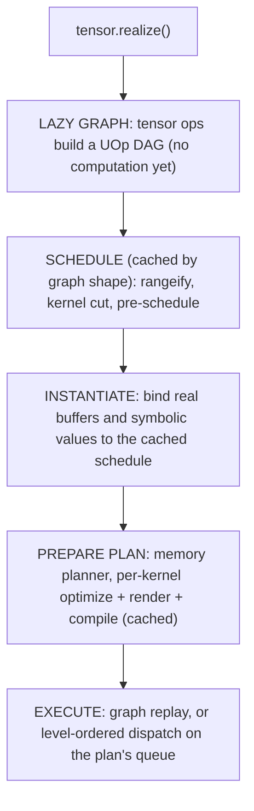
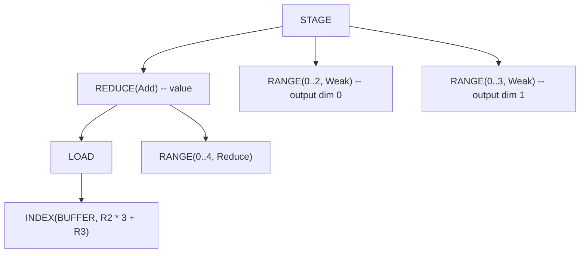
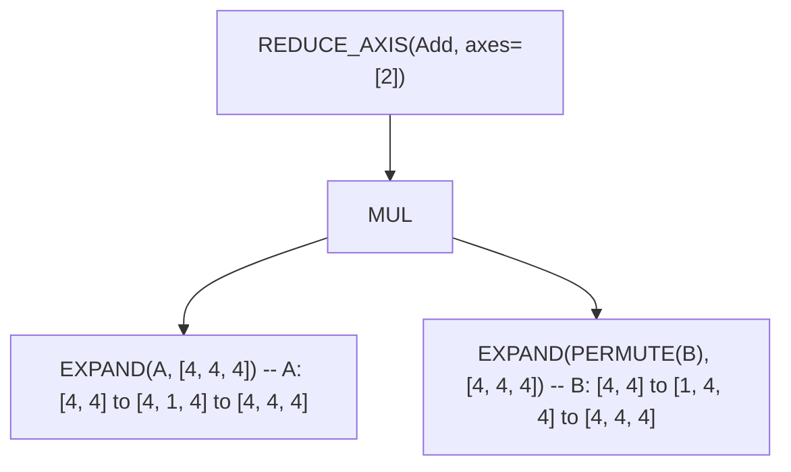
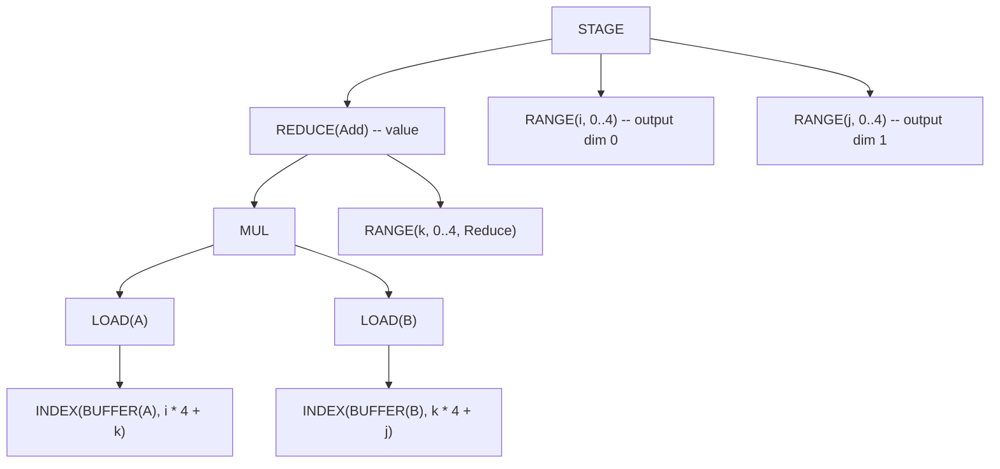
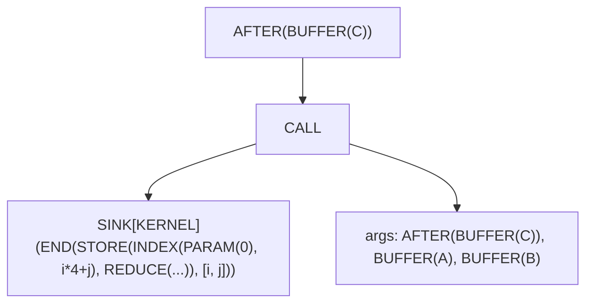

# From Tensor to Machine Code

In most ML frameworks, computation happens immediately. Write `a + b` in PyTorch and it runs *now*—the GPU crunches numbers before you can even inspect the result. This eager execution is simple to understand, but it leaves optimization opportunities on the table. How can a compiler optimize a computation it hasn't seen yet?

Svod takes the opposite approach: **lazy evaluation**. When you write `a.try_add(&b)?`, nothing computes. Svod builds a graph describing *what* to compute, not *when*. The work happens when you call `realize()`—that single method triggers the entire compilation pipeline, from high-level tensor operations down to JIT-compiled machine code.

This chapter traces that journey. The [IR design](./ir-design.md) page explains the node type every stage shares; the [codegen chapters](./codegen/overview.md) go pass by pass through the per-kernel optimizer; this page is the map between them.



---

## Lazy Evaluation: Building the Graph

A `Tensor` in Svod is a handle:

```rust
pub struct Tensor {
    entry: Arc<TensorEntry>,
}

pub struct TensorEntry {
    pub id: u64,
    pub uop: RwLock<Arc<UOp>>,     // the computation this tensor represents
    buffer: OnceLock<Arc<Buffer>>, // filled by realization
}
```

The UOp sits behind an `RwLock` so the graph can be swapped in place (see the registry below), and the buffer lives in the shared entry rather than in the handle, so cloning a tensor shares its realization. That is why `realize()`, `prepare()` and `profile()` take `&self`.

### Three Ways to Create Tensors

**1. Input tensors** — buffer allocated and filled immediately:

```rust
let a = Tensor::from_slice([1.0f32, 2.0, 3.0]);
// a.buffer() is Some(..): device memory allocated, bytes copied in
```

`from_slice` (and `from_ndarray`, which copies once for C-contiguous input) allocates a device `Buffer`, copies your bytes with `copyin`, and builds the graph `BUFFER.reshape(shape)`. There is no deferred host copy.

**2. Lazy operations** — no buffer, only graph:

```rust
let b = a.try_add(&a)?;   // b.buffer() is None
let c = b.try_mul(&a)?;   // c.buffer() is None
```

Arithmetic operations don't compute anything. They build a UOp graph: `Binary(Add, a.uop, a.uop)`. The tensor exists purely as a description of future work.

**3. Movement operations** — views over the original storage:

```rust
let d = a.try_reshape(&[1, 3])?;  // d.buffer() resolves to a's storage
```

Reshape, permute, and similar operations create a new lazy entry whose graph is `RESHAPE(a.uop)`. The entry owns no buffer; `buffer()` walks to the base `BUFFER` node and finds `a`'s storage through the registry.

### The Global Registry

`tensor/src/tensor_registry.rs` keeps two lock-free `papaya` maps:

| Map | Key → Value | Purpose |
|-----|-------------|---------|
| `TENSORS` | tensor id → `Weak<TensorEntry>` | Every live tensor, for graph substitution |
| `BUFFERS` | `BUFFER` UOp id → `Arc<Buffer>` | Find device storage during scheduling and `buffer()` lookups |

This registry enables **global graph substitution**: when `realize()` finishes, the realized subgraph is replaced by its `BUFFER` in every tensor that referenced it (`apply_map_to_tensors_realized`), so a later `realize()` on a dependent tensor reads the result instead of recomputing it. `BUFFERS` entries expire through a UOp drop hook when the `BUFFER` node itself is dropped.

### Hash Consing in Action

Because UOps are hash-consed (content-based interning), identical computations share memory:

```rust
let x = a.try_add(&b)?;
let y = a.try_add(&b)?;
// x.uop() and y.uop() are the SAME Arc<UOp>
```

This is what makes the caches below cheap: two tensors with the same shape of computation reach the scheduler as the same node, and every cache key is a structural `content_hash` of the graph, so even graphs built separately (or in another process run) hit.

---

## What `realize()` Does

`Tensor::realize` (`tensor/src/realize.rs`) is short:

```rust
pub fn realize(&self) -> Result<()> {
    if self.uop().has_buffer_identity() { self.ensure_buffer(); return Ok(()); }
    if is_any_const(&self.uop()) { self.set_uop(self.uop().contiguous()); }  // force a buffer
    if self.has_zero_elements() { return Ok(()); }

    let old_uop = self.uop();
    let plan = self.prepare_plan_with(&PrepareConfig::from_env())?;  // schedule + compile
    plan.execute()?;
    self.finalize_realize(&plan, &old_uop)?;      // tensor ← BUFFER.reshape(shape)
    apply_map_to_tensors_realized(&{old_uop => realized_uop});
    Ok(())
}
```

`prepare_plan_with` wraps the graph as `SINK(CONTIGUOUS(uop))` and runs two steps: `schedule_result_from_sink_with_cache` (next section) and `prepare_execution_plan` (the section after). `prepare()` runs the same two steps and hands you the `ExecutionPlan` to execute yourself; `realize_batch` / `prepare_batch` do it for several tensors through one `SINK(CONTIGUOUS(t1), …, CONTIGUOUS(tN))`, so kernels that feed more than one output are shared. `PrepareConfig::from_env()` reads the optimizer strategy, thread budget and memory-planner mode from the environment (table at the end); `realize_with` / `prepare_with` take an explicit config.

---

## Scheduling: From Graph to Kernels

### The schedule cache

Scheduling (rangeify plus the kernel cut) is the most expensive compile step and depends only on the *shape* of the graph, not on which buffers it reads. `schedule_result_from_sink_with_cache` therefore first **normalizes** the sink — every `BUFFER` becomes a positional `PARAM`, every `BIND(DEFINE_VAR, CONST)` loses its runtime value — and looks the result up in a process-wide cache keyed by `(content_hash(normalized sink), compiler identity)`. Hits skip straight to instantiation; misses run rangeify once per key even when several threads race (single-flight). `SVOD_DISABLE_SCHEDULE_CACHE=1` turns it off.

A cache miss runs, in order: `rangeify_with_map` → `try_get_kernel_graph` → `wrap_scan_loops` (schedule-level loops for scan ops) → `create_pre_schedule`.

### Rangeify: Making Loops Explicit

When you write `tensor.reshape([2, 3]).expand([4, 2, 3]).sum(axis=0)`, those movement operations are high-level descriptions. To generate loops, iteration has to be explicit. **Rangeify** (`rangeify_with_map`, `schedule/src/rangeify/transforms.rs`) turns movement ops into `RANGE` loops and `INDEX` arithmetic:

| Step | Code | Purpose |
|------|------|---------|
| Multi-device | `multi_pm()`, `lower_allreduce_pm()` | Resolve sharding of multi-device tensors, lower `ALLREDUCE` |
| Tags | `add_tags_patterns()` | Number every node so tensor identity survives the rewrites |
| Calls | `resolve_calls()` | Inline non-precompiled `FUNCTION`s, fold `GETTUPLE(TUPLE)` |
| Early rewrites | `movement_op_patterns() + early_rewrites() + split_reduceop_patterns()` | Clean up movement ops; split large reductions in two stages |
| Range assignment | `indexing::run_rangeify` | Decide what materializes (`pm_generate_realize_map`), assign a `RANGE` per output axis, then lower `REDUCE_AXIS` → `REDUCE`, `PAD` → `WHERE`, `STACK` → `WHERE`, and insert `STAGE` + `INDEX` where values materialize |
| Mega-pass | `symbolic() + pm_reduce_simplify() + movement_op_patterns() + buffer_folding() + dead_axis_removal() + pm_remove_bufferize()` | One fixpoint loop: algebra, reduction simplification, buffer folding, dead-axis removal, removal of `STAGE`s that can be fused |
| Outputs | rebuild `SINK` | Keep only the public outputs |
| Buffer limit | `buffer_limit_patterns(limit)` | Split kernels that would exceed the device's argument limit |

Every step is pattern-based rewriting (see the [Pattern Engine](./optimizations/pattern-system.md)). The per-kernel passes the [Rangeify chapter](./codegen/rangeify.md) describes as stages 1–7 (early movement ops, load collapse, split ranges, initial symbolic, simplify ranges) run later, in `apply_pre_optimization()`, once the graph is cut into kernels.

Each movement op lowers to a specific index transformation (`apply_movement_op`, `schedule/src/rangeify/indexing.rs`):

| Operation | Transformation |
|-----------|----------------|
| **RESHAPE** | Flatten by output strides, split back with `/` and `%` by input shape |
| **PERMUTE** | Reorder the ranges by the inverse permutation |
| **EXPAND** | Index of an expanded axis becomes `0` (the range no longer affects the address) |
| **PAD** | Index becomes `WHERE(valid, rng - begin, INVALID)`; the padded value is `WHERE(valid, src, 0)` |
| **SHRINK** | `rng + begin` |
| **FLIP** | `(size - 1) - rng` |

After rangeify, there are no movement ops—just arithmetic on indices. Before and after, for the expression above:

```text
Before: BUFFER.reshape([2, 3]).expand([4, 2, 3]).sum(axis=0)
```



The `EXPAND` became a `RANGE(0..4)` that does not appear in the buffer index—broadcasting. The `RESHAPE` became index arithmetic. The `SUM` became `REDUCE(Add)` closing a `Reduce` range. Output ranges are `Weak` here: the optimizer decides later which become `Global`, `Local` or `Upcast`.

### The Kernel Cut

`try_get_kernel_graph` (`schedule/src/rangeify/kernel.rs`) splits the rangeified graph into kernels:

**Step 1: STAGE → STORE** (`pm_add_buffers_patterns`, `bufferize_to_store`). Each `STAGE` gets a fresh `BUFFER` node (no device memory yet) and becomes a store under its ranges, wrapped in an `AFTER` on that buffer:

```text
Before: STAGE(compute, ranges)
After:  AFTER(BUFFER, [END(STORE(INDEX(BUFFER, flat_idx), compute), ranges)])
```

**Step 2: Split stores into kernels** (`split_all_stores` → `split_store`). Each store becomes a callable. Inside the body, global `BUFFER`s turn into `PARAM(slot = N)` in pattern-match order (the `LocalAddBufferContext.param_slot` counter), the body is sealed as a `SINK` carrying `KernelInfo`, and the kernel is a `CALL` whose arguments are the buffers (as `AFTER`s) and the `BIND`s it needs:

```text
After:  AFTER(BUFFER, [CALL(SINK[KERNEL](END(STORE(...), ranges)), args = [AFTER(BUFFER..), BIND..])])
```

There is no `KERNEL` op: a kernel is a `CALL` of a `SINK[KERNEL]`. The cut is also where origin attribution is harvested onto the `CALL` (see [Kernel Origins](./kernel-origins.md)).

**Step 3: Fix assignments** (`fix_assign`). When kernel B reads a buffer kernel A writes, B's `AFTER` is appended to A's `AFTER` deps, so a write-after-read on the same buffer keeps its order. Dependencies live in `AFTER` nodes; no separate dependency graph exists until the schedule is built.

### Pre-schedule and instantiation

`create_pre_schedule` (`tensor/src/schedule.rs`) walks the kernel graph, Kahn-sorts the callables by their `AFTER` dependencies and records, per kernel, the AST and the buffer *identities* it touches — but no buffers. That is what the cache stores. `instantiate_schedule` then restores the real `BUFFER`s, allocates `Buffer` handles for intermediates and outputs (outputs stay host-visible unless `PrepareConfig::device_local_outputs`), binds the symbolic values and produces:

```rust
pub struct ScheduleResult {
    pub items: Vec<ScheduleItem>,
    pub output_uop_ids: Vec<u64>,
    pub alias_output_buffers: HashMap<u64, Buffer>,  // outputs that alias an input
}

pub struct ScheduleItem {
    pub kernel: Arc<UOp>,              // the CALL: dependency identity
    pub ast: Arc<UOp>,                 // the SINK[KERNEL] body (for codegen)
    pub buffers: Vec<Buffer>,          // device buffers, in CALL argument order
    pub buffer_uop_ids: Vec<u64>,      // their BUFFER UOp ids
    pub fixedvars: HashMap<String, i64>,  // bound symbolic variables
    pub loop_var_names: HashSet<String>,  // fixedvars fed by schedule-loop counters
    pub dependencies: Vec<u64>,        // producer CALL ids
    pub instance_dependencies: Vec<usize>, // producer schedule-item indices
}
```

---

## Preparing the Plan

`prepare_execution_plan` (`tensor/src/realize.rs`) turns schedule items into an `ExecutionPlan`. It runs detached from any origin scope and sizes the shared thread pool from `PrepareConfig::threads` first.

### Memory planner

Before anything is allocated, the planner (`tensor/src/memory_planner/`) decides which intermediate buffers can share storage. Liveness is measured in **execution levels** — Kahn waves of the kernel DAG (`compute_topological_levels`, shared with the runtime) — and a buffer last used in level *L* may reuse storage first used in a level after *L*. The planner injects no ordering edges; safety comes from the level barrier the executor already enforces.

| `SVOD_MEMORY_PLANNER` | Mode | Effect |
|---|---|---|
| unset, `1`, `arena` | `Arena` (default) | Pack plannable buffers into one per-device TLSF arena; each logical buffer becomes a `Buffer::view` into it |
| `remap`, `pool` | `Remap` | Pool whole buffers by `(device, dtype, size rounded to 256 B)` and swap `Arc<Buffer>`s |
| `0`, `off`, `none`, `disabled` | `Disabled` | Every buffer keeps its own allocation |

Inputs, outputs, aliased storage, disk buffers and copy/custom-function operands are never planned.

### Per-kernel compilation and the caches

Each non-copy item resolves to a `KernelSite`: its device, renderer and an `OptKey`. Kernels missing from the cache are optimized in parallel, named in schedule order (the `n1`, `n2` suffixes are part of the source text, so naming must not depend on thread timing), then rendered and compiled:

```text
ast ──► apply_pre_optimization ──► heuristics | BEAM ──► post-optimization ──► PROGRAM ──► LINEAR ──► SOURCE ──► BINARY
```

- `apply_pre_optimization()`: movement-op cleanup, `pm_load_collapse`, `pm_split_ranges + pm_flatten_range`, `sym + pm_fold_cast_const`, `pm_simplify_ranges`.
- The optimizer picks axis types and tiling: the [heuristics](./optimizations/kernel-search.md) by default, [BEAM search](./optimizations/kernel-search.md) with `BEAM=N`, or an explicit `opts_to_apply` list for hand-lowered kernels.
- Post-optimization lowers the kernel through the stages the [codegen overview](./codegen/overview.md) labels 08–20: post-opt symbolic, the expander (`Upcast`/`Unroll` ranges → lanes), local buffers, `pm_add_gpudims` (`Global`/`Local` ranges → `SPECIAL`), `pm_add_loads`, the devectorizer (with `bool_storage_patterns`), memory coalescing, index-dtype lowering, dtype decompositions (`pm_float_decomp`, `pm_long_decomp`), late rewrites (`pm_fma_decomposition` when the target has `MulAcc`, fast division, …), `pm_move_gates_from_index`, and the final rewrite (`pm_split_ends`, implicit barriers). `SVOD_DUMP_STAGE=<prefix>` prints the kernel after any one of them.
- `program_from_sink_with_renderer` adds control flow, numbers any remaining `PARAM` slots and builds the `PROGRAM` node; `do_linearize` / `do_render` / `do_compile` fill its `LINEAR`, `SOURCE` and `BINARY` fields (`codegen/src/program_pipeline.rs`).

Three in-process caches and one on disk make repeated work free:

| Cache | Key | Scope |
|-------|-----|-------|
| Schedule cache | `content_hash(normalized SINK)` + compiler identity | rangeify + kernel cut |
| `OPT_CACHE` | `content_hash(kernel AST)` + device + compiler key + renderer fingerprint + optimizer fingerprint | optimized AST and compiled program; FIFO-bounded by `SVOD_OPT_CACHE_MAX` (4096) |
| Compiled-program cache | `content_hash(PROGRAM)` + compiler key | `CachedKernel`: program handle, source, entry point, ABI slots; lives for the process |
| Object cache (CPU) | SHA-256 of the source + `CompilerIdentity` (backend, target, toolchain, flags, ABI) | relocatable objects under `~/.cache/svod/objects` (`SVOD_OBJECT_CACHE_DIR`, `SVOD_OBJECT_CACHE=0` to disable) |

All keys are structural hashes, not UOp ids, so a graph rebuilt from scratch — or in another process — still hits. BEAM results have their own on-disk cache (`SVOD_BEAM_CACHE_DIR`).

### The ExecutionPlan

The result (`runtime/src/execution_plan.rs`):

```rust
pub struct ExecutionPlan {
    ops: Vec<PreparedOp>,               // CompiledProgram | BufferCopy | CustomFunction
    op_order: Vec<usize>,               // topological order
    op_levels: Vec<Vec<usize>>,         // Kahn levels: ops in one level are independent
    buffers: Vec<Buffer>,
    ast_to_buffer: HashMap<u64, usize>, // BUFFER UOp id -> buffer index
    output_buffer_indices: Vec<usize>,  // plan outputs, in SINK source order
    device: DeviceSpec,
    runtime_var_vals: HashMap<String, i64>,
    graph: OnceLock<Option<Box<dyn Graph>>>,          // captured on first execute (GPU)
    plan_ctx: OnceLock<Option<Box<dyn PlanContext>>>, // the plan's own queue
    // ... HCQ executor state elided
}
```

| Method | Purpose |
|--------|---------|
| `execute()` | Run every op once with the current buffers and variable values |
| `execute_with_vars(&[(name, value)])` | Rebind symbolic variables (validated against their `[min, max]`), then execute — no recompilation |
| `output_buffer()` / `output_buffer_at(i)` / `num_outputs()` | The plan's outputs (`i` follows SINK source order) |
| `profile(&ProfileOptions)` | Replayed, timestamped run returning a `RunProfile` |
| `declare_input(idx)` / `replicate()` | What the [JIT wrapper](./jit-graphs.md) builds on |

The plan is **reusable**: compile once, execute many times with different data in the same buffers.

---

## Code Generation

Two renderers (`svod_codegen::Renderer`) cover the four device backends; the device picks:

| Device backend | Renderer | Output |
|----------------|----------|--------|
| **CPU** | `LlvmTextRenderer` (default) or `CRenderer` (`SVOD_CPU_BACKEND=clang`) | LLVM IR text, or C source |
| **CUDA** | `LlvmTextRenderer::nvptx(arch)` | LLVM IR, `ptx_kernel` ABI |
| **AMD** | `LlvmTextRenderer::amd(arch)` | LLVM IR, `amdgpu_kernel` ABI |
| **Metal** | `CRenderer::metal()` | Metal Shading Language |

```rust
pub trait Renderer {
    fn render(&self, uop: &Arc<UOp>, name: Option<&str>) -> Result<RenderedKernel>;
    fn backend_name(&self) -> &str;
    fn decompositor(&self) -> Option<TypedPatternMatcher<()>>;
}
```

The runtime wraps each in the device-level `svod_device::device::Renderer`, which adds the target's capabilities (`supported_ops`, `gpu_arch`, the extra and ISA matchers) and returns a `ProgramSpec`: source, entry point, the variable names and the `globals` / `outs` / `ins` buffer slots the plan binds arguments with.

The LLVM renderer (`codegen/src/llvm/text/`) walks the `LINEAR` op stream and emits one function per kernel. Every buffer is a direct `ptr noalias align 32 %dataN` parameter — no args array — and symbolic variables (plus `core_id` for CPU threading) are typed scalar parameters:

```llvm
define void @E_128(ptr noalias align 32 %data0, ptr noalias align 32 %data1, i32 %N) #0 {
entry:
  br label %loop_0

loop_0:
  %i = phi i32 [ 0, %entry ], [ %i.next, %loop_0 ]
  ; ... computation ...
  %i.next = add nsw i32 %i, 1
  %cond = icmp slt i32 %i.next, 128
  br i1 %cond, label %loop_0, label %exit

exit:
  ret void
}
```

---

## Compilation and Loading

On the CPU, the IR text becomes a relocatable object and is loaded in-process; there is no LLVM `ExecutionEngine` and no temporary shared library:

1. **Compile** at `-O2` — through libLLVM bound in-process with `libloading` when it is available (`SVOD_LLVM_INPROCESS=0` opts out, `SVOD_LLVM_LIB` points at a library), otherwise `clang -x ir -c -O2 … -o -` on stdin/stdout.
2. **Reuse** the object from the on-disk cache when the source and compiler identity match.
3. **Load** it with the ELF loader: sections into an anonymous mmap, relocations applied, pages flipped executable (`runtime/src/jit_loader.rs`; see [JIT Compiler](../backends/jit-loader.md)).

```rust
let object = cache.get_or_compile(key, validate_relocatable_object, |ir| producer.compile(ir))?;
let (fn_ptr, _mmap) = jit_load(&object, &entry_point)?;  // ELF loader, no linker
```

GPU backends hand the same LLVM IR to the driver instead: PTX JIT-ed by the CUDA driver (or `ptxas` when installed), AMDGPU code objects loaded through KFD, Metal source compiled by the Metal framework.

---

## Execution

`ExecutionPlan::execute()` picks one of three paths, all under the plan's executor lock:

1. **Graph replay.** If every op is a compiled kernel on the plan's device with no unbound symbolic variable, and the device has a graph factory (CUDA Graphs, AMD PM4/AQL graph, Metal indirect command buffer), the plan captures the whole dispatch sequence on the first `execute()` and replays it afterwards, patching only the kernel arguments that changed. The [JIT Graphs](./jit-graphs.md#graph-capture-and-replay) page documents the backends and their switches.
2. **Native linked plan** (AMD). Plans a graph cannot capture — those with runtime variables, copies, or custom functions — are captured as one linked HCQ command stream whose kernel arguments are repacked per replay.
3. **Per-op dispatch.** Otherwise the plan walks `op_levels` level by level and submits each op to the plan's own queue (`PlanContext::dispatch`, asynchronous on GPUs) or calls the CPU program directly.

Within one plan, ops in a level are *not* run on separate host threads: the levels are the memory planner's reuse barrier and the graph capture order. CPU parallelism is inside a kernel (`Thread` axes split over the rayon pool) and across distinct plans. Each `PreparedKernel` carries its own device, so a plan can span devices, with `BufferCopy` ops moving data between them.

---

## Worked Example: Matrix Multiply

Let's trace `C = A.matmul(&B)?` through the pipeline for 4×4 matrices.

### Stage 1: Lazy Graph Construction

```rust
let a = Tensor::from_slice(a_data).try_reshape(&[4, 4])?;  // input buffer allocated
let b = Tensor::from_slice(b_data).try_reshape(&[4, 4])?;  // input buffer allocated
let c = a.matmul(&b)?;                                     // graph built, no computation
```

`matmul` reshapes `A` to `[4, 1, 4]` and `B` to `[1, 4, 4]`, transposes `B`, multiplies (broadcast inserts the `EXPAND`s) and sums the last axis:



### Stage 2: Rangeify

Movement ops become explicit loops:



The `i` and `j` ranges are output dimensions. The `k` range is the reduction (contracted) dimension.

### Stage 3: Kernel Cut

One `STAGE` → one store → one `CALL`:



### Stage 4: Schedule

One `ScheduleItem`:
- `kernel`: the `CALL`
- `ast`: the `SINK[KERNEL]`
- `buffers`: `[C, A, B]` — `C` allocated now, `A` and `B` already resident
- `dependencies`: `[]` (no producer kernels)

### Stage 5: Optimization

The heuristic optimizer picks, for example, `Upcast` on `j` by 4 (a `float4` vector per store) and `Unroll` on `k`; on a GPU `i` becomes `Global`.

### Stage 6: Code Generation

Generated LLVM IR, scalar form for readability:

```llvm
define void @r_4_4_4(ptr noalias align 32 %data0, ptr noalias align 32 %data1, ptr noalias align 32 %data2) #0 {
entry:
  br label %loop_i

loop_i:
  %i = phi i32 [ 0, %entry ], [ %i.next, %loop_i.end ]
  br label %loop_j

loop_j:
  %j = phi i32 [ 0, %loop_i ], [ %j.next, %loop_k.end ]
  br label %loop_k

loop_k:
  %k = phi i32 [ 0, %loop_j ], [ %k.next, %loop_k ]
  %acc = phi float [ 0.0, %loop_j ], [ %acc.new, %loop_k ]
  %a_val = load float, ptr ...  ; A[i, k]  (data1)
  %b_val = load float, ptr ...  ; B[k, j]  (data2)
  %prod = fmul float %a_val, %b_val
  %acc.new = fadd float %acc, %prod
  %k.next = add nsw i32 %k, 1
  %k.cond = icmp slt i32 %k.next, 4
  br i1 %k.cond, label %loop_k, label %loop_k.end

loop_k.end:
  store float %acc.new, ptr ...  ; C[i, j]  (data0)
  ; ... continue j, i loops
}
```

### Stage 7: Execution

1. Compile the IR (or take the cached object) and load it.
2. `execute()`: one `PreparedKernel`, called with `[C_ptr, A_ptr, B_ptr]` in `ProgramSpec.globals` order.
3. `finalize_realize` rewires `c` to `BUFFER(C).reshape([4, 4])`.

---

## Environment Reference

The variables that steer this pipeline (optimizer and backend knobs are listed on their own pages):

| Variable | Effect |
|----------|--------|
| `SVOD_DEVICE` | Default device (`CPU`, `CUDA:0`, `AMD:0`, `METAL`); Metal on macOS, CPU elsewhere when unset |
| `SVOD_CPU_BACKEND` | `llvm` (default) or `clang` |
| `SVOD_THREADS` | Compile and CPU-kernel thread budget (default: available parallelism) |
| `SVOD_NOOPT`, `BEAM=N` | Optimizer strategy: none, or beam search of width N (default: heuristics) |
| `SVOD_MEMORY_PLANNER` | `arena` (default), `remap`, `off` |
| `SVOD_DISABLE_SCHEDULE_CACHE=1`, `SVOD_OPT_CACHE_MAX` | Schedule cache off; optimized-kernel cache capacity |
| `SVOD_OBJECT_CACHE=0`, `SVOD_OBJECT_CACHE_DIR`, `SVOD_OBJECT_CACHE_MAX_BYTES` | On-disk object cache |
| `SVOD_LLVM_INPROCESS=0`, `SVOD_LLVM_LIB` | Force the `clang` subprocess; pick the libLLVM to bind |
| `SVOD_PER_STAGE_UOPS=1`, `SVOD_DUMP_STAGE=<prefix>`, `SVOD_DUMP_LINEAR=<dir>`, `SVOD_DUMP_LLVM_IR=<dir>` | Dump the kernel after each or one optimizer stage, the linearized stream, the rendered IR |
| `SVOD_SPEC=1` | Verify the IR against the kernel-graph spec after each phase |
| `SVOD_ORIGIN=1` | Attribute kernels to model code ([Kernel Origins](./kernel-origins.md)) |
| `RUST_LOG` | `tracing` filter; `debug` prints per-phase timings, `trace` the buffer mappings |

---

## The Deeper Insight

**Lazy evaluation enables global optimization.** By deferring computation, the scheduler sees the entire graph before cutting kernels; fusion is the default and materialization the exception.

**Explicit loops enable hardware-specific scheduling.** Movement ops are convenient abstractions, but hardware needs loops. Rangeify bridges the gap, and the optimizer only has to change a range's `AxisType`.

**Structural hashing makes caching automatic.** Every cache — schedule, optimized kernel, compiled program, object file — is keyed by the content hash of a UOp graph, so the second model of the same shape costs allocation and dispatch, nothing more.

**Separation of concerns keeps each stage simple.** Rangeify doesn't know about LLVM. Code generation doesn't know about tensor semantics. Each stage does one thing, on the same IR.
