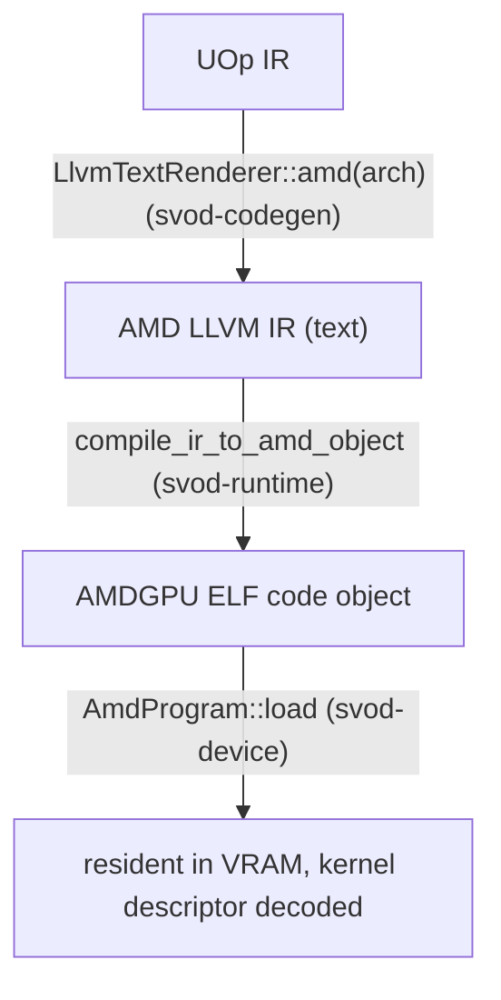

# Compile & Graph

This page follows a kernel from rendered LLVM IR to a running dispatch, then
covers how a whole chain of kernels is captured into a single replayable
command stream. The dispatch machinery it builds on — rings, compute lanes, the
timeline — is described in [Queues & Dispatch](./queues-and-dispatch.md).

---

## From IR to a loaded program

The compile path is **AMD LLVM IR text → `clang` → ELF code object → in-VRAM
load**. Three crates cooperate, wired together in
`runtime/src/devices/amd.rs`:



### Rendering

`AmdRendererWrapper` (`runtime/src/devices/amd.rs`) renders with
`LlvmTextRenderer::amd(arch)`. Its `supported_ops` removes `Exp`, `Log`,
`Sin`, `Cos`, `Tan` and `Erf` (plus `Pow`, `Max` and `Threefry`, as on every
GPU renderer), so the scheduler decomposes them before rendering: its
`decompositor` is `svod_ir::decompositions::amd_decomposition_patterns()`,
which lowers `exp`, `log`, `cos`, `tan` and `pow` to SLEEF-style polynomials
over the native `exp2`/`log2` for `f16`/`f32`/`f64` — bf16, fp8 and integer
operands are cast to f32 around the polynomial — and rewrites f32→bf16 casts
into the integer round-to-nearest-even form; `sin` goes through the shared
transcendental patterns for the same reason (`v_sin_f32` is only accurate for
small arguments). Only `exp2`, `log2` and `sqrt` stay native `@llvm.*`
intrinsics (~1 ulp on AMD hardware). The renderer-local `amd_extra_matcher()`
runs last.

### Compiling

`compile_ir_to_amd_object` (`runtime/src/amd/compile.rs`) shells out to `clang`,
piping IR in on stdin and reading the ELF back on stdout — no temp files, the
same in-memory style as the [CPU JIT loader](../jit-loader.md):

```text
clang -x ir -c -O3 --target=amdgcn-amd-amdhsa -mcpu=<arch> \
      -mcumode -nogpuinc -Wno-override-module -fno-math-errno [-nogpulib] - -o -
```

`-nogpulib` is added only when the IR references no `@__ocml_*` entry point:
the renderer emits `@llvm.*` intrinsics for every float unary the AMDGPU backend
can select, so the ROCm device libraries are needed only for f64 non-`sqrt`
unaries. The IR is part of the object-cache key, so keying a flag off it stays
sound. The result is validated (`validate_amd_object`: ELF64-LE, `EM_AMDGPU`,
the arch in `e_flags`, a defined `<name>.kd`) before it is cached under the
`amd-clang` identity or loaded.

`clang` invokes `lld` internally for a single translation unit, so the output is
a directly-loadable AMDGPU ELF — no separate link step. A per-process memoized
`ClangToolchain::has_target("amdgcn")` probe (`clang --print-targets`) turns a
clang without the AMDGPU target into a clean `JitCompilation` error rather than
a crash. Setting `SVOD_DUMP_AMD_IR=<dir>` dumps each kernel's `.ll` for
inspection.

### Loading & descriptor parsing

`AmdProgram::load` (`device/src/amd/program.rs`) parses the ELF with the
`object` crate and lays the image out the way tinygrad's `elf_loader` does:
`SHF_ALLOC` sections with a non-zero address go at their address; address-0
sections are appended aligned. It validates ELF64-LE + `EM_AMDGPU`, applies the
`R_AMDGPU_ABS64` / `R_AMDGPU_REL64` / `R_AMDGPU_REL32` relocations clang emits
(anything else is a clean error, never a silent zero-write), and resolves the
kernel-descriptor symbol **`<name>.kd`**.

From the 64-byte `AmdHsaKernelDescriptor` it derives everything dispatch needs:

| Derived | From |
|---|---|
| `aql_prog_addr` | `code_gpu + kd_offset` (the AQL `kernel_object`) |
| `pm4_prog_addr` | `aql_prog_addr + kernel_code_entry_byte_offset` (the shader entry; the LO/HI registers carry `>> 8`) |
| `rsrc1 / rsrc2 / rsrc3` | `compute_pgm_rsrc{1,2,3}`; `rsrc1` gets the cwsr-priv bit on gfx11, `rsrc2` the LDS-size field, `rsrc3` is used as is |
| `wave32` | `kernel_code_properties & 0x400` (RDNA3/4 default) |
| `target_major` | 9 / 11 / 12, from the device arch |
| kernarg / scratch / group sizes | `kernarg_size`, `private_segment_fixed_size`, `group_segment_fixed_size` |

Two safety checks happen at load: an over-large group (LDS) segment fails fast
with `GroupSegmentTooLarge`, and a kernel that sets `ENABLE_SGPR_DISPATCH_PTR`
(which would need an HSA dispatch packet alongside kernargs — not yet wired) is
rejected. The code object is copied into a host-visible, `nolru` VRAM buffer
held for the program's lifetime.

---

## Dispatching a kernel

`AmdProgram::execute_on(owner, pool, buffers, vals, global_size, local_size,
wait, profile)` is the lane-scoped dispatch path that plans and graphs use —
`owner` is the `OwnerCtx` holding the logical plan state, `pool` the exclusively
leased `PoolQueue`. (The `Program::execute` trait method builds a throwaway
`OwnerCtx`, which leases a lane, and delegates here.) It:

1. **Validates** the buffer and scalar counts against the kernel, and checks
   that the packed kernarg layout fits: `ClikeKernargLayout::from_abi(abi)`
   lays the parameters out in ABI slot order with natural alignment (8-byte
   pointers, 4-byte scalars) and its `packed_size()` must not exceed the
   descriptor's `kernarg_size`.
2. **Fills a kernarg slot** by bumping the device's 16 MiB kernarg arena
   (shared by every lane, 16-byte aligned; a wrap drains all lanes first),
   writing each buffer VA as 8 bytes and each scalar as a 4-byte `i32`. The
   `i32` packing is deliberate — the renderer lowers `Index → i32`, so the
   descriptor's `kernarg_size` reflects 4-byte vars; packing 8 bytes would
   overflow into the next slot.
3. **Builds a submission** — an `hcq::Submission` of `MemoryBarrier` then
   `Compute`, carrying the kernarg VA, the `rsrc` triple, and the PM4 program
   address.
4. **Dispatches** through `queue.submit_hcq_dispatch(pool, &submission, …)`.
   On a PM4 queue `lower_hcq_pm4` → `build_exec_pm4` emits raw dwords, and the
   optional 4-dword scratch descriptor is prepended to `COMPUTE_USER_DATA_0`
   from the same `scratch_address` snapshot that is written into
   `COMPUTE_DISPATCH_SCRATCH_BASE` — so a concurrent scratch realloc can't make
   the descriptor and the register disagree. On an AQL queue
   `lower_hcq_aql_submission_program` emits the wait/barrier as vendor-IB PM4
   packets, the 64-byte dispatch packet (`build_dispatch_packet_barrier`) and a
   vendor-IB timeline store, with the control bytes staged in the kernarg
   arena.
5. Retains the code object, registers the finalizer in flight and records it
   as the owner's newest completion. If `wait`, drains through the owner's
   `synchronize()`.

`Program::execute` (the per-call trait path) goes through
`PlanContext::dispatch`: it waits the prior epoch, leases a lane, dispatches
as above, and with `wait = false` ends the epoch and records the finalizer as
an unattributed token that `wait_storage` later observes.

---

## Graph capture & replay: `AmdGraph`

When the same kernel chain runs repeatedly (streaming inference), paying the
per-kernel `wait → barrier → exec → signal → doorbell` round-trip N times is
waste. `AmdGraph` (`device/src/amd/graph.rs`) — modelled on tinygrad's
`HCQGraph`, but with one barrier and no inter-kernel signals — captures the
whole chain into **one command stream** (PM4 or AQL, whichever the queue uses),
binds it into a host-visible page, and replays it with **one doorbell**.

### Structure

The graph is one device-timeline step:

```text
preamble:   Wait(timeline signal, timeline value)
            MemoryBarrier          ← one per graph, after the wait
per kernel: Compute(...)           ← no inter-kernel signal/wait; same-queue
                                     ordering is the acquire_mem +
                                     CS_PARTIAL_FLUSH that exec already emits
final:      Store(timeline signal, next timeline value)
```

Every address and value in that stream is a **placeholder** bound to a
`PatchSource` — `System(SystemField::TimelineSignal/TimelineValue)` for the
timeline ends, `System(ScratchAddress)`/`System(ScratchTmpring)` for PM4 scratch,
and `LinkAddress` entries for the program and kernarg pointers — all resolved at
replay against the leased lane, so the graph composes with ordinary per-call
dispatch and `synchronize`. Capture lays out one fixed kernarg slot per kernel in
a dedicated `AllocTag::Kernarg` page — owning that page (rather than sharing the
rolling kernarg arena, which concurrent per-call dispatch could lap into stale
VAs) is what makes replay safe.

Replay (`Graph::replay`) serializes graph-owned mutable storage, waits its prior
finalizer, acquires an exclusive compute lane, ensures lane scratch, patches the
current kernargs and system fields, then publishes the resident PM4 IB or AQL
submission program. Identical arguments skip the kernarg pack entirely. It
returns asynchronously; the next replay waits before reusing that storage.
`replay_profiled` runs a variant with a per-kernel `SystemField::Timestamp`
slot and synchronizes before returning the stamps.

### When capture happens

Capture is gated several ways, and falls back to per-call dispatch — on
`Ok(None)`, and also on a capture error, which the plan swallows — if any
fails:

- The chain must be **all compiled kernels with no unbound vars** — copies,
  views, and dynamic launch dims keep the host in the loop; a bound variable
  (a schedule-loop counter, say) is allowed and passed as `vals` on replay.
- The chain must be **single-device** and every current replay buffer must be
  backed by that exact physical allocation owner. `AmdGraph::capture` re-checks
  this below: every kernel must be an `AmdProgram` on the same `Arc<AmdDevice>`
  (`Arc::ptr_eq`).
- AQL graph capture is supported. PM4 graph capture is opt-in through
  `SVOD_PM4_GRAPH=1` because it is not a performance win on every gfx11/12 GPU.

:::note[Queue ownership]
Graphs do not retain a hardware queue. Capture stores immutable templates and
graph-owned resident/control memory; every replay leases a bounded pool lane.
:::

---

## Why this matters

Compilation is one `clang` subprocess and an in-VRAM ELF load — no ROCm
runtime, no temporary files (the object cache persists the result on disk),
the same minimalism as the CPU path. The plan tries a graph first, then native
linked replay, then direct dispatch. Dispatch reuses the entire
lane/timeline machinery from [Queues & Dispatch](./queues-and-dispatch.md),
so the [JIT Graphs](../../architecture/jit-graphs.md) layer's compile-once / replay-many promise
lands on AMD with one doorbell per replay: on AQL hardware by default, and on
PM4 hardware once `SVOD_PM4_GRAPH=1` opts in.
