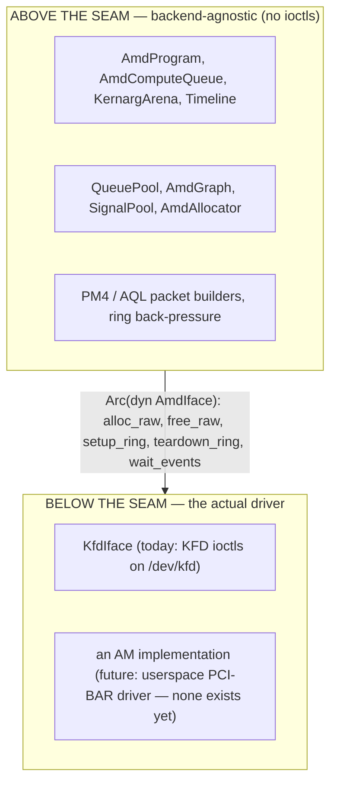
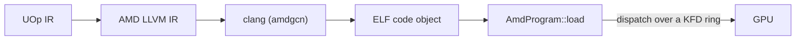

# The AMD Backend

Svod runs on AMD GPUs by talking to the kernel driver directly. There is no HIP,
no ROCr/HSA runtime, no `libamdhip64.so` — the only external dependency is
`clang` with the AMDGPU target (for compilation). Everything else — allocating
VRAM, building command rings, dispatching kernels, waiting on completion — is
done with raw `ioctl` calls against `/dev/kfd`, the Linux **KFD** (Kernel
Fusion Driver) interface that ships inside the `amdgpu` kernel module.

The design is a port of [tinygrad](https://github.com/tinygrad/tinygrad)'s
KFD-direct `ops_amd.py` and its HCQ (Hardware Command Queue) model; the port is
pinned to a specific tinygrad commit in `device/src/amd/mod.rs`, and the
packet layouts and bring-up sequence follow that reference.

The code lives in the `svod-device` crate under `device/src/amd/`.

---

## Supported GPUs

A node is supported when its KFD `gfx_target_version` maps to an `AmdArch`
(`dtype/src/amd_arch.rs`; the encoding is `major*10000 + minor*100 + step`,
decimal):

| `gfx_target_version` | `AmdArch` | Family | Wave size | Matrix cores |
|---|---|---|---|---|
| `90402` | `Gfx942` | CDNA3 (MI300) | 64 | MFMA |
| `90500` | `Gfx950` | CDNA (MI350) | 64 | MFMA |
| `110000` / `110001` / `110002` | `Gfx1100` / `Gfx1101` / `Gfx1102` | RDNA3 (Radeon 7000) | 32 | WMMA |
| `110501` | `Gfx1151` | RDNA3.5 (Strix Halo / Strix Point) | 32 | WMMA |
| `120000` / `120001` | `Gfx1200` / `Gfx1201` | RDNA4 (Radeon RX 9000) | 32 | WMMA |

Every supported arch has matrix cores; RDNA2 and earlier are not supported, and
`gfx90a` is not in the list. The wave size follows the arch (64 on CDNA, 32
otherwise), is passed to clang through `-mcpu` and is part of the object-cache
ABI string. An unsupported node makes opening it fail with `DeviceUnavailable`
naming the supported families.

---

## A runtime-detected execution provider

The AMD backend is always compiled, never gated behind a cargo feature: the
`amd` module is declared unconditionally, and everything that touches the
kernel (the ioctl wrappers, allocator, queues, programs, graphs) is `cfg(unix)`,
as are the `nix`, `libc` and `bindgen` dependencies. The topology parser and
the packet builders compile everywhere. Availability is decided **at runtime**,
ORT-style: the device registry probes for hardware with
`svod_device::amd::has_devices()` — a sysfs-only, side-effect-free read of the
KFD topology — and registers the `"AMD"` device factory *only* when a
supported GPU is present. A host with no `/dev/kfd` cleanly has no `"AMD"`
device type.

The point is robustness: because the backend is in every Unix build's
type-check, an API change in the generic core (a `Program` or `PlanContext`
trait, say) is caught on every dev box at `cargo check`, not only on the GPU
host. The cost is compile time, which is accepted. The bindgen step is
correspondingly **hermetic** — it runs against vendored headers, with no system
kernel headers required (see [KFD Bindings](./kfd-bindings.md)).

---

## Why KFD-direct instead of HIP

A "sane person" writing an AMD backend reaches for HIP (the CUDA-alike runtime)
or the HSA runtime underneath it. Svod deliberately does not. The reasoning:

- **No userspace runtime dependency.** HIP/ROCr is hundreds of megabytes of
  shared libraries that must match the kernel driver version. KFD is a stable
  kernel `ioctl` ABI; a Svod binary links `libc` + `nix` and shells out to
  `clang`, nothing else. The backend works on any host with a recent enough
  `amdgpu` and `clang`'s `amdgcn` target — no ROCm install (the ROCm device
  libraries are linked only for f64 transcendentals, see
  [Compile & Graph](./compile-and-graph.md)).
- **Deterministic control.** We own the command ring, the doorbell, the
  timeline signal, the page-table-visible allocations, and the scratch buffer.
  There is no runtime between us and the hardware reordering submissions or
  hiding state, which matters for the leased-lane dispatch the backend is
  built around (see [Queues & Dispatch](./queues-and-dispatch.md)).
- **A proven reference.** tinygrad's HCQ model is KFD-direct and
  battle-tested. Porting it means we inherit its exact packet layouts and
  bring-up sequence rather than reverse-engineering our own.

HIP and ROCr both sit *on top of* KFD — they open the same `/dev/kfd` and issue
the same ioctls we do. Going direct removes the middle layers, not a capability.

:::note[The CPU analogue]
KFD-direct is the AMD analogue of what the [ELF JIT loader](../jit-loader.md)
does on the CPU: skip the heavyweight vendor toolchain and drive the bare
mechanism in-process. The CPU path `mmap`s a relocatable object; the AMD
backend loads a code object into VRAM and dispatches it over a KFD ring.
:::

---

## The backend seam

The backend is split into two halves by the **`AmdIface`** trait
(`device/src/amd/iface.rs`):



Everything that is *not* a kernel call — the 16 MiB command ring, the PM4/AQL
packet construction, the kernarg bump arena, the timeline counter, the program
loader — lives above the seam. The trait is deliberately tiny: **five required
methods** (`alloc_raw`, `free_raw`, `setup_ring`, `teardown_ring`,
`wait_events`) plus three hooks that default to a no-op
(`queue_event_mailbox`, `publication_checkpoint`, `update_queue_percentage`).
The key insight that keeps it small is that the ring, GART page, EOP buffer and
MQD are *just GPU memory* — they get allocated above the seam via `alloc_raw`,
and the only thing a driver genuinely has to do differently is **activate the
queue** (map the doorbell, tell the scheduler the ring exists): that is
`setup_ring`. `KfdIface` is the only implementation outside the test suite.

The implementor is chosen at device-open time from the `SVOD_AMD_BACKEND`
environment variable:

| `SVOD_AMD_BACKEND` | Backend | Status |
|---|---|---|
| `kfd` (default) | `KfdIface` — KFD-direct | Production |
| anything else | — | Rejected: `unknown SVOD_AMD_BACKEND=... (only 'kfd' supported)` |

:::caution[The AM driver is scaffolding]
`device/src/amd/am/` holds an experimental userspace driver that talks to the
GPU's PCI BARs directly. It implements no `AmdIface`, is not selectable, and
has never executed a kernel: its bring-up was exercised once (June 2026) on a
CDNA3 SR-IOV virtual function up to GMC context programming, through the
standalone `am_*` examples. See [The AM Driver](./am-driver.md) for exactly
what exists.
:::

---

## Device-local memory and the SDMA copy queue

At device-open the backend installs an **SDMA copy queue** (`AmdCopyQueue`) on
every supported part, which flips `has_sdma_queue` true; a failure to create it
logs a warning and leaves buffers host-visible, and `AMD_DISABLE_SDMA` (any
value) skips the attempt. The queue used to be CDNA-only over an RDNA stability
worry that traced back to the HDP flush handshake, since fixed. With it,
intermediates can live in **device-only VRAM** (`cpu_access = false`) and
host↔device copies go through asynchronous DMA: `_copyin`/`_copyout` stage
through the SDMA queue, and `_transfer` is a device→device DMA when either side
is device-only (two host-mapped buffers are a host `memmove`). When no copy
queue is present the allocator falls back to the simpler model — every buffer
is forced host-visible (CPU-mappable VRAM or GTT) and copies are host memmoves
after the storage-scoped `wait_storage`. Allocation and copies are covered in
[KFD Bindings](./kfd-bindings.md).

---

## Running on AMD

Select the GPU with the `SVOD_DEVICE` environment variable: `AMD:N` is the N-th
GPU node of the [KFD topology](./kfd-bindings.md) in node order (a bare `AMD`
is node 0; `HIP` is an accepted alias; the value is case-insensitive). The
factory is registered when *any* node is supported, so `AMD:0` can still fail
with `DeviceUnavailable` if node 0 itself is an unsupported part:

```bash
SVOD_DEVICE=AMD:0 cargo run --release -p svod-model --example gigaam_infer -- ./audio.wav
```

The only run-time host requirement beyond a supported AMD GPU is `clang` with
the `amdgcn` target on `PATH` (used to compile kernels — see
[Compile & Graph](./compile-and-graph.md)); there is no ROCm/HIP install.
Building the crate needs `libclang` for bindgen. The
[Queues & Dispatch](./queues-and-dispatch.md) page lists every environment knob.

---

## Where it sits in the pipeline

The AMD backend is the device half of the compiler. The frontend lowers tensors
to a single UOp IR; codegen maps that IR onto GPU thread indices (the
["Add GPU Dims"](../../architecture/codegen/devectorizer.md) stage turns ranges into
`gidxN`/`lidxN` SPECIAL indices, per [IR Design](../../architecture/ir-design.md)); the renderer emits
AMD LLVM IR; and this backend compiles and runs it:



The [JIT Graphs](../../architecture/jit-graphs.md) layer wraps this so a model graph compiles
once and replays many times.

---

## Reading guide

| Page | What it covers |
|---|---|
| [KFD Bindings](./kfd-bindings.md) | How the kernel ABI is bound (bindgen over a vendored header), the exact ioctls used, sysfs topology, and the allocation flow |
| [Queues & Dispatch](./queues-and-dispatch.md) | The command ring, PM4 vs AQL, the bounded compute-lane pool, publication and device-wide drains, the timeline, and every configuration env var |
| [Compile & Graph](./compile-and-graph.md) | How a kernel goes from LLVM IR to a loaded program, how it dispatches, and how graph capture/replay works (AQL by default, PM4 opt-in) |
| [The AM Driver](./am-driver.md) | The experimental userspace driver: what is built, what is not, and how it would plug into the seam |
| [Debugging](./debugging.md) | The VA→allocation registry for fault triage, the poison latch, and the dispatch/tracing diagnostics |
