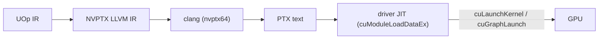

# The CUDA Backend

Svod runs on NVIDIA GPUs through the **CUDA driver API** (`libcuda.so.1`) and
nothing else from the CUDA stack: no toolkit, no `nvcc`, no NVRTC, no
`libcudart`. Kernels are rendered as NVPTX LLVM IR, lowered to PTX text by the
host `clang`, and JIT-compiled to SASS by the driver at module load. The
design follows tinygrad's `ops_cuda.py`; the code lives in `device/src/cuda/`
(driver, memory, programs, graphs), `runtime/src/cuda/` and
`runtime/src/devices/cuda.rs` (compile and device factory), and
`codegen/src/llvm/nvptx/` (the renderer).

---

## Requirements

| Requirement | Why |
|---|---|
| An NVIDIA driver exposing `libcuda.so.1` | Every driver call is resolved from it at runtime with `libloading` |
| Driver **CUDA 12.0 (R525) or newer** | The CUDA-graph entry points are bound by their versioned names (`cuGraphAddKernelNode_v2`, `cuGraphExecKernelNodeSetParams_v2`), which date from 12.0; the PTX ISA is pinned to **7.8** (`--cuda-feature=+ptx78`), which any such driver JITs |
| `clang` built with the **NVPTX** target | `clang -x ir --target=nvptx64-nvidia-cuda` turns the rendered IR into PTX |

Check them on a host:

```bash
ldconfig -p | grep libcuda.so.1          # the driver library
nvidia-smi | grep 'CUDA Version'         # the driver's CUDA level (>= 12.0)
clang --print-targets | grep nvptx64     # the NVPTX backend
```

A clang without NVPTX yields a clean `JitCompilation` error naming the fix
(`-DLLVM_TARGETS_TO_BUILD='X86;AArch64;NVPTX'`). No CUDA toolkit is needed to
run; `ptxas` and `compute-sanitizer` are useful for
[debugging](./debugging.md) only.

---

## A runtime-detected execution provider

The backend is **always compiled**, on every host, behind no cargo feature
(the old `cudarc`-based `cuda` feature is gone). Availability is decided at
runtime: `svod_device::cuda::has_devices()` loads `libcuda.so.1`, resolves every
bound entry point, calls `cuInit(0)` and `cuDeviceGetCount`, and memoizes the
answer. The runtime's device registry registers the `"CUDA"` factory only when
that is `true`; a host without the driver simply has no `CUDA` device type and
the hardware tests self-skip.

This is the same contract as the [AMD backend](../amd/overview.md): the driver
call sites type-check in every `cargo check`, so an API change in the generic
`Program` / `PlanContext` / `Graph` traits is caught without a GPU.

---

## Running on CUDA

Select the GPU with `SVOD_DEVICE` (`CUDA:N`; `NV` and `GPU` are accepted
aliases, `CUDA` alone means device 0):

```bash
SVOD_DEVICE=CUDA:0 cargo run --release -p svod-model --example gigaam_infer -- ./audio.wav
```

Opening a device logs one `info` line with its name, `sm_XY`, SM count,
managed-memory support and driver version (`RUST_LOG=svod_device=info`).

The compute capability is read from the driver at open and kept as an
open-ended `CudaArch { major, minor }` (`sm_86`, `sm_120`, ...). It selects
`clang -march`, keys the object cache, and picks the optimizer profile
(`OptimizerRenderer::for_cuda_arch`):

| Capability | Tensor cores in the profile |
|---|---|
| below `sm_75` | none |
| `sm_75` | f16 `m16n8k8` |
| `sm_80`+ | f16 and bf16 `m16n8k16`, f16 `m16n8k8`; bf16 storage. tf32 stays opt-in (`cuda_sm80(true)`) |
| `sm_89`+ | the sm_80 set plus fp8 `m16n8k32`, which the renderer cannot feed yet (see [Limitations](./limitations.md)) |

---

## Where it sits in the pipeline



Compiled PTX is cached on disk by the shared object cache; the driver keeps
its own SASS cache (`~/.nv/ComputeCache`), so a warm start skips both clang
and `ptxas`.

---

## Tests

Host-only tests (symbol table, struct layouts, kernarg packing, timeline logic,
PTX validation, golden NVPTX IR) run everywhere. Hardware tests return early
through `cuda_device_or_skip()` when no device is present, so a CUDA host runs
them by default:

```bash
cargo test -p svod-device cuda
cargo test -p svod-codegen nvptx
SVOD_DEVICE=CUDA:0 cargo test -p svod-tensor            # codegen_tests! `cuda` variants
SVOD_DEVICE=CUDA:0 cargo test -p svod-onnx              # the ONNX suite's `cuda` variants
```

---

## Reading guide

| Page | What it covers |
|---|---|
| [Architecture](./architecture.md) | The driver bindings, context and streams, memory kinds, program loading and launch, timelines, CUDA graphs, the object cache identity |
| [Codegen](./codegen.md) | The NVPTX renderer: intrinsics, barriers, transcendentals, `mma.sync` tensor cores, launch bounds, the clang invocation and PTX validation |
| [Profiling](./profiling.md) | Event-based GPU timestamps, `cuFuncGetAttribute` resources, which profiler tiers exist on CUDA |
| [Limitations](./limitations.md) | What is not there yet and the roadmap |
| [Debugging](./debugging.md) | Environment variables, IR dumps, reading driver and JIT errors, offline `ptxas` checks |
