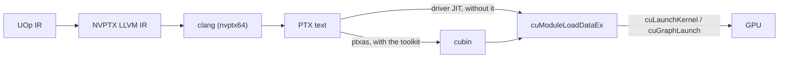

# The CUDA Backend

Svod runs on NVIDIA GPUs through the **CUDA driver API** (`libcuda.so.1`) and
nothing else from the CUDA stack: no toolkit, no `nvcc`, no NVRTC, no
`libcudart`. Kernels are rendered as NVPTX LLVM IR, lowered to PTX text by the
host `clang`, assembled to a cubin by `ptxas` when the CUDA toolkit is
installed and JIT-compiled to SASS by the driver at module load otherwise. The
design follows tinygrad's `ops_cuda.py`; the code lives in `device/src/cuda/`
(driver, memory, programs, graphs), `runtime/src/cuda/` and
`runtime/src/devices/cuda.rs` (compile and device factory), and
`codegen/src/llvm/nvptx/` (the renderer).

---

## Requirements

| Requirement | Why |
|---|---|
| An NVIDIA driver exposing `libcuda.so.1` | Every driver call is resolved from it at runtime with `libloading` |
| Driver **CUDA 12.0 (R525) or newer** | The CUDA-graph entry points are bound by their versioned names (`cuGraphAddKernelNode_v2`, `cuGraphExecKernelNodeSetParams_v2`), which date from 12.0. The PTX ISA pin follows the compute capability: **7.8** up to sm_88, **8.4** on sm_89 and sm_90 (their fp8 `mma.sync` shapes; CUDA 12.4 / R550), **8.6** on sm_100 to sm_102 (CUDA 12.7), **8.7** on sm_120 (CUDA 12.8), **8.8** on sm_103, sm_121 and newer (CUDA 12.9) — a Blackwell part needs the driver of the ISA that introduced it |
| `clang` built with the **NVPTX** target | `clang -x ir --target=nvptx64-nvidia-cuda` turns the rendered IR into PTX |

Check them on a host:

```bash
ldconfig -p | grep libcuda.so.1          # the driver library
nvidia-smi | grep 'CUDA Version'         # the driver's CUDA level (>= 12.0)
clang --print-targets | grep nvptx64     # the NVPTX backend
```

A clang without NVPTX yields a clean `JitCompilation` error naming the fix
(`-DLLVM_TARGETS_TO_BUILD='X86;AArch64;NVPTX'`). No CUDA toolkit is needed to
run: a `ptxas` found on `PATH`, in `/opt/cuda/bin` or in `$CUDA_PATH/bin` is
used to pre-assemble kernels when it happens to be there (`SVOD_CUDA_PTXAS=0`
opts out; an unusable one logs a warning and the driver JIT takes over) and
`compute-sanitizer` is useful for [debugging](./debugging.md), but neither is
required. There is no compute-capability floor in the code: `CudaArch` is
open-ended, and what runs is what the driver and clang's `-march` accept.

---

## A runtime-detected execution provider

The backend is **always compiled**, on every host, behind no cargo feature
(the old `cudarc`-based `cuda` feature is gone). Availability is decided at
runtime: `svod_device::cuda::has_devices()` loads `libcuda.so.1`, resolves every
bound entry point, calls `cuInit(0)` and `cuDeviceGetCount`, and memoizes the
answer. The runtime's device registry registers the `"CUDA"` factory only when
that is `true`; a host without the driver simply has no `CUDA` device type and
the hardware tests self-skip. A driver older than 12.0 ends up the same way —
one of the `_v2` graph symbols is missing, so the load fails and the backend
stays unregistered without a warning.

This is the same contract as the [AMD backend](../amd/overview.md): the driver
call sites type-check in every `cargo check`, so an API change in the generic
`Program` / `PlanContext` / `Graph` traits is caught without a GPU.

---

## Running on CUDA

Select the GPU with `SVOD_DEVICE` (`CUDA:N`, case-insensitive; `GPU` is an
accepted alias, `CUDA` alone means device 0). `NV` is deliberately **not**
accepted — the name stays reserved for a future userspace driver backend:

```bash
SVOD_DEVICE=CUDA:0 cargo run --release -p svod-model --example gigaam_infer -- ./audio.wav
```

Opening a device logs one `info` line with its name, `sm_XY`, SM count,
managed-memory support, driver version and whether scoped synchronization is
on (`RUST_LOG=svod_device=info`).

The compute capability is read from the driver at open and kept as an
open-ended `CudaArch { major, minor }` (`sm_86`, `sm_120`, ...). It selects
`clang -march`, keys the object cache, and picks the optimizer profile
(`OptimizerRenderer::for_cuda_arch`):

| Capability | Tensor cores in the profile |
|---|---|
| below `sm_75` | none (Volta's `mma.sync` is not used); no bf16 storage dtype either |
| `sm_75` | f16 `m16n8k8` into f32 or f16 |
| `sm_80`+ | f16 and bf16 `m16n8k16`, f16 `m16n8k8`, int8 `m16n8k32` accumulating into i32; bf16 storage. The tf32 row exists in the renderer but `for_cuda_arch` never enables it and there is no switch |
| `sm_89`+ | the sm_80 set unchanged: the fp8 `m16n8k32` cores exist (`sm89_tensor_cores`) but `for_cuda_arch` withholds them while the renderer cannot lower fp8 casts (see [Limitations](./limitations.md)) |

---

## Where it sits in the pipeline


```mermaid
flowchart LR
  A["UOp IR"] --> B["NVPTX LLVM IR"]
  B --> C["clang (nvptx64)"]
  C --> D["PTX text"]
  D -->|"ptxas, with the toolkit"| E["cubin"]
  D -->|"driver JIT, without it"| F["cuModuleLoadDataEx"]
  E --> F
  F -->|"cuLaunchKernel / cuGraphLaunch"| G["GPU"]
```

The compiled object is cached on disk by the shared object cache — a cubin
when `ptxas` is installed, PTX text otherwise, and the two formats never share
an entry. On the PTX path the driver keeps its own SASS cache
(`~/.nv/ComputeCache`), so a warm start skips clang and usually the JIT too.

---

## Tests

Host-only tests (symbol table, struct layouts, kernarg packing, timeline logic,
PTX validation, golden NVPTX IR) run everywhere. Hardware tests return early
through `cuda_device_or_skip()` when no device is present, so a CUDA host runs
them by default:

```bash
cargo test -p svod-device cuda
cargo test -p svod-codegen nvptx
SVOD_DEVICE=CUDA:0 cargo test -p svod-tensor            # codegen_tests! `cuda` variants
SVOD_DEVICE=CUDA:0 cargo test -p svod-onnx              # the ONNX suite's `cuda` variants
```

---

## Reading guide

| Page | What it covers |
|---|---|
| [Architecture](./architecture.md) | The driver bindings, context and streams, memory kinds, program loading and launch, timelines, CUDA graphs, the object cache identity |
| [Codegen](./codegen.md) | The NVPTX renderer: intrinsics, barriers, transcendentals, `mma.sync` tensor cores, launch bounds, the clang invocation and PTX validation |
| [Profiling](./profiling.md) | Event-based GPU timestamps, `cuFuncGetAttribute` resources, which profiler tiers exist on CUDA |
| [Limitations](./limitations.md) | What is not there yet and the roadmap |
| [Debugging](./debugging.md) | Environment variables, IR dumps, reading driver and JIT errors, offline `ptxas` checks |
