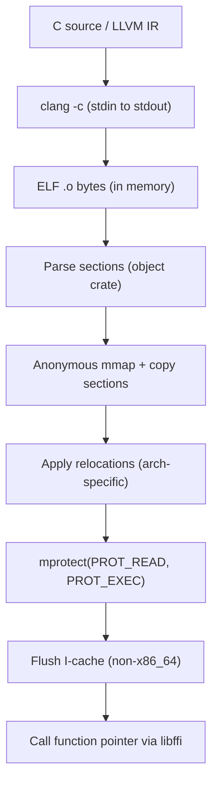

# JIT Compiler

Most ML compilers either link an entire LLVM toolchain into the binary — adding hundreds of megabytes of dependencies — or write temporary files to disk and `dlopen` the result. Svod does neither.

When a kernel needs to execute, Svod pipes the generated source through `clang` on stdin, receives a relocatable ELF object on stdout, parses it in-process, copies the machine code into an anonymous memory mapping, applies relocations, flips the page permissions to executable, and calls the function pointer directly. The whole process happens in memory — no temp files touch the disk, no shared libraries are loaded, and no LLVM installation is required beyond `clang` on the PATH.

This chapter describes how the CPU JIT loader works. The GPU backends pipe through the same `clang` but dispatch through their drivers: see the [AMD backend](./amd/overview.md) (KFD-direct) and the [CUDA backend](./cuda/overview.md) (driver API, PTX JIT). The higher-level graph wrapper API that compiles a model graph once and replays it many times is documented in [JIT Graphs](../architecture/jit-graphs.md).

## Pipeline



Both the **Clang** backend (C source via `-x c`) and the **LLVM** backend (LLVM IR text via `-x ir`) share this loader. The only difference is the clang input language flag.

:::tip Fallback mode
For debugging or platforms where the custom ELF loader doesn't work, the `dlopen-fallback` Cargo feature switches to a traditional pipeline: `clang -shared` writes a `.so` to a temp directory, which is loaded via `dlopen`. This is slower (disk I/O + dynamic linker overhead) but more portable.
:::

## Supported Architectures

| Architecture | Target triple | Compile flag | I-cache | Notes |
|---|---|---|---|---|
| **x86_64** | `x86_64-none-unknown-elf` | `-march=native` | Coherent | AMD64, Intel 64 |
| **aarch64** | `aarch64-none-unknown-elf` | `-march=native` | `__clear_cache` | Apple Silicon, Ampere, Graviton |
| **riscv64** | `riscv64-none-unknown-elf` | `-march=rv64gc` | `__clear_cache` | RV64I + M + A + F + D + C extensions |
| **loongarch64** | `loongarch64-none-unknown-elf` | `-march=native` | `__clear_cache` | Loongson 3A5000+ |
| **ppc64le** | `powerpc64le-none-unknown-elf` | `-mcpu=native` | `__clear_cache` | ELFv2 ABI, little-endian only |

Architecture detection is automatic via `std::env::consts::ARCH` at runtime — no compile-time feature flags needed.

### Relocation Support

The loader implements a minimal ELF relocator for each architecture. It handles the relocation types that `clang -c -O2` actually emits for small, self-contained compute kernels — not a full linker.

**x86_64** — PC-relative (`R_X86_64_PC32`, `PLT32`, `GOTPCRELX`, `REX_GOTPCRELX`), absolute 32/64-bit (`R_X86_64_32`, `32S`, `64`).

**aarch64** — 26-bit branches (`CALL26`, `JUMP26`) with automatic veneer generation when the target exceeds ±128 MiB, page-relative ADRP (`ADR_PREL_PG_HI21`), 12-bit page offsets with access-size shifts (`ADD_ABS_LO12_NC`, `LDST8/16/32/64/128_ABS_LO12_NC`).

**riscv64** — Call pairs (`CALL`, `CALL_PLT`), PC-relative split addressing with state tracking (`PCREL_HI20` + `PCREL_LO12_I/S`), absolute (`HI20`, `LO12_I/S`), branches (`BRANCH`, `JAL`), data (`32`, `64`). Linker relaxation hints (`RELAX`) are skipped.

**loongarch64** — 26-bit branches (`B26`), page-aligned split addressing (`PCALA_HI20`, `PCALA_LO12`), data (`32`, `64`). Linker relaxation hints (`RELAX`) are skipped.

**ppc64le** — 24-bit branches (`REL24`), TOC-relative addressing with `.TOC.` symbol lookup (`TOC16_HA`, `TOC16_LO`, `TOC16_LO_DS`, `TOC16`, `TOC16_HI`), PC-relative (`REL32`), absolute (`ADDR32`, `ADDR64`).

## Compilation Flags

The loader compiles with a bare-metal target to produce clean, self-contained ELF objects with no runtime dependencies:

| Flag | C backend | LLVM IR backend | Purpose |
|---|---|---|---|
| `-c` | yes | yes | Compile only (no linking) |
| `-O2` | yes | yes | Optimization level |
| `-march=native` | yes | yes | Use host CPU features |
| `-fPIC` | yes | yes | Position-independent code |
| `-ffreestanding` | yes | no | No hosted environment assumed |
| `-fno-math-errno` | yes | yes | Math builtins don't set errno |
| `-fno-stack-protector` | yes | yes | No stack canary overhead |
| `-nostdlib` | yes | no | No standard library |
| `-fno-ident` | yes | no | Suppress `.comment` section |
| `--target=<arch>-none-unknown-elf` | yes | yes | Bare-metal ELF target |
| `-ffixed-x18` | aarch64 macOS/Win | aarch64 macOS/Win | Reserve platform register |
| `-funroll-loops` | no | yes | Aggressive loop unrolling |
| `-fvectorize` | no | yes | Loop vectorization |
| `-fslp-vectorize` | no | yes | SLP (straight-line) vectorization |

The C backend uses `__builtin_*` functions (e.g. `__builtin_sqrtf`, `__builtin_fmaf`) instead of `#include <math.h>`, so `-ffreestanding -nostdlib` works without losing math support — these are compiler intrinsics that lower to hardware instructions directly.

## External Symbol Resolution

If clang emits a call to an external function (rare — most math is handled by builtins), the loader resolves it via `dlsym(RTLD_DEFAULT, name)` at load time. This covers cases like `memcpy` or platform-specific libm symbols that clang might emit instead of inlining.

### Branch Veneers (aarch64)

On aarch64, `CALL26`/`JUMP26` relocations encode a PC-relative offset in 26 bits, giving a range of ±128 MiB. On macOS with ASLR, the anonymous mmap region is typically ~2 GB away from system libraries like libm — far beyond this range.

When the loader detects an out-of-range `CALL26`/`JUMP26`, it emits a **veneer** (branch trampoline) in a reserved area at the end of the mmap:

```text
LDR X16, [PC, #8]   // load 64-bit target address
BR  X16              // indirect branch
.quad <address>      // full 64-bit address
```

Veneers are pre-scanned (counted before mmap allocation) and deduplicated — if multiple call sites reference the same external symbol, they share a single veneer.

### Platform Register (aarch64)

On macOS and Windows ARM, register `x18` is reserved as the platform register. Since we compile with `--target=aarch64-none-unknown-elf` (bare-metal), the compiler would normally treat `x18` as a free GPR. The `-ffixed-x18` flag prevents this, avoiding crashes when JIT code runs in a macOS/Windows process.

## Instruction Cache Coherence

On x86_64, the instruction and data caches are coherent — writing machine code to memory and jumping to it works without extra steps. On all other architectures, the loader calls `__clear_cache(start, end)` after `mprotect` to ensure the instruction cache sees the new code.
