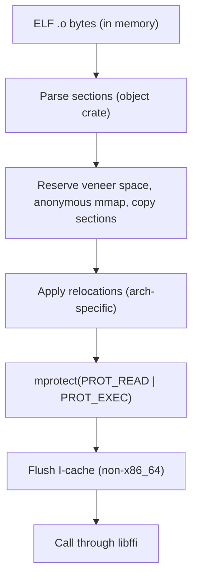

# The ELF JIT Loader

Both [CPU](./cpu.md) code paths end in a relocatable ELF object in memory — from
libLLVM in process, or from a `clang -c` subprocess on stdin/stdout. The loader
(`runtime/src/jit_loader.rs`) turns those bytes into a callable function
without touching the disk: it parses the sections, copies them into an anonymous
mapping, applies relocations, flips the pages to executable and hands back the
entry pointer. No temporary file, no `dlopen`, no linker.


```mermaid
flowchart TD
  A["ELF .o bytes (in memory)"] --> B["Parse sections (object crate)"]
  B --> C["Reserve veneer space, anonymous mmap, copy sections"]
  C --> D["Apply relocations (arch-specific)"]
  D --> E["mprotect(PROT_READ | PROT_EXEC)"]
  E --> F["Flush I-cache (non-x86_64)"]
  F --> G["Call through libffi"]
```

The entry point is `jit_load(object, name) -> (fn_ptr, mapping)`; the entry
symbol is `name` or `_name`. The mapping lives as long as the `JitKernel` /
`LlvmKernel` that owns it.

:::tip[Fallback mode]
The `dlopen-fallback` cargo feature of `svod-runtime` bypasses the loader for
the C path: `clang -shared` writes a `.so` into a temporary directory, which
`libloading` opens. It is slower (disk I/O, the dynamic linker) but portable,
and CI runs it as the `test-dlopen-fallback` check. The LLVM path always uses
the in-memory loader.
:::

## Supported Architectures

| Architecture | Target triple | I-cache | Notes |
|---|---|---|---|
| **x86_64** | `x86_64-none-unknown-elf` | Coherent | AMD64, Intel 64 |
| **aarch64** | `aarch64-none-unknown-elf` | `__clear_cache` | Apple Silicon, Ampere, Graviton |
| **riscv64** | `riscv64-none-unknown-elf` | `__clear_cache` | RV64I + M + A + F + D (`-march=rv64g`) |
| **loongarch64** | `loongarch64-none-unknown-elf` | `__clear_cache` | Loongson 3A5000+ |
| **ppc64le** | `powerpc64le-none-unknown-elf` | `__clear_cache` | ELFv2 ABI; the instruction patching assumes little-endian |

The architecture is `std::env::consts::ARCH` at run time; there are no
compile-time feature flags. Objects are compiled for a bare-metal
`<arch>-none-unknown-elf` target so they carry no runtime dependencies, with
PIC relocations. The compile flags per path are on the [CPU page](./cpu.md).

### Relocation Support

The loader implements a minimal ELF relocator for each architecture. It handles
the relocation types that an `-O2` object of a small, self-contained compute
kernel actually contains — not a full linker. Anything else is a clean error,
never a silent zero-write.

**x86_64** — PC-relative (`R_X86_64_PC32`, `PLT32`, `GOTPCRELX`,
`REX_GOTPCRELX`, patched as `S + A - P` with no GOT), absolute 32/64-bit
(`R_X86_64_32`, `32S`, `64`).

**aarch64** — 26-bit branches (`CALL26`, `JUMP26`) with automatic veneer
generation when the target exceeds ±128 MiB, page-relative ADRP
(`ADR_PREL_PG_HI21`), 12-bit page offsets with access-size shifts
(`ADD_ABS_LO12_NC`, `LDST8/16/32/64/128_ABS_LO12_NC`).

**riscv64** — Call pairs (`CALL`, `CALL_PLT`), PC-relative split addressing with
state tracking (`PCREL_HI20` + `PCREL_LO12_I/S`), absolute (`HI20`, `LO12_I/S`),
branches (`BRANCH`, `JAL`), data (`32`, `64`). Linker relaxation hints (`RELAX`)
are skipped.

**loongarch64** — 26-bit branches (`B26`), page-aligned split addressing
(`PCALA_HI20`, `PCALA_LO12`), data (`32`, `64`). Linker relaxation hints
(`RELAX`) are skipped.

**ppc64le** — 24-bit branches (`REL24`), TOC-relative addressing with `.TOC.`
symbol lookup (`TOC16_HA`, `TOC16_LO`, `TOC16_LO_DS`, `TOC16`, `TOC16_HI`),
PC-relative (`REL32`), absolute (`ADDR32`, `ADDR64`).

## External Symbol Resolution

Undefined symbols are resolved with `dlsym(RTLD_DEFAULT, name)` at load time.
This is a routine path, not a rare one: `sqrt`, `fma`, `floor` and `rint` lower
to instructions, but `exp`, `log`, `sin`, `cos`, `tan`, `pow`, `fmod` and `erf`
reach the object as calls into `libm`, whether they were rendered as
`__builtin_*` in C or as `@llvm.*` intrinsics in IR. A symbol the process does
not export is a load error naming it.

### Branch Veneers (aarch64, x86_64)

On aarch64, `CALL26`/`JUMP26` encode a PC-relative offset in 26 bits, a range of
±128 MiB; on x86_64 `PC32`/`PLT32` give ±2 GiB. A long-lived process fills its
mmap area top-down, so an anonymous JIT mapping eventually lands beyond the
reach of `libm` and friends.

When a direct branch would not reach, the loader routes it through a **veneer**
(branch trampoline) in a reserved area at the end of the mapping:

```text
LDR X16, [PC, #8]   // load 64-bit target address
BR  X16              // indirect branch
.quad <address>      // full 64-bit address
```

The x86_64 form is `MOVABS $target, %r11` + `JMP *%r11`, and it is only taken
when the byte before the patch site is a real `call` (`E8`) or `jmp` (`E9`)
opcode — an out-of-range RIP-relative data reference fails loudly instead.
Veneer space is reserved for every unique undefined direct-branch symbol before
the mapping is allocated, and veneers are deduplicated by target address, so
call sites sharing a symbol share one trampoline.

### Platform Register (aarch64)

On macOS ARM, register `x18` is reserved as the platform register and the kernel
clobbers it on a context switch. Since objects are compiled for the bare-metal
`aarch64-none-unknown-elf` target, the compiler would otherwise treat `x18` as a
free GPR. The clang paths pass `-ffixed-x18` and the in-process path adds
`+reserve-x18` to the feature string. Linux ARM treats `x18` as an ordinary
GPR, and Windows ARM is not a target Svod supports.

## Instruction Cache Coherence

On x86_64, the instruction and data caches are coherent — writing machine code
to memory and jumping to it works without extra steps. On every other
architecture the loader calls `__clear_cache(start, end)` after `mprotect` so
the instruction cache sees the new code.

## Calling the kernel

The entry pointer is called through **libffi** with a `KernelCif`
(`runtime/src/dispatch.rs`) built from the kernel's ABI descriptors: a pointer
per storage parameter, an `i32` per scalar, `void` return. The executor's `i64`
values are truncated to `i32` at the call. One CIF per kernel is what lets each
kernel have its own arity without a transmute per signature.

## Tests

`runtime/src/test/unit/jit_loader.rs` compiles small C kernels through clang on
any host (a no-op, buffers and vars, `__builtin_sqrtf`). The veneer tests —
routing past 2 GiB, a shared veneer, the error on an out-of-range non-branch
relocation — are x86_64 only, and the far-call execution test additionally
requires Linux. The other relocators have no dedicated tests beyond running the
suite on that hardware.
