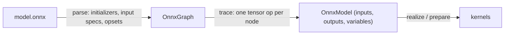

# ONNX Inference

`svod-onnx` turns a `.onnx` file into the same lazy tensor graph a hand-written
model builds: every operator is decomposed into `svod-tensor` operations, so the
imported graph goes through the full scheduler, optimizer and code generator and
runs on every backend. There is no ONNX Runtime underneath.

| Capability | Status |
|---|---|
| Forward inference | Supported |
| Operators | 162 / 200 standard ops ([parity table](https://github.com/npatsakula/svod/blob/main/onnx/PARITY.md)) |
| Conformance | 1357 ONNX backend node tests pass on both CPU backends (Clang, LLVM); the suite also runs on AMD and CUDA when `SVOD_DEVICE` selects one |
| Dynamic dimensions | Bound at import time (see [Dynamic dimensions](#dynamic-dimensions)) |
| Microsoft contrib ops | `Attention`, `RotaryEmbedding`, `SkipLayerNormalization`, `EmbedLayerNormalization`, `BiasGelu`, `FastGelu` |
| Training / backward pass | Not supported |

For an operator outside the table, `ort` (a wrapper around the C++ ONNX
Runtime) covers the full specification.

---

## Quick start

```toml
[dependencies]
svod-onnx   = "0.2"
svod-tensor = "0.2"
prost       = "0.14"            # ModelProto::decode
```

The importer has three entry points:

| Call | Weights | Inputs |
|---|---|---|
| `import(path, dim_bindings)` | Float initializers are memory-mapped lazily from the file; `data_location = EXTERNAL` resolves against the file's directory | Unallocated placeholders you `assign` to |
| `import_model_with_inputs(proto, inputs, dim_bindings)` | Read from the decoded `ModelProto` | Your own tensors, traced into the graph directly |
| `import_model(proto, dim_bindings)` | Read from the decoded `ModelProto` | Placeholders, as `import` |

All three return an `OnnxModel`:

```rust
pub struct OnnxModel {
    pub inputs: HashMap<String, Tensor>,      // graph inputs that are not initializers
    pub outputs: HashMap<String, Tensor>,     // lazy; nothing has run yet
    pub variables: HashMap<String, Variable>, // one per named dim_param
}
```

### Runtime inputs

Build the input tensors yourself and hand them to the importer. The graph is
traced on them, so the tensors you hold are the buffers the kernels read:

```rust
use std::collections::HashMap;

use prost::Message;
use svod_onnx::parser::onnx::ModelProto;
use svod_onnx::{OnnxImporter, OnnxModel};
use svod_tensor::Tensor;

fn main() -> Result<(), Box<dyn std::error::Error>> {
    let proto = ModelProto::decode(std::fs::read("model.onnx")?.as_slice())?;

    // Same shape and dtype as the graph input "input"
    let image = Tensor::from_ndarray(&load_image_nchw());    // [1, 3, 224, 224] f32

    let OnnxModel { outputs, .. } = OnnxImporter::new().import_model_with_inputs(
        proto,
        HashMap::from([("input".to_string(), image.clone())]),
        &[("batch", 1)],
    )?;

    // Schedule every output together, run once
    Tensor::realize_batch(outputs.values())?;
    for (name, tensor) in &outputs {
        println!("{name}: {:?}", tensor.as_ndarray::<f32>()?);
    }
    Ok(())
}
```

`Tensor::from_ndarray` and `Tensor::from_raw_bytes(bytes, &dims, dtype)` give
a tensor that owns a buffer of the declared shape; `Tensor::from_slice` is
always 1-D, so reshape it only through one of those.

### Compile once, replay

For repeated inference compile the outputs into a plan and write new data
straight into the input buffer between runs:

```rust
let plan = Tensor::prepare_batch(outputs.values())?;   // schedule + compile, once
plan.execute()?;

for batch in batches {
    image.array_view_mut::<f32>()?.as_slice_mut().unwrap().copy_from_slice(&batch);
    plan.execute()?;                                   // replay: no tracing, no compilation
    let logits = outputs["output"].as_vec::<f32>()?;
}
```

`array_view_mut` is a zero-copy `ndarray` view over the input's host mapping;
`prepare_batch` wires each output tensor to the plan's buffer, so `as_vec` /
`as_ndarray` read the latest run.

### Placeholder inputs

`import(path)` is the entry point that memory-maps the weights and resolves
external data. Its inputs are placeholders: `assign` a value of the same shape
and realize the input *before* the outputs. A placeholder keeps one buffer
across plans, so a prepared plan also sees later `assign` + `realize` calls
and `array_view_mut` writes to it.

```rust
let OnnxModel { mut inputs, outputs, .. } = OnnxImporter::new().import("model.onnx", &[])?;

let input = inputs.remove("input").unwrap();
input.assign(&Tensor::from_ndarray(&image));
input.realize()?;
Tensor::realize_batch(outputs.values())?;
```

A model whose inputs are all initializers needs none of this:
`Tensor::realize_batch(model.outputs.values())?` runs it.

---

## Dynamic dimensions

A named `dim_param` (`"batch"`, `"sequence_length"`) becomes a `Variable` with
bounds `(1, default_max_dim)`; `default_max_dim` is a public field of
`OnnxImporter` and defaults to 32767. An unnamed or zero-sized dimension
becomes 1.

Bind every dynamic dimension at import. A bound dimension is a plain constant
in the traced graph, so the kernels specialize to it:

```rust
let model = importer.import("model.onnx", &[("batch", 8), ("sequence_length", 512)])?;
println!("{:?}", model.inputs["input_ids"]);   // Tensor { shape: [8, 512], dtype: Scalar(Int64), .. }
```

A dimension you leave unbound stays symbolic: its buffer is allocated for the
upper bound and `dims()` fails with `SymbolicShape` (the `Debug` output prints
`shape: symbolic`). Rebinding through `ExecutionPlan::execute_with_vars` is not
supported for imported graphs — a bound dimension is already a constant, and an
unbound one compiles a kernel that ignores the runtime value. To serve several
batch sizes, import once per size, or lower `default_max_dim` so the unbound
buffers stay small. Out-of-range bindings fail at import with `IrConstruction`;
a binding for a name the model does not declare is ignored.

---

## How the importer works



**Parse.** The protobuf is decoded, initializers become tensors, graph inputs
become shape specs and the opset per domain is recorded. Through `import`, every
float initializer with more than one element is a lazy view into the file
(`SHRINK → BITCAST → RESHAPE → COPY` onto the default device), so a large model
costs no host copy; scalars are folded into constants.

**Trace.** Nodes are visited in topological order and each dispatches to its
tensor implementation. The result is a set of lazy output tensors. A few
operators read a *data* input at trace time — `Reshape`'s shape, `Tile`'s
repeats, `TopK`'s k, `Range`, `ConstantOfShape`, and the `axes` input of the
reductions from opset 13 (`ReduceSum`) or 18 (the rest) — so those small
tensors are realized during import. When one of them is a graph input, supply
it through `import_model_with_inputs`.

### Operator decomposition

About fifty operators map 1:1 to a tensor method:

```rust
"Add"     => x.try_add(y)?
"Relu"    => x.relu()?
"Sigmoid" => x.sigmoid()?
"Equal"   => x.try_eq(y)?
```

Operators with many optional attributes use the tensor crate's builders:

```rust
x.conv()
    .weight(w)
    .maybe_bias(bias)
    .auto_pad(AutoPad::SameLower)
    .group(32)
    .maybe_dilations(Some(&[2, 2]))
    .call()?
```

The rest are multi-step decompositions. `Mod`, for instance, picks one of four
forms from the `fmod` attribute and the input dtype; the floating-point
Python-style branch is `x - floor(x / y) * y`:

```rust
let div = x.try_div(y)?;
x.try_sub(&div.floor().try_mul(y)?)?
```

`floor()` carries no `?`: the rounding ops, `cast`, `neg`, `abs`, `square`
and `sign` cannot fail. The bitwise operators behind `BitwiseAnd`/`Or`/`Xor`
and `BitShift` are `try_bitand`, `try_bitor`, `try_bitxor`, `try_shl` and
`try_shr`.

### Attributes and opsets

Attributes are popped as they are read — `attrs.int("axis", -1)`,
`attrs.float("epsilon", 1e-5)` — and `attrs.done()` returns
`UnhandledAttributes` if any are left, so an attribute an implementation
forgot is an import error rather than a silently wrong result.

Operators switch behaviour on the opset their domain imports: `Softmax` and
`LogSoftmax` default to axis `1` before opset 13 and `-1` from 13; `ReduceSum`
takes its axes as an input from opset 13 and the other reductions from 18.
The `""` and `ai.onnx` domains share one opset.

### Transformer operators

The `com.microsoft` contrib operators that ONNX Runtime exports:

| Operator | Notes |
|---|---|
| `Attention` | Packed QKV with `mask_index` (1-D, 2-D or n-D), `unidirectional`, `qkv_hidden_sizes` and a past KV cache |
| `RotaryEmbedding` | Interleaved and non-interleaved |
| `SkipLayerNormalization` | Residual + LayerNorm; the optional mean / inverse-std outputs are zeros |
| `EmbedLayerNormalization` | Token + position + segment embeddings → LayerNorm; the mask input is ignored |
| `BiasGelu`, `FastGelu` | Fused bias + GELU |

The standard `ai.onnx` `Attention` supports grouped-query attention, causal
masking, past KV caching, softcap, every `qk_matmul_output_mode`,
`softmax_precision`, `nonpad_kv_seqlen` and 3-D inputs; its outputs are
`[output, present_key, present_value, qk]`.

---

## Control flow and limitations

### `If` traces both branches

Nothing executes at trace time, so the condition of an `If` node is unknown.
The importer traces *both* branches and merges them with `where_`:

```text
ONNX:   if condition { then_branch } else { else_branch }
Svod:   then_result.where_(&condition, else_result)
```

`where_` reads "keep `self` where the condition holds";
`condition.select(&a, &b)` is the same op spelled from the mask's side. The
compiled graph then handles any condition value, with one constraint: both
branches must produce the same shapes and dtypes. A shape-polymorphic `If`
is rejected at import.

### Not implemented

- `Loop` and `Scan`: iterative control flow needs repeated tracing or
  unrolling. `RNN`, `GRU` and `LSTM` are native ops instead; their `direction`
  is inferred from `W`'s leading dimension (`bidirectional` works, `reverse`
  runs forward) and the `activations` and `clip` attributes are ignored.
- Training: no backward pass, gradients or optimizers.

| Category | Examples | Why |
|---|---|---|
| Dynamic quantization | `QuantizeLinear`, `DequantizeLinear`, `DynamicQuantizeLinear` (`QLinearConv`, `QLinearMatMul`, `ConvInteger` and `MatMulInteger` are implemented) | Not yet ported |
| Sequence ops | `SequenceConstruct`, `SequenceAt` | Non-tensor types are outside the type system |
| Random | `RandomNormal`, `RandomUniform`, `Bernoulli` | No stateful RNG in the graph |
| Signal processing | `DFT`, `STFT`, `MelWeightMatrix` | Not wired to the importer (the tensor crate has `stft` / `istft` / `mel_spectrogram`) |
| Text | `StringNormalizer`, `TfIdfVectorizer` | No string type |

---

## Debugging

**Per-node tracing.** At `trace` level the importer realizes every node's
output as it is traced and logs its shape and first five values — a numerical
bisection tool for a model that produces wrong results. It breaks fusion, so
use it only for debugging, and install a `tracing-subscriber` with an
`EnvFilter` in your binary:

```bash
RUST_LOG=svod_onnx::importer=trace cargo run
```

Tracing happens inside the import call, so real input values appear only when
the inputs are supplied through `import_model_with_inputs`; placeholder inputs
trace as empty buffers.

**Inspecting the graph.** `Tensor`'s `Debug` prints shape, dtype, device and
realization state, never the data:

```rust
let model = importer.import("model.onnx", &[])?;
for (name, tensor) in &model.inputs {
    println!("input {name}: {tensor:?}");
}
println!("outputs:   {:?}", model.outputs.keys().collect::<Vec<_>>());
println!("variables: {:?}", model.variables);
```

**Kernel attribution.** Every kernel the importer produces records its ONNX
node as its origin, so the profiler reports device time per node — see
[Kernel origins](./architecture/kernel-origins).

---

## Summary

| Aspect | Detail |
|---|---|
| **Entry points** | `import(path, dims)`, `import_model_with_inputs(proto, inputs, dims)`, `import_model(proto, dims)` |
| **Runtime inputs** | Build the tensors, pass them to `import_model_with_inputs`, write through `array_view_mut` between runs |
| **Dynamic dims** | Bind at import: `&[("batch", 8)]`; one import per batch size |
| **Operators** | 162 / 200 ([parity table](https://github.com/npatsakula/svod/blob/main/onnx/PARITY.md)) |
| **Conformance** | 1357 node tests on Clang and LLVM; AMD and CUDA via `SVOD_DEVICE` |
| **Extensions** | com.microsoft `Attention`, `RotaryEmbedding`, `SkipLayerNormalization`, `EmbedLayerNormalization`, `BiasGelu`, `FastGelu` |
| **Limitations** | No training, no `Loop` / `Scan`, no shape-polymorphic `If`, no runtime rebinding of dynamic dims |

**Next:** [Tensor API](./examples) for the graph these models land in, or
[Running models](./models) for the native ports.
