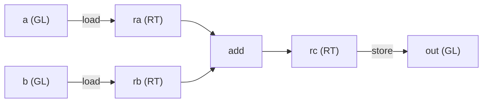

# Writing Your First Kernel

[Authoring into the IR](./lowering) explained the builder in the abstract: `Kernel` hands you
the raw materials, `Group` carries the compute vocabulary, and `finish` wraps everything in a
`SINK`. This chapter makes that concrete by writing the smallest kernel that does real work —
**load two `16×16` tiles, add them, store the result** — and running it.

It is deliberately the simplest thing that still exercises the whole shape of a kernel: the
load → compute → store arc from [What Tiling Is](./tiling), made into code. No matrix multiply,
no shared memory, no loop — just enough to see every step. The matmul and Flash Attention
kernels are this same skeleton with more on top.



---

## The whole kernel

Here it is end to end — declare the buffers, build the body, run it, read the result back:

```rust
use svod_dtype::DType;
use svod_tensor::Tensor;
use svod_tk::arch::FragRole;
use svod_tk::index::Idx;
use svod_tk::tiles::TileLayout;
use svod_tk::{run_kernel, MoveIdx};

// Two 16×16 inputs and an output, as flat f32 buffers.
let a: Vec<f32> = (0..256).map(|i| i as f32).collect();
let b: Vec<f32> = (0..256).map(|i| (2 * i) as f32).collect();
let ta = Tensor::from_slice(&a);
let tb = Tensor::from_slice(&b);
let mut out = Tensor::empty(&[1, 1, 16, 16], DType::Float32);

// One wave covers the tile; its width is 64 on CDNA, 32 on RDNA and CUDA.
let arch = svod_tk::target::resolve_arch(&ta.device()).expect("a GPU device");
let w = svod_tk::ArchCaps::for_arch(arch).wave_size as i64;

run_kernel("tile_add", [1, 1, 1], w, &mut [&mut out], &[&ta, &tb], |ker| {
    let warp = ker.warp();

    // Globals, in launch order: output first, then the two inputs.
    let o = ker.gl(&[1, 1, 16, 16], DType::Float32);
    let ga = ker.gl(&[1, 1, 16, 16], DType::Float32);
    let gb = ker.gl(&[1, 1, 16, 16], DType::Float32);

    // Ask for the 16×16 f32 fragment by role — arch-correct on wave32 and wave64.
    let frag = ker.caps.frag(FragRole::Accumulator);
    let blk = [Idx::Const(0), Idx::Const(0), Idx::Const(0), Idx::Const(0)];

    // global → register
    let ra = warp.load(ker.rt((16, 16), DType::Float32, TileLayout::Row, frag), ga, MoveIdx::block(&blk, 2));
    let rb = warp.load(ker.rt((16, 16), DType::Float32, TileLayout::Row, frag), gb, MoveIdx::block(&blk, 2));

    // the one compute op
    let rc = warp.add(ra, &rb);

    // register → global, then close the kernel around its single store
    let _ = warp.store(o, rc, MoveIdx::block(&blk, 2));
    ker.finish(1)
})
.expect("tile_add launch");

let result = out.as_vec::<f32>().expect("read out"); // result[i] == 3 * i
```

That's the entire kernel. The rest of this chapter walks each line.

---

## Step by step

### 1. Declare the launch

`run_kernel` is the direct-dispatch entry from the DEBUG face: it realizes the inputs, allocates
the outputs, builds a `Kernel` for you, runs your closure to get the `SINK`, then compiles and
dispatches — writing the outputs in place.

```rust
run_kernel("tile_add", [1, 1, 1], w, &mut [&mut out], &[&ta, &tb], |ker| { /* body */ })
```

The `[1, 1, 1]` grid and `w` block are the launch geometry. We use **one workgroup of one wave**:
the whole `16×16` tile fits in a single wave's registers, so there is nothing to spread across
blocks. The block size is `w`, the **wave width** — which we queried from the device up front
(`ArchCaps::for_arch(resolve_arch(&ta.device())).wave_size`), because a wave is 64 lanes on CDNA but 32 on RDNA and
the block dimension *is* that lane count. The output slice comes first, the inputs second — and
**that order is the contract** the next step depends on.

### 2. Get a wave to work with

```rust
let warp = ker.warp();
```

`Group` is the cooperating wave (`warp` is the NVIDIA term for the same thing). Every compute op —
loads, the add, the store — is a method on it. `ker.warp()` is the single-wave group; `ker.group(n)`
would give you `n` waves for a bigger tile.

### 3. Declare the globals

```rust
let o  = ker.gl(&[1, 1, 16, 16], DType::Float32);
let ga = ker.gl(&[1, 1, 16, 16], DType::Float32);
let gb = ker.gl(&[1, 1, 16, 16], DType::Float32);
```

A **global layout** (`GL`) is a typed view over one of the buffers — it knows the logical shape,
so loads compute the right address. Each `gl()` call binds the *next* buffer in declaration order,
and that order must match the launch: we passed `&mut [&mut out]` then `&[&ta, &tb]`, so we declare
`o`, then `ga`, then `gb`. Get this order wrong and the kernel reads and writes the wrong buffers.

The `[1, 1, 16, 16]` shape is the 4-D addressing convention tk kernels use; the two leading `1`s
are batch/head dimensions a real kernel would iterate, left trivial here. (The input *tensors*
themselves can be flat 256-element buffers — the `GL` view supplies the logical shape; only the
output tensor carries its shape, for allocation.)

### 4. Ask for the tile by role

```rust
let frag = ker.caps.frag(FragRole::Accumulator);
```

This is the portability move from [Wave32 vs Wave64](./wave-portability), and it matters even in a
kernel with no matrix multiply: the same logical `16×16` f32 tile has a *different physical lane
layout* on the two AMD wave widths, so naming a **role** instead of a hardcoded fragment lets one
body compile for both. We ask `ArchCaps` for the `Accumulator` role — simply the role for a
full-precision result tile, which is what an add produces too, not only an MMA — and let it resolve
the physical fragment for the target: wave64 on CDNA, the even/odd wave32 layout on RDNA.

### 5. Load: global → register

```rust
let blk = [Idx::Const(0), Idx::Const(0), Idx::Const(0), Idx::Const(0)];
let ra = warp.load(ker.rt((16, 16), DType::Float32, TileLayout::Row, frag), ga, MoveIdx::block(&blk, 2));
let rb = warp.load(ker.rt((16, 16), DType::Float32, TileLayout::Row, frag), gb, MoveIdx::block(&blk, 2));
```

`ker.rt(...)` allocates a register tile in the fragment layout we just resolved; `warp.load` fills
it from the global. `MoveIdx::block(&blk, 2)` says *which* tile of the global to read: `blk` is the
tile's coordinate along each of the four dimensions — all zeros, because a single `16×16` tile has
only the `(0, 0)` position — and the `2` is the axis those tiles are stacked along: dimension 2, the
row dimension of the `[1, 1, 16, 16]` view. (A `[1, 1, 32, 16]` global would hold two row-tiles;
reading the second would set that coordinate to `Idx::Const(1)`.) The wave cooperatively pulls the
256 elements straight into registers, already in the layout compute wants.

This is the *direct* `global → register` path — no shared-memory stop. A kernel that streams large
tensors would stage through a shared tile first (for coalescing and a conflict-free swizzle, the
gaps from [Where the FLOPS Hide](./where-flops-hide)); we skip it because a single resident tile
needs neither.

### 6. Compute: the one op

```rust
let rc = warp.add(ra, &rb);
```

The only arithmetic in the kernel. `add` is elementwise over the tile — no lane indexing, no
address math, just "add these two tiles." (It takes the first operand by value and the second by
reference, returning the result tile.) This is where, in a real kernel, `mma`, reductions, and
elementwise maps would go; the mechanics around them are exactly what you see here.

### 7. Store and finish

```rust
let _ = warp.store(o, rc, MoveIdx::block(&blk, 2));
ker.finish(1)
```

`warp.store` writes the result tile back to the output global — the same indexing in reverse.
`ker.finish(1)` closes the kernel around its **one** store, producing the `SINK` (stamped
`opts_to_apply: Some(vec![])` so the optimizer leaves the hand-lowered body alone, as
[Authoring into the IR](./lowering) described). The number you pass `finish` is how many output
stores to collect into the `SINK` — we have one output, so `1`.

### 8. Run it and read it back

`run_kernel` compiles and dispatches the moment the closure returns. The output was bound in place,
so we read it straight off the tensor:

```rust
let result = out.as_vec::<f32>().expect("read out"); // result[i] == 3 * i
```

With `a[i] = i` and `b[i] = 2i`, every element comes back `3i`.

---

## The rules you can't break

A few constraints are load-bearing — get one wrong and you get a compile error, a panic, or a
wrong answer:

| Rule | Why |
|------|-----|
| **Tile dims are a multiple of `16`** | A tile is a whole number of `16×16` matrix-core fragments; `ker.rt` asserts it. |
| **`gl()` order = launch buffer order** | Outputs first, then inputs. The bind is positional; a mismatch silently swaps buffers — wrong numbers, no error, so the compiler can't catch it. |
| **Request fragments by role, not by constant** | `caps.frag(role)` is what makes one body run on wave32 *and* wave64. |
| **It's a GPU kernel** | The builder mints real lane indices (`Op::Special`), so execution targets an AMD device, not the CPU. |

---

:::tip For GPU experts
The body lowers to exactly the `RANGE` / `INDEX` / `LOAD` / `STORE` shape from
[Authoring into the IR](./lowering) — no new node types. The kernel mints a lane-index `Op::Special`
that the wave's loads ride; each `warp.load` becomes a global `LOAD` under that lane, `warp.add` is a
single `Op::Binary(Add)`, and the store is one `STORE` the `SINK` closes over. There is **no** `Wmma`
and **no** `DefineLocal`: this is a register-only round-trip, the leanest kernel the IR can express.

Because the kernel emits `Special` ops, it *is* a fully hand-lowered GPU kernel — the optimizer and
the workgroup-dimension passes treat a `Special`-bearing graph as already-lowered and pass it
through (the same gate `opts_to_apply: Some(vec![])` enforces). That is also why it renders only on
the AMD LLVM backend: the lane index has no meaning on the scalar CPU path. *Building* the `SINK`,
though, is pure UOp construction — that needs no GPU; only executing it does. That split is what
lets a kernel be guarded by a host-side shape check on every build, with a separate gated test for
the on-device numbers.
:::

---

## Why this matters

This tiny kernel is the template every tk kernel is poured into. The matmul kernel adds an `mma`
and a K-loop, and the worked [Flash Attention](./flash-attention) example puts the matrix core to
work alongside an online-softmax recurrence, double-buffered streaming, and a wave-size branch. But
the bones are exactly what you just wrote: declare globals in launch order, request tiles by role,
move data between memory spaces, compute on tiles, `finish`. Learn this skeleton and the harder
kernels add to it rather than replace it.

And all of it is the one UOp IR. The `SINK` you built is the same kind of object the compiler
produces for an autotuned kernel — which is the whole point of the section.

Next, the wrinkle that makes hand-authoring genuinely hard on AMD — keeping a kernel correct across
wave sizes: [Wave32 vs Wave64](./wave-portability).
