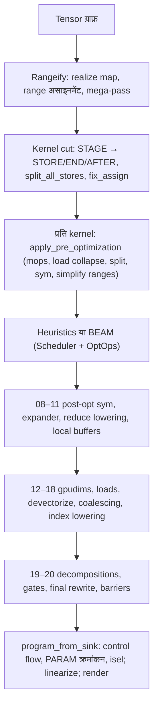

# Codegen पाइपलाइन

एक tensor एक्सप्रेशन चार कोड-हिस्सों से गुज़रकर हार्डवेयर तक पहुँचता है; आख़िरी कदम को छोड़कर सभी `svod-schedule` crate में हैं:

| हिस्सा | एंट्री पॉइंट | इनपुट → आउटपुट |
|-------|-------------|----------------|
| Rangeify | `rangeify_with_map` (`rangeify/transforms.rs`) | movement ops वाला tensor ग्राफ़ → स्पष्ट `RANGE`s के साथ `STAGE` / `INDEX` / `REDUCE` का ग्राफ़ |
| Kernel cut | `try_get_kernel_graph` (`rangeify/kernel.rs`) | `STAGE` → `STORE`/`END`/`AFTER`, हर kernel के लिए एक `CALL` में विभाजित |
| प्रति-kernel ऑप्टिमाइज़ेशन | `optimize_kernel_with_naming` / `beam_search_cached_remote` (`optimizer/`) | Kernel AST → ऑप्टिमाइज़्ड kernel AST (`apply_pre_optimization`, heuristics या BEAM, `apply_post_optimization_configured_with_capture`) |
| प्रोग्राम सीमा | `program_from_sink` + `do_linearize` (`svod-codegen`, `program_pipeline.rs`) | Kernel AST → control-flow edges → रैखिक instruction सूची → source / binary |

`tensor/src/realize.rs` इन्हें जोड़ता है: `rangeify_with_map` → `try_get_kernel_graph` → हर kernel पर `optimize_kernel_with_naming` (या BEAM) → `program_from_sink` → `do_linearize` → `do_render` → compile।

हर पास एक `patterns!` matcher पर `graph_rewrite` है ([pattern इंजन](../optimizations/pattern-system.md) देखें); कुछ अपवाद (`memory_coalescing`, `merge_register_read_ends`, `linearize`) साधारण ग्राफ़-वॉक हैं। Matchers fixpoint तक चलते हैं, फिर अगला पास शुरू होता है।

## शब्दावली

- **UOp** — एक hash-consed नोड (`Arc<UOp>`): एक op, एक dtype, sources। एक जैसे सबट्री एक ही पॉइंटर होते हैं, इसलिए `Arc::ptr_eq` संरचनात्मक समानता है।
- **RANGE** — एक लूप वेरिएबल `[0, end)`। इसका `AxisType` बताता है कि यह कैसे चलता है: `Weak` (अभी वर्गीकृत नहीं), `Loop`, `Global`/`Thread` (grid / CPU core), `Warp`, `Local` (workgroup), `GroupReduce`, `Reduce`, `Upcast`, `Unroll`, `Device` (launch पर बँधा)। `AxisType::priority()` इन्हें बाहर से अंदर के क्रम में रखता है: Device −2, Weak/Loop −1, Global/Thread 0, Warp 1, Local/GroupReduce 2, Upcast 3, Reduce 4, Unroll 5 (`ir/src/types.rs`)।
- **END(x, ranges)** ranges को बंद करता है; **AFTER(buf, deps)** किसी buffer के read को `deps` के बाद क्रमित करता है; **STAGE(compute, ranges, opts)** का अर्थ है "इसे buffer में materialize करो", इससे पहले कि kernel cut तय करे कि ऐसा करना है या नहीं।
- **STACK** lanes को एक आकार वाले मान में इकट्ठा करता है; **INDEX(STACK(..), c)** उनमें से एक चुनता है। कोई अलग vector op नहीं है।
- **WeakInt** index dtype है, जब तक `pm_lower_index_dtype` इसे `i32`/`i64` पर तय नहीं कर देता।
- **Invalid** (`UOp::invalid_marker()`) out-of-bounds sentinel है; validity index के भीतर `WHERE(valid, idx, Invalid)` के रूप में चलती है, जब तक देर वाला gate पास इसे LOAD/STORE पर नहीं ले जाता।

## पास मानचित्र

संख्याएँ वे लेबल हैं जो `apply_post_optimization_configured_with_capture` `SVOD_PER_STAGE_UOPS=1` के तहत प्रिंट करता है; ये `SVOD_DUMP_STAGE=<prefix>` से मेल खाते हैं। ऑप्टिमाइज़र से पहले के पासों की कोई संख्या नहीं होती — वे `tracing` आउटपुट और `scripts/extract-ir.sh` में दिखते हैं।

| लेबल | Matcher / फ़ंक्शन | पेज |
|-------|--------------------|------|
| — | `multi_pm`, `add_tags_patterns`, `resolve_calls`, `movement_op_patterns + early_rewrites + split_reduceop_patterns` (bottom-up) | [Rangeify](./rangeify.md) |
| — | `run_rangeify` (`pm_generate_realize_map`, `assign_ranges`, `apply_rangeify_patterns`) | [Rangeify](./rangeify.md) |
| — | mega-pass: `symbolic + pm_reduce_simplify + movement_op_patterns + buffer_folding + dead_axis_removal + pm_remove_bufferize` | [Rangeify](./rangeify.md) |
| — | `kernel_graph_pre_cut` (`pm_add_buffers_patterns`, `pm_flatten_range`), `split_all_stores`, `fix_assign` | [Rangeify](./rangeify.md) |
| — | `apply_pre_optimization`: `movement_op_patterns` (bottom-up), `pm_load_collapse`, `pm_split_ranges + pm_flatten_range`, `sym + pm_fold_cast_const + pm_flatten_range`, `pm_flatten_range + pm_simplify_ranges` | [Rangeify](./rangeify.md) |
| — | `hand_coded_optimizations` या BEAM | [Kernel खोज](../optimizations/kernel-search.md) |
| `08-post_opt_sym` | `POST_OPT_SYM = sym + pm_move_where_on_load + pm_flatten_range + pm_reduce_unparented` | [Expander](./expander.md) |
| `09-pre_expand` | `expander2 + pm_flatten_range + mop_cleanup_patterns` | [Expander](./expander.md) |
| `10-pm_reduce` | `movement_cleanup_patterns + pm_reduce_local` | [Expander](./expander.md) |
| `11-local_buffers` | `pm_add_local_buffers` | [Expander](./expander.md) |
| `12-pm_add_gpudims` | `pm_lower_device_ranges`, फिर `has_local || has_threads` होने पर `pm_add_gpudims` | [Devectorizer](./devectorizer.md) |
| `13-pm_add_loads` | `symbolic_simple + pm_expand_broadcast + pm_add_loads` | [Devectorizer](./devectorizer.md) |
| `14-devectorize` | `symbolic_simple + devectorize_patterns + bool_storage_patterns + indexing_simplify` | [Devectorizer](./devectorizer.md) |
| `15-early_symbolic` | `sym` | [Devectorizer](./devectorizer.md) |
| `16-memory_coalescing` | `memory_coalescing` (ग्राफ़-वॉक) | [Devectorizer](./devectorizer.md) |
| `17-bottom_up_ew_image` | `symbolic_simple + no_vectorized_alu + pm_simplify_add_image` (bottom-up) | [Devectorizer](./devectorizer.md) |
| `16-extra_symbolic` | `sym + indexing_simplify` | [Devectorizer](./devectorizer.md) |
| `17-pm_lower_index_dtype` | `symbolic_simple + pm_fold_cast_const + pm_lower_index_dtype + indexing_simplify` | [Devectorizer](./devectorizer.md) |
| `18-final_symbolic` | `symbolic` | [Devectorizer](./devectorizer.md) |
| `19-cast_float_alu` | `pm_cast_float_alu` | [Linearizer](./linearizer.md) |
| `19b-early_decompositions` | `early_decomposition_patterns(supported_ops)` | [Linearizer](./linearizer.md) |
| `19c-dtype_decompositions` | `pm_dtype_decomp_commit` (FP8 / f16 / bf16 / i64 emulation) | [Linearizer](./linearizer.md) |
| `19d-late_decompositions` | `early + get_late_rewrite_patterns + get_transcendental_patterns (+ renderer.decomposition_matcher)` | [Linearizer](./linearizer.md), [Strength reduction](../optimizations/strength-reduction.md) |
| `19e-move_gates_from_index` | `pm_move_gates_from_index`, `pm_scalarize_register_stack_index_preserve_deps`, `merge_register_read_ends`, `demote_unsupported_floats` | [Linearizer](./linearizer.md) |
| `20-final_rewrite` | `pm_commit_weak + pm_cast_weak + pm_decomp (+ extra_matcher) + pm_split_ends`, फिर `pm_remove_invalid`, `add_implicit_barriers` | [Linearizer](./linearizer.md) |
| — | `add_control_flow`, `number_params`, `pre_isel_matcher`/`isel_matcher`, `linearize`, `line_rewrite_cleanups` | [Linearizer](./linearizer.md) |

दो लेबल दोहराए जाते हैं (`16`, `17`): डायग्नॉस्टिक ऊपर दिए नामों का ज्यों का त्यों उपयोग करता है, इसलिए `SVOD_DUMP_STAGE=16` दोनों `16-memory_coalescing` और `16-extra_symbolic` प्रिंट करता है।

:::tip[स्टेज संख्याएँ कहाँ से आती हैं]
क्रॉस-रेफ़रेंस के लिए लेबल Tinygrad की `codegen/__init__.py` स्टेज सूची का पालन करते हैं। वे लगातार नहीं हैं और पेजों का क्रम भी नहीं हैं: `10-pm_reduce` reductions को `11-local_buffers` से *पहले* lower करता है, और index lowering `17` है, `15` नहीं।
:::

## IR डंप करना

| स्विच | प्रभाव |
|--------|--------|
| `SVOD_PER_STAGE_UOPS=1` | हर post-opt स्टेज के बाद `[per-stage] <label> : node_count=N` प्रिंट करता है |
| `SVOD_DUMP_STAGE=<prefix>` | prefix से शुरू होने वाले हर लेबल के लिए `UOp::tree()` भी प्रिंट करता है (`09`, `19`, या सभी के लिए ख़ाली) |
| `SVOD_DUMP_CANONICAL_STAGE=<prefix>` | वही prefix मिलान, allocation-स्वतंत्र canonical JSON (parity टूलिंग) |
| `SVOD_DUMP_LINEAR=<dir>` | `do_linearize` से `tree_<id>.txt` / `linear_<id>.txt` लिखता है |
| `RUST_LOG=svod_schedule::optimizer=debug` (JSON subscriber) | वही ट्री `tracing` फ़ील्ड के रूप में; `scripts/extract-ir.sh <test> -p <crate>` rangeify, pre-opt और post-opt ट्री को एक फ़ाइल में इकट्ठा करता है |
| `SVOD_SPEC=0` | pre-opt, final-symbolic और प्रोग्राम सीमाओं पर `spec` type सत्यापन छोड़ देता है |

`UOp::tree()` `├── `/`│   `/`└── ` चिह्नों के साथ `[id] OP : dtype shape=[..]` प्रिंट करता है, और पहले से प्रिंट हुए नोड के लिए `[id] → (see above)` — hash consing साझा सबट्री को दिखाई देने योग्य बनाता है। [उदाहरण सहित विवरण](./worked-example.md) एक kernel का पूरा आउटपुट दिखाती है।
