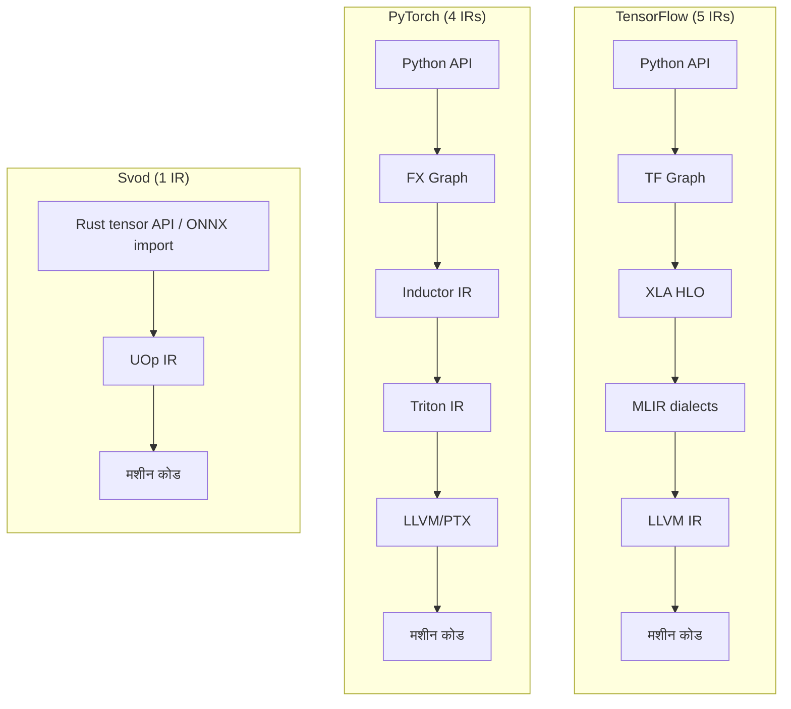
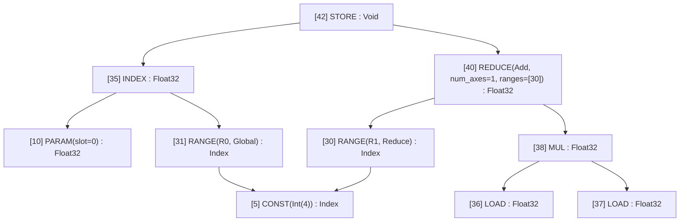
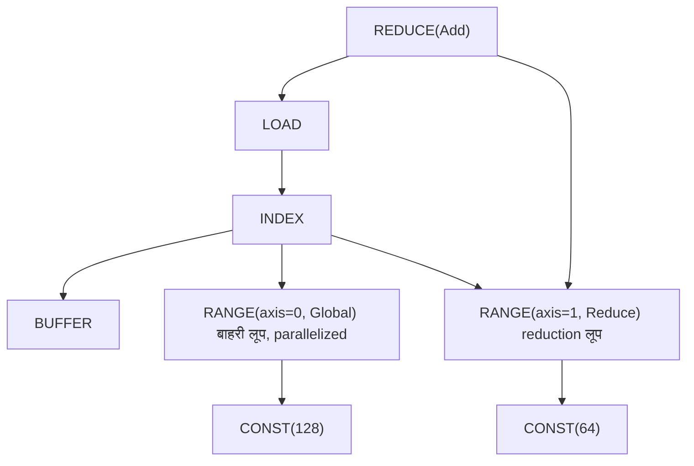
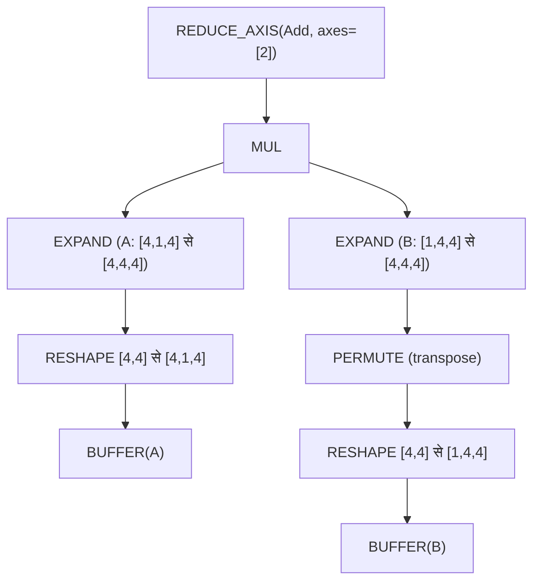
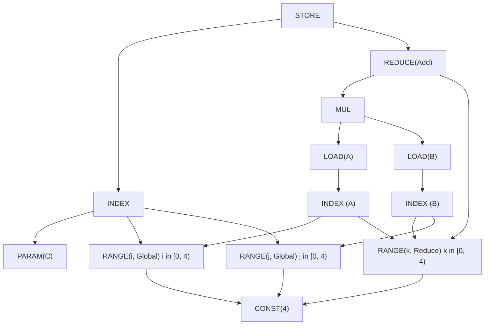

# एक IR सबके लिए {#one-ir-to-rule-them-all}

आप एक स्लो मॉडल डीबग कर रहे हैं। प्रोफ़ाइलर कहता है "kernel X 200ms लेता है" लेकिन आपको कोई आइडिया नहीं कि kernel X असल में *करता* क्या है। आप PyTorch के dispatcher से ट्रेस करते हैं, फिर ATen, फिर TorchInductor, फिर Triton IR, और आख़िर में LLVM IR पर पहुँचते हैं। पाँच अलग-अलग रिप्रेज़ेंटेशन, पाँच अलग-अलग मेंटल मॉडल, पाँच अलग-अलग डीबगिंग टूल।

यह मॉडर्न ML कम्पाइलेशन की हक़ीक़त है। TensorFlow के XLA की भी ऐसी ही कहानी है: Python → Graph → XLA HLO → MLIR → LLVM IR। हर लेयर एक असली प्रॉब्लम सॉल्व करने के लिए जोड़ी गई, लेकिन जमा होती कॉम्प्लेक्सिटी हैरान करने वाली है।

Svod एक अलग तरीका अपनाता है, [Tinygrad](https://github.com/tinygrad/tinygrad) से उधार लिया हुआ: **tensor से मशीन कोड तक एक ही IR**।



अक्सर सबसे सरल आर्किटेक्चर ही जीतता है। यह चैप्टर समझाता है कि एक सोच-समझकर डिज़ाइन किया गया IR पूरे कम्पाइलर स्टैक की जगह कैसे ले सकता है।

---

## UOp: यूनिवर्सल नोड {#uop-the-universal-node}

एक **UOp** (micro-operation) कम्प्यूटेशन ग्राफ़ का एक नोड है। लेकिन दूसरे IRs के नोड्स के उलट, एक UOp *किसी भी* abstraction लेवल पर ऑपरेशन रिप्रेज़ेंट कर सकता है — हाई-लेवल tensor reshapes से लेकर अलग-अलग CPU instructions तक।

मुख्य बात यह है: "tensor operations", "loop structures" और "memory accesses" के लिए अलग-अलग IRs रखने की बजाय, हम इन सबको एक enum में रखते हैं (`ir/src/op.rs`):

```rust
pub enum Op {
    // High-level tensor operations
    Reshape { src: Arc<UOp>, new_shape: Arc<UOp> },
    Permute { src: Arc<UOp>, axes: Vec<usize> },
    ReduceAxis { src: Arc<UOp>, reduce_op: ReduceOp, axes: Vec<usize> },

    // Loop-level control flow
    Range { end: Arc<UOp>, axis_id: AxisId, axis_type: AxisType, deps: SmallVec<[Arc<UOp>; 2]> },
    End { computation: Arc<UOp>, ranges: SmallVec<[Arc<UOp>; 4]> },

    // Memory operations (the buffer is reached through the INDEX, not a field)
    Load { index: Arc<UOp>, alt: Option<Arc<UOp>>, gate: Option<Arc<UOp>> },
    Store { index: Arc<UOp>, value: Arc<UOp>, gate: Option<Arc<UOp>> },

    // ALU operations (grouped enums with many individual values)
    Binary(BinaryOp, Arc<UOp>, Arc<UOp>),  // Add, Mul, etc.
    Unary(UnaryOp, Arc<UOp>),              // Sqrt, Exp, etc.
    Ternary(TernaryOp, Arc<UOp>, Arc<UOp>, Arc<UOp>),  // Where, MulAcc, etc.

    // Compilation stages are nodes too
    Program { sink: Arc<UOp>, info: Box<ProgramInfo>, linear: Option<Arc<UOp>>, source: Option<Arc<UOp>>, binary: Option<Arc<UOp>> },
    // ... 60 variants in all
}
```

Enum में abstraction लेवल के हिसाब से व्यवस्थित 60 variants हैं (अलग-अलग `UnaryOp`/`BinaryOp`/`TernaryOp` kinds गिनें तो लगभग 100 ऑपरेशन); [op bestiary](./op-bestiary.md) हर एक को दर्ज करता है:

| कैटेगरी | उदाहरण | क्या रिप्रेज़ेंट करता है |
|----------|----------|-------------------|
| **Movement** | `RESHAPE`, `PERMUTE`, `EXPAND`, `PAD` | Tensor shape ट्रांसफ़ॉर्मेशन |
| **Reduction** | `REDUCE_AXIS`, `REDUCE` | गणितीय aggregations |
| **Control** | `RANGE`, `END`, `IF`, `BARRIER` | लूप और branch स्ट्रक्चर |
| **Memory** | `LOAD`, `STORE`, `INDEX`, `BUFFER` | हार्डवेयर मेमोरी एक्सेस |
| **ALU** | `ADD`, `MUL`, `SQRT`, `EXP`, `WHERE` | CPU/GPU instructions |
| **Callable** | `CALL`, `FUNCTION`, `PROGRAM`, `LINEAR`, `SOURCE` | Kernels और उनकी कम्पाइलेशन स्टेजें |
| **Advanced** | `WMMA` | Tensor cores और उनका expansion metadata |

जब आप `uop.tree()` से UOp ग्राफ़ प्रिंट करते हैं, तो उसका स्ट्रक्चर ASCII tree के रूप में दिखता है:



Text रूप `├── `, `│   ` और `└── ` glyphs इस्तेमाल करता है, हर नोड को `[id] NAME : dtype shape=[...]` के रूप में लेबल करता है, और जो नोड पहले आ चुका है उसे back-reference के रूप में प्रिंट करता है। सबसे छोटा असली उदाहरण, `1.0 + 1.0`:

```text
[1] Add : Scalar(Float32) shape=[]
├── [0] CONST(Float(1.0)) : Scalar(Float32) shape=[]
└── [0] → (see above)
```

दोनों operands नोड `[0]` हैं। यह सिर्फ़ सुंदर प्रिंटिंग नहीं — यह एक बुनियादी property है जिसे **hash consing** कहते हैं।

---

## Hash Consing: स्ट्रक्चरल शेयरिंग {#hash-consing-structural-sharing}

जब आप Svod में एक ही expression दो बार बनाते हैं, तो आपको *वही pointer* मिलता है। बराबर values नहीं — वही मेमोरी address।

```rust
let a = x.try_add(&y)?;
let b = x.try_add(&y)?;

assert!(Arc::ptr_eq(&a.uop(), &b.uop()));  // Same pointer!
```

:::note[Origin नोड की आइडेंटिटी का हिस्सा है]
`SVOD_ORIGIN=1` के साथ हर नोड वह `OriginScope` भी रखता है जिसके नीचे वह बना था, उसके
content hash में मिलाकर। तब अलग-अलग scopes में बने दो एक जैसे subgraphs *अलग* नोड होते हैं
और तब तक शेयर नहीं होते जब तक kernel cut origins हटा न दे। Origin-opaque नोड अपवाद हैं:
`CONST`, `VCONST`, `BUFFER`, `PARAM`, `UNIQUE`, `LUNIQUE`, `STACK`, `BIND`, `DEFINE_VAR`, `NOOP`
और `Index` dtype वाली हर चीज़ — दो scopes एक ही constant स्वतंत्र रूप से बनाते हैं, इसलिए वहाँ
origin बस उस नोड को बाँट देता जिसे cut फिर से मिला देता है। देखें
[कर्नेल Origins](./kernel-origins.md#costs-and-trade-offs)।
:::

Intern table (`ir/src/uop/hash_consing.rs`) एक lock-free `papaya::HashMap` है जिसकी keys में पहले से गिना हुआ structural hash और एक `Weak<UOp>` होता है, इसलिए कोई unreferenced नोड leak होने की बजाय अपना आख़िरी `Arc` drop होते ही table से निकल जाता है:

```rust
// Simplified from ir/src/uop/hash_consing.rs
struct InternKey { hash: u64, node: Weak<UOp> }
static UOPS: OnceLock<papaya::HashMap<InternKey, (), PrecomputedHash>>;

pub fn new(op: Op, dtype: DType) -> Arc<Self> {
    let hash = xxh64(&(dtype, &op, origin::current()));
    if let Some(existing) = UOPS.get_key_value(&Probe { hash, op: &op, dtype, .. })
        .and_then(|(key, _)| key.node.upgrade())
    {
        return existing;                       // same structure → same Arc
    }
    let node = Arc::new(UOp { op, dtype, .. });
    UOPS.compute(InternKey { hash, node: Arc::downgrade(&node) }, /* abort if a racing thread inserted first */);
    node
}
```

ML इंजीनियरों के लिए यह क्यों मायने रखता है?

- **Pointer equality ही semantic equality है।** यह जाँचने के लिए कि दो subexpressions एक जैसे हैं, बस pointers की तुलना करें: `Arc::ptr_eq(&a, &b)`। Tree traversal की ज़रूरत नहीं।

- **Pattern matching O(1) है।** जब ऑप्टिमाइज़र पूछता है "क्या मैंने यह pattern पहले देखा है?", pointer तुलना तुरंत जवाब देती है।

- **मेमोरी की बचत।** Common subexpressions (जैसे attention में शेयर्ड कम्प्यूटेशन, gradient graphs) एक बार स्टोर होते हैं, दोहराए नहीं जाते।

- **Thread safety।** अलग-अलग threads से आया एक ही कम्प्यूटेशन एक ही object बनाता है — कोई synchronization bugs नहीं।

Tree printout यही दिखाता है: जब आप `[10] → (see above)` देखते हैं, तो वह copy नहीं — वह कई जगहों से refer किया गया *वही नोड* है।

---

## एक्सप्लिसिट लूप: `RANGE` ऑपरेशन {#explicit-loops-the-range-operation}

ज़्यादातर ML IRs लूप्स को ऑपरेशनों के अंदर छिपा देते हैं। ONNX में एक reduction ऐसा दिखता है:

```python
ReduceSum(data, axes=[1], keepdims=0)
```

लूप कहाँ है? वह implicit है — runtime के `ReduceSum` implementation में कहीं अंदर। आप उसे देख नहीं सकते, बदल नहीं सकते, उसके बारे में तर्क नहीं कर सकते।

Svod `RANGE` ऑपरेशनों से लूप्स को *एक्सप्लिसिट* बनाता है। वही reduction बन जाता है:



हर `RANGE` के पास एक **AxisType** होता है जो ऑप्टिमाइज़र और कोड जनरेटर को बताता है कि उसे कैसे compile करना है:

| AxisType | Priority | किसमें lower होता है | मतलब |
|----------|----------|------------|---------|
| **Placeholder** | -3 | — | RESHAPE lowering को cache करते समय इस्तेमाल होने वाला अस्थायी canonical range |
| **Device** | -2 | launch पर per-device bind | multi-device tensor का device axis |
| **Weak** | -1 | serial `for` लूप | बिना parallelization का range; rangeify का default, जिसमें से ऑप्टिमाइज़र चुनता है |
| **Loop** | -1 | serial `for` लूप | एक्सप्लिसिट सामान्य लूप |
| **Global** | 0 | `gidx` (`SPECIAL`) | GPU grid dimension |
| **Thread** | 0 | thread pool पर `gidx` (`SPECIAL`) | CPU parallelism |
| **Warp** | 1 | सबसे आगे की local dimension | हार्डवेयर lane (tensor-core fragments) |
| **Local** | 2 | `lidx` (`SPECIAL`) | GPU workgroup dimension |
| **GroupReduce** | 2 | local dimension + shared-memory stage | दो-स्टेज reduction |
| **Upcast** | 3 | vector lanes (`STACK`) | Vectorization |
| **Reduce** | 4 | accumulator लूप | Reduction dimension |
| **Unroll** | 5 | unrolled copies | लूप unrolling |

Priority लूप nesting का क्रम है — कम values बाहरी लूप्स हैं। `AxisType::Global` वाला `RANGE` CUDA पर `blockIdx.x` बनता है; `AxisType::Local` वाला `RANGE` `threadIdx.x` बनता है; वही `Global` range CPU पर एक work item होगा जिसे thread pool बाँटता है। ऑप्टिमाइज़र किसी range का type बदलता है (`Weak` → `Upcast`, `Weak` → `Local`, …) और वही एक field तय करता है कि लूप कैसे compile होगा।

एक्सप्लिसिट लूप्स क्यों मायने रखते हैं:

- **ऑप्टिमाइज़ेशन दिखाई देता है।** आप *देख* सकते हैं कि कौन-से लूप parallelize होंगे, कौन-से unroll होंगे, कौन-से SIMD इस्तेमाल करेंगे।

- **Scheduling ग्राफ़ रीराइटिंग है।** लूप का क्रम, tiling या unrolling बदलना बस एक pattern ट्रांसफ़ॉर्मेशन है — कोई ख़ास "scheduling pass" नहीं।

- **हर स्टेज पर वही IR।** Tensor लेवल पर "batch dimension पर iterate करो" को रिप्रेज़ेंट करने वाला `RANGE` *वही* `RANGE` है जो generated code में `for (int i = 0; i < N; i++)` बनता है।

---

## ग्राफ़ रीराइटिंग: एक ट्रांसफ़ॉर्मेशन मैकेनिज़्म {#graph-rewriting-one-transformation-mechanism}

पारंपरिक कम्पाइलरों में दर्जनों ख़ास passes होते हैं: constant folding, dead code elimination, loop unrolling, operator fusion। हर pass का अपना logic, अपने data structures, अपने bugs।

Svod एक ही मैकेनिज़्म इस्तेमाल करता है: **pattern-based ग्राफ़ रीराइटिंग**, `patterns!` DSL में लिखी और `graph_rewrite` से लागू की जाती है:

```rust
patterns! {
    // Identity folding: x + 0 → x
    Add[x, @zero] => x,

    // Constant folding: 3 + 4 → 7
    Add(a @const(a_val), _b @const(b_val))
        => eval_add(a_val, b_val).map(|r| UOp::const_(a.dtype(), r)),

    // Self-folding: x // x → 1
    FloorDiv(x, x) => 1.into_uop(x.dtype()),

    // Dead code: if(true) { x } else { y } → x
    Where(Const(ConstValue::Bool(true)), t, _f) => t,
}
```

`[x, y]` commutative है, `(x, y)` ordered, `@zero`/`@one` किसी भी dtype के constant से match करते हैं, `c @const(val)` value को bind करता है, दोहराया गया नाम (`x, x`) वही नोड माँगता है, और right-hand side `Arc<UOp>`, `Option<Arc<UOp>>` (`None` यानी मना) या `RewriteResult` लौटाता है। Production rules ऐसी ही दिखती हैं लेकिन उनमें guards होते हैं (असली `x + 0` rule `-0.0` के लिए मना कर देता है); पूरा syntax [पैटर्न इंजन](./optimizations/pattern-system.md) चैप्टर में है।

`graph_rewrite` पहले children पर जाता है (post-order), हर फिर से बने नोड पर matcher लागू करता है, और हर replacement पर उसे तब तक दोबारा लागू करता है जब तक वह नोड fixpoint पर न पहुँच जाए; नतीजे हर नोड के लिए memoize होते हैं:

```text
Original:       Add(Mul(x, 1), 0)
After Mul:      Add(x, 0)         # Mul(x, 1) → x
After Add:      x                 # Add(x, 0) → x
```

(`graph_rewrite_bottom_up`, उलझाने वाले ढंग से, *दूसरा* mode है: यह नीचे उतरने से पहले patterns लागू करता है, इसलिए वे मूल children देखते हैं — यह नामकरण Tinygrad का है।)

यह एक मैकेनिज़्म सँभालता है:

- **Algebraic simplification** — constant folding, identity हटाना
- **Rangeify ट्रांसफ़ॉर्मेशन** — movement ops → एक्सप्लिसिट लूप्स
- **Kernel ऑप्टिमाइज़ेशन** — vectorization, unrolling, tensor cores
- **कोड जनरेशन** — हार्डवेयर primitives तक lowering

वही patterns, वही इंजन, हर स्टेज के लिए अलग pattern sets।

---

## वर्क्ड उदाहरण: Matmul की यात्रा {#worked-example-matmul-journey}

चलिए `C = A @ B` (4×4 मैट्रिक्स गुणा) को पूरी पाइपलाइन से ट्रेस करते हैं।

### स्टेज 1: Tensor कंस्ट्रक्शन {#stage-1-tensor-construction}

जब आप `A.matmul(&B)?` लिखते हैं, Svod दोनों operands को एक साझा rank तक reshape करता है, `B` को transpose करता है, गुणा करता है (broadcast `EXPAND`s डालता है) और आख़िरी axis पर sum करता है:



यह शुद्ध गणित है: "dimensions मिलाने के लिए A और B को expand करो, elementwise गुणा करो, contracted axis पर sum करो।"

### स्टेज 2: Rangeify {#stage-2-rangeify}

Rangeify pass movement ops (`EXPAND`, `PERMUTE`, `RESHAPE`) को `RANGE` लूप्स के साथ एक्सप्लिसिट index कम्प्यूटेशन में बदलता है:



अब लूप स्ट्रक्चर दिखता है: `i` और `j` output ranges हैं (rangeify उन्हें `Weak` के रूप में emit करता है; GPU पर ऑप्टिमाइज़र उन्हें `Global` में promote करता है), `k` `Reduce` है (accumulated)।

### स्टेज 3: Symbolic सिम्प्लिफ़िकेशन {#stage-3-symbolic-simplification}

Pattern rewrites फ़ालतू ऑपरेशन साफ़ करते हैं, constants fold करते हैं और index अरिथमेटिक को सरल बनाते हैं।

### स्टेज 4: कोड जनरेशन {#stage-4-code-generation}

अंतिम IR सीधे लूप्स में translate होता है:

```c
// GPU kernel (conceptual)
__global__ void matmul(float* C, float* A, float* B) {
    int i = blockIdx.x;   // from RANGE(i, Global)
    int j = blockIdx.y;   // from RANGE(j, Global)
    float acc = 0.0f;
    for (int k = 0; k < 4; k++) {  // from RANGE(k, Reduce)
        acc += A[i*4 + k] * B[k*4 + j];
    }
    C[i*4 + j] = acc;
}
```

मुख्य बात: **हर स्टेज पर स्ट्रक्चर दिखाई देता है**। कोई जादुई fusion pass नहीं जो तीन nested लूप्स को किसी पहचान में न आने वाली चीज़ में बदल दे। स्टेज 2 में दिखने वाला `RANGE` स्ट्रक्चर ठीक वही है जो स्टेज 4 में लूप्स बनता है। [एक्ज़ीक्यूशन पाइपलाइन](./pipeline.md) पेज उसी kernel को scheduling, caching और execution से होकर आगे ट्रेस करता है।

---

## तुलना: दूसरे IR कैसे अलग हैं {#comparison-how-other-irs-differ}

अलग-अलग IRs अलग-अलग समझौते करते हैं। तुलना ऐसी है:

| पहलू | ONNX | XLA HLO | Triton | **Svod** |
|--------|------|---------|--------|-----------|
| **उद्देश्य** | मॉडल interchange | Backend ऑप्टिमाइज़ेशन | GPU kernel DSL | पूरा कम्पाइलेशन |
| **Operators** | ~200 हाई-लेवल | ~100–150 हाई-लेवल | Tile operations | 60 multi-level |
| **लूप मॉडल** | Implicit | Implicit | Tile-based | **एक्सप्लिसिट `RANGE`** |
| **मेमोरी** | Pure values | Pure values → buffers | एक्सप्लिसिट pointers | **एक्सप्लिसिट `LOAD`/`STORE`** |
| **ऑप्टिमाइज़ेशन** | कोई नहीं | ख़ास passes | MLIR patterns | **एकीकृत रीराइटिंग** |
| **Targets** | Runtime engines | CPU/GPU/TPU | सिर्फ़ GPU | CPU/GPU |

**ONNX** portability को अधिकतम करता है। `Conv` और `MatMul` जैसे ऑपरेशन implementation की हर detail छिपा देते हैं। मॉडल exchange के लिए बढ़िया, लेकिन जो दिखता नहीं उसे ऑप्टिमाइज़ नहीं कर सकते।

**XLA HLO** functional और pure है — कोई side effects नहीं, immutable tensors। इससे algebraic ऑप्टिमाइज़ेशन संभव होता है, लेकिन कोड जनरेशन से पहले एक अलग "buffer assignment" phase चाहिए। HLO से LMHLO (buffer-based) तक का बदलाव एक बुनियादी सीमा है।

**Triton** ONNX से ज़्यादा लेकिन Svod से कम दिखाता है। आप "tile-level" कोड लिखते हैं — डेटा के blocks पर ऑपरेशन — और कम्पाइलर thread-level details सँभालता है। मेमोरी एक्सप्लिसिट है (`tl.load`, `tl.store`), लेकिन tiles के अंदर parallelization implicit।

**Svod** सब कुछ दिखाता है: लूप्स एक्सप्लिसिट हैं (`RANGE`), मेमोरी एक्सप्लिसिट है (`LOAD`/`STORE`), parallelization एक्सप्लिसिट है (`AxisType`)। इसका मतलब सीखने को ज़्यादा है, लेकिन कुछ भी छिपा नहीं।

---

## यह क्यों ज़रूरी है: प्रैक्टिकल फ़ायदे {#why-this-matters-practical-benefits}

Svod के पारदर्शी IR के ML इंजीनियरों के लिए प्रैक्टिकल फ़ायदे हैं:

**डीबगिंग सीधी है।** किसी भी स्टेज पर ग्राफ़ प्रिंट करें:

```rust
println!("{}", tensor.uop().tree());
```

आप ठीक-ठीक देखेंगे कि कौन-से ऑपरेशन मौजूद हैं, वे कैसे जुड़े हैं और कम्प्यूटेशन कहाँ होता है। कोई "kernel X" रहस्य नहीं। इसकी बजाय `SVOD_DUMP_STAGE=<prefix>` हर ऑप्टिमाइज़र स्टेज के बाद kernel प्रिंट करता है; [codegen वर्क्ड उदाहरण](./codegen/worked-example.md) स्टेजों के नाम बताता है।

**Performance tuning जानकारी के साथ होती है।** देखें कि कौन-से लूप्स parallelized हैं:

```text
[31] RANGE(R0, Global) : Index    # parallelized across GPU blocks
[32] RANGE(R1, Local) : Index     # parallelized within a block
[33] RANGE(R2, Loop) : Index      # sequential — might be slow!
```

अगर कुछ parallel होना चाहिए लेकिन नहीं है, तो आप उसे देख सकते हैं।

**मेंटल मॉडल सरल है।** एक IR, एक ट्रांसफ़ॉर्मेशन मैकेनिज़्म, ऑपरेशनों का एक set। आपको XLA HLO *और* MLIR *और* Triton *और* LLVM सीखने की ज़रूरत नहीं। बस UOps।

**ऑप्टिमाइज़ेशन composable है।** कोई custom rewrite चाहिए? एक pattern जोड़ें:

```rust
patterns! {
    // Illustrative: x - x → 0 (op names must be real Op / ALU variants)
    Sub(x, x) => 0.into_uop(x.dtype()),
}
```

यह उसी इंजन के साथ काम करता है जिससे constant folding, fusion और बाक़ी सब कुछ होता है।

---

## गहरी समझ {#the-deeper-insight}

Svod/Tinygrad साबित करते हैं कि कम्पाइलर की कॉम्प्लेक्सिटी अक्सर *आकस्मिक* होती है, ज़रूरी नहीं। TensorFlow और PyTorch के multi-layer IR stacks स्वाभाविक रूप से जमा होते गए — हर लेयर ने एक असली प्रॉब्लम सॉल्व की, लेकिन पूरा सिस्टम किसी भी अकेले हिस्से से समझने में कठिन है।

एक अच्छी तरह डिज़ाइन किया गया IR, एक ट्रांसफ़ॉर्मेशन मैकेनिज़्म और सिद्धांतबद्ध composition ख़ास passes की हज़ारों लाइनों की जगह ले सकते हैं। यह कम्पाइलरों पर लागू Unix philosophy है: एक काम अच्छे से करो, और जोड़ो।

क़ीमत है स्पष्टता — आप लूप्स, मेमोरी एक्सेस और parallelization hints देखते हैं जिन्हें दूसरे IRs छिपाते हैं। लेकिन दिखाई देना एक feature है, bug नहीं। जब आपका मॉडल स्लो हो, तो आप देखना चाहते हैं *क्यों*, न कि यह उम्मीद करना कि कम्पाइलर ख़ुद समझ लेगा।

Svod यही दाँव लगाता है: पारदर्शी कॉम्प्लेक्सिटी छिपी कॉम्प्लेक्सिटी से बेहतर है।
