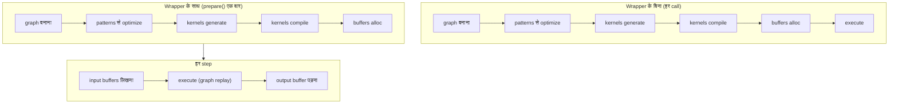

# JIT ग्राफ़

एक streaming ASR pipeline वही encoder सैकड़ों बार call करती है। हर call पर tensor graph बनाना, उसे optimize करना, kernel source generate करना, उसे backend के [JIT loader](../backends/jit-loader.md) के ज़रिए compile करना और device buffers allocate करना — यह सब वह काम है जो input पर निर्भर नहीं करता, और हर बार दोहराना बर्बादी है।

`jit_wrapper!` macro उस build-once / run-many pattern को **एक typed Rust struct** में बदल देता है। आप inputs और graph declare करते हैं; macro एक wrapper generate करता है जो `prepare()` के दौरान graph को एक बार compile करता है और हर `execute()` पर device buffers को उनकी जगह पर रखते हुए उसे replay करता है।



Wrapper `Tensor::prepare_batch_with` और उसके लौटाए `ExecutionPlan` के ऊपर एक पतली परत है ([एक्ज़ीक्यूशन पाइपलाइन](./pipeline.md) देखें); [पैटर्न इंजन](./optimizations/pattern-system.md) `prepare()` के समय चलता है और [JIT loader](../backends/jit-loader.md) kernels को machine code में बदलता है। यह पेज wrapper को और उसे कवर करता है जिसे `execute()` replay करता है।

---

## `jit_wrapper!` DSL {#the-jit_wrapper-dsl}

एक wrapper declaration struct का नाम, वह model type जो build closure को मिलता है, वे inputs जो wrapper expose करता है, optional symbolic shape variables, और graph बनाने वाला एक `build` block बताता है:

```rust
jit_wrapper! {
    MyModelJit(MyModel) {
        input1: Tensor,
        input2: Tensor,

        vars {
            b: (1, model.config.max_batch),
            t: (1, model.config.max_time),
        }

        build(input1, input2, b, t) {
            model.forward(input1, input2, &b, &t)
        }
    }
}
```

| Section | मतलब | ज़रूरी |
|---|---|---|
| `WrapperName<generics>(ModelType) { ... }` | generate होने वाले struct का नाम (generic parameters की अनुमति है, जैसे `RnntBlockJit<const W: usize>`) और उस model का type जो build closure को मिलता है | हाँ |
| `name: Tensor` / `name: [Tensor; N]` lines | wrapper के हर exposed input के लिए एक; type annotation सिर्फ़ जानकारी के लिए है, `N > 0` | optional (आमतौर पर एक या अधिक) |
| `inputs { ... }` | वही slots एक block के अंदर, जहाँ `#[unbatched]` की भी अनुमति है | optional |
| `vars { name: (min, max), ... }` | bounds वाले symbolic shape variables; bound expressions `new(model)` के अंदर चलते हैं और `model` पढ़ सकते हैं | optional |
| `batch_var name: (min, max)` | एक var जो हर batched input के dim 0 को भी अपने तक shrink करता है | optional |
| `state { name, ... }` | वे inputs जिन्हें plan लिखता भी है, calls के बीच उसी जगह recycle होते हैं; `outputs` block ज़रूरी है | optional |
| `outputs { name, ... }` | हर output के लिए एक named buffer accessor; तब `build` closure इतने ही tensors का tuple, इसी क्रम में, लौटाता है | optional |
| `build(args...) { ... }` | closure जो inputs, state और vars से output tensor(s) बनाता है; `model` scope में है | हाँ |

Macro expansion के समय ही इन्हें reject कर देता है: ऐसा `build` argument जो किसी declared चीज़ का नाम न हो, inputs / state / outputs / vars में दोहराए गए नाम, किसी generated method के नाम वाला output, state पर या बिना `batch_var` के `#[unbatched]`, और बिना `outputs` के `state`। Block के अंदर हर input या state slot एक `&Tensor` है — array slot के लिए `[&Tensor; N]` — जिसके पीछे एक zero-initialized placeholder है जिसे macro `prepare()` चलने पर default device पर allocate करता है; हर var एक `svod_tensor::BoundVariable` है जो पहले से अपने upper bound पर bound है — इसे `&name` के रूप में आगे पास करें; और `model` wrapper की अपनी model value का shared reference है। Closure किसी भी `E: std::error::Error + Send + Sync + 'static` के लिए `Result<Tensor, E>` लौटाता है; failures `JitError::Build` के रूप में सामने आती हैं। पूरा build `OriginScope::label("WrapperName")` के नीचे चलता है, इसीलिए profiles इसके kernels को wrapper के नाम के खाते में डालते हैं।

`outputs` block के बिना closure एक अकेला `Tensor` लौटाता है, जो `output()` से मिलता है। इसके साथ, वह ठीक उतने ही tensors का tuple लौटाता है, और हर एक को declaration order के हिसाब से अपना named `&Buffer` accessor मिलता है। अगर scheduler उनमें से किसी को fuse या elide कर दे तो positional accessors चुपचाप ग़लत जगह इशारा करने लगेंगे, इसलिए उसकी जगह `prepare()` `JitError::OutputCountMismatch` के साथ fail होता है।

---

## Array slots, batch variables और state {#array-slots-batch-variables-and-state}

Declaration के block रूप तीन ऐसी चीज़ें जोड़ते हैं जिनकी streaming model को ज़रूरत होती है। तीनों optional हैं; पुराने flat रूप में लिखा wrapper बिना बदलाव के काम करता रहता है।

```rust
jit_wrapper! {
    StepJit(StepModel) {
        inputs {
            x: Tensor,
            #[unbatched] bias: Tensor,
            taps: [Tensor; 3],
        }
        batch_var b: (1, 4),
        state { h: Tensor, tail: [Tensor; 2] }
        outputs { emitted }

        // returns (emitted, h, tail): declared outputs first, then state
        build(x, bias, taps, h, tail) {
            model.step(x, bias, taps, h, tail)
        }
    }
}
```

**`[Tensor; N]` slots** एक नाम के पीछे N buffers रखते हैं: `prepare` `[InputSpec; N]` लेता है, build closure को `[&Tensor; N]` मिलता है, और generated accessors एक leaf index लेते हैं — `jit.taps_view_mut::<f32>(1)?`। Outputs भी arrays हो सकते हैं। Range से बाहर input index `JitError::InputBufferNotFound` है; range से बाहर output index panic करता है।

**`batch_var b: (min, max)`** एक symbolic variable declare करता है *और* placeholders realize होते ही हर batched input के dim 0 को उस तक shrink कर देता है, ताकि एक plan batch sizes की पूरी range सँभाल सके। `#[unbatched]` किसी input को इससे बाहर रखता है — जैसे shared bias, या ऐसी table जिसकी leading axis batch नहीं है — और state slots कभी shrink नहीं होते। इसे हर call पर generated `execute_bound(4)` से bind करें।

**`state { ... }`** slots वे inputs हैं जिन्हें plan लिखता भी है। Build tuple हर एक के लिए नई value ले जाता है, macro उसे सीधे उसी slot के device-local buffer में वापस assign करता है, और अगला `execute()` उसे वहीं से पढ़ता है — एक recurrence जो कभी host तक आती-जाती नहीं। State slots `prepare()` में (inputs के बाद) अपना `InputSpec` लेते हैं, उनके पास `<state>_mut()` accessor है लेकिन कोई typed view नहीं, वे outputs के रूप में expose नहीं होते, और `reset()` नए sequence के लिए उन सबको zero कर देता है।

Build tuple में हर declared output slot के लिए एक element और हर state slot के लिए एक element होता है — और अगर कुल एक ही हो तो कोई tuple नहीं होता।

---

## Symbolic variables {#symbolic-variables}

`vars { ... }` block ऐसी values declare करता है जो graph में shape या index expressions के रूप में हिस्सा लेती हैं, लेकिन जिनकी सटीक value execute के समय दी जाती है। इनसे एक prepared plan बिना recompile किए input shapes की पूरी range सँभाल लेता है।

हर entry `name: (min, max)` wrapper पर तीन configuration setters generate करती है:

| Setter | असर |
|---|---|
| `with_<name>_bound(max)` | सिर्फ़ upper bound override करता है; `max < min` पर panic |
| `with_<name>_min_bound(min)` | सिर्फ़ lower bound override करता है; `min > max` पर panic |
| `with_<name>_fixed(value)` | दोनों bounds को `value` पर pin करता है, जिससे var JIT-time constant बन जाता है; `value == 0` पर panic |

तीनों `Self` लौटाते हैं (builder style) और `prepare()` से पहले call होने चाहिए, क्योंकि build closure चलते समय bounds capture कर लेता है।

चौड़ी range एक ज़्यादा general kernel बनाती है जिसे range की हर shape सँभालनी पड़ती है; तंग range optimizer को specialize करने देती है। जब value कभी नहीं बदलती तो var को `with_<name>_fixed` से pin करें, और जब कोई बाहरी caller model की hard ceiling से छोटा maximum बताए तो upper bound घटा दें।

Execute के समय असली values `execute_with_vars` से पास करें, या `execute_bound` से, जो declaration order में हर declared variable के लिए एक `i64` लेता है और आगे उसी को forward करता है:

```rust
jit.execute_with_vars(&[("b", batch as i64), ("t", time as i64)])?;
jit.execute_bound(batch as i64, time as i64)?;   // same thing, positionally
```

हर pair एक var bind करता है; जो vars सूची में नहीं हैं वे जो भी रखते हैं वही रखते हैं — अपना `prepare()`-time upper bound, या वह value जिस पर पिछला `execute_with_vars` उन्हें छोड़ गया था। Bindings sticky हैं, per-call नहीं। Plan हर value को var के declared `[min, max]` से जाँचता है और उससे बाहर की value को कुछ भी dispatch करने से पहले `JitError::Runtime` के साथ reject कर देता है। जिन नामों को plan नहीं जानता, उन्हें अनदेखा किया जाता है।

---

## Generated runtime API {#generated-runtime-api}

Macro wrapper के life cycle के हर phase के लिए methods का एक group emit करता है:

| Method | Phase | Notes |
|---|---|---|
| `new(model)` | construction | model को by value लेता है; var bounds evaluate करता है; अभी कोई kernel compile नहीं |
| `with_<var>_bound` / `with_<var>_min_bound` / `with_<var>_fixed` | `new` और `prepare` के बीच | shape envelope configure करते हैं |
| `prepare(input1: InputSpec, ..., state1: InputSpec, ...)` | एक बार | graph बनाना, patterns चलाना, kernels compile करना, buffers allocate करना; `PrepareConfig::from_env()` पढ़ता है |
| `prepare_with_config(..., &PrepareConfig)` | एक बार | `prepare` जैसा ही, explicit config के साथ |
| `<input>_mut([i]) -> Result<&mut Buffer>` | हर step | हर declared input या state slot का raw buffer (array slots के लिए `i`) |
| `<input>_view_mut::<T>([i]) -> Result<ArrayViewMutD<T>>` | हर step | input buffer पर typed write view, dtype-checked |
| `output() -> Result<&Buffer>` | हर step | plan का पहला output |
| `<output>([i])` / `<output>_shape()` / `_view::<T>()` / `_to_vec::<T>()` | हर step | named output buffer, उसकी live shape और reads, मौजूदा variable bindings के हिसाब से resolve |
| `reset() -> Result<()>` | हर step | हर `state` slot को zero करता है (सिर्फ़ `state` होने पर generate) |
| `execute() -> Result<()>` | हर step | मौजूदा input buffers के साथ replay |
| `execute_bound(v1, v2, ...) -> Result<()>` | हर step | replay, हर declared variable को positionally bind करते हुए (सिर्फ़ vars होने पर generate) |
| `execute_with_vars(&[(name, value)]) -> Result<()>` | हर step | replay और एक या अधिक symbolic variables को फिर से bind |
| `execute_profiled` / `execute_with_vars_profiled` | optional | non-profiled variants जैसे ही, लेकिन `Vec<KernelProfile>` लौटाते हैं |
| `execute_profiled_static()` | optional | `ExecutionPlan::profile` से एक profiled run, आख़िरी stage के kernels लौटाता है |
| `copy_output_to_<input>([i,] out_pos, dst_off, src_off, len)` | हर step | किसी output region की input buffer में on-device copy; host round-trip नहीं; दोनों storage साझा करें तो fail |
| `replicate() -> Result<Self>` | optional | concurrent execution के लिए prepared JIT की deep copy (नीचे देखें) |

चार निचले स्तर के accessors tooling के लिए plan के details खोलते हैं:

| Accessor | लौटाता है |
|---|---|
| `buffers()` | plan के मालिकाना हक़ वाला हर buffer |
| `output_buffers()` | plan के declared output buffers |
| `input_buffer_ids()` | device buffer ids जिनमें wrapper लिखता है |
| `prepared_kernels()` | compiled kernels |

ज़्यादातर callers को इनकी ज़रूरत नहीं होती। `prepare()` से पहले कोई भी per-step method call करने पर `JitError::NotPrepared` मिलता है।

`replicate()` model (`Arc`) और compiled kernels साझा करता है, हर input और state buffer के bytes का snapshot लेता है, plan जिस storage में लिखता है (intermediates, outputs) उसे copy किए बिना fork करता है, arena views को फिर से mint करता है ताकि aliasing बनी रहे, और replica को नई queue, graph और timelines देता है। Replicate तब करें जब source plan idle हो: snapshot चल रहे काम के साथ synchronized नहीं है।

---

## `InputSpec` {#inputspec}

`InputSpec`, `JitError` और वे buffer helpers जिनमें macro expand होता है, `svod_tensor::jit` में रहते हैं, इसलिए `jit_wrapper!` रखने वाले crate को बस यही dependency चाहिए (`svod_model::jit` पुराने paths के लिए इन्हें re-export करता है)।

`prepare()` हर declared input और state slot के लिए एक `InputSpec` लेता है — या हर array slot के लिए एक `[InputSpec; N]`:

```rust
pub struct InputSpec {
    pub shape: Vec<usize>,
    pub dtype: DType,
    /// Allocate the input device-local (no host mapping).
    pub device_local: bool,
}

impl InputSpec {
    pub fn new(shape: &[usize], dtype: DType) -> Self { ... }
    pub fn f32(shape: &[usize]) -> Self { ... }
    pub fn i32(shape: &[usize]) -> Self { ... }
    pub fn i64(shape: &[usize]) -> Self { ... }
    pub fn device_local(mut self) -> Self { ... }
    pub fn numel(&self) -> usize { ... }
}
```

Macro build closure चलाने से पहले shape और dtype से default device पर एक zero-initialized placeholder tensor allocate करता है। Callers `Tensor::zeros(...).realize()` placeholders ख़ुद नहीं बनाते। Shape अधिकतम input size बन जाती है; symbolic variables execute के समय `try_shrink` जैसे operations से उसे छोटा करते हैं — यह एक coding pattern है, wrapper द्वारा लागू किया गया runtime contract नहीं। `InputSpec::device_local()` उन inputs की host mapping हटा देता है जिन्हें host सिर्फ़ `copyin` / `copy_from` से लिखता है या जो on-device फिर से भरे जाते हैं; `state` slots अपने आप इसी तरह allocate होते हैं। Output की तरफ़, `PrepareConfig::device_local()` plan के outputs के लिए यही विचार है — यह `device_local_outputs` set किया हुआ `from_env()` है।

---

## ग्राफ़ कैप्चर और रीप्ले {#graph-capture-and-replay}

`execute()` असल में `ExecutionPlan::execute()` है। GPU पर plan हर call में अपने kernels पर दोबारा नहीं चलता: पहला `execute()` dispatch sequence को एक device graph में **capture** करता है, और हर बाद वाला call उसे **replay** करता है, सिर्फ़ उन kernel arguments को patch करते हुए जो capture के बाद बदले हैं (buffer addresses, variable values)। Capture lazy और per plan है; `replicate()` नए सिरे से शुरू करता है।

Plan तभी capture होता है जब हर op plan के device पर एक compiled kernel हो और कोई unbound symbolic variable न हो। Runtime variables, buffer copies और custom functions सभी इसे बंद कर देते हैं — इसलिए हर `batch_var` / `vars` wrapper नीचे वाले fallback path से चलता है, जबकि fixed-shape wrapper (GigaAM encoder, Silero front-end, Whisper decoder step) graph replay करता है। Graph के अंदर dependencies **byte ranges** पर read/write hazards हैं, क्योंकि memory planner intermediates को ऐसे arena views में pack करता है जो alias करते हैं।

| Backend | Mechanism | Notes |
|---|---|---|
| CUDA | `cuGraphAddKernelNode` DAG, `cuGraphInstantiate`, `cuGraphLaunch` | default में चालू; `cuGraphExecKernelNodeSetParams` सिर्फ़ उन nodes को patch करता है जिनके arguments बदले; buffer-aliasing बदलने पर फिर से capture |
| AMD | graph-owned kernarg storage वाली एक linked HCQ/PM4 command stream, एक ही doorbell से replay | AQL queues (multi-XCC parts, या `SVOD_AMD_AQL=1`) default में capture करती हैं; PM4 capture `SVOD_PM4_GRAPH=1` से opt-in है |
| Metal | per-command barriers वाला `MTLIndirectCommandBuffer`, हर replay पर एक `executeCommandsInBuffer` | किसी kernel के scalar arguments लेने पर या virtualized GPU पर मना कर देता है; rebind से पहले पिछले replay का इंतज़ार करता है |
| CPU | — | कोई graph factory नहीं; kernels सीधे call होते हैं |

**Fallbacks.** जब कोई graph इस्तेमाल नहीं होता, तो AMD plans — dynamic-shape वाले भी — एक *linked plan* के रूप में capture होते हैं: एक command stream जिसके kernel arguments और launch dimensions हर replay पर फिर से pack किए जाते हैं। बाक़ी हर जगह plan अपने levels पर क्रम से चलता है और हर kernel को plan की अपनी queue में submit करता है (GPUs पर asynchronously; `wait` सिर्फ़ अंत में)। `execute_profiled` graph का profiled variant इस्तेमाल करता है अगर वह मौजूद हो, वरना per-dispatch timestamps।

---

## Recurrent execution {#recurrent-execution}

Recurrent model की state device पर ही रहती है: उसे `state { ... }` में declare करें और हर step एक `execute()` है, बिना host round trip और बिना किसी packing helper के।

```rust
jit.reset()?;                                    // zero the state, new sequence
for chunk in chunks {
    for (slot, v) in jit.x_view_mut::<f32>()?.iter_mut().zip(chunk) {
        *slot = v;                               // per-step input, written in place
    }
    jit.execute()?;                              // reads state, writes it back
    let frame = jit.emitted_to_vec::<f32>()?;    // only the emitted head crosses
}
```

:::tip[पहले पढ़ना, फिर लिखना]
हर state buffer उसी जगह recycle होता है, इसलिए एक `build` के अंदर कोई slot किसी दूसरे slot की *नई* value पर निर्भर नहीं होना चाहिए: per-buffer ordering तभी असंदिग्ध है जब हर slot उन्हीं values से आगे बढ़े जिनके साथ step शुरू हुआ था। नई values inputs और पुरानी state से निकालें, फिर उन सबको build tuple में लौटाएँ।
:::

State buffers device-local allocate होते हैं, इसलिए कुछ भी उन्हें host पर map नहीं करता। सिर्फ़ वही वापस पढ़ें जिसकी caller को सच में ज़रूरत है — declared outputs — `<output>_to_vec` या `<output>_view` के ज़रिए। In-tree उदाहरण: `RnntBlockJit<const W: usize>` (`state { time, prev, symbols, h, c }`), `FireRedVadStreamJit` (`state { caches: [Tensor; 8] }`) और `GtcrnStreamJit`।

---

## उदाहरण: GigaAM encoder {#example-gigaam-encoder}

GigaAM Conformer encoder constant shape पर prepare होता है। Batch और mel-frame bounds construction के समय एक बार गिने जाते हैं और plan में bake हो जाते हैं; छोटे chunks उन्हीं buffers में zero-pad किए जाते हैं:

```rust
jit_wrapper! {
    GigaAmEncoderJit(GigaAm) {
        mel: Tensor,
        lengths: Tensor,

        outputs { frames },

        build(mel, lengths) {
            let out = model.encoder.forward_batch(mel, lengths)?;
            // Permute [B, d_model, T_sub] → [B, T_sub, d_model] on-device: the
            // RN-T decoder consumes frame-major rows, and doing it here turns
            // the host-side strided transpose over the slow mapping into one
            // contiguous copyout.
            Ok::<_, super::error::Error>(out.cast(svod_dtype::DType::Float32).try_permute(&[0, 2, 1])?)
        }
    }
}
```

Wrapper एक mel-spectrogram input और per-batch length vector लेता है और `frames: [B, T_sub, d_model]` बनाता है, जिसे RN-T decoder `frames()?.copyout_prefix(..)` से पढ़ता है। (CTC head एक sibling, `GigaAmCtcJit`, इस्तेमाल करता है, जिसका अकेला output `log_probs` है।) `GigaAmTranscriber` plan का size एक बार तय करता है: mel length को अगली power of two तक round up किया जाता है ताकि codegen को साफ़ factorisation मिले, और `config.max_mel_frames` पर clamp किया जाता है; batch को cap किया जाता है ताकि live SDPA score tiles `max_scores_mib` (`SVOD_MAX_SCORES_MIB`, default 256) के अंदर रहें। Mel input `InputSpec::f32(..).device_local()` है और mel JIT के output से `mel_mut()?.copy_from(..)` के ज़रिए on-device भरा जाता है; plan `PrepareConfig::device_local()` के साथ prepare होता है। फिर हर chunk `execute()` से वही plan replay करता है।

`cast` infallible है, इसलिए उसे `?` नहीं चाहिए, और model का error type tensor error को सादे `?` से समेट लेता है — build closure किसी भी `E: std::error::Error + Send + Sync + 'static` के लिए `Result<_, E>` लौटाता है।

`out.cast(DType::Float32)` encoder और किसी भी downstream head के बीच की fp32 सीमा है। Encoder गति के लिए fp16 या bf16 में चल सकता है, लेकिन हर consumer (CTC log-softmax, RN-T predictor और joint) एक समान fp32 input देखता है। Cast को JIT के अंदर रखने से वह encoder के आख़िरी kernels में fuse हो जाता है।

---

## उदाहरण: Silero VAD {#example-silero-vad}

Silero V5 एक recurrent network है, लेकिन उसका recurrence इतना छोटा है कि हर window पर एक launch का ख़र्च नहीं उठा सकता। इसलिए JIT सिर्फ़ batched conv front-end और LSTM input projection को कवर करता है; scan ख़ुद host पर रहता है:

```rust
jit_wrapper! {
    SileroVadFeatureJit(SileroVad) {
        chunks: Tensor,

        build(chunks) {
            // [FEATURE_BATCH, CHUNK_LEN] -> [FEATURE_BATCH, 4*HIDDEN] LSTM gate
            // pre-activations (conv features + input projection, biases folded).
            // Fixed batch (not a runtime var): the front-end is row-independent,
            // so partial batches just fill fewer rows and ignore the rest — and
            // a symbolic leading dim trips the reflect-pad lowering.
            model.forward_gates(chunks)
        }
    }
}
```

Leading dimension var की जगह एक fixed `FEATURE_BATCH` (4096) है: front-end row-independent है, इसलिए अधूरा batch बस कम rows भरता है, और symbolic leading dim reflect-pad lowering को तोड़ देता है। Preparation device-local output माँगता है, क्योंकि 8 MiB का gate readback host mapping की जगह copy engine पर होना चाहिए:

```rust
let mut jit = SileroVadFeatureJit::new(vad);
jit.prepare_with_config(
    InputSpec::f32(&[FEATURE_BATCH, CHUNK_LEN]),
    &svod_tensor::PrepareConfig::device_local(),
)?;
```

फिर `VadInference::probs` waveform पर `FEATURE_BATCH`-आकार के dispatches में चलता है — `chunks_view_mut::<f32>()` pack करना, `execute()`, valid rows का `copyout_prefix` — और gates को `VadHead::scan` को सौंप देता है, जो host CPU की सबसे चौड़ी SIMD width पर vectorized एक LSTM plus sigmoid head है। इस बँटवारे ने उस one-tiny-dispatch-per-window path की जगह ली जिसकी round-trip latency पूरे model पर हावी थी।

---

## Data-independence contract {#data-independence-contract}

Wrapper graph को एक बार compile करता है और उसे कई बार replay करता है। यह तभी काम करता है जब graph topology `prepare()` के समय तय हो। Execute के समय जो कुछ भी बदल सकता है, उसे input buffers (`*_mut` के ज़रिए) या symbolic vars (`execute_with_vars` के ज़रिए) से होकर आना होगा। Build closure के अंदर किसी tensor value पर branch graph को उसी branch के लिए specialize कर देता है; यह build-time फ़ैसला है, runtime नहीं।

:::note[सावधानियाँ]
- Build closure के अंदर `Tensor::full(value).realize()` उस value को अकेले prepared plan में bake कर देता है। किसी भी per-call बदलाव के लिए `prepare()` को शुरू से फिर चलाना पड़ता है — पूरा graph build और kernel compile। Host-side scratch buffers (जैसे `ndarray::Array3`) उस per-step setup के लिए सही विकल्प हैं जिसे JIT को देखने की ज़रूरत नहीं।
- Dynamic batch सँभालने का idiomatic तरीक़ा `batch_var` है, जो आपके लिए हर batched input का dim 0 shrink करता है; इसे हर call पर `execute_bound` से bind करें। ResNet और YOLO26 दोनों में एक `images` input, एक `batch_var b: (1, model.config.max_batch_size)` और एक output है। किसी दूसरी dynamic axis के लिए, maximum-size input पर var-bound length के साथ `try_shrink` और call site पर `execute_with_vars` इसका manual समकक्ष है।
- Dynamic var की क़ीमत graph replay है: plan per-call dispatch (या AMD के linked plan) पर लौट आता है। जब deployment में vars कभी नहीं बदलते तो उन्हें `with_<var>_fixed` से pin करें।
:::

Contract तोड़ने से दो में से एक failure mode होता है: ग़लत नतीजे, क्योंकि cached plan किसी ऐसी value के बारे में पुरानी धारणा के साथ replay करता है जो बाद में बदलती निकली; या चुपचाप धीमापन, क्योंकि हर call recompile path में जा पहुँचता है। इनका निदान build closure को फिर से पढ़कर करें; kernel output शायद ही कभी मदद करता है।

---

## Errors {#errors}

`JitError` उन runtime failures को कवर करता है जो wrapper उठा सकता है। ज़्यादातर unrecoverable हैं और किसी अस्थायी स्थिति की बजाय usage bug की ओर इशारा करते हैं।

| Variant | किससे होता है |
|---|---|
| `NotPrepared` | `prepare` से पहले per-step method call हुआ, या output buffer उपलब्ध नहीं |
| `InputBufferNotFound` | prepared plan के अंदर input index resolve नहीं हुआ, या array-slot index range से बाहर |
| `DuplicateInputBuffer` | `prepare` के समय दो declared inputs एक ही device buffer पर map होते हैं |
| `InputAliased` | कोई input किसी पराए plan buffer पर resolve हुआ — किसी concurrent `prepare` ने उसकी graph identity बिगाड़ दी |
| `Build` | build closure ने `Err` लौटाया; अंदर का error `Box<dyn Error + Send + Sync>` के रूप में सुरक्षित रहता है |
| `Tensor` | `prepare` के दौरान या build closure में tensor op fail हुआ |
| `Device` | कोई device या buffer operation fail हुआ |
| `OutputCountMismatch` | wrapper ने N output और state slots declare किए लेकिन compiled plan में अलग संख्या बची |
| `DtypeMismatch` | किसी typed view या read ने ऐसा dtype माँगा जो buffer में नहीं है |
| `ViewOutOfBounds` | live output shape को उसके buffer से ज़्यादा bytes चाहिए — bound variables उससे आगे हैं जिसके लिए plan compile हुआ था |
| `InferredOutputDim` | किसी output shape में `-1` dimension थी, जिसकी जगह रखने के लिए कोई live value नहीं |
| `Runtime` | kernel execution fail हुआ, या कोई variable अपने `[min, max]` के बाहर bind हुआ |

Symbolic-variable setters (`with_<var>_*`) पर configuration ग़लतियाँ error लौटाने की बजाय call site पर panic करती हैं, क्योंकि वे किसी plan के बनने से पहले होती हैं।

---

## यह क्यों मायने रखता है {#why-this-matters}

**Lifecycle स्पष्ट है।** Prepared state में जाने का एकमात्र रास्ता `prepare` है, और हर per-step accessor उसी से होकर जाता है। Wrapper plan को एक `Option` के पीछे रखता है, इसलिए ग़लत क्रम में call करने पर आधे बने plan को पढ़ने की बजाय तुरंत `JitError::NotPrepared` के साथ failure मिलता है।

**Replay सस्ता है।** एक graph build, एक kernel compile, allocations का एक set — एक ही बार चुकाया जाता है। हर बाद वाला call बस buffer writes और एक graph launch है।

**Contract स्थानीय है।** Data-independence नियम वह अकेला invariant है जो wrapper को per-call झंझट सुरक्षित रूप से छोड़ने देता है। बाक़ी हर गारंटी इसी से निकलती है।

**Errors स्पष्ट हैं।** Runtime failures `JitError` variants के रूप में सामने आती हैं; सिर्फ़ variable setters पर configuration-time misuse अब भी panic करता है।

Wrapper कोई नए primitives नहीं गढ़ता। यह build / prepare / execute cycle को ऐसा आकार देता है जिसे type system थाम सके, ताकि streaming inference per-call overhead के बिना one-shot evaluation की गति से चले।
