# Op Bestiary: UOp ऑपरेशनों की फ़ील्ड गाइड {#op-bestiary-a-field-guide-to-uop-operations}

Svod IR डंप डीबग करते समय आपको ऐसे ऑपरेशन मिलेंगे जो नाम से स्पष्ट नहीं होते। यह चैप्टर नॉन-ट्रिवियल ऑपरेशनों को उनके सटीक फ़ील्ड्स (जैसे `ir/src/op.rs` में declare हैं), उनके साथ चलने वाले metadata structs (`ir/src/types.rs`) और उदाहरणों के साथ डॉक्यूमेंट करता है।

**क्या कवर है:** वे ऑपरेशन जिन्हें व्याख्या चाहिए — लूप कंट्रोल, रिडक्शन, मेमोरी ऑपरेशन, कर्नेल स्ट्रक्चर, वेक्टराइज़ेशन, tensor cores।

**क्या कवर नहीं है:** ट्रिवियल ALU ऑपरेशन (`Add`, `Mul`, `Sqrt`, आदि) जो बिल्कुल वैसे ही काम करते हैं जैसा आप सोचते हैं। `Op` में 60 variants हैं; उनमें से तीन (`Unary`, `Binary`, `Ternary`) एक op kind रखते हैं, इसलिए हर kind को अलग गिनें तो लगभग 100 ऑपरेशन बनते हैं।

उदाहरणों में नोड लेबल `UOp::tree()` की वर्तनी इस्तेमाल करते हैं: `[id] NAME : dtype`, इसलिए `RANGE(R0, Global)` का मतलब है `Global` टाइप का renumbered axis `R0`, और `[10] → (see above)` पहले प्रिंट हो चुका एक शेयर्ड नोड है।

---

## लूप कंट्रोल: RANGE और END {#loop-control-range-and-end}

### RANGE — लूप स्कोप ओपनर {#range--loop-scope-opener}

```rust
Range {
    end: Arc<UOp>,           // loop bound (exclusive)
    axis_id: AxisId,         // identifier for deduplication
    axis_type: AxisType,     // scheduling behavior
    deps: SmallVec<[Arc<UOp>; 2]>,  // range dependencies
}
```

**फ़ील्ड्स:**

| फ़ील्ड | टाइप | उद्देश्य |
|-------|------|---------|
| `end` | `Arc<UOp>` | अपर बाउंड (exclusive), आमतौर पर एक `CONST` या symbolic expression |
| `axis_id` | `AxisId` | कर्नेल स्प्लिटिंग से पहले `Unrenumbered(n)` (`U<n>` के रूप में प्रिंट), बाद में `Renumbered(n)` (`R<n>`); `UnrenumberedPath` / `RenumberedPath` रूप (`U0_1`) किसी parent range से structurally निकली range को पहचानते हैं |
| `axis_type` | `AxisType` | लूप कैसे शेड्यूल होगा यह तय करता है (नीचे देखें) |
| `deps` | `SmallVec<[Arc<UOp>; 2]>` | दूसरी ranges जिन पर यह range निर्भर है |

**AxisType हायरार्की** (`AxisType::priority()`; `Ord` इसी से तुलना करता है, कम values बाहरी लूप हैं):

| टाइप | प्रायोरिटी | अक्षर | किसमें lower होता है | उद्देश्य |
|------|----------|--------|------------|---------|
| `Placeholder` | -3 | `P` | — | RESHAPE caching के दौरान इस्तेमाल होने वाली अस्थायी canonical range |
| `Device` | -2 | `d` | launch पर per-device bind | multi-device tensor का device-selection dimension |
| `Weak` | -1 | `L` | serial `for` लूप | rangeify से बनी बिना parallelization की range; ऑप्टिमाइज़र इसी में से चुनता है |
| `Loop` | -1 | `L` | serial `for` लूप | एक्सप्लिसिट सामान्य लूप; `END(CALL)` के साथ जोड़े गए schedule-level wrappers |
| `Global` | 0 | `g` | `gidx` (`SPECIAL`) | GPU grid dimension |
| `Thread` | 0 | `t` | `gidx` (`SPECIAL`) | CPU work-item dimension, thread pool पर dispatch |
| `Warp` | 1 | `w` | सबसे आगे की local dimension | हार्डवेयर lane; `mma.sync` fragments इसी से address करते हैं |
| `Local` | 2 | `l` | `lidx` (`SPECIAL`) | GPU workgroup dimension |
| `GroupReduce` | 2 | `G` | local dimension + shared-memory stage | दो-स्टेज रिडक्शन |
| `Upcast` | 3 | `u` | vector lanes (`STACK`) | वेक्टराइज़ेशन |
| `Reduce` | 4 | `R` | accumulator लूप | रिडक्शन dimension |
| `Unroll` | 5 | `r` | unrolled copies | लूप unrolling |

`is_parallel()` `Global | Thread | Local | Warp` है; `is_reduce()` `Reduce | GroupReduce | Unroll` है। `pm_add_gpudims` `Global`/`Thread` ranges को global `SPECIAL`s में और `Local`/`Warp`/`GroupReduce` ranges को local वालों में बदलता है; CPU renderer के पास `has_threads` है लेकिन `has_local` नहीं, इसलिए उसे सिर्फ़ `Thread` ही दिखता है। कर्नेल-सीमा की framing `CALL`/`FUNCTION` के ज़रिए structural है, कोई अलग axis type नहीं। `r_128_3_32_4…` जैसे कर्नेल नाम इन्हीं अक्षरों से बनते हैं।

**उदाहरण:**
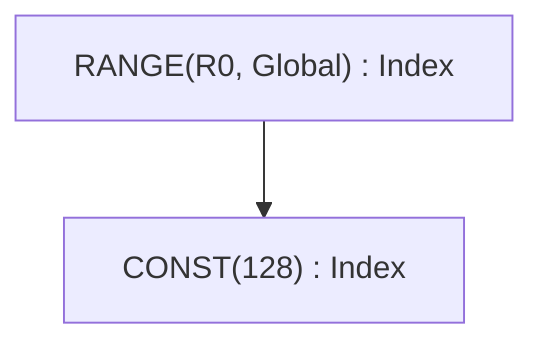

### END — लूप स्कोप क्लोज़र {#end--loop-scope-closer}

```rust
End {
    computation: Arc<UOp>,              // value computed inside loop
    ranges: SmallVec<[Arc<UOp>; 4]>,    // ranges being closed
}
```

END एक या अधिक RANGE स्कोप बंद करता है और उन्हें active set से हटा देता है। कई ranges एक साथ बंद की जा सकती हैं।

**उदाहरण:**
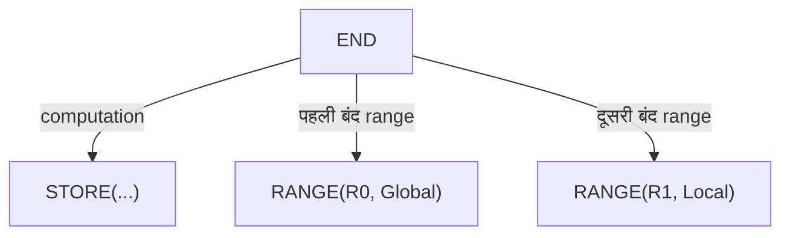

---

## रिडक्शन: REDUCE बनाम REDUCE_AXIS {#reduction-reduce-vs-reduce_axis}

मिलते-जुलते नामों वाले दो ऑपरेशन अलग-अलग काम करते हैं।

### REDUCE_AXIS — Tensor Dimension रिडक्शन (हाई-लेवल) {#reduce_axis--tensor-dimension-reduction-high-level}

```rust
ReduceAxis {
    src: Arc<UOp>,           // input tensor
    reduce_op: ReduceOp,     // Add, Mul, Max, Min
    axes: Vec<usize>,        // axes to reduce
}
```

Rangeify से **पहले** इस्तेमाल होता है। NumPy के `.sum(axis=0)` की तरह tensor dimensions पर काम करता है।

**उदाहरण:**
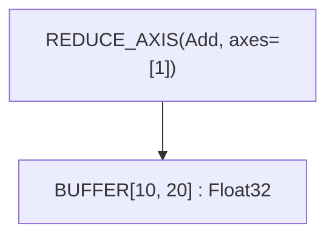

यह axis 1 पर sum करके `[10, 20]` tensor को `[10]` में घटाता है।

### REDUCE — Range Iteration रिडक्शन (लो-लेवल) {#reduce--range-iteration-reduction-low-level}

```rust
Reduce {
    src: Arc<UOp>,                      // value to accumulate
    ranges: SmallVec<[Arc<UOp>; 4]>,    // ranges being reduced
    reduce_op: ReduceOp,                // Add, Mul, Max, Min
    num_axes: usize,                    // reduced axes of the shaped source
}
```

Rangeify के **बाद** इस्तेमाल होता है। RANGE iterations के पार values accumulate करता है और बताई गई ranges बंद करता है। Tree इसे `REDUCE(Add, num_axes=1, ranges=[30])` के रूप में प्रिंट करता है, साथ में उन ranges की ids जिन्हें यह बंद करता है।

**ReduceOp Variants:**

| Op | Identity | ऑपरेशन | Tinygrad |
|----|----------|-----------|----------|
| `Add` | 0 | `acc + value` | ✓ |
| `Mul` | 1 | `acc * value` | ✓ |
| `Max` | -∞ | `max(acc, value)` | ✓ |
| `Min` | +∞ | `min(acc, value)` | सिर्फ़ Svod |

> **Compatibility:** Tinygrad का spec REDUCE_AXIS को `{Add, Mul, Max}` तक सीमित रखता है। Svod इसमें `Min` जोड़ता है।

**उदाहरण:**
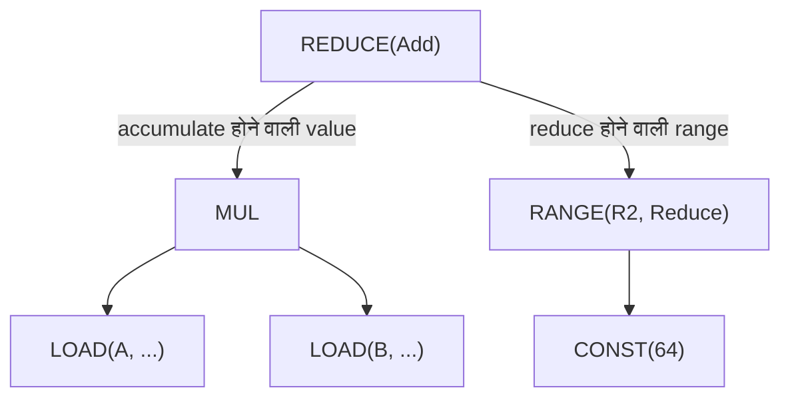

### ALLREDUCE — क्रॉस-डिवाइस रिडक्शन {#allreduce--cross-device-reduction}

```rust
AllReduce {
    src: Arc<UOp>,           // local partial result
    device: DeviceSpec,      // device specification
    reduce_op: ReduceOp,     // reduction operation
}
```

कई devices के पार distributed रिडक्शन करता है। Multi-GPU training के लिए इस्तेमाल होता है।

---

## बफ़र ऑपरेशन {#buffer-operations}

### BUFFER — बफ़र डिक्लेरेशन {#buffer--buffer-declaration}

```rust
Buffer {
    shape: Arc<UOp>,         // flat storage shape (one element count)
    arg: Box<ParamArg>,      // slot, dtype, address space, device
}
```

Tensor storage के लिए एक बफ़र declare करता है। `ParamArg` `PARAM` के साथ शेयर्ड है:

| फ़ील्ड | टाइप | उद्देश्य |
|-------|------|---------|
| `slot` | `usize` | एक जैसे size/device वाले बफ़रों में फ़र्क़ करता है; `PARAM` के लिए कर्नेल argument की position |
| `dtype` | `DType` | Element type |
| `addrspace` | `Option<AddrSpace>` | device मेमोरी के लिए `Global`, GPU shared मेमोरी (LDS) के लिए `Local`, register/scratch allocation के लिए `Reg`; scalar parameter के लिए `None` |
| `device` | `Option<DeviceSpec>` | जिस device पर बफ़र रहता है; `Local`/`Reg` के लिए `None` |
| `name`, `vmin_vmax`, `multiple_of` | `Option<_>` | Scalar-parameter metadata: नाम और value bounds (`UOp::scalar_param`) |
| `axis` | `Option<usize>` | multi-device बफ़र का shard axis |
| `volatile` | `bool` | Reads को hoist या merge नहीं किया जाना चाहिए |

### STAGE — Materialization मार्कर {#stage--materialization-marker}

```rust
Stage {
    compute: Arc<UOp>,                  // computation to materialize
    ranges: SmallVec<[Arc<UOp>; 4]>,    // output dimensions
    opts: Box<BufferizeOpts>,           // address space, device
}
```

बताता है कि कम्प्यूटेशन कहाँ मेमोरी में materialize होना चाहिए। कर्नेल स्प्लिटिंग ट्रिगर करता है।

**BufferizeOpts:**

| फ़ील्ड | टाइप | उद्देश्य |
|-------|------|---------|
| `device` | `Option<DeviceSpec>` | Target device, local के लिए `None` |
| `local_axis` | `Option<AxisId>` | `GroupReduce` axis जिसका एक LOCAL staging बफ़र है |
| `addrspace` | `AddrSpace` | `Global` (device) या `Local` (shared) |
| `removable` | `bool` | `false` होने पर `buffer_removal` को इस STAGE को inline करने की अनुमति नहीं — multi-consumer realize सीमाओं पर इस्तेमाल होता है ताकि mega-pass fixpoint iterations के पार बफ़र स्थिर रहे |

**उदाहरण:**
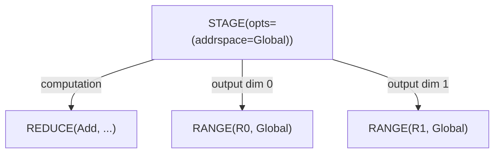

### INDEX — मल्टी-डायमेंशनल बफ़र एक्सेस {#index--multi-dimensional-buffer-access}

```rust
Index {
    buffer: Arc<UOp>,                   // BUFFER, PARAM or STACK
    indices: SmallVec<[Arc<UOp>; 4]>,   // index per dimension
}
```

मल्टी-डायमेंशनल indices से मेमोरी address कम्प्यूट करता है। Element dtype लौटाता है (pointer नहीं)। किसी index को `idx.valid(cond)` से conditional बनाया जा सकता है, जो उसे `WHERE(cond, idx, INVALID)` में लपेट देता है — `INVALID` `Bool` dtype का poison constant `CONST(Invalid)` है, जिसे tree `INVALID` के रूप में प्रिंट करता है। `STACK` पर INDEX address की बजाय एक lane चुनता है: constant scalar index सीधे stacked source में fold हो जाता है।

**उदाहरण:**
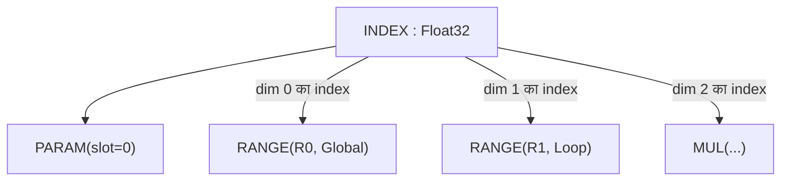

### LOAD — मेमोरी रीड {#load--memory-read}

```rust
Load {
    index: Arc<UOp>,         // INDEX op (buffer accessed via the INDEX)
    alt: Option<Arc<UOp>>,   // alternative value for gated loads
    gate: Option<Arc<UOp>>,  // predicate for gated loads
}
```

Index पर बफ़र से value पढ़ता है; कोई अलग `buffer` फ़ील्ड नहीं है, बफ़र INDEX नोड के ज़रिए पहुँचता है। Gated loads के लिए, `gate` false होने पर `alt` value देता है (मेमोरी एक्सेस पूरी तरह टल जाता है)। `alt` और `gate` हमेशा साथ set होते हैं: load दोनों रखता है या एक भी नहीं, gate `Bool` है, और `alt` `INVALID` marker हो सकता है। Renderers को single-axis `INDEX` चाहिए, इसलिए multi-index accesses को load के कोड जनरेशन तक पहुँचने से पहले flatten करना होता है।

**उदाहरण:**
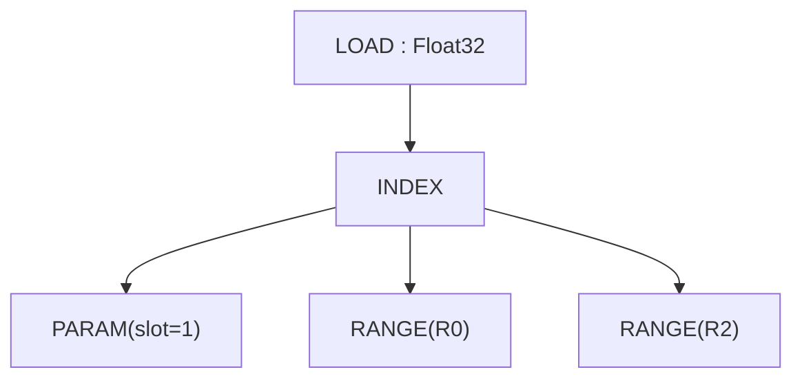

### STORE — मेमोरी राइट {#store--memory-write}

```rust
Store {
    index: Arc<UOp>,                    // INDEX op (buffer accessed via index.src[0])
    value: Arc<UOp>,                    // value to write
    gate: Option<Arc<UOp>>,             // predicate for gated stores
}
```

बफ़र में value लिखता है। बफ़र INDEX नोड के ज़रिए (`index.src[0]` से) एक्सेस होता है, किसी अलग फ़ील्ड से नहीं। `Upcast` और `Unroll` expansion के दौरान range axis types ही बने रहते हैं।

Gated stores के लिए `store_gated` `gate` set करता है; `pm_move_gates_from_index` वह pass है जो gate को address expression से उठाकर LOAD/STORE पर ले जाता है।

> **Compatibility:** Svod के STORE में कोई अलग `buffer` फ़ील्ड नहीं — sources हैं: index=0, value=1। STAGE या REDUCE के उलट, STORE ranges बंद नहीं करता।

**उदाहरण:**
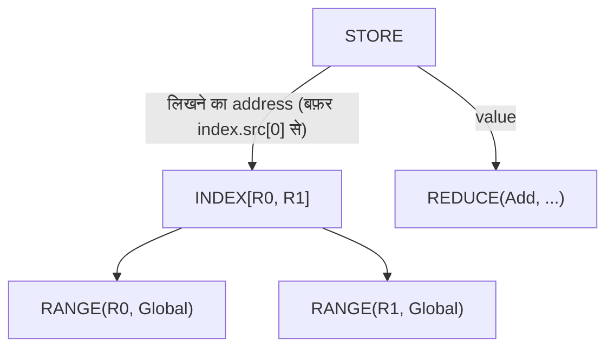

---

## कर्नेल स्ट्रक्चर और Callable IR {#kernel-structure--callable-ir}

Schedule-level काम एक callable IR के रूप में व्यक्त होता है जो tinygrad के `CALL`/`FUNCTION`/`PROGRAM` मॉडल का प्रतिबिंब है: एक `Function` arguments से parametrized एक body (आमतौर पर stores का एक `Sink`) परिभाषित करता है, एक `Call` उसे ठोस arguments के साथ invoke करता है, और एक `Program` body को सख़्त `SINK → LINEAR → SOURCE → BINARY` कम्पाइलेशन staging से होकर ले जाता है। कोई `KERNEL` op नहीं है: कर्नेल एक `CALL` है जिसकी body एक `SINK[KERNEL]` है (`KernelInfo` रखने वाला SINK)।

### CALL — Function Body को Invoke करना {#call--invoke-a-function-body}

```rust
Call {
    body: Arc<UOp>,                     // FUNCTION (or its body)
    args: SmallVec<[Arc<UOp>; 4]>,      // concrete argument values
    info: Box<CallInfo>,                // annotations (name, origin, ...)
}
```

किसी callable body को arguments के साथ invoke करता है। Range-ending: `args` में मौजूद किसी भी `Range` ऑपरेशन को बंद करता है (range_start_index = 1; `body=0`, `args=1+`)।

`CallInfo` cache-key के लिए सुरक्षित annotations रखता है:

| फ़ील्ड | टाइप | उद्देश्य |
|-------|------|---------|
| `name` | `Option<String>` | पढ़ने लायक callable नाम |
| `grad_tag` | `Option<String>` | gradient-callback identity के लिए आरक्षित |
| `origin` | `Option<OriginId>` | stored value के root का origin — कर्नेल किसके खाते में जाता है |
| `origins` | `OriginSet` | body से हटाए जाने से पहले उसमें पहुँच योग्य हर origin |
| `precompile` / `precompile_backward` | `bool` | Eager-compile संकेत |

Kernel CALL वह जगह है जहाँ dispatch वह attribution रखता है जिसे profiler rollups पढ़ते हैं; देखें
[कर्नेल Origins](./kernel-origins.md)।

### FUNCTION — दोबारा इस्तेमाल होने वाली Body {#function--reusable-body}

```rust
Function {
    body: Arc<UOp>,                     // computation
    args: SmallVec<[Arc<UOp>; 4]>,      // formal parameters
    info: Box<CallInfo>,
}
```

एक दोबारा इस्तेमाल होने वाला callable। इसका dtype हमेशा `Void` है; कई values लौटाने वाली bodies एक `Tuple` में लपेटी जाती हैं ताकि function सीमा Void बनी रहे। `Call` जैसा ही range-ending आकार।

### TUPLE / GET_TUPLE — कई Values लौटाना {#tuple--get_tuple--multi-value-returns}

```rust
Tuple { src: SmallVec<[Arc<UOp>; 4]> }
GetTuple { src: Arc<UOp>, index: usize }
```

`Tuple` अलग-अलग तरह की values को pack करता है; इसका dtype हमेशा `Void` है। `GetTuple` किसी `Tuple` से (या ऐसे `Function` से जिसकी body `Tuple` है) element `index` निकालता है; इसका dtype अंदर के element से मेल खाता है। वरना-Void function सीमा के पार कई outputs ले जाने के लिए इस्तेमाल होता है।

### PROGRAM — Compile-Pipeline कंटेनर {#program--compile-pipeline-container}

```rust
Program {
    sink: Arc<UOp>,                     // root SINK
    info: Box<ProgramInfo>,             // name, launch dims, ABI slots, target
    linear: Option<Arc<UOp>>,           // LINEAR (after linearize)
    source: Option<Arc<UOp>>,           // SOURCE (after render)
    binary: Option<Arc<UOp>>,           // PROGRAM_BINARY (after compile)
}
```

कर्नेल को `codegen/src/program_pipeline.rs` (`do_linearize`/`do_render`/`do_compile`/`get_program`) द्वारा लागू `SINK → LINEAR → SOURCE → PROGRAM_BINARY` staging से होकर ले जाता है। हर स्टेज अगला फ़ील्ड भरती है। `ProgramInfo` में `name`, symbolic `global_size` / `local_size`, कर्नेल के लिए जाने वाले `vars`, `globals` / `outs` / `ins` बफ़र slots और `target` device होते हैं। C/LLVM renderers `Op::Linear` input की उम्मीद करते हैं और panic करने की बजाय per-context `pending_error` के ज़रिए `Error::InvalidGraph` लौटाते हैं; renderer तक पहुँचने वाला multi-index `INDEX` भी इसी तरह reject होता है, इसलिए indices को पहले ही single axis में flatten होना चाहिए।

### LINEAR — Linearized Op Stream {#linear--linearized-op-stream}

```rust
Linear { ops: SmallVec<[Arc<UOp>; 8]> }
```

Linearization से बना ops का flat sequence। Consumers ग्राफ़ पर दोबारा चले बिना सीधे `ops` पर iterate करते हैं।

### SOURCE / PROGRAM_BINARY — कम्पाइलेशन Artifacts {#source--program_binary--compilation-artifacts}

```rust
Source { code: String, identity: Option<Box<SourceStageIdentity>> }
ProgramBinary { bytes: Vec<u8>, identity: Option<Box<BinaryStageIdentity>> }
```

Program pipeline की अंतिम स्टेजें। दोनों leaves हैं (कोई children नहीं)। Optional `identity` वह semantic प्रमाण है जो किसी स्टेज को ठीक पिछली स्टेज से बाँधता है (`SourceStageIdentity` ABI, target, entry name और LINEAR/SOURCE digests रखता है; `BinaryStageIdentity` उसे compiler key और binary digest के साथ लपेटता है), इसलिए cached artifact बदले हुए ग्राफ़ के पार दोबारा इस्तेमाल नहीं हो सकता। Tree binary को `BINARY(len=…, identity=…)` के रूप में प्रिंट करता है।

### SINK — कई Roots का संग्राहक {#sink--multiple-root-collector}

```rust
Sink {
    sources: SmallVec<[Arc<UOp>; 4]>,
    info: Option<Box<KernelInfo>>,      // structural marker for kernel ASTs
}
```

कई outputs को एक ही root में इकट्ठा करता है। किसी `Function` की body आमतौर पर stores का एक `Sink` होती है। `info` फ़ील्ड एक hash-consed structural marker है जो kernel-AST SINKs (`SINK[KERNEL]` के रूप में प्रिंट) को वरना-एक-जैसे सादे SINKs से अलग करता है। `KernelInfo` में `opts_to_apply` (`None`: ऑप्टिमाइज़र चुनता है; `Some([])`: हाथ से lower किया गया, छुएँ नहीं; `Some(opts)`: ठीक यही लागू करें), `applied_opts`, `dont_use_locals` और कर्नेल का `name` होता है।

**उदाहरण:**
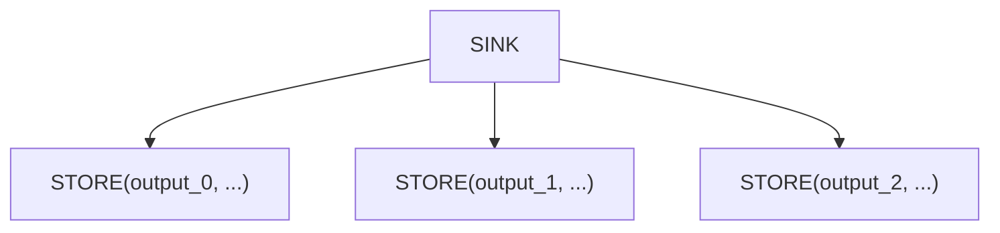

### AFTER — डिपेंडेंसी मार्कर {#after--dependency-marker}

```rust
After {
    passthrough: Arc<UOp>,              // value that flows through
    deps: SmallVec<[Arc<UOp>; 4]>,      // operations that must complete
}
```

बिना data dependency के कर्नेलों के बीच execution dependencies व्यक्त करता है। `passthrough` value बिना बदले लौटाई जाती है, लेकिन सिर्फ़ तब जब सारे `deps` पूरे हो जाएँ।

**उदाहरण:**
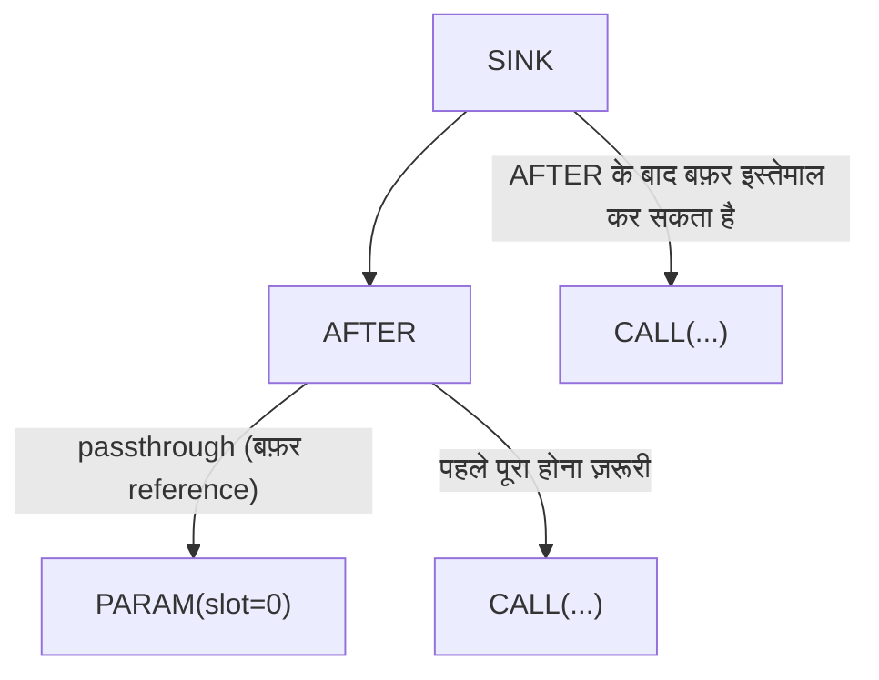

### BARRIER — Synchronization फ़ेंस {#barrier--synchronization-fence}

```rust
Barrier {
    src: Arc<UOp>,                      // value passing through
    deps: SmallVec<[Arc<UOp>; 4]>,      // operations to wait for
}
```

GPU workgroup synchronization। यह सुनिश्चित करता है कि आगे बढ़ने से पहले workgroup के सारे threads barrier तक पहुँच जाएँ।

---

## वेक्टर ऑपरेशन {#vector-operations}

### STACK — Lanes से Shaped Value बनाना {#stack--build-a-shaped-value-from-lanes}

```rust
Stack {
    sources: SmallVec<[Arc<UOp>; 4]>,
}
```

N values को N lanes वाली एक shaped value में जोड़ता है। Element dtype scalar ही रहता है — lane count STACK ख़ुद रखता है, dtype को चौड़ा करके नहीं — और construction के समय sources promoted dtype में cast होते हैं।

**उदाहरण:**
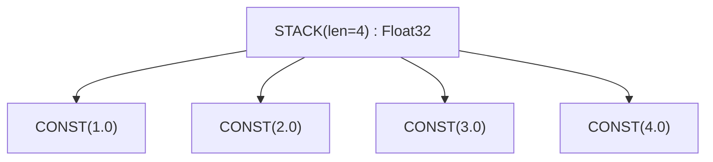

### Lane चयन — STACK पर INDEX {#lane-selection--index-over-a-stack}

कोई अलग extract ऑपरेशन नहीं है। `INDEX` किसी `STACK` से lane ठीक वैसे ही चुनता है जैसे बफ़र से address, और constant index construction के समय ही सीधे stacked source में fold हो जाता है।

**उदाहरण:**
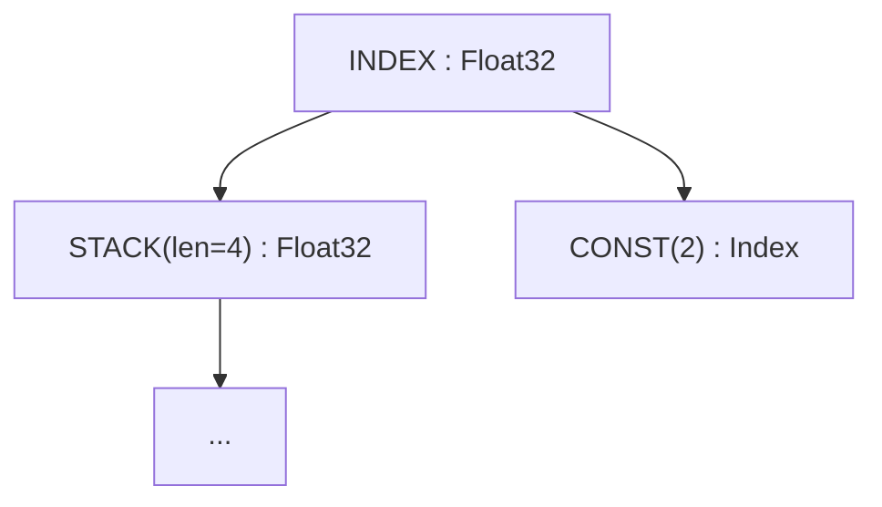

### VConst — वेक्टर Constant {#vconst--vector-constant}

```rust
VConst {
    values: Vec<ConstValue>,
}
```

Compile-time constants का वेक्टर। `CONST` नोड्स के `STACK` से ज़्यादा कुशल।

Lane aggregation `STACK` इस्तेमाल करता है; lane और address चयन `INDEX`। लूप unrolling `AxisType::Unroll` वाली `Range` से व्यक्त होती है, किसी अलग ऑपरेशन से नहीं। Tensor-core expansion axes `WmmaMetadata` में रहते हैं।

---

## Tensor Cores: WMMA {#tensor-cores-wmma}

### WMMA — Warp Matrix Multiply-Accumulate {#wmma--warp-matrix-multiply-accumulate}

```rust
Wmma {
    a: Arc<UOp>,             // matrix A fragment
    b: Arc<UOp>,             // matrix B fragment
    c: Arc<UOp>,                 // accumulator C fragment
    metadata: Box<WmmaMetadata>, // hardware configuration
}
```

हार्डवेयर tensor core ऑपरेशन: `D = A × B + C`। ख़ास matrix shapes और data layouts चाहिए।

**WmmaMetadata फ़ील्ड्स:**

| फ़ील्ड | टाइप | उद्देश्य |
|-------|------|---------|
| `name` | `String` | Instruction का नाम (जैसे `"__hmma..."`) |
| `dims` | `(N, M, K)` | Matrix dimensions (जैसे `(16, 16, 16)`) |
| `dtype_in` | `DType` | Input matrix precision (जैसे `Float16`) |
| `dtype_out` | `DType` | Output precision (जैसे `Float32`) |
| `device` | `RendererDevice` | वह Renderer / TC backend जिसने यह WMMA बनाया (`CudaSm80`, `AmdRdna3`, `Metal`, …) |
| `threads` | `usize` | हर warp में threads (आमतौर पर 32) |
| `upcast_axes` | `Option<WmmaUpcastAxes>` | हर source के expansion axes (फ़ील्ड्स: `a`, `b`, `c`); `expander2` के sources और output को shape देने के बाद साफ़ कर दिए जाते हैं |
| `reduce_axes` | `Vec<AxisId>` | TC reduce axis IDs, expansion के दौरान `exclude_args` के रूप में इस्तेमाल |

**उदाहरण:**
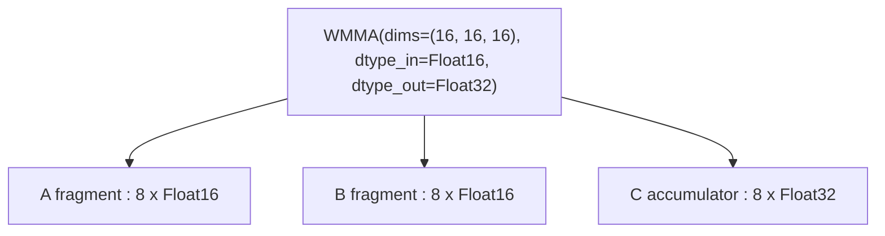

---

## कंट्रोल फ़्लो {#control-flow}

### IF / ENDIF — Conditional Execution {#if--endif--conditional-execution}

```rust
If {
    condition: Arc<UOp>,                // boolean predicate
    body: SmallVec<[Arc<UOp>; 4]>,      // operations to execute
}

EndIf {
    if_op: Arc<UOp>,         // corresponding IF op
}
```

Body को सिर्फ़ तब execute करता है जब condition true हो। Boundary checks और sparse ऑपरेशनों के लिए इस्तेमाल होता है।

**उदाहरण:**
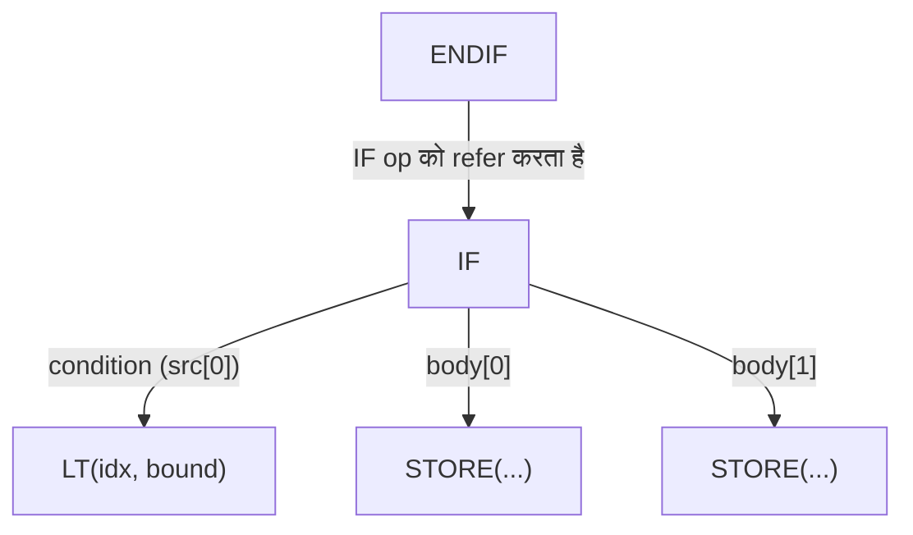

---

## डेफ़िनिशन ऑपरेशन {#definition-operations}

### CONST — Literal {#const--literal}

```rust
Const(ConstValueHash)        // Int(i64), UInt(u64), Float(f64), Bool(bool), Invalid
```

एक compile-time scalar। `Invalid` वह poison value है जिस पर हर `valid()` gate लौटता है; इसका dtype हमेशा `Bool` है। Constants, बफ़रों और params की तरह, कभी origin नहीं रखते।

### PARAM — बफ़र Parameter {#param--buffer-parameter}

```rust
Param { shape: Arc<UOp>, arg: Box<ParamArg> }
```

Normalized बफ़र parameter — किसी input/output बफ़र का positional reference। Pre-schedule normalization (BUFFER→PARAM) से बनता है ताकि बफ़र identity मिट जाए, जिससे अलग-अलग बफ़रों पर एक जैसे कम्प्यूटेशनों का structural deduplication संभव हो। `arg.slot` कर्नेल argument सूची में position है, `shape` element count रखता है। `ParamArg` scalar parameters (`UOp::scalar_param`) को भी कवर करता है, जिनमें एक optional नाम और value bounds होते हैं और कोई address space नहीं।

### Shared मेमोरी और Registers {#shared-memory-and-registers}

कोई अलग `DefineLocal` या `DefineReg` ऑपरेशन नहीं है। GPU shared मेमोरी (LDS) और register/scratch allocations ऐसे `Buffer` नोड हैं जिनका `arg.addrspace` `AddrSpace::Local` या `AddrSpace::Reg` है; उनका कोई device नहीं होता और वे सिर्फ़ एक workgroup (LOCAL) या एक thread (REG) के अंदर दिखाई देते हैं।

### DEFINE_VAR — Symbolic Runtime Variable {#define_var--symbolic-runtime-variable}

```rust
DefineVar {
    name: String,            // variable name
    min_val: i64,            // minimum bound
    max_val: i64,            // maximum bound
}
```

ज्ञात bounds वाला runtime variable। Dynamic shapes के लिए इस्तेमाल होता है जहाँ bounds पता हों।

**उदाहरण:**
```text
DEFINE_VAR('batch_size', min=1, max=128) : Index
```

### BIND — Variable Binding {#bind--variable-binding}

```rust
Bind {
    var: Arc<UOp>,           // DEFINE_VAR
    value: Arc<UOp>,         // concrete value
}
```

Runtime पर किसी symbolic variable को ठोस value से bind करता है।

---

## ख़ास ऑपरेशन {#special-operations}

### SPECIAL — हार्डवेयर से मिलने वाली Values {#special--hardware-provided-values}

```rust
Special {
    end: Arc<UOp>,           // upper bound for this dimension
    name: String,            // e.g., "gidx0", "lidx1"
}
```

हार्डवेयर से मिलने वाली values (thread/block indices) को एक्सेस करता है। यह लूप नहीं है — हार्डवेयर value सीधे देता है।

**उदाहरण:**
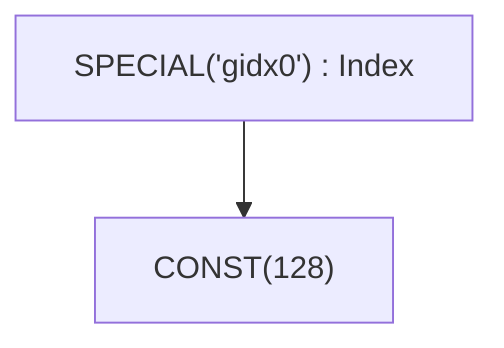

### UNIQUE / LUNIQUE — Identity मार्कर {#unique--lunique--identity-markers}

```rust
Unique(usize)                // global identity counter
LUnique(usize)               // local-scope identity counter
```

बफ़रों में फ़र्क़ करने के लिए एक unique identity बनाता है। अलग-अलग `Unique` values वाले दो बफ़र अलग हैं, भले बाक़ी सब एक जैसा हो। `LUnique` एक local scope (जैसे किसी `Function` body) के अंदर वही फ़र्क़ ग्लोबल counter से टकराए बिना देता है, ताकि callable bodies को इस बात से स्वतंत्र hash-cons किया जा सके कि वे कहाँ से call होती हैं।

Devices का अपना कोई नोड नहीं है: target उन ऑपरेशनों पर एक `DeviceSpec` फ़ील्ड है जिन्हें इसकी ज़रूरत है (`Copy`, `GetAddr`, `AllReduce`, `ParamArg.device`, `BufferizeOpts.device`, `ProgramInfo.target`)।

---

## Movement ऑपरेशन {#movement-operations}

हाई-लेवल tensor shape ट्रांसफ़ॉर्मेशन। Rangeify के दौरान ये एक्सप्लिसिट INDEX ऑपरेशनों में बदल दिए जाते हैं।

| ऑपरेशन | Signature | उद्देश्य |
|-----------|-----------|---------|
| `Reshape` | `{ src, new_shape }` | shape बदलना, elements वही |
| `Permute` | `{ src, axes: Vec<usize> }` | axes को transpose/क्रम बदलना |
| `Expand` | `{ src, new_shape }` | बड़ी shape तक broadcast |
| `Pad` | `{ src, begin_pads, end_pads }` | padding जोड़ना |
| `Shrink` | `{ src, offsets, sizes }` | sub-region निकालना |
| `Flip` | `{ src, axes: Vec<bool> }` | axes के साथ उलटना |

**उदाहरण:** RESHAPE
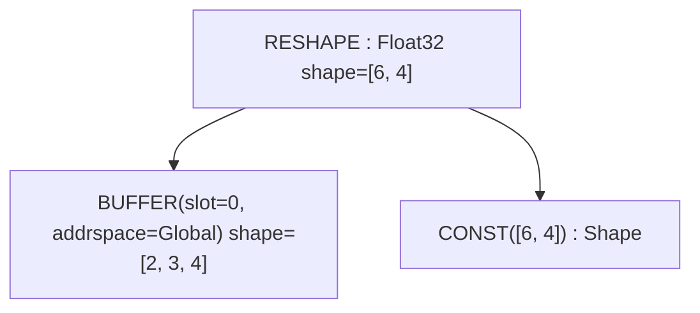

---

## अतिरिक्त ऑपरेशन {#additional-operations}

नीचे दिए ऑपरेशन `Op` enum में मौजूद हैं, लेकिन या तो internal हैं या डीबगिंग के दौरान कम ही मिलते हैं:

| ऑपरेशन | उद्देश्य |
|-----------|---------|
| `Copy` | `{ src, device }` - किसी value की दूसरे device पर एक्सप्लिसिट copy; अपने source की हर range बंद करता है |
| `Slice` | `{ buffer, offset, size }` - बफ़र पर contiguous typed slice metadata (offset source elements में); अपने source की हर range बंद करता है |
| `GetAddr` | `{ src, device }` - किसी buffer-like source का `UInt64` address |
| `MStack` | `{ buffers }` - multi-device tensor के per-device बफ़र |
| `MSelect` | `{ buffer, device_index }` - multi-device tensor में से एक device का बफ़र |
| `Multi` | `{ src, axis }` - shard marker: वह axis जिस पर multi-device tensor बँटा है |
| `Group` | `{ sources }` - scheduling के लिए ऑपरेशनों को समूह में रखता है |
| `Noop` | बिना operands और बिना असर वाला placeholder |
| `Detach` | ग्राफ़ से अलग करना (इसके पार ऑप्टिमाइज़ेशन रोकना) |
| `Contiguous` | `{ src, opts: Vec<ContiguousHint> }` - अपने बफ़र में materialization को मजबूर करना, optional ऑप्टिमाइज़र hints के साथ; `realize()` अपने root को इसी में लपेटता है |
| `ContiguousBackward` | contiguous hint का backward pass |
| `Precast` | type conversion के लिए pre-cast |
| `Custom` / `CustomI` | `{ deps, code }` - inline backend कोड (C या LLVM IR), दोनों renderers render करते हैं |
| `CustomFunction` | `{ kind, attrs }` - runtime custom-function hook; kinds: `EncDec`, `Graph`, `AllReduce { reduce_op }` |
| `Ins` | `{ sources, arg: InsArg }` - ISA renderer द्वारा चुना गया target instruction (`opcode` और sorted attributes) |

---

## क्विक रेफ़रेंस {#quick-reference}

### कैटेगरी के अनुसार {#by-category}

| कैटेगरी | ऑपरेशन |
|----------|------------|
| **Nullary** | `CONST`, `VCONST`, `UNIQUE`, `LUNIQUE`, `NOOP`, `DEFINE_VAR` |
| **लूप कंट्रोल** | `RANGE`, `END` |
| **रिडक्शन** | `REDUCE_AXIS`, `REDUCE`, `ALLREDUCE` |
| **मेमोरी** | `BUFFER`, `SLICE`, `STAGE`, `INDEX`, `LOAD`, `STORE`, `GETADDR`, `COPY` |
| **Multi-device** | `MSTACK`, `MSELECT`, `MULTI` |
| **कर्नेल और Callable** | `SINK`, `GROUP`, `CALL`, `FUNCTION`, `TUPLE`, `GET_TUPLE`, `PROGRAM`, `LINEAR`, `SOURCE`, `PROGRAM_BINARY`, `AFTER`, `BARRIER` |
| **वेक्टर** | `STACK`, `INDEX`, `VCONST` |
| **Expansion** | `AxisType::Upcast` या `AxisType::Unroll` वाला `RANGE` |
| **हार्डवेयर** | `WMMA`, `SPECIAL`, `INS` |
| **कंट्रोल** | `IF`, `ENDIF` |
| **डेफ़िनिशन** | `PARAM`, `DEFINE_VAR`, `BIND`, `UNIQUE`, `LUNIQUE` |
| **Movement** | `RESHAPE`, `PERMUTE`, `EXPAND`, `PAD`, `SHRINK`, `FLIP` |
| **ग्राफ़ hints** | `CONTIGUOUS`, `CONTIGUOUS_BACKWARD`, `DETACH`, `PRECAST` |
| **Extension** | `CUSTOM`, `CUSTOMI`, `CUSTOM_FUNCTION` |
| **ALU** | `Unary(...)`, `Binary(...)`, `Ternary(...)`, `Cast`, `BitCast` |

### Range-Ending ऑपरेशन {#range-ending-operations}

वे ऑपरेशन जो RANGE स्कोप बंद करते हैं (`Op::range_ending_src_index`):

| ऑपरेशन | Range Start Index |
|-----------|-------------------|
| `STAGE` | 1 (compute=0, ranges=1+) |
| `REDUCE` | 1 (src=0, ranges=1+) |
| `WMMA` | 3 (a=0, b=1, c=2) |
| `END` | 1 (computation=0, ranges=1+) |
| `CALL` / `FUNCTION` | 1 (body=0, args=1+) |

`Op::ended_ranges()` दो अप्रत्यक्ष मामले जोड़ता है: `AFTER` वह सब बंद करता है जो उसके `deps` बंद करते हैं, और `COPY` / `SLICE` अपने source पर scope में मौजूद हर range बंद करते हैं।

### Expandable ऑपरेशन {#expandable-operations}

वे ऑपरेशन जो expanded lanes को कम्प्यूटेशन ग्राफ़ में आगे ले जाते हैं (`Op::is_expandable`):

- ALU: `Unary`, `Binary`, `Ternary`
- Type: `Cast`, `BitCast`
- Shaped values: `Stack`
- मेमोरी: `Load`, `Store`, `Index`
- कंट्रोल: `Reduce`, `End`, `After`
- बफ़र: `Stage`
- हार्डवेयर: `Wmma`
