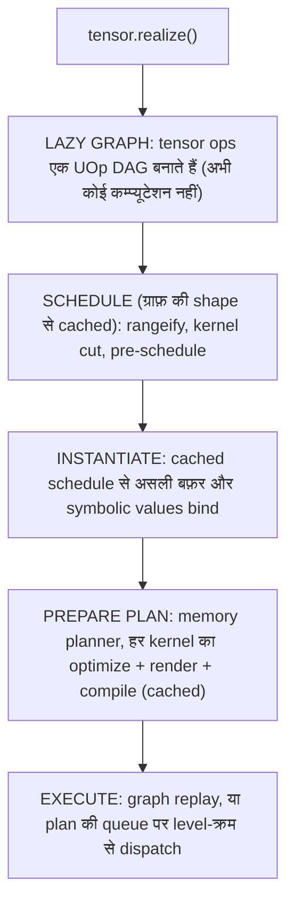
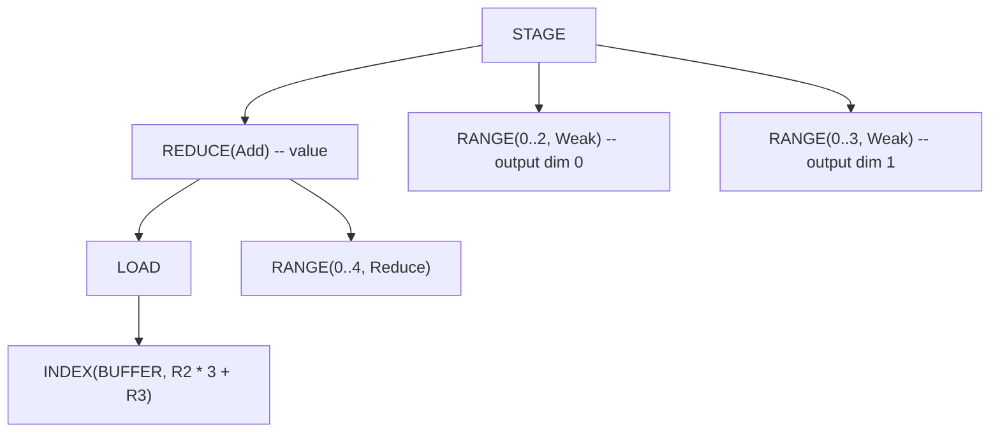
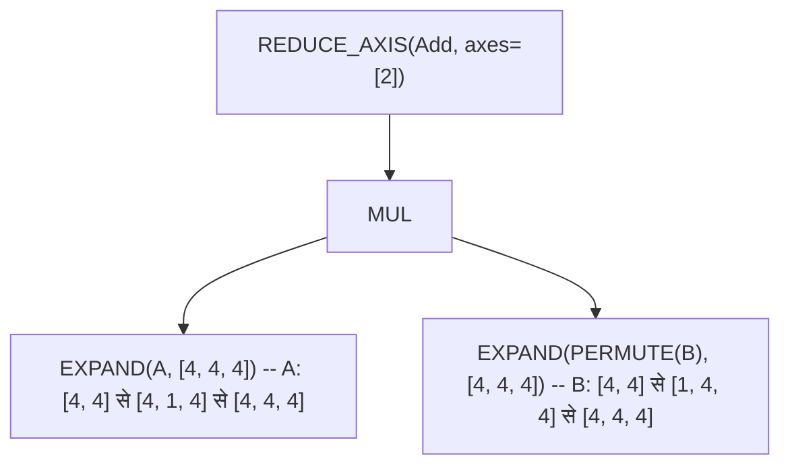
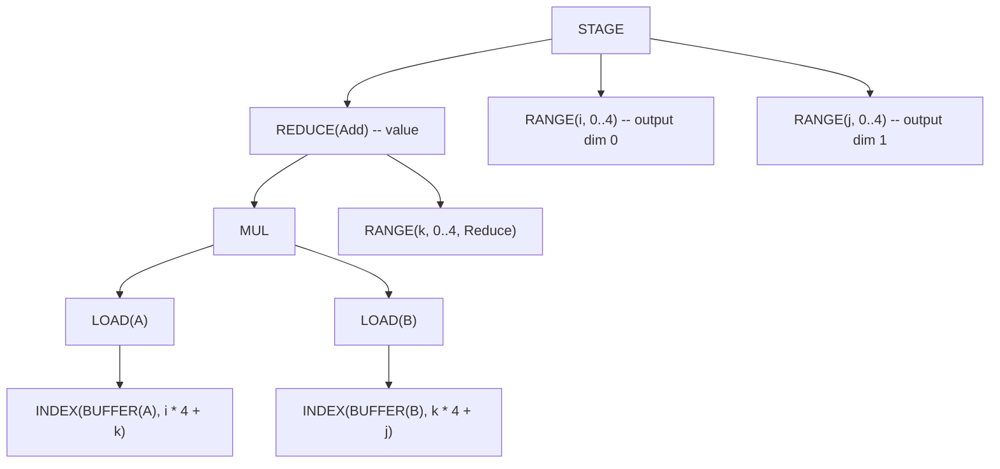
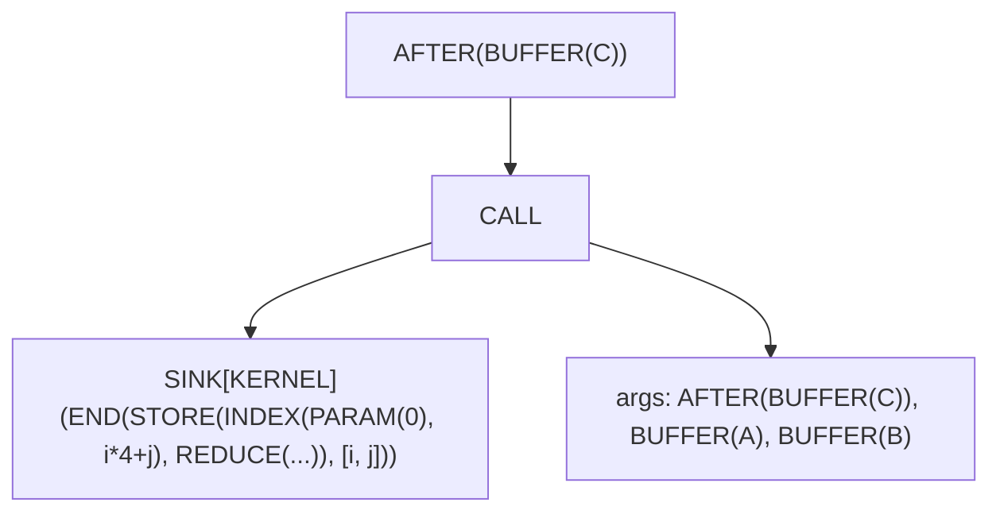

# Tensor से मशीन कोड तक {#from-tensor-to-machine-code}

ज़्यादातर ML फ़्रेमवर्क में कम्प्यूटेशन तुरंत होता है। PyTorch में `a + b` लिखें और यह *अभी* चलता है — GPU नंबर क्रंच कर देता है इससे पहले कि आप रिज़ल्ट देख भी सकें। यह eager execution समझने में आसान है, लेकिन ऑप्टिमाइज़ेशन के मौके छूट जाते हैं। कम्पाइलर उस कम्प्यूटेशन को कैसे ऑप्टिमाइज़ करे जो उसने अभी देखा ही नहीं?

Svod उलटा तरीका अपनाता है: **lazy evaluation**। जब आप `a.try_add(&b)?` लिखते हैं, कुछ भी कम्प्यूट नहीं होता। Svod एक ग्राफ़ बनाता है जो बताता है *क्या* कम्प्यूट करना है, *कब* नहीं। काम तब होता है जब आप `realize()` कॉल करते हैं — वह एक मेथड पूरी कम्पाइलेशन पाइपलाइन ट्रिगर करता है, हाई-लेवल tensor ऑपरेशनों से लेकर JIT-कम्पाइल्ड मशीन कोड तक।

यह चैप्टर उस यात्रा को ट्रेस करता है। [IR डिज़ाइन](./ir-design.md) पेज उस node type को समझाता है जिसे हर स्टेज साझा करती है; [codegen चैप्टर](./codegen/overview.md) per-kernel ऑप्टिमाइज़र को पास-दर-पास दिखाते हैं; यह पेज उनके बीच का नक्शा है।



---

## Lazy Evaluation: ग्राफ़ बनाना {#lazy-evaluation-building-the-graph}

Svod में `Tensor` एक हैंडल है:

```rust
pub struct Tensor {
    entry: Arc<TensorEntry>,
}

pub struct TensorEntry {
    pub id: u64,
    pub uop: RwLock<Arc<UOp>>,     // the computation this tensor represents
    buffer: OnceLock<Arc<Buffer>>, // filled by realization
}
```

UOp एक `RwLock` के पीछे रहता है ताकि ग्राफ़ को उसी जगह बदला जा सके (नीचे रजिस्ट्री देखें), और बफ़र हैंडल में नहीं बल्कि शेयर्ड entry में रहता है, इसलिए tensor को clone करने पर उसका realization भी शेयर होता है। इसीलिए `realize()`, `prepare()` और `profile()` `&self` लेते हैं।

### Tensor बनाने के तीन तरीके {#three-ways-to-create-tensors}

**1. इनपुट tensor** — बफ़र तुरंत एलोकेट और भरा जाता है:

```rust
let a = Tensor::from_slice([1.0f32, 2.0, 3.0]);
// a.buffer() is Some(..): device memory allocated, bytes copied in
```

`from_slice` (और `from_ndarray`, जो C-contiguous इनपुट के लिए एक बार copy करता है) एक device `Buffer` एलोकेट करता है, आपके bytes `copyin` से copy करता है, और ग्राफ़ `BUFFER.reshape(shape)` बनाता है। कोई टाला हुआ host copy नहीं है।

**2. Lazy ऑपरेशन** — कोई बफ़र नहीं, सिर्फ़ ग्राफ़:

```rust
let b = a.try_add(&a)?;   // b.buffer() is None
let c = b.try_mul(&a)?;   // c.buffer() is None
```

अरिथमेटिक ऑपरेशन कुछ कम्प्यूट नहीं करते। वे एक UOp ग्राफ़ बनाते हैं: `Binary(Add, a.uop, a.uop)`। Tensor सिर्फ़ भविष्य के काम के विवरण के रूप में मौजूद है।

**3. Movement ऑपरेशन** — मूल storage पर views:

```rust
let d = a.try_reshape(&[1, 3])?;  // d.buffer() resolves to a's storage
```

Reshape, permute और ऐसे ही ऑपरेशन एक नई lazy entry बनाते हैं जिसका ग्राफ़ `RESHAPE(a.uop)` है। Entry के पास अपना कोई बफ़र नहीं होता; `buffer()` base `BUFFER` node तक जाता है और रजिस्ट्री के ज़रिए `a` का storage ढूँढता है।

### ग्लोबल रजिस्ट्री {#the-global-registry}

`tensor/src/tensor_registry.rs` दो lock-free `papaya` maps रखता है:

| Map | Key → Value | उद्देश्य |
|-----|-------------|---------|
| `TENSORS` | tensor id → `Weak<TensorEntry>` | हर ज़िंदा tensor, ग्राफ़ substitution के लिए |
| `BUFFERS` | `BUFFER` UOp id → `Arc<Buffer>` | scheduling और `buffer()` lookups के दौरान device storage ढूँढना |

यह रजिस्ट्री **ग्लोबल ग्राफ़ substitution** संभव बनाती है: जब `realize()` पूरा होता है, realized subgraph हर उस tensor में उसके `BUFFER` से बदल दिया जाता है जो उसे refer करता था (`apply_map_to_tensors_realized`), इसलिए किसी dependent tensor पर बाद का `realize()` नतीजा दोबारा कम्प्यूट करने की बजाय पढ़ लेता है। `BUFFERS` entries एक UOp drop hook के ज़रिए तब ख़त्म होती हैं जब `BUFFER` node ख़ुद drop होता है।

### Hash Consing इन एक्शन {#hash-consing-in-action}

चूँकि UOps hash-consed हैं (content-based interning), एक जैसे कम्प्यूटेशन मेमोरी शेयर करते हैं:

```rust
let x = a.try_add(&b)?;
let y = a.try_add(&b)?;
// x.uop() and y.uop() are the SAME Arc<UOp>
```

यही नीचे के कैश को सस्ता बनाता है: एक जैसी shape वाले कम्प्यूटेशन के दो tensors scheduler तक एक ही node के रूप में पहुँचते हैं, और हर cache key ग्राफ़ का एक structural `content_hash` है, इसलिए अलग-अलग बने ग्राफ़ (या किसी दूसरे process run में बने) भी hit करते हैं।

---

## `realize()` क्या करता है {#what-realize-does}

`Tensor::realize` (`tensor/src/realize.rs`) छोटा है:

```rust
pub fn realize(&self) -> Result<()> {
    if self.uop().has_buffer_identity() { self.ensure_buffer(); return Ok(()); }
    if is_any_const(&self.uop()) { self.set_uop(self.uop().contiguous()); }  // force a buffer
    if self.has_zero_elements() { return Ok(()); }

    let old_uop = self.uop();
    let plan = self.prepare_plan_with(&PrepareConfig::from_env())?;  // schedule + compile
    plan.execute()?;
    self.finalize_realize(&plan, &old_uop)?;      // tensor ← BUFFER.reshape(shape)
    apply_map_to_tensors_realized(&{old_uop => realized_uop});
    Ok(())
}
```

`prepare_plan_with` ग्राफ़ को `SINK(CONTIGUOUS(uop))` में लपेटता है और दो कदम चलाता है: `schedule_result_from_sink_with_cache` (अगला सेक्शन) और `prepare_execution_plan` (उसके बाद वाला)। `prepare()` यही दो कदम चलाता है और `ExecutionPlan` आपको सौंप देता है ताकि आप ख़ुद execute करें; `realize_batch` / `prepare_batch` कई tensors के लिए यही काम एक `SINK(CONTIGUOUS(t1), …, CONTIGUOUS(tN))` से करते हैं, ताकि एक से ज़्यादा output को feed करने वाले kernels शेयर हों। `PrepareConfig::from_env()` ऑप्टिमाइज़र strategy, thread budget और memory-planner mode environment से पढ़ता है (तालिका अंत में); `realize_with` / `prepare_with` explicit config लेते हैं।

---

## Scheduling: ग्राफ़ से कर्नेल तक {#scheduling-from-graph-to-kernels}

### शेड्यूल कैश {#the-schedule-cache}

Scheduling (rangeify और kernel cut) सबसे महँगा compile कदम है और सिर्फ़ ग्राफ़ की *shape* पर निर्भर करता है, इस पर नहीं कि वह कौन-से बफ़र पढ़ता है। इसलिए `schedule_result_from_sink_with_cache` पहले sink को **normalize** करता है — हर `BUFFER` एक positional `PARAM` बन जाता है, हर `BIND(DEFINE_VAR, CONST)` अपनी runtime value खो देता है — और नतीजे को `(content_hash(normalized sink), compiler identity)` key वाले process-wide cache में ढूँढता है। Hits सीधे instantiation पर पहुँचते हैं; misses हर key के लिए rangeify एक ही बार चलाते हैं, भले कई threads होड़ करें (single-flight)। `SVOD_DISABLE_SCHEDULE_CACHE=1` इसे बंद करता है।

Cache miss क्रम से चलाता है: `rangeify_with_map` → `try_get_kernel_graph` → `wrap_scan_loops` (scan ops के लिए schedule-level loops) → `create_pre_schedule`।

### Rangeify: लूप्स को एक्सप्लिसिट बनाना {#rangeify-making-loops-explicit}

जब आप `tensor.reshape([2, 3]).expand([4, 2, 3]).sum(axis=0)` लिखते हैं, तो ये movement ऑपरेशन हाई-लेवल विवरण हैं। लूप्स बनाने के लिए iteration को एक्सप्लिसिट होना होगा। **Rangeify** (`rangeify_with_map`, `schedule/src/rangeify/transforms.rs`) movement ops को `RANGE` लूप्स और `INDEX` अरिथमेटिक में बदलता है:

| कदम | कोड | उद्देश्य |
|------|------|---------|
| Multi-device | `multi_pm()`, `lower_allreduce_pm()` | multi-device tensors की sharding resolve करना, `ALLREDUCE` lower करना |
| Tags | `add_tags_patterns()` | हर node को नंबर देना ताकि rewrites के पार tensor identity बची रहे |
| Calls | `resolve_calls()` | non-precompiled `FUNCTION`s को inline करना, `GETTUPLE(TUPLE)` fold करना |
| शुरुआती rewrites | `movement_op_patterns() + early_rewrites() + split_reduceop_patterns()` | movement ops साफ़ करना; बड़े reductions को दो स्टेज में बाँटना |
| Range assignment | `indexing::run_rangeify` | तय करना कि क्या materialize होगा (`pm_generate_realize_map`), हर output axis को एक `RANGE` देना, फिर `REDUCE_AXIS` → `REDUCE`, `PAD` → `WHERE`, `STACK` → `WHERE` lower करना, और जहाँ values materialize होती हैं वहाँ `STAGE` + `INDEX` डालना |
| Mega-pass | `symbolic() + pm_reduce_simplify() + movement_op_patterns() + buffer_folding() + dead_axis_removal() + pm_remove_bufferize()` | एक fixpoint loop: algebra, reduction simplification, buffer folding, dead-axis removal, fuse हो सकने वाले `STAGE`s को हटाना |
| Outputs | `SINK` फिर से बनाना | सिर्फ़ public outputs रखना |
| Buffer limit | `buffer_limit_patterns(limit)` | उन kernels को बाँटना जो device की argument limit पार कर जाते |

हर कदम pattern-based rewriting है ([पैटर्न इंजन](./optimizations/pattern-system.md) देखें)। जिन per-kernel passes को [Rangeify चैप्टर](./codegen/rangeify.md) स्टेज 1–7 कहता है (early movement ops, load collapse, split ranges, initial symbolic, simplify ranges), वे बाद में `apply_pre_optimization()` में चलते हैं, जब ग्राफ़ kernels में कट चुका होता है।

हर movement op एक ख़ास index transformation में lower होता है (`apply_movement_op`, `schedule/src/rangeify/indexing.rs`):

| ऑपरेशन | Transformation |
|-----------|----------------|
| **RESHAPE** | output strides से flatten, फिर input shape के हिसाब से `/` और `%` से वापस बाँटना |
| **PERMUTE** | inverse permutation से ranges का क्रम बदलना |
| **EXPAND** | expanded axis का index `0` बन जाता है (range अब address को प्रभावित नहीं करता) |
| **PAD** | index `WHERE(valid, rng - begin, INVALID)` बन जाता है; padded value `WHERE(valid, src, 0)` है |
| **SHRINK** | `rng + begin` |
| **FLIP** | `(size - 1) - rng` |

Rangeify के बाद कोई movement ops नहीं बचते — सिर्फ़ indices पर अरिथमेटिक। ऊपर वाले expression के लिए पहले और बाद:

```text
Before: BUFFER.reshape([2, 3]).expand([4, 2, 3]).sum(axis=0)
```



`EXPAND` एक `RANGE(0..4)` बन गया जो बफ़र index में नहीं दिखता — यही broadcasting है। `RESHAPE` index अरिथमेटिक बन गया। `SUM` एक `Reduce` range को बंद करने वाला `REDUCE(Add)` बन गया। यहाँ output ranges `Weak` हैं: ऑप्टिमाइज़र बाद में तय करता है कि कौन `Global`, `Local` या `Upcast` बनेगा।

### कर्नेल कट {#the-kernel-cut}

`try_get_kernel_graph` (`schedule/src/rangeify/kernel.rs`) rangeified ग्राफ़ को kernels में बाँटता है:

**कदम 1: STAGE → STORE** (`pm_add_buffers_patterns`, `bufferize_to_store`)। हर `STAGE` को एक नया `BUFFER` node मिलता है (अभी कोई device मेमोरी नहीं) और वह अपनी ranges के नीचे एक store बन जाता है, उस बफ़र पर एक `AFTER` में लिपटा हुआ:

```text
Before: STAGE(compute, ranges)
After:  AFTER(BUFFER, [END(STORE(INDEX(BUFFER, flat_idx), compute), ranges)])
```

**कदम 2: Stores को kernels में बाँटना** (`split_all_stores` → `split_store`)। हर store एक callable बन जाता है। Body के अंदर global `BUFFER`s pattern-match क्रम में `PARAM(slot = N)` बन जाते हैं (`LocalAddBufferContext.param_slot` counter), body `KernelInfo` वाले `SINK` के रूप में सील होती है, और kernel एक `CALL` है जिसके arguments बफ़र (`AFTER`s के रूप में) और ज़रूरी `BIND`s हैं:

```text
After:  AFTER(BUFFER, [CALL(SINK[KERNEL](END(STORE(...), ranges)), args = [AFTER(BUFFER..), BIND..])])
```

कोई `KERNEL` op नहीं है: kernel एक `SINK[KERNEL]` का `CALL` है। Cut वह जगह भी है जहाँ origin attribution `CALL` पर harvest होता है ([कर्नेल Origins](./kernel-origins.md) देखें)।

**कदम 3: Assignments ठीक करना** (`fix_assign`)। जब kernel B वह बफ़र पढ़ता है जिसे kernel A लिखता है, तो B का `AFTER` A के `AFTER` deps में जोड़ दिया जाता है, ताकि एक ही बफ़र पर write-after-read अपना क्रम बनाए रखे। Dependencies `AFTER` nodes में रहती हैं; schedule बनने तक कोई अलग dependency ग्राफ़ नहीं होता।

### Pre-schedule और instantiation {#pre-schedule-and-instantiation}

`create_pre_schedule` (`tensor/src/schedule.rs`) kernel ग्राफ़ पर चलता है, callables को उनकी `AFTER` dependencies से Kahn-sort करता है और हर kernel के लिए AST और उसके छुए बफ़रों की *identities* दर्ज करता है — लेकिन बफ़र नहीं। Cache यही रखता है। फिर `instantiate_schedule` असली `BUFFER`s वापस लाता है, intermediates और outputs के लिए `Buffer` हैंडल एलोकेट करता है (outputs host-visible रहते हैं जब तक `PrepareConfig::device_local_outputs` न हो), symbolic values bind करता है और बनाता है:

```rust
pub struct ScheduleResult {
    pub items: Vec<ScheduleItem>,
    pub output_uop_ids: Vec<u64>,
    pub alias_output_buffers: HashMap<u64, Buffer>,  // outputs that alias an input
}

pub struct ScheduleItem {
    pub kernel: Arc<UOp>,              // the CALL: dependency identity
    pub ast: Arc<UOp>,                 // the SINK[KERNEL] body (for codegen)
    pub buffers: Vec<Buffer>,          // device buffers, in CALL argument order
    pub buffer_uop_ids: Vec<u64>,      // their BUFFER UOp ids
    pub fixedvars: HashMap<String, i64>,  // bound symbolic variables
    pub loop_var_names: HashSet<String>,  // fixedvars fed by schedule-loop counters
    pub dependencies: Vec<u64>,        // producer CALL ids
    pub instance_dependencies: Vec<usize>, // producer schedule-item indices
}
```

---

## प्लान तैयार करना {#preparing-the-plan}

`prepare_execution_plan` (`tensor/src/realize.rs`) schedule items को एक `ExecutionPlan` में बदलता है। यह किसी भी origin scope से अलग होकर चलता है और सबसे पहले शेयर्ड thread pool का आकार `PrepareConfig::threads` से तय करता है।

### मेमोरी प्लानर {#memory-planner}

कुछ भी एलोकेट होने से पहले प्लानर (`tensor/src/memory_planner/`) तय करता है कि कौन-से intermediate बफ़र storage शेयर कर सकते हैं। Liveness **execution levels** में मापी जाती है — kernel DAG की Kahn waves (`compute_topological_levels`, runtime के साथ शेयर्ड) — और जो बफ़र आख़िरी बार level *L* में इस्तेमाल हुआ, वह उस storage को फिर इस्तेमाल कर सकता है जो पहली बार *L* के बाद वाले level में इस्तेमाल हुआ। प्लानर कोई ordering edges नहीं जोड़ता; सुरक्षा उस level barrier से आती है जिसे executor पहले से लागू करता है।

| `SVOD_MEMORY_PLANNER` | Mode | असर |
|---|---|---|
| unset, `1`, `arena` | `Arena` (default) | प्लान होने लायक बफ़रों को हर device के एक TLSF arena में pack करना; हर logical बफ़र उसमें एक `Buffer::view` बन जाता है |
| `remap`, `pool` | `Remap` | पूरे बफ़रों को `(device, dtype, size rounded to 256 B)` से pool करना और `Arc<Buffer>`s बदलना |
| `0`, `off`, `none`, `disabled` | `Disabled` | हर बफ़र अपना अलग allocation रखता है |

Inputs, outputs, aliased storage, disk बफ़र और copy/custom-function operands कभी प्लान नहीं होते।

### Per-kernel कम्पाइलेशन और कैश {#per-kernel-compilation-and-the-caches}

हर non-copy item एक `KernelSite` में resolve होता है: उसका device, renderer और एक `OptKey`। Cache में न मिलने वाले kernels parallel में optimize होते हैं, schedule क्रम में नाम पाते हैं (`n1`, `n2` suffixes source text का हिस्सा हैं, इसलिए नामकरण thread timing पर निर्भर नहीं होना चाहिए), फिर render और compile होते हैं:

```text
ast ──► apply_pre_optimization ──► heuristics | BEAM ──► post-optimization ──► PROGRAM ──► LINEAR ──► SOURCE ──► BINARY
```

- `apply_pre_optimization()`: movement-op cleanup, `pm_load_collapse`, `pm_split_ranges + pm_flatten_range`, `sym + pm_fold_cast_const`, `pm_simplify_ranges`।
- ऑप्टिमाइज़र axis types और tiling चुनता है: default में [heuristics](./optimizations/kernel-search.md), `BEAM=N` के साथ [BEAM search](./optimizations/kernel-search.md), या हाथ से lower किए kernels के लिए एक explicit `opts_to_apply` सूची।
- Post-optimization kernel को उन स्टेजों से lower करता है जिन्हें [codegen overview](./codegen/overview.md) 08–20 लेबल देता है: post-opt symbolic, expander (`Upcast`/`Unroll` ranges → lanes), local बफ़र, `pm_add_gpudims` (`Global`/`Local` ranges → `SPECIAL`), `pm_add_loads`, devectorizer (`bool_storage_patterns` के साथ), memory coalescing, index-dtype lowering, dtype decompositions (`pm_float_decomp`, `pm_long_decomp`), late rewrites (target में `MulAcc` हो तो `pm_fma_decomposition`, fast division, …), `pm_move_gates_from_index`, और final rewrite (`pm_split_ends`, implicit barriers)। `SVOD_DUMP_STAGE=<prefix>` इनमें से किसी के भी बाद kernel print करता है।
- `program_from_sink_with_renderer` control flow जोड़ता है, बचे हुए `PARAM` slots को नंबर देता है और `PROGRAM` node बनाता है; `do_linearize` / `do_render` / `do_compile` उसके `LINEAR`, `SOURCE` और `BINARY` fields भरते हैं (`codegen/src/program_pipeline.rs`)।

तीन in-process कैश और एक on-disk कैश दोहराए जाने वाले काम को मुफ़्त बना देते हैं:

| Cache | Key | दायरा |
|-------|-----|-------|
| Schedule cache | `content_hash(normalized SINK)` + compiler identity | rangeify + kernel cut |
| `OPT_CACHE` | `content_hash(kernel AST)` + device + compiler key + renderer fingerprint + optimizer fingerprint | optimized AST और compiled program; `SVOD_OPT_CACHE_MAX` (4096) से FIFO-bounded |
| Compiled-program cache | `content_hash(PROGRAM)` + compiler key | `CachedKernel`: program handle, source, entry point, ABI slots; process भर ज़िंदा |
| Object cache (CPU) | source का SHA-256 + `CompilerIdentity` (backend, target, toolchain, flags, ABI) | `~/.cache/svod/objects` के नीचे relocatable objects (`SVOD_OBJECT_CACHE_DIR`, बंद करने के लिए `SVOD_OBJECT_CACHE=0`) |

सभी keys structural hashes हैं, UOp ids नहीं, इसलिए शुरू से दोबारा बना ग्राफ़ — या किसी दूसरे process में बना — भी hit करता है। BEAM नतीजों का अपना on-disk कैश है (`SVOD_BEAM_CACHE_DIR`)।

### ExecutionPlan {#the-executionplan}

नतीजा (`runtime/src/execution_plan.rs`):

```rust
pub struct ExecutionPlan {
    ops: Vec<PreparedOp>,               // CompiledProgram | BufferCopy | CustomFunction
    op_order: Vec<usize>,               // topological order
    op_levels: Vec<Vec<usize>>,         // Kahn levels: ops in one level are independent
    buffers: Vec<Buffer>,
    ast_to_buffer: HashMap<u64, usize>, // BUFFER UOp id -> buffer index
    output_buffer_indices: Vec<usize>,  // plan outputs, in SINK source order
    device: DeviceSpec,
    runtime_var_vals: HashMap<String, i64>,
    graph: OnceLock<Option<Box<dyn Graph>>>,          // captured on first execute (GPU)
    plan_ctx: OnceLock<Option<Box<dyn PlanContext>>>, // the plan's own queue
    // ... HCQ executor state elided
}
```

| मेथड | उद्देश्य |
|--------|---------|
| `execute()` | मौजूदा बफ़रों और variable values के साथ हर op एक बार चलाना |
| `execute_with_vars(&[(name, value)])` | symbolic variables फिर से bind करना (उनके `[min, max]` से जाँचकर), फिर execute — कोई recompilation नहीं |
| `output_buffer()` / `output_buffer_at(i)` / `num_outputs()` | प्लान के outputs (`i` SINK source क्रम का पालन करता है) |
| `profile(&ProfileOptions)` | replay किया गया, timestamped run जो `RunProfile` लौटाता है |
| `declare_input(idx)` / `replicate()` | जिन पर [JIT wrapper](./jit-graphs.md) टिका है |

प्लान **दोबारा इस्तेमाल होने लायक** है: एक बार compile करें, उन्हीं बफ़रों में अलग-अलग डेटा के साथ कई बार execute करें।

---

## कोड जनरेशन {#code-generation}

दो renderers (`svod_codegen::Renderer`) चारों device backends को कवर करते हैं; device चुनता है:

| Device backend | Renderer | Output |
|----------------|----------|--------|
| **CPU** | `LlvmTextRenderer` (default) या `CRenderer` (`SVOD_CPU_BACKEND=clang`) | LLVM IR text, या C source |
| **CUDA** | `LlvmTextRenderer::nvptx(arch)` | LLVM IR, `ptx_kernel` ABI |
| **AMD** | `LlvmTextRenderer::amd(arch)` | LLVM IR, `amdgpu_kernel` ABI |
| **Metal** | `CRenderer::metal()` | Metal Shading Language |

```rust
pub trait Renderer {
    fn render(&self, uop: &Arc<UOp>, name: Option<&str>) -> Result<RenderedKernel>;
    fn backend_name(&self) -> &str;
    fn decompositor(&self) -> Option<TypedPatternMatcher<()>>;
}
```

Runtime हर एक को device-level `svod_device::device::Renderer` में लपेटता है, जो target की capabilities (`supported_ops`, `gpu_arch`, extra और ISA matchers) जोड़ता है और एक `ProgramSpec` लौटाता है: source, entry point, variable names और वे `globals` / `outs` / `ins` बफ़र slots जिनसे प्लान arguments bind करता है।

LLVM renderer (`codegen/src/llvm/text/`) `LINEAR` op stream पर चलता है और हर kernel के लिए एक function emit करता है। हर बफ़र एक direct `ptr noalias align 32 %dataN` parameter है — कोई args array नहीं — और symbolic variables (साथ में CPU threading के लिए `core_id`) typed scalar parameters हैं:

```llvm
define void @E_128(ptr noalias align 32 %data0, ptr noalias align 32 %data1, i32 %N) #0 {
entry:
  br label %loop_0

loop_0:
  %i = phi i32 [ 0, %entry ], [ %i.next, %loop_0 ]
  ; ... computation ...
  %i.next = add nsw i32 %i, 1
  %cond = icmp slt i32 %i.next, 128
  br i1 %cond, label %loop_0, label %exit

exit:
  ret void
}
```

---

## कम्पाइलेशन और लोडिंग {#compilation-and-loading}

CPU पर IR text एक relocatable object बनता है और in-process लोड होता है; कोई LLVM `ExecutionEngine` नहीं और कोई अस्थायी shared library नहीं:

1. **Compile** `-O2` पर — `libloading` से in-process bind की गई libLLVM के ज़रिए, जब वह उपलब्ध हो (`SVOD_LLVM_INPROCESS=0` से opt out, `SVOD_LLVM_LIB` किसी library की ओर इशारा करता है), वरना stdin/stdout पर `clang -x ir -c -O2 … -o -`।
2. **Reuse** — जब source और compiler identity मेल खाते हों तो on-disk कैश से object।
3. **Load** — ELF loader से: sections एक anonymous mmap में, relocations लागू, pages executable किए जाते हैं (`runtime/src/jit_loader.rs`; [JIT Compiler](../backends/jit-loader.md) देखें)।

```rust
let object = cache.get_or_compile(key, validate_relocatable_object, |ir| producer.compile(ir))?;
let (fn_ptr, _mmap) = jit_load(&object, &entry_point)?;  // ELF loader, no linker
```

GPU backends वही LLVM IR driver को सौंपते हैं: PTX को CUDA driver (या install हो तो `ptxas`) JIT करता है, AMDGPU code objects KFD के ज़रिए लोड होते हैं, Metal source को Metal framework compile करता है।

---

## एक्ज़ीक्यूशन {#execution}

`ExecutionPlan::execute()` तीन में से एक रास्ता चुनता है, सभी प्लान के executor lock के नीचे:

1. **Graph replay।** अगर हर op प्लान के device पर बिना unbound symbolic variable वाला compiled kernel है, और device के पास graph factory है (CUDA Graphs, AMD PM4/AQL graph, Metal indirect command buffer), तो प्लान पहले `execute()` पर पूरी dispatch sequence capture करता है और उसके बाद उसे replay करता है, सिर्फ़ बदले हुए kernel arguments patch करते हुए। [JIT ग्राफ़](./jit-graphs.md#graph-capture-and-replay) पेज backends और उनके switches को दर्ज करता है।
2. **Native linked plan** (AMD)। जिन प्लान को graph capture नहीं कर सकता — runtime variables, copies या custom functions वाले — वे एक linked HCQ command stream के रूप में capture होते हैं जिसके kernel arguments हर replay पर फिर से pack होते हैं।
3. **Per-op dispatch।** वरना प्लान `op_levels` पर level-दर-level चलता है और हर op को प्लान की अपनी queue में submit करता है (`PlanContext::dispatch`, GPUs पर asynchronous) या CPU program को सीधे call करता है।

एक प्लान के अंदर, एक level के ops अलग host threads पर *नहीं* चलते: levels मेमोरी प्लानर का reuse barrier और graph capture का क्रम हैं। CPU parallelism kernel के अंदर है (`Thread` axes rayon pool पर बँटते हैं) और अलग-अलग प्लानों के बीच। हर `PreparedKernel` अपना device रखता है, इसलिए एक प्लान कई devices पर फैल सकता है, और `BufferCopy` ops उनके बीच डेटा ले जाते हैं।

---

## वर्क्ड उदाहरण: मैट्रिक्स मल्टिप्लाई {#worked-example-matrix-multiply}

चलिए 4×4 मैट्रिक्स के लिए `C = A.matmul(&B)?` को पाइपलाइन से ट्रेस करते हैं।

### स्टेज 1: Lazy ग्राफ़ कंस्ट्रक्शन {#stage-1-lazy-graph-construction}

```rust
let a = Tensor::from_slice(a_data).try_reshape(&[4, 4])?;  // input buffer allocated
let b = Tensor::from_slice(b_data).try_reshape(&[4, 4])?;  // input buffer allocated
let c = a.matmul(&b)?;                                     // graph built, no computation
```

`matmul` `A` को `[4, 1, 4]` और `B` को `[1, 4, 4]` में reshape करता है, `B` को transpose करता है, गुणा करता है (broadcast `EXPAND`s डालता है) और आख़िरी axis पर sum करता है:



### स्टेज 2: Rangeify {#stage-2-rangeify}

Movement ops एक्सप्लिसिट लूप्स बन जाते हैं:



`i` और `j` ranges output dimensions हैं। `k` range reduction (contracted) dimension है।

### स्टेज 3: कर्नेल कट {#stage-3-kernel-cut}

एक `STAGE` → एक store → एक `CALL`:



### स्टेज 4: शेड्यूल {#stage-4-schedule}

एक `ScheduleItem`:
- `kernel`: `CALL`
- `ast`: `SINK[KERNEL]`
- `buffers`: `[C, A, B]` — `C` अभी एलोकेट हुआ, `A` और `B` पहले से resident
- `dependencies`: `[]` (कोई producer kernel नहीं)

### स्टेज 5: ऑप्टिमाइज़ेशन {#stage-5-optimization}

Heuristic ऑप्टिमाइज़र, उदाहरण के लिए, `j` पर 4 से `Upcast` (हर store पर एक `float4` vector) और `k` पर `Unroll` चुनता है; GPU पर `i` `Global` बन जाता है।

### स्टेज 6: कोड जनरेशन {#stage-6-code-generation}

Generated LLVM IR, पढ़ने में आसानी के लिए scalar रूप में:

```llvm
define void @r_4_4_4(ptr noalias align 32 %data0, ptr noalias align 32 %data1, ptr noalias align 32 %data2) #0 {
entry:
  br label %loop_i

loop_i:
  %i = phi i32 [ 0, %entry ], [ %i.next, %loop_i.end ]
  br label %loop_j

loop_j:
  %j = phi i32 [ 0, %loop_i ], [ %j.next, %loop_k.end ]
  br label %loop_k

loop_k:
  %k = phi i32 [ 0, %loop_j ], [ %k.next, %loop_k ]
  %acc = phi float [ 0.0, %loop_j ], [ %acc.new, %loop_k ]
  %a_val = load float, ptr ...  ; A[i, k]  (data1)
  %b_val = load float, ptr ...  ; B[k, j]  (data2)
  %prod = fmul float %a_val, %b_val
  %acc.new = fadd float %acc, %prod
  %k.next = add nsw i32 %k, 1
  %k.cond = icmp slt i32 %k.next, 4
  br i1 %k.cond, label %loop_k, label %loop_k.end

loop_k.end:
  store float %acc.new, ptr ...  ; C[i, j]  (data0)
  ; ... continue j, i loops
}
```

### स्टेज 7: एक्ज़ीक्यूशन {#stage-7-execution}

1. IR compile करें (या cached object लें) और लोड करें।
2. `execute()`: एक `PreparedKernel`, `ProgramSpec.globals` क्रम में `[C_ptr, A_ptr, B_ptr]` के साथ call होता है।
3. `finalize_realize` `c` को `BUFFER(C).reshape([4, 4])` से फिर जोड़ता है।

---

## Environment संदर्भ {#environment-reference}

वे variables जो इस पाइपलाइन को चलाते हैं (ऑप्टिमाइज़र और backend के knobs उनके अपने पेजों पर दिए हैं):

| Variable | असर |
|----------|--------|
| `SVOD_DEVICE` | default device (`CPU`, `CUDA:0`, `AMD:0`, `METAL`); unset हो तो macOS पर Metal, बाक़ी जगह CPU |
| `SVOD_CPU_BACKEND` | `llvm` (default) या `clang` |
| `SVOD_THREADS` | compile और CPU-kernel thread budget (default: उपलब्ध parallelism) |
| `SVOD_NOOPT`, `BEAM=N` | ऑप्टिमाइज़र strategy: कोई नहीं, या width N का beam search (default: heuristics) |
| `SVOD_MEMORY_PLANNER` | `arena` (default), `remap`, `off` |
| `SVOD_DISABLE_SCHEDULE_CACHE=1`, `SVOD_OPT_CACHE_MAX` | schedule cache बंद; optimized-kernel cache की क्षमता |
| `SVOD_OBJECT_CACHE=0`, `SVOD_OBJECT_CACHE_DIR`, `SVOD_OBJECT_CACHE_MAX_BYTES` | on-disk object cache |
| `SVOD_LLVM_INPROCESS=0`, `SVOD_LLVM_LIB` | `clang` subprocess को ज़बरदस्ती चलाना; bind करने के लिए libLLVM चुनना |
| `SVOD_PER_STAGE_UOPS=1`, `SVOD_DUMP_STAGE=<prefix>`, `SVOD_DUMP_LINEAR=<dir>`, `SVOD_DUMP_LLVM_IR=<dir>` | हर या किसी एक ऑप्टिमाइज़र स्टेज के बाद kernel, linearized stream, rendered IR dump करना |
| `SVOD_SPEC=1` | हर phase के बाद IR को kernel-graph spec से जाँचना |
| `SVOD_ORIGIN=1` | kernels को model code के खाते में डालना ([कर्नेल Origins](./kernel-origins.md)) |
| `RUST_LOG` | `tracing` filter; `debug` per-phase timings print करता है, `trace` बफ़र mappings |

---

## गहरी समझ {#the-deeper-insight}

**Lazy evaluation ग्लोबल ऑप्टिमाइज़ेशन संभव बनाता है।** कम्प्यूटेशन टालकर scheduler kernels काटने से पहले पूरा ग्राफ़ देखता है; fusion default है और materialization अपवाद।

**एक्सप्लिसिट लूप्स हार्डवेयर-विशिष्ट scheduling संभव बनाते हैं।** Movement ops सुविधाजनक abstractions हैं, लेकिन हार्डवेयर को लूप्स चाहिए। Rangeify यह खाई पाटता है, और ऑप्टिमाइज़र को सिर्फ़ किसी range का `AxisType` बदलना होता है।

**Structural hashing कैशिंग को अपने आप बना देता है।** हर कैश — schedule, optimized kernel, compiled program, object file — एक UOp ग्राफ़ के content hash से keyed है, इसलिए उसी shape के दूसरे model की क़ीमत बस allocation और dispatch है, उससे ज़्यादा कुछ नहीं।

**ज़िम्मेदारियों का बँटवारा हर स्टेज को सरल रखता है।** Rangeify को LLVM के बारे में नहीं पता। कोड जनरेशन को tensor semantics के बारे में नहीं पता। हर स्टेज एक काम करती है, उसी IR पर।
