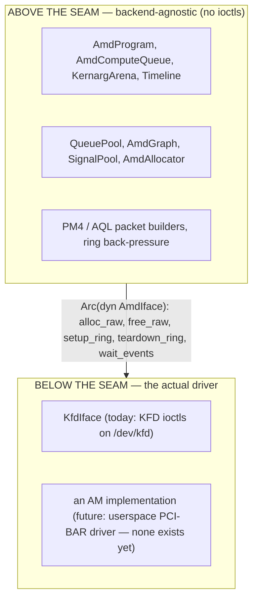
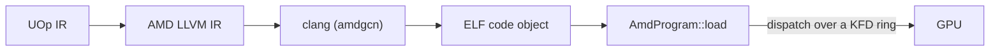

# AMD बैकएंड

Svod सीधे kernel driver से बात करके AMD GPUs पर चलता है। कोई HIP नहीं, कोई ROCr/HSA runtime
नहीं, कोई `libamdhip64.so` नहीं — एकमात्र external dependency AMDGPU target वाला `clang` है
(compilation के लिए)। बाकी सब कुछ — VRAM allocate करना, command rings बनाना, कर्नेल dispatch
करना, completion का इंतज़ार करना — `/dev/kfd` के विरुद्ध raw `ioctl` calls से किया जाता है,
जो Linux **KFD** (Kernel Fusion Driver) interface है और `amdgpu` kernel module के भीतर ship
होता है।

design [tinygrad](https://github.com/tinygrad/tinygrad) के KFD-direct `ops_amd.py` और उसके
HCQ (Hardware Command Queue) model का port है; port `device/src/amd/mod.rs` में एक विशिष्ट
tinygrad commit पर pinned है, और packet layouts व bring-up sequence उसी reference का अनुसरण
करते हैं।

code `svod-device` crate में `device/src/amd/` के अंतर्गत रहता है।

---

## समर्थित GPUs

एक node तब supported है जब उसका KFD `gfx_target_version` एक `AmdArch` पर map होता है
(`dtype/src/amd_arch.rs`; encoding `major*10000 + minor*100 + step` है, decimal):

| `gfx_target_version` | `AmdArch` | Family | Wave size | Matrix cores |
|---|---|---|---|---|
| `90402` | `Gfx942` | CDNA3 (MI300) | 64 | MFMA |
| `90500` | `Gfx950` | CDNA (MI350) | 64 | MFMA |
| `110000` / `110001` / `110002` | `Gfx1100` / `Gfx1101` / `Gfx1102` | RDNA3 (Radeon 7000) | 32 | WMMA |
| `110501` | `Gfx1151` | RDNA3.5 (Strix Halo / Strix Point) | 32 | WMMA |
| `120000` / `120001` | `Gfx1200` / `Gfx1201` | RDNA4 (Radeon RX 9000) | 32 | WMMA |

हर supported arch में matrix cores हैं; RDNA2 और उससे पुराने supported नहीं हैं, और
`gfx90a` सूची में नहीं है। wave size arch का अनुसरण करता है (CDNA पर 64, अन्यथा 32), `-mcpu`
के माध्यम से clang को pass होता है और object-cache ABI string का हिस्सा है। एक unsupported
node उसे खोलने को `DeviceUnavailable` के साथ fail करता है, जो supported families का नाम
बताता है।

---

## Runtime-detected execution provider

AMD बैकएंड हमेशा compile होता है, कभी किसी cargo feature के पीछे gated नहीं: `amd` module
बिना शर्त declare होता है, और kernel को छूने वाली हर चीज़ (ioctl wrappers, allocator, queues,
programs, graphs) `cfg(unix)` है, जैसे कि `nix`, `libc` और `bindgen` dependencies। topology
parser और packet builders हर जगह compile होते हैं। उपलब्धता **runtime पर** तय होती है,
ORT-style: device registry `svod_device::amd::has_devices()` से hardware के लिए probe करती
है — KFD topology का sysfs-only, side-effect-free read — और `"AMD"` device factory को *केवल*
तब register करती है जब कोई supported GPU मौजूद हो। बिना `/dev/kfd` वाले host पर साफ़ तौर पर कोई
`"AMD"` device type नहीं होता।

मकसद robustness है: चूँकि बैकएंड हर Unix build के type-check में है, generic core में API
बदलाव (मान लीजिए एक `Program` या `PlanContext` trait) हर dev box पर `cargo check` पर पकड़ा
जाता है, केवल GPU host पर नहीं। कीमत compile time है, जो स्वीकार्य है। bindgen step उसी अनुरूप
**hermetic** है — यह vendored headers के विरुद्ध चलता है, बिना किसी system kernel headers की
ज़रूरत के ([KFD Bindings](./kfd-bindings.md) देखें)।

---

## HIP के बजाय KFD-direct क्यों

AMD बैकएंड लिखने वाला कोई "समझदार व्यक्ति" HIP (CUDA-जैसा runtime) या उसके नीचे के HSA
runtime की ओर हाथ बढ़ाता है। Svod जान-बूझकर ऐसा नहीं करता। तर्क:

- **कोई userspace runtime dependency नहीं।** HIP/ROCr सैकड़ों megabytes की shared libraries
  है जिन्हें kernel driver version से मेल खाना चाहिए। KFD एक stable kernel `ioctl` ABI है;
  एक Svod binary `libc` + `nix` link करता है और `clang` को shell out करता है, और कुछ नहीं।
  बैकएंड पर्याप्त नए `amdgpu` और `clang` के `amdgcn` target वाले किसी भी host पर काम करता है —
  कोई ROCm install नहीं (ROCm device libraries केवल f64 transcendentals के लिए link होती हैं,
  [Compile & Graph](./compile-and-graph.md) देखें)।
- **Deterministic नियंत्रण।** command ring, doorbell, timeline signal,
  page-table-visible allocations और scratch buffer हमारे हैं। हमारे और hardware के बीच कोई
  runtime नहीं है जो submissions को reorder करे या state छिपाए, जो उस leased-lane dispatch के
  लिए मायने रखता है जिसके इर्द-गिर्द बैकएंड बना है
  ([Queues & Dispatch](./queues-and-dispatch.md) देखें)।
- **एक सिद्ध reference।** tinygrad का HCQ model KFD-direct और battle-tested है। इसे port
  करने का अर्थ है कि हमें उसके सटीक packet layouts और bring-up sequence विरासत में मिलते हैं,
  अपने ख़ुद के reverse-engineer करने के बजाय।

HIP और ROCr दोनों KFD के *ऊपर* बैठते हैं — वे वही `/dev/kfd` खोलते हैं और वही ioctls issue करते
हैं जो हम करते हैं। सीधे जाना बीच की layers हटाता है, कोई capability नहीं।

:::note[CPU समकक्ष]
KFD-direct उसका AMD समकक्ष है जो [ELF JIT loader](../jit-loader.md) CPU पर करता है: भारी
vendor toolchain को छोड़ना और bare mechanism को in-process चलाना। CPU path एक relocatable
object को `mmap` करता है; AMD बैकएंड एक code object को VRAM में load करता है और उसे एक KFD
ring पर dispatch करता है।
:::

---

## बैकएंड seam

बैकएंड **`AmdIface`** trait (`device/src/amd/iface.rs`) द्वारा दो हिस्सों में बँटा है:



जो कुछ भी kernel call *नहीं* है — 16 MiB command ring, PM4/AQL packet construction, kernarg
bump arena, timeline counter, program loader — seam के ऊपर रहता है। trait जान-बूझकर बहुत छोटा
है: **पाँच आवश्यक methods** (`alloc_raw`, `free_raw`, `setup_ring`, `teardown_ring`,
`wait_events`) plus तीन hooks जो default रूप से no-op हैं (`queue_event_mailbox`,
`publication_checkpoint`, `update_queue_percentage`)। इसे छोटा रखने वाली मुख्य अंतर्दृष्टि यह
है कि ring, GART page, EOP buffer और MQD *बस GPU memory* हैं — वे seam के ऊपर `alloc_raw` से
allocate होते हैं, और driver को वास्तव में जो एकमात्र चीज़ अलग करनी होती है वह है **queue को
activate करना** (doorbell map करना, scheduler को बताना कि ring मौजूद है): वही `setup_ring`
है। test suite के बाहर `KfdIface` एकमात्र implementation है।

implementor device-open time पर `SVOD_AMD_BACKEND` environment variable से चुना जाता है:

| `SVOD_AMD_BACKEND` | बैकएंड | स्थिति |
|---|---|---|
| `kfd` (default) | `KfdIface` — KFD-direct | Production |
| कुछ भी और | — | Rejected: `unknown SVOD_AMD_BACKEND=... (only 'kfd' supported)` |

:::caution[AM driver scaffolding है]
`device/src/amd/am/` में एक experimental userspace driver है जो GPU के PCI BARs से सीधे बात
करता है। यह कोई `AmdIface` implement नहीं करता, चुना नहीं जा सकता, और इसने कभी कोई कर्नेल
execute नहीं किया: इसका bring-up एक बार (जून 2026) एक CDNA3 SR-IOV virtual function पर GMC
context programming तक, standalone `am_*` examples के माध्यम से परखा गया। ठीक-ठीक क्या मौजूद
है, इसके लिए [AM Driver](./am-driver.md) देखें।
:::

---

## Device-local memory और SDMA copy queue

device-open पर बैकएंड हर supported part पर एक **SDMA copy queue** (`AmdCopyQueue`) install
करता है, जो `has_sdma_queue` को true कर देता है; इसे बनाने में विफलता एक warning log करती है
और buffers को host-visible छोड़ देती है, और `AMD_DISABLE_SDMA` (कोई भी value) प्रयास को skip
करता है। queue पहले केवल CDNA पर थी, एक RDNA stability चिंता के कारण जो HDP flush handshake
तक पहुँची, जो अब ठीक हो चुका है। इसके साथ, intermediates **device-only VRAM**
(`cpu_access = false`) में रह सकते हैं और host↔device copies asynchronous DMA से होती हैं:
`_copyin`/`_copyout` SDMA queue से stage होते हैं, और `_transfer` एक device→device DMA है जब
कोई भी पक्ष device-only हो (दो host-mapped buffers एक host `memmove` हैं)। जब कोई copy queue
मौजूद न हो तो allocator सरल model पर fallback करता है — हर buffer को host-visible होने को
मजबूर किया जाता है (CPU-mappable VRAM या GTT) और copies storage-scoped `wait_storage` के बाद
host memmoves हैं। Allocation और copies [KFD Bindings](./kfd-bindings.md) में कवर हैं।

---

## AMD पर चलाना

`SVOD_DEVICE` environment variable से GPU चुनें: `AMD:N` node क्रम में
[KFD topology](./kfd-bindings.md) का N-वाँ GPU node है (अकेला `AMD` node 0 है; `HIP` एक
स्वीकृत alias है; value case-insensitive है)। factory तब register होती है जब *कोई भी* node
supported हो, इसलिए यदि node 0 ख़ुद unsupported part है तो `AMD:0` फिर भी
`DeviceUnavailable` के साथ fail हो सकता है:

```bash
SVOD_DEVICE=AMD:0 cargo run --release -p svod-model --example gigaam_infer -- ./audio.wav
```

एक supported AMD GPU के अलावा एकमात्र run-time host आवश्यकता `PATH` पर `amdgcn` target वाला
`clang` है (कर्नेल compile करने के लिए उपयोग होता है — [Compile & Graph](./compile-and-graph.md)
देखें); कोई ROCm/HIP install नहीं है। crate build करने के लिए bindgen हेतु `libclang` चाहिए।
[Queues & Dispatch](./queues-and-dispatch.md) पेज हर environment knob की सूची देता है।

---

## Pipeline में इसका स्थान

AMD बैकएंड compiler का device हिस्सा है। frontend tensors को एक single UOp IR में lower करता
है; codegen उस IR को GPU thread indices पर map करता है
(["Add GPU Dims"](../../architecture/codegen/devectorizer.md) stage ranges को `gidxN`/`lidxN`
SPECIAL indices में बदलता है, [IR Design](../../architecture/ir-design.md) के अनुसार); renderer
AMD LLVM IR emit करता है; और यह बैकएंड उसे compile करके चलाता है:



[JIT Graphs](../../architecture/jit-graphs.md) layer इसे wrap करती है ताकि एक model graph एक बार
compile हो और कई बार replay हो।

---

## पढ़ने की मार्गदर्शिका

| पेज | क्या कवर करता है |
|---|---|
| [KFD Bindings](./kfd-bindings.md) | kernel ABI कैसे bind होता है (vendored header पर bindgen), उपयोग किए गए सटीक ioctls, sysfs topology, और allocation flow |
| [Queues & Dispatch](./queues-and-dispatch.md) | command ring, PM4 बनाम AQL, bounded compute-lane pool, publication और device-wide drains, timeline, और हर configuration env var |
| [Compile & Graph](./compile-and-graph.md) | एक कर्नेल LLVM IR से loaded program तक कैसे जाता है, कैसे dispatch होता है, और graph capture/replay कैसे काम करता है (default रूप से AQL, PM4 opt-in) |
| [AM Driver](./am-driver.md) | experimental userspace driver: क्या बना है, क्या नहीं, और यह seam में कैसे plug होगा |
| [Debugging](./debugging.md) | fault triage के लिए VA→allocation registry, poison latch, और dispatch/tracing diagnostics |
