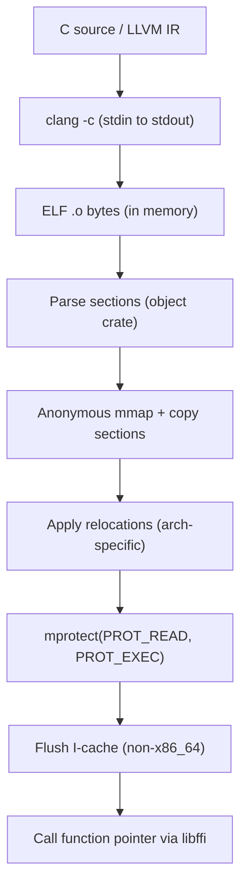

# JIT कंपाइलर

अधिकांश ML कंपाइलर या तो पूरे LLVM टूलचेन को बाइनरी में लिंक करते हैं — सैकड़ों मेगाबाइट डिपेंडेंसी जोड़ते हुए — या डिस्क पर अस्थायी फ़ाइलें लिखकर `dlopen` से लोड करते हैं। Svod इनमें से कुछ भी नहीं करता।

जब किसी kernel को execute करना होता है, Svod जनरेट किए गए सोर्स कोड को stdin से `clang` को भेजता है, stdout पर relocatable ELF ऑब्जेक्ट प्राप्त करता है, प्रक्रिया में ही पार्स करता है, मशीन कोड को anonymous memory mapping में कॉपी करता है, relocations लागू करता है, पेज permissions को executable में बदलता है, और function pointer को सीधे कॉल करता है। पूरी प्रक्रिया मेमोरी में होती है — कोई अस्थायी फ़ाइल डिस्क को नहीं छूती, कोई shared library लोड नहीं होती, और PATH में `clang` के अलावा किसी LLVM इंस्टॉलेशन की ज़रूरत नहीं।

यह अध्याय CPU JIT लोडर की कार्यप्रणाली का वर्णन करता है। GPU बैकएंड उसी `clang` के माध्यम से pipe करते हैं लेकिन डिस्पैच अपने-अपने ड्राइवर से करते हैं: देखें [AMD बैकएंड](./amd/overview.md) (KFD-direct) और [CUDA बैकएंड](./cuda/overview.md) (ड्राइवर API, PTX JIT)।

## पाइपलाइन



**Clang** बैकएंड (C सोर्स, `-x c` से) और **LLVM** बैकएंड (LLVM IR टेक्स्ट, `-x ir` से) दोनों एक ही लोडर साझा करते हैं। एकमात्र अंतर clang का इनपुट language flag है।

:::tip फ़ॉलबैक मोड
डिबगिंग या उन प्लेटफ़ॉर्म के लिए जहाँ कस्टम ELF लोडर काम नहीं करता, Cargo feature `dlopen-fallback` पारंपरिक पाइपलाइन पर स्विच करता है: `clang -shared` एक अस्थायी डायरेक्टरी में `.so` लिखता है, जिसे `dlopen` से लोड किया जाता है। यह धीमा है (डिस्क I/O + dynamic linker ओवरहेड), लेकिन अधिक पोर्टेबल।
:::

## समर्थित आर्किटेक्चर

| आर्किटेक्चर | Target triple | कंपाइल flag | I-cache | नोट्स |
|---|---|---|---|---|
| **x86_64** | `x86_64-none-unknown-elf` | `-march=native` | स्वतः सुसंगत | AMD64, Intel 64 |
| **aarch64** | `aarch64-none-unknown-elf` | `-march=native` | `__clear_cache` | Apple Silicon, Ampere, Graviton |
| **riscv64** | `riscv64-none-unknown-elf` | `-march=rv64gc` | `__clear_cache` | RV64I + M + A + F + D + C एक्सटेंशन |
| **loongarch64** | `loongarch64-none-unknown-elf` | `-march=native` | `__clear_cache` | Loongson 3A5000+ |
| **ppc64le** | `powerpc64le-none-unknown-elf` | `-mcpu=native` | `__clear_cache` | ELFv2 ABI, केवल little-endian |

आर्किटेक्चर डिटेक्शन runtime पर `std::env::consts::ARCH` के माध्यम से स्वचालित है — किसी compile-time feature flag की आवश्यकता नहीं।

### Relocation सपोर्ट

लोडर प्रत्येक आर्किटेक्चर के लिए एक न्यूनतम ELF relocator लागू करता है। यह उन relocation प्रकारों को संभालता है जो `clang -c -O2` वास्तव में छोटे, स्वतंत्र compute kernels के लिए उत्पन्न करता है — यह पूर्ण लिंकर नहीं है।

**x86_64** — PC-relative (`R_X86_64_PC32`, `PLT32`, `GOTPCRELX`, `REX_GOTPCRELX`), absolute 32/64-bit (`R_X86_64_32`, `32S`, `64`)।

**aarch64** — 26-bit branches (`CALL26`, `JUMP26`) जब target ±128 MB से अधिक दूर हो तो स्वचालित veneer generation के साथ, page-relative ADRP (`ADR_PREL_PG_HI21`), access-size shifts के साथ 12-bit page offsets (`ADD_ABS_LO12_NC`, `LDST8/16/32/64/128_ABS_LO12_NC`)।

**riscv64** — Call pairs (`CALL`, `CALL_PLT`), state tracking के साथ PC-relative split addressing (`PCREL_HI20` + `PCREL_LO12_I/S`), absolute (`HI20`, `LO12_I/S`), branches (`BRANCH`, `JAL`), data (`32`, `64`)। Linker relaxation hints (`RELAX`) छोड़ दिए जाते हैं।

**loongarch64** — 26-bit branches (`B26`), page-aligned split addressing (`PCALA_HI20`, `PCALA_LO12`), data (`32`, `64`)। Linker relaxation hints (`RELAX`) छोड़ दिए जाते हैं।

**ppc64le** — 24-bit branches (`REL24`), `.TOC.` symbol lookup के साथ TOC-relative addressing (`TOC16_HA`, `TOC16_LO`, `TOC16_LO_DS`, `TOC16`, `TOC16_HI`), PC-relative (`REL32`), absolute (`ADDR32`, `ADDR64`)।

## कंपाइलेशन flags

लोडर bare-metal target के साथ कंपाइल करता है ताकि बिना runtime dependencies के साफ़, स्वतंत्र ELF objects बनें:

| Flag | C बैकएंड | LLVM IR बैकएंड | उद्देश्य |
|---|---|---|---|
| `-c` | हाँ | हाँ | केवल कंपाइल (कोई linking नहीं) |
| `-O2` | हाँ | हाँ | Optimization level |
| `-march=native` | हाँ | हाँ | Host CPU features का उपयोग |
| `-fPIC` | हाँ | हाँ | Position-independent code |
| `-ffreestanding` | हाँ | नहीं | Hosted environment नहीं माना जाता |
| `-fno-math-errno` | हाँ | हाँ | Math builtins errno सेट नहीं करते |
| `-fno-stack-protector` | हाँ | हाँ | Stack canary का ओवरहेड नहीं |
| `-nostdlib` | हाँ | नहीं | Standard library नहीं |
| `-fno-ident` | हाँ | नहीं | `.comment` section दबाएँ |
| `--target=<arch>-none-unknown-elf` | हाँ | हाँ | Bare-metal ELF target |
| `-ffixed-x18` | aarch64 macOS/Win | aarch64 macOS/Win | Platform register आरक्षित करें |
| `-funroll-loops` | नहीं | हाँ | आक्रामक loop unrolling |
| `-fvectorize` | नहीं | हाँ | Loop vectorization |
| `-fslp-vectorize` | नहीं | हाँ | SLP (straight-line) vectorization |

C बैकएंड `#include <math.h>` के बजाय `__builtin_*` फ़ंक्शन (जैसे `__builtin_sqrtf`, `__builtin_fmaf`) का उपयोग करता है, इसलिए `-ffreestanding -nostdlib` गणित सपोर्ट खोए बिना काम करता है — ये compiler intrinsics हैं जो सीधे hardware instructions में बदलते हैं।

## बाहरी सिंबल रिज़ॉल्यूशन

यदि clang किसी बाहरी फ़ंक्शन का call उत्पन्न करता है (दुर्लभ — अधिकांश गणित builtins द्वारा संभाली जाती है), लोडर इसे लोड समय पर `dlsym(RTLD_DEFAULT, name)` के माध्यम से resolve करता है। यह `memcpy` या platform-specific libm symbols जैसे मामलों को कवर करता है।

### Branch veneers (aarch64)

aarch64 पर, `CALL26`/`JUMP26` relocations PC-relative offset को 26 bits में encode करती हैं, जो ±128 MB की range देता है। ASLR वाले macOS पर, anonymous mmap region आमतौर पर libm जैसी system libraries से ~2 GB दूर होता है — इस range से बहुत आगे।

जब लोडर out-of-range `CALL26`/`JUMP26` detect करता है, तो वह mmap के अंत में reserved area में एक **veneer** (branch trampoline) generate करता है:

```text
LDR X16, [PC, #8]   // 64-bit target address लोड करें
BR  X16              // indirect branch
.quad <address>      // पूर्ण 64-bit address
```

Veneers को पहले से scan किया जाता है (mmap allocation से पहले count) और deduplicate किया जाता है — यदि कई call sites एक ही external symbol को reference करते हैं, तो वे एक ही veneer साझा करते हैं।

### Platform register (aarch64)

macOS और Windows ARM पर, register `x18` platform register के रूप में reserved है। चूँकि हम `--target=aarch64-none-unknown-elf` (bare-metal) के साथ compile करते हैं, compiler सामान्यतः `x18` को free GPR मानता। `-ffixed-x18` flag इसे रोकता है, macOS/Windows process में JIT code चलने पर crashes से बचाता है।

## इंस्ट्रक्शन कैश सुसंगतता

x86_64 पर इंस्ट्रक्शन और डेटा कैश स्वतः सुसंगत हैं — मेमोरी में मशीन कोड लिखना और उस पर jump करना बिना अतिरिक्त steps के काम करता है। अन्य सभी आर्किटेक्चर पर, लोडर `mprotect` के बाद `__clear_cache(start, end)` कॉल करता है ताकि इंस्ट्रक्शन कैश नया कोड देख सके।
