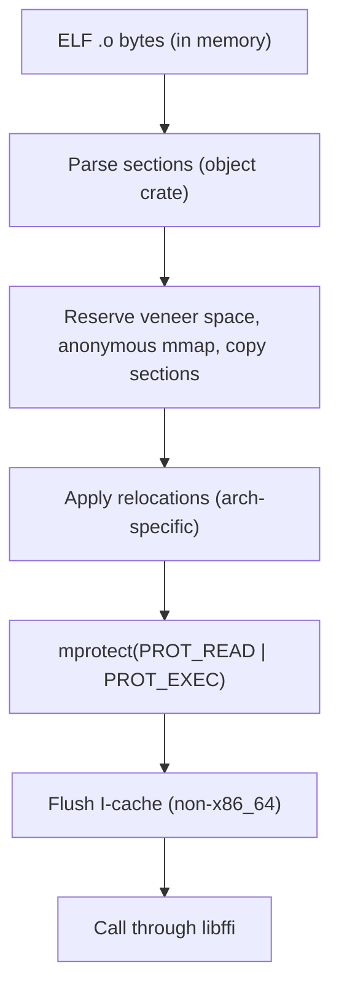

# ELF JIT लोडर

दोनों [CPU](./cpu.md) code paths memory में एक relocatable ELF object पर ख़त्म होते हैं —
process में libLLVM से, या stdin/stdout पर एक `clang -c` subprocess से। loader
(`runtime/src/jit_loader.rs`) disk को छुए बिना उन bytes को एक callable function में बदलता
है: यह sections parse करता है, उन्हें एक anonymous mapping में copy करता है, relocations
लागू करता है, pages को executable में बदलता है और entry pointer लौटाता है। कोई temporary
file नहीं, कोई `dlopen` नहीं, कोई linker नहीं।


```mermaid
flowchart TD
  A["ELF .o bytes (in memory)"] --> B["Parse sections (object crate)"]
  B --> C["Reserve veneer space, anonymous mmap, copy sections"]
  C --> D["Apply relocations (arch-specific)"]
  D --> E["mprotect(PROT_READ | PROT_EXEC)"]
  E --> F["Flush I-cache (non-x86_64)"]
  F --> G["Call through libffi"]
```

entry point `jit_load(object, name) -> (fn_ptr, mapping)` है; entry symbol `name` या `_name`
है। mapping तब तक जीवित रहती है जब तक उसका स्वामी `JitKernel` / `LlvmKernel` रहता है।

:::tip[Fallback mode]
`svod-runtime` का `dlopen-fallback` cargo feature C path के लिए loader को bypass करता है:
`clang -shared` एक temporary directory में `.so` लिखता है, जिसे `libloading` खोलता है। यह
धीमा है (disk I/O, dynamic linker) पर portable है, और CI इसे `test-dlopen-fallback` check
के रूप में चलाता है। LLVM path हमेशा in-memory loader उपयोग करता है।
:::

## समर्थित Architectures

| Architecture | Target triple | I-cache | टिप्पणियाँ |
|---|---|---|---|
| **x86_64** | `x86_64-none-unknown-elf` | Coherent | AMD64, Intel 64 |
| **aarch64** | `aarch64-none-unknown-elf` | `__clear_cache` | Apple Silicon, Ampere, Graviton |
| **riscv64** | `riscv64-none-unknown-elf` | `__clear_cache` | RV64I + M + A + F + D (`-march=rv64g`) |
| **loongarch64** | `loongarch64-none-unknown-elf` | `__clear_cache` | Loongson 3A5000+ |
| **ppc64le** | `powerpc64le-none-unknown-elf` | `__clear_cache` | ELFv2 ABI; instruction patching little-endian मानकर चलता है |

architecture run time पर `std::env::consts::ARCH` है; कोई compile-time feature flags नहीं
हैं। objects एक bare-metal `<arch>-none-unknown-elf` target के लिए compile होते हैं ताकि उनकी
कोई runtime dependencies न हों, PIC relocations के साथ। प्रति path compile flags
[CPU पेज](./cpu.md) पर हैं।

### Relocation समर्थन

loader हर architecture के लिए एक न्यूनतम ELF relocator implement करता है। यह उन relocation
types को संभालता है जो एक छोटे, self-contained compute कर्नेल के `-O2` object में वास्तव में
होते हैं — पूरा linker नहीं। बाकी कुछ भी एक साफ़ error है, कभी चुपचाप zero-write नहीं।

**x86_64** — PC-relative (`R_X86_64_PC32`, `PLT32`, `GOTPCRELX`, `REX_GOTPCRELX`, बिना GOT
के `S + A - P` के रूप में patched), absolute 32/64-bit (`R_X86_64_32`, `32S`, `64`)।

**aarch64** — 26-bit branches (`CALL26`, `JUMP26`), target ±128 MiB से आगे होने पर automatic
veneer generation के साथ, page-relative ADRP (`ADR_PREL_PG_HI21`), access-size shifts के
साथ 12-bit page offsets (`ADD_ABS_LO12_NC`, `LDST8/16/32/64/128_ABS_LO12_NC`)।

**riscv64** — Call pairs (`CALL`, `CALL_PLT`), state tracking के साथ PC-relative split
addressing (`PCREL_HI20` + `PCREL_LO12_I/S`), absolute (`HI20`, `LO12_I/S`), branches
(`BRANCH`, `JAL`), data (`32`, `64`)। Linker relaxation hints (`RELAX`) skip किए जाते हैं।

**loongarch64** — 26-bit branches (`B26`), page-aligned split addressing (`PCALA_HI20`,
`PCALA_LO12`), data (`32`, `64`)। Linker relaxation hints (`RELAX`) skip किए जाते हैं।

**ppc64le** — 24-bit branches (`REL24`), `.TOC.` symbol lookup के साथ TOC-relative
addressing (`TOC16_HA`, `TOC16_LO`, `TOC16_LO_DS`, `TOC16`, `TOC16_HI`), PC-relative
(`REL32`), absolute (`ADDR32`, `ADDR64`)।

## External Symbol Resolution

Undefined symbols load time पर `dlsym(RTLD_DEFAULT, name)` से resolve होते हैं। यह एक
सामान्य path है, दुर्लभ नहीं: `sqrt`, `fma`, `floor` और `rint` instructions में lower होते
हैं, लेकिन `exp`, `log`, `sin`, `cos`, `tan`, `pow`, `fmod` और `erf` object तक `libm` में
calls के रूप में पहुँचते हैं, चाहे वे C में `__builtin_*` के रूप में render हुए हों या IR में
`@llvm.*` intrinsics के रूप में। ऐसा symbol जिसे process export नहीं करता, उसका नाम बताते हुए
load error है।

### Branch Veneers (aarch64, x86_64)

aarch64 पर, `CALL26`/`JUMP26` एक PC-relative offset को 26 bits में encode करते हैं, ±128 MiB
की range; x86_64 पर `PC32`/`PLT32` ±2 GiB देते हैं। एक लंबे समय तक चलने वाला process अपना mmap
area ऊपर से नीचे भरता है, इसलिए एक anonymous JIT mapping अंततः `libm` आदि की पहुँच से बाहर
पहुँच जाती है।

जब एक direct branch नहीं पहुँच पाता, loader उसे mapping के अंत में एक reserved area में
एक **veneer** (branch trampoline) के माध्यम से route करता है:

```text
LDR X16, [PC, #8]   // load 64-bit target address
BR  X16              // indirect branch
.quad <address>      // full 64-bit address
```

x86_64 रूप `MOVABS $target, %r11` + `JMP *%r11` है, और यह केवल तब लिया जाता है जब patch
site से पहले का byte एक असली `call` (`E8`) या `jmp` (`E9`) opcode हो — एक out-of-range
RIP-relative data reference इसके बजाय स्पष्ट रूप से fail होता है। mapping allocate होने से पहले
हर unique undefined direct-branch symbol के लिए veneer space reserve किया जाता है, और veneers
target address के अनुसार deduplicate होते हैं, इसलिए एक symbol साझा करने वाले call sites एक
trampoline साझा करते हैं।

### Platform Register (aarch64)

macOS ARM पर, register `x18` platform register के रूप में आरक्षित है और kernel context
switch पर उसे clobber कर देता है। चूँकि objects bare-metal `aarch64-none-unknown-elf` target
के लिए compile होते हैं, compiler अन्यथा `x18` को एक free GPR मानता। clang paths
`-ffixed-x18` pass करते हैं और in-process path feature string में `+reserve-x18` जोड़ता है।
Linux ARM `x18` को एक साधारण GPR मानता है, और Windows ARM Svod द्वारा supported target नहीं है।

## Instruction Cache Coherence

x86_64 पर, instruction और data caches coherent हैं — memory में machine code लिखकर उस पर
jump करना बिना अतिरिक्त कदमों के काम करता है। हर दूसरे architecture पर loader `mprotect` के
बाद `__clear_cache(start, end)` call करता है ताकि instruction cache नया code देखे।

## कर्नेल call करना

entry pointer **libffi** के माध्यम से एक `KernelCif` (`runtime/src/dispatch.rs`) के साथ call
होता है, जो कर्नेल के ABI descriptors से बना है: प्रति storage parameter एक pointer, प्रति
scalar एक `i32`, `void` return। executor की `i64` values call पर `i32` में truncate होती हैं।
प्रति कर्नेल एक CIF ही वह चीज़ है जो हर कर्नेल को प्रति signature transmute के बिना अपनी arity
रखने देती है।

## Tests

`runtime/src/test/unit/jit_loader.rs` किसी भी host पर clang से छोटे C कर्नेल compile करता है
(एक no-op, buffers और vars, `__builtin_sqrtf`)। veneer tests — 2 GiB के पार routing, एक साझा
veneer, out-of-range non-branch relocation पर error — केवल x86_64 के लिए हैं, और far-call
execution test को अतिरिक्त रूप से Linux चाहिए। बाकी relocators के लिए उस hardware पर suite
चलाने के अलावा कोई समर्पित tests नहीं हैं।
