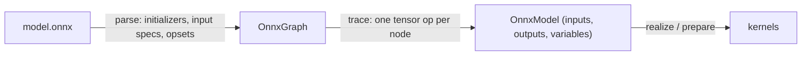

# ONNX इन्फ़रेंस

`svod-onnx` एक `.onnx` फ़ाइल को उसी लेज़ी टेंसर ग्राफ़ में बदलता है जो हाथ से लिखा
मॉडल बनाता है: हर ऑपरेटर `svod-tensor` ऑपरेशनों में विघटित होता है, इसलिए
इम्पोर्ट किया गया ग्राफ़ पूरे शेड्यूलर, ऑप्टिमाइज़र और कोड जनरेटर से गुज़रता है और
हर बैकएंड पर चलता है। नीचे कोई ONNX Runtime नहीं है।

| क्षमता | स्थिति |
|---|---|
| फ़ॉरवर्ड इन्फ़रेंस | समर्थित |
| ऑपरेटर | 200 में से 162 मानक ऑप ([पैरिटी तालिका](https://github.com/npatsakula/svod/blob/main/onnx/PARITY.md)) |
| अनुरूपता | 1357 ONNX backend node टेस्ट दोनों CPU बैकएंड (Clang, LLVM) पर पास होते हैं; जब `SVOD_DEVICE` AMD या CUDA चुनता है तो सूट उन पर भी चलता है |
| डायनामिक आयाम | इम्पोर्ट के समय बाँधे जाते हैं (देखें [डायनामिक आयाम](#dynamic-dimensions)) |
| Microsoft contrib ऑप | `Attention`, `RotaryEmbedding`, `SkipLayerNormalization`, `EmbedLayerNormalization`, `BiasGelu`, `FastGelu` |
| ट्रेनिंग / बैकवर्ड पास | समर्थित नहीं |

तालिका से बाहर के ऑपरेटर के लिए `ort` (C++ ONNX
Runtime का रैपर) पूरा स्पेसिफ़िकेशन कवर करता है।

---

## त्वरित शुरुआत

```toml
[dependencies]
svod-onnx   = "0.2"
svod-tensor = "0.2"
prost       = "0.14"            # ModelProto::decode
```

इम्पोर्टर के तीन प्रवेश बिंदु हैं:

| कॉल | Weights | इनपुट |
|---|---|---|
| `import(path, dim_bindings)` | Float initializers फ़ाइल से लेज़ी रूप से memory-map होते हैं; `data_location = EXTERNAL` फ़ाइल की डायरेक्टरी के सापेक्ष resolve होता है | बिना आवंटन वाले placeholders, जिन पर आप `assign` करते हैं |
| `import_model_with_inputs(proto, inputs, dim_bindings)` | डिकोड किए गए `ModelProto` से पढ़े जाते हैं | आपके अपने टेंसर, सीधे ग्राफ़ में trace किए जाते हैं |
| `import_model(proto, dim_bindings)` | डिकोड किए गए `ModelProto` से पढ़े जाते हैं | Placeholders, `import` की तरह |

तीनों एक `OnnxModel` लौटाते हैं:

```rust
pub struct OnnxModel {
    pub inputs: HashMap<String, Tensor>,      // graph inputs that are not initializers
    pub outputs: HashMap<String, Tensor>,     // lazy; nothing has run yet
    pub variables: HashMap<String, Variable>, // one per named dim_param
}
```

### रनटाइम इनपुट

इनपुट टेंसर खुद बनाएँ और उन्हें इम्पोर्टर को दें। ग्राफ़ उन्हीं पर
trace होता है, इसलिए आपके पास जो टेंसर हैं वही बफ़र हैं जिन्हें कर्नेल पढ़ते हैं:

```rust
use std::collections::HashMap;

use prost::Message;
use svod_onnx::parser::onnx::ModelProto;
use svod_onnx::{OnnxImporter, OnnxModel};
use svod_tensor::Tensor;

fn main() -> Result<(), Box<dyn std::error::Error>> {
    let proto = ModelProto::decode(std::fs::read("model.onnx")?.as_slice())?;

    // Same shape and dtype as the graph input "input"
    let image = Tensor::from_ndarray(&load_image_nchw());    // [1, 3, 224, 224] f32

    let OnnxModel { outputs, .. } = OnnxImporter::new().import_model_with_inputs(
        proto,
        HashMap::from([("input".to_string(), image.clone())]),
        &[("batch", 1)],
    )?;

    // Schedule every output together, run once
    Tensor::realize_batch(outputs.values())?;
    for (name, tensor) in &outputs {
        println!("{name}: {:?}", tensor.as_ndarray::<f32>()?);
    }
    Ok(())
}
```

`Tensor::from_ndarray` और `Tensor::from_raw_bytes(bytes, &dims, dtype)` ऐसा
टेंसर देते हैं जो घोषित shape के बफ़र का मालिक हो; `Tensor::from_slice`
हमेशा 1-D होता है, इसलिए reshape केवल इन्हीं में से किसी के ज़रिए करें।

### एक बार कंपाइल, बार-बार चलाना

बार-बार इन्फ़रेंस के लिए outputs को एक प्लान में कंपाइल करें और रनों के बीच नया डेटा
सीधे इनपुट बफ़र में लिखें:

```rust
let plan = Tensor::prepare_batch(outputs.values())?;   // schedule + compile, once
plan.execute()?;

for batch in batches {
    image.array_view_mut::<f32>()?.as_slice_mut().unwrap().copy_from_slice(&batch);
    plan.execute()?;                                   // replay: no tracing, no compilation
    let logits = outputs["output"].as_vec::<f32>()?;
}
```

`array_view_mut` इनपुट की host mapping पर एक zero-copy `ndarray` view है;
`prepare_batch` हर output टेंसर को प्लान के बफ़र से जोड़ता है, इसलिए `as_vec` /
`as_ndarray` नवीनतम रन का परिणाम पढ़ते हैं।

### Placeholder इनपुट

`import(path)` वह प्रवेश बिंदु है जो weights को memory-map करता है और
external data resolve करता है। इसके इनपुट placeholders हैं: उसी shape का मान `assign` करें
और इनपुट को outputs से *पहले* realize करें। Placeholder सभी plans में एक ही बफ़र रखता है, इसलिए prepare किया गया
प्लान बाद के `assign` + `realize` और `array_view_mut` से लिखा गया डेटा भी देखता है।

```rust
let OnnxModel { mut inputs, outputs, .. } = OnnxImporter::new().import("model.onnx", &[])?;

let input = inputs.remove("input").unwrap();
input.assign(&Tensor::from_ndarray(&image));
input.realize()?;
Tensor::realize_batch(outputs.values())?;
```

जिस मॉडल के सभी इनपुट initializers हैं, उसे इसमें से कुछ नहीं चाहिए:
`Tensor::realize_batch(model.outputs.values())?` उसे चला देता है।

---

## डायनामिक आयाम {#dynamic-dimensions}

नामित `dim_param` (`"batch"`, `"sequence_length"`) एक `Variable` बन जाता है जिसकी
सीमाएँ `(1, default_max_dim)` होती हैं; `default_max_dim` `OnnxImporter` का एक public
फ़ील्ड है और इसका डिफ़ॉल्ट 32767 है। बिना नाम का या शून्य-आकार का आयाम
1 बन जाता है।

हर डायनामिक आयाम को इम्पोर्ट के समय बाँधें। बँधा हुआ आयाम trace किए गए ग्राफ़ में
एक साधारण स्थिरांक होता है, इसलिए कर्नेल उसके लिए विशिष्ट हो जाते हैं:

```rust
let model = importer.import("model.onnx", &[("batch", 8), ("sequence_length", 512)])?;
println!("{:?}", model.inputs["input_ids"]);   // Tensor { shape: [8, 512], dtype: Scalar(Int64), .. }
```

जिस आयाम को आप नहीं बाँधते वह symbolic रहता है: उसका बफ़र
ऊपरी सीमा के लिए आवंटित होता है और `dims()` `SymbolicShape` के साथ विफल होता है (`Debug` output
`shape: symbolic` प्रिंट करता है)। `ExecutionPlan::execute_with_vars` के ज़रिए फिर से बाँधना
इम्पोर्ट किए गए ग्राफ़ के लिए समर्थित नहीं है — बँधा हुआ आयाम पहले से ही स्थिरांक है, और
न बँधा आयाम ऐसा कर्नेल कंपाइल करता है जो रनटाइम मान को अनदेखा करता है। कई
batch sizes सर्व करने के लिए हर size के लिए एक बार इम्पोर्ट करें, या `default_max_dim` कम करें ताकि न बँधे
बफ़र छोटे रहें। सीमा से बाहर की bindings इम्पोर्ट पर `IrConstruction` के साथ विफल होती हैं;
ऐसे नाम की binding जिसे मॉडल घोषित नहीं करता, अनदेखी की जाती है।

---

## इम्पोर्टर कैसे काम करता है



**Parse.** protobuf डिकोड होता है, initializers टेंसर बनते हैं, graph inputs
shape specs बनते हैं और हर domain का opset दर्ज होता है। `import` के ज़रिए, एक से अधिक
एलिमेंट वाला हर float initializer फ़ाइल में एक लेज़ी view होता है
(डिफ़ॉल्ट डिवाइस पर `SHRINK → BITCAST → RESHAPE → COPY`), इसलिए बड़े मॉडल
की कोई host कॉपी नहीं बनती; scalars स्थिरांकों में fold हो जाते हैं।

**Trace.** नोड्स topological क्रम में देखे जाते हैं और हर नोड अपने
टेंसर implementation पर dispatch होता है। परिणाम लेज़ी output टेंसरों का एक समूह है। कुछ
ऑपरेटर trace के समय एक *data* इनपुट पढ़ते हैं — `Reshape` का shape, `Tile` के
repeats, `TopK` का k, `Range`, `ConstantOfShape`, और opset 13 (`ReduceSum`) या 18 (बाकी) से
reductions का `axes` इनपुट — इसलिए ये छोटे
टेंसर इम्पोर्ट के दौरान realize होते हैं। जब इनमें से कोई graph input हो, तो उसे
`import_model_with_inputs` के ज़रिए दें।

### ऑपरेटर विघटन

लगभग पचास ऑपरेटर 1:1 किसी टेंसर मेथड से मैप होते हैं:

```rust
"Add"     => x.try_add(y)?
"Relu"    => x.relu()?
"Sigmoid" => x.sigmoid()?
"Equal"   => x.try_eq(y)?
```

कई वैकल्पिक attributes वाले ऑपरेटर टेंसर क्रेट के builders का उपयोग करते हैं:

```rust
x.conv()
    .weight(w)
    .maybe_bias(bias)
    .auto_pad(AutoPad::SameLower)
    .group(32)
    .maybe_dilations(Some(&[2, 2]))
    .call()?
```

बाकी बहु-चरणीय विघटन हैं। उदाहरण के लिए, `Mod` `fmod` attribute और इनपुट dtype के आधार पर
चार रूपों में से एक चुनता है; floating-point
Python-शैली की शाखा `x - floor(x / y) * y` है:

```rust
let div = x.try_div(y)?;
x.try_sub(&div.floor().try_mul(y)?)?
```

`floor()` पर `?` नहीं है: rounding ऑप, `cast`, `neg`, `abs`, `square`
और `sign` विफल नहीं हो सकते। `BitwiseAnd`/`Or`/`Xor`
और `BitShift` के पीछे के bitwise ऑपरेटर `try_bitand`, `try_bitor`, `try_bitxor`, `try_shl` और
`try_shr` हैं।

### Attributes और opsets

Attributes पढ़े जाते ही निकाल दिए जाते हैं — `attrs.int("axis", -1)`,
`attrs.float("epsilon", 1e-5)` — और कोई बचा हो तो `attrs.done()`
`UnhandledAttributes` लौटाता है, इसलिए जिस attribute को implementation भूल गया
वह चुपचाप गलत परिणाम के बजाय इम्पोर्ट त्रुटि बनता है।

ऑपरेटर अपने domain द्वारा इम्पोर्ट किए गए opset के अनुसार व्यवहार बदलते हैं: `Softmax` और
`LogSoftmax` का डिफ़ॉल्ट axis opset 13 से पहले `1` और 13 से `-1` है; `ReduceSum`
opset 13 से और बाकी reductions 18 से अपने axes इनपुट के रूप में लेते हैं।
`""` और `ai.onnx` domains एक ही opset साझा करते हैं।

### Transformer ऑपरेटर

`com.microsoft` contrib ऑपरेटर जिन्हें ONNX Runtime export करता है:

| ऑपरेटर | टिप्पणी |
|---|---|
| `Attention` | `mask_index` (1-D, 2-D या n-D), `unidirectional`, `qkv_hidden_sizes` और past KV cache के साथ packed QKV |
| `RotaryEmbedding` | Interleaved और non-interleaved |
| `SkipLayerNormalization` | Residual + LayerNorm; वैकल्पिक mean / inverse-std outputs शून्य होते हैं |
| `EmbedLayerNormalization` | Token + position + segment embeddings → LayerNorm; mask इनपुट अनदेखा होता है |
| `BiasGelu`, `FastGelu` | Fused bias + GELU |

मानक `ai.onnx` `Attention` grouped-query attention, causal
masking, past KV caching, softcap, हर `qk_matmul_output_mode`,
`softmax_precision`, `nonpad_kv_seqlen` और 3-D इनपुट का समर्थन करता है; इसके outputs
`[output, present_key, present_value, qk]` हैं।

---

## कंट्रोल फ़्लो और सीमाएँ

### `If` दोनों शाखाओं को trace करता है

trace के समय कुछ भी नहीं चलता, इसलिए `If` नोड की शर्त अज्ञात होती है।
इम्पोर्टर *दोनों* शाखाओं को trace करता है और उन्हें `where_` से मिलाता है:

```text
ONNX:   if condition { then_branch } else { else_branch }
Svod:   then_result.where_(&condition, else_result)
```

`where_` का अर्थ है "जहाँ शर्त सत्य हो वहाँ `self` रखो";
`condition.select(&a, &b)` वही ऑप है जिसे mask की ओर से लिखा गया है।
कंपाइल किया गया ग्राफ़ फिर किसी भी शर्त-मान को संभालता है, एक बाधा के साथ: दोनों
शाखाओं को समान shapes और dtypes देने चाहिए। shape-polymorphic `If`
इम्पोर्ट पर अस्वीकार किया जाता है।

### लागू नहीं किया गया

- `Loop` और `Scan`: पुनरावृत्त कंट्रोल फ़्लो को बार-बार trace करने या
  unrolling की ज़रूरत है। `RNN`, `GRU` और `LSTM` इसके बजाय native ऑप हैं; उनकी `direction`
  `W` के पहले आयाम से निकाली जाती है (`bidirectional` काम करता है, `reverse`
  forward चलता है) और `activations` तथा `clip` attributes अनदेखे होते हैं।
- ट्रेनिंग: कोई backward pass, gradients या optimizers नहीं।

| श्रेणी | उदाहरण | कारण |
|---|---|---|
| डायनामिक quantization | `QuantizeLinear`, `DequantizeLinear`, `DynamicQuantizeLinear` (`QLinearConv`, `QLinearMatMul`, `ConvInteger` और `MatMulInteger` लागू हैं) | अभी port नहीं हुए |
| Sequence ऑप | `SequenceConstruct`, `SequenceAt` | non-tensor टाइप टाइप सिस्टम से बाहर हैं |
| Random | `RandomNormal`, `RandomUniform`, `Bernoulli` | ग्राफ़ में stateful RNG नहीं है |
| सिग्नल प्रोसेसिंग | `DFT`, `STFT`, `MelWeightMatrix` | इम्पोर्टर से जुड़े नहीं हैं (टेंसर क्रेट में `stft` / `istft` / `mel_spectrogram` हैं) |
| टेक्स्ट | `StringNormalizer`, `TfIdfVectorizer` | string टाइप नहीं है |

---

## डिबगिंग

**हर नोड का tracing।** `trace` स्तर पर इम्पोर्टर हर नोड के
output को trace होते ही realize करता है और उसका shape और पहले पाँच मान लॉग करता है — गलत परिणाम देने वाले
मॉडल के लिए एक संख्यात्मक bisection टूल। यह फ़्यूज़न तोड़ता है, इसलिए
इसे केवल डिबगिंग के लिए उपयोग करें, और अपनी binary में `EnvFilter` के साथ एक
`tracing-subscriber` इंस्टॉल करें:

```bash
RUST_LOG=svod_onnx::importer=trace cargo run
```

Tracing इम्पोर्ट कॉल के अंदर होता है, इसलिए असली इनपुट मान तभी दिखते हैं जब
इनपुट `import_model_with_inputs` के ज़रिए दिए गए हों; placeholder इनपुट
खाली बफ़र के रूप में trace होते हैं।

**ग्राफ़ की जाँच।** `Tensor` का `Debug` shape, dtype, डिवाइस और
realization स्थिति प्रिंट करता है, डेटा कभी नहीं:

```rust
let model = importer.import("model.onnx", &[])?;
for (name, tensor) in &model.inputs {
    println!("input {name}: {tensor:?}");
}
println!("outputs:   {:?}", model.outputs.keys().collect::<Vec<_>>());
println!("variables: {:?}", model.variables);
```

**कर्नेल का श्रेय।** इम्पोर्टर द्वारा बनाया गया हर कर्नेल अपने ONNX
नोड को अपने origin के रूप में दर्ज करता है, इसलिए प्रोफ़ाइलर हर नोड का डिवाइस समय बताता है — देखें
[कर्नेल origins](./architecture/kernel-origins)।

---

## सारांश

| पहलू | विवरण |
|---|---|
| **प्रवेश बिंदु** | `import(path, dims)`, `import_model_with_inputs(proto, inputs, dims)`, `import_model(proto, dims)` |
| **रनटाइम इनपुट** | टेंसर बनाएँ, उन्हें `import_model_with_inputs` को दें, रनों के बीच `array_view_mut` के ज़रिए लिखें |
| **डायनामिक आयाम** | इम्पोर्ट पर बाँधें: `&[("batch", 8)]`; हर batch size के लिए एक इम्पोर्ट |
| **ऑपरेटर** | 200 में से 162 ([पैरिटी तालिका](https://github.com/npatsakula/svod/blob/main/onnx/PARITY.md)) |
| **अनुरूपता** | Clang और LLVM पर 1357 node टेस्ट; `SVOD_DEVICE` के ज़रिए AMD और CUDA |
| **एक्सटेंशन** | com.microsoft `Attention`, `RotaryEmbedding`, `SkipLayerNormalization`, `EmbedLayerNormalization`, `BiasGelu`, `FastGelu` |
| **सीमाएँ** | ट्रेनिंग नहीं, `Loop` / `Scan` नहीं, shape-polymorphic `If` नहीं, डायनामिक आयामों का रनटाइम पर फिर से बाँधना नहीं |

**आगे:** इन मॉडलों के ग्राफ़ के लिए [टेंसर API](./examples), या
native ports के लिए [मॉडल चलाना](./models)।
