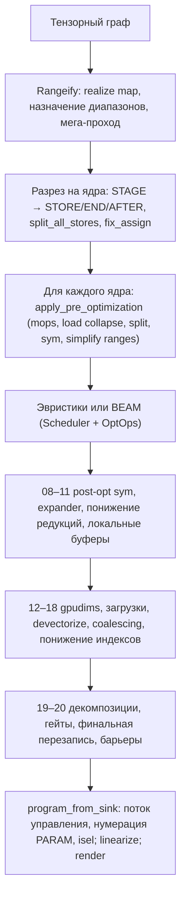

# Пайплайн кодогенерации

Тензорное выражение доходит до железа через четыре части кода; все они, кроме последнего шага, находятся в крейте `svod-schedule`:

| Часть | Точка входа | Вход → выход |
|-------|-------------|----------------|
| Rangeify | `rangeify_with_map` (`rangeify/transforms.rs`) | Тензорный граф с операциями перемещения → граф из `STAGE` / `INDEX` / `REDUCE` с явными `RANGE` |
| Разрез на ядра | `try_get_kernel_graph` (`rangeify/kernel.rs`) | `STAGE` → `STORE`/`END`/`AFTER`, разбиение на один `CALL` на ядро |
| Оптимизация ядра | `optimize_kernel_with_naming` / `beam_search_cached_remote` (`optimizer/`) | AST ядра → оптимизированный AST ядра (`apply_pre_optimization`, эвристики или BEAM, `apply_post_optimization_configured_with_capture`) |
| Граница программы | `program_from_sink` + `do_linearize` (`svod-codegen`, `program_pipeline.rs`) | AST ядра → рёбра потока управления → линейный список инструкций → исходный код / бинарник |

`tensor/src/realize.rs` связывает их в цепочку: `rangeify_with_map` → `try_get_kernel_graph` → для каждого ядра `optimize_kernel_with_naming` (или BEAM) → `program_from_sink` → `do_linearize` → `do_render` → компиляция.

Каждый проход — это `graph_rewrite` поверх матчера `patterns!` (см. [движок паттернов](../optimizations/pattern-system.md)); немногочисленные исключения (`memory_coalescing`, `merge_register_read_ends`, `linearize`) — обычные обходы графа. Матчеры работают до неподвижной точки, после чего начинается следующий проход.

## Словарь

- **UOp** — один хеш-консируемый узел (`Arc<UOp>`): операция, dtype, источники. Одинаковые поддеревья — это один и тот же указатель, поэтому `Arc::ptr_eq` означает структурное равенство.
- **RANGE** — переменная цикла `[0, end)`. Её `AxisType` определяет, как она исполняется: `Weak` (ещё не классифицирована), `Loop`, `Global`/`Thread` (сетка / ядро CPU), `Warp`, `Local` (рабочая группа), `GroupReduce`, `Reduce`, `Upcast`, `Unroll`, `Device` (привязывается при запуске). `AxisType::priority()` упорядочивает их от внешних к внутренним: Device −2, Weak/Loop −1, Global/Thread 0, Warp 1, Local/GroupReduce 2, Upcast 3, Reduce 4, Unroll 5 (`ir/src/types.rs`).
- **END(x, ranges)** закрывает диапазоны; **AFTER(buf, deps)** упорядочивает чтение буфера после `deps`; **STAGE(compute, ranges, opts)** означает «материализовать это в буфер» — до того, как разрез на ядра решит, делать ли это.
- **STACK** собирает линии (lanes) в значение с формой; **INDEX(STACK(..), c)** выбирает одну из них. Отдельной векторной операции нет.
- **WeakInt** — dtype индексов, пока `pm_lower_index_dtype` не зафиксирует его как `i32`/`i64`.
- **Invalid** (`UOp::invalid_marker()`) — сигнальное значение выхода за границы; валидность едет внутри индекса как `WHERE(valid, idx, Invalid)`, пока поздний проход гейтов не перенесёт её на LOAD/STORE.

## Карта проходов

Номера — это метки, которые `apply_post_optimization_configured_with_capture` печатает при `SVOD_PER_STAGE_UOPS=1`; они совпадают с `SVOD_DUMP_STAGE=<prefix>`. У проходов до оптимизатора номера нет — они видны в выводе `tracing` и в `scripts/extract-ir.sh`.

| Метка | Матчер / функция | Страница |
|-------|--------------------|------|
| — | `multi_pm`, `add_tags_patterns`, `resolve_calls`, `movement_op_patterns + early_rewrites + split_reduceop_patterns` (снизу вверх) | [Rangeify](./rangeify.md) |
| — | `run_rangeify` (`pm_generate_realize_map`, `assign_ranges`, `apply_rangeify_patterns`) | [Rangeify](./rangeify.md) |
| — | мега-проход: `symbolic + pm_reduce_simplify + movement_op_patterns + buffer_folding + dead_axis_removal + pm_remove_bufferize` | [Rangeify](./rangeify.md) |
| — | `kernel_graph_pre_cut` (`pm_add_buffers_patterns`, `pm_flatten_range`), `split_all_stores`, `fix_assign` | [Rangeify](./rangeify.md) |
| — | `apply_pre_optimization`: `movement_op_patterns` (снизу вверх), `pm_load_collapse`, `pm_split_ranges + pm_flatten_range`, `sym + pm_fold_cast_const + pm_flatten_range`, `pm_flatten_range + pm_simplify_ranges` | [Rangeify](./rangeify.md) |
| — | `hand_coded_optimizations` или BEAM | [Поиск ядер](../optimizations/kernel-search.md) |
| `08-post_opt_sym` | `POST_OPT_SYM = sym + pm_move_where_on_load + pm_flatten_range + pm_reduce_unparented` | [Expander](./expander.md) |
| `09-pre_expand` | `expander2 + pm_flatten_range + mop_cleanup_patterns` | [Expander](./expander.md) |
| `10-pm_reduce` | `movement_cleanup_patterns + pm_reduce_local` | [Expander](./expander.md) |
| `11-local_buffers` | `pm_add_local_buffers` | [Expander](./expander.md) |
| `12-pm_add_gpudims` | `pm_lower_device_ranges`, затем `pm_add_gpudims`, если `has_local || has_threads` | [Devectorizer](./devectorizer.md) |
| `13-pm_add_loads` | `symbolic_simple + pm_expand_broadcast + pm_add_loads` | [Devectorizer](./devectorizer.md) |
| `14-devectorize` | `symbolic_simple + devectorize_patterns + bool_storage_patterns + indexing_simplify` | [Devectorizer](./devectorizer.md) |
| `15-early_symbolic` | `sym` | [Devectorizer](./devectorizer.md) |
| `16-memory_coalescing` | `memory_coalescing` (обход графа) | [Devectorizer](./devectorizer.md) |
| `17-bottom_up_ew_image` | `symbolic_simple + no_vectorized_alu + pm_simplify_add_image` (снизу вверх) | [Devectorizer](./devectorizer.md) |
| `16-extra_symbolic` | `sym + indexing_simplify` | [Devectorizer](./devectorizer.md) |
| `17-pm_lower_index_dtype` | `symbolic_simple + pm_fold_cast_const + pm_lower_index_dtype + indexing_simplify` | [Devectorizer](./devectorizer.md) |
| `18-final_symbolic` | `symbolic` | [Devectorizer](./devectorizer.md) |
| `19-cast_float_alu` | `pm_cast_float_alu` | [Linearizer](./linearizer.md) |
| `19b-early_decompositions` | `early_decomposition_patterns(supported_ops)` | [Linearizer](./linearizer.md) |
| `19c-dtype_decompositions` | `pm_dtype_decomp_commit` (эмуляция FP8 / f16 / bf16 / i64) | [Linearizer](./linearizer.md) |
| `19d-late_decompositions` | `early + get_late_rewrite_patterns + get_transcendental_patterns (+ renderer.decomposition_matcher)` | [Linearizer](./linearizer.md), [Снижение стоимости операций](../optimizations/strength-reduction.md) |
| `19e-move_gates_from_index` | `pm_move_gates_from_index`, `pm_scalarize_register_stack_index_preserve_deps`, `merge_register_read_ends`, `demote_unsupported_floats` | [Linearizer](./linearizer.md) |
| `20-final_rewrite` | `pm_commit_weak + pm_cast_weak + pm_decomp (+ extra_matcher) + pm_split_ends`, затем `pm_remove_invalid`, `add_implicit_barriers` | [Linearizer](./linearizer.md) |
| — | `add_control_flow`, `number_params`, `pre_isel_matcher`/`isel_matcher`, `linearize`, `line_rewrite_cleanups` | [Linearizer](./linearizer.md) |

Две метки повторяются (`16`, `17`): диагностика использует приведённые выше имена дословно, поэтому `SVOD_DUMP_STAGE=16` печатает и `16-memory_coalescing`, и `16-extra_symbolic`.

:::tip[Откуда берутся номера стадий]
Метки следуют списку стадий из `codegen/__init__.py` в Tinygrad, чтобы их было удобно сопоставлять. Они не идут подряд и не соответствуют порядку страниц: `10-pm_reduce` понижает редукции *до* `11-local_buffers`, а понижение индексов — это `17`, а не `15`.
:::

## Дамп IR

| Переключатель | Эффект |
|--------|--------|
| `SVOD_PER_STAGE_UOPS=1` | Печатать `[per-stage] <label> : node_count=N` после каждой post-opt стадии |
| `SVOD_DUMP_STAGE=<prefix>` | Дополнительно печатать `UOp::tree()` для каждой метки, начинающейся с префикса (`09`, `19` или пустая строка для всех) |
| `SVOD_DUMP_CANONICAL_STAGE=<prefix>` | Тот же поиск по префиксу, канонический JSON, не зависящий от аллокаций (инструменты паритета) |
| `SVOD_DUMP_LINEAR=<dir>` | Записывать `tree_<id>.txt` / `linear_<id>.txt` из `do_linearize` |
| `RUST_LOG=svod_schedule::optimizer=debug` (JSON-подписчик) | Те же деревья как поля `tracing`; `scripts/extract-ir.sh <test> -p <crate>` собирает деревья rangeify, pre-opt и post-opt в один файл |
| `SVOD_SPEC=0` | Пропустить проверку типов `spec` на границах pre-opt, final-symbolic и программы |

`UOp::tree()` печатает `[id] OP : dtype shape=[..]` с символами `├── `/`│   `/`└── ` и `[id] → (see above)` для уже напечатанного узла — хеш-консинг делает общие поддеревья видимыми. [Разобранный пример](./worked-example.md) показывает полный вывод для одного ядра.
