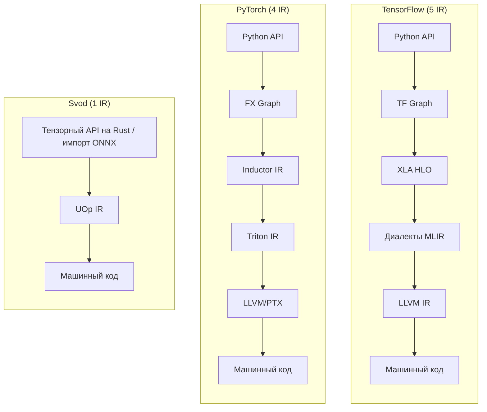
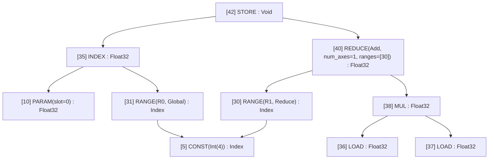
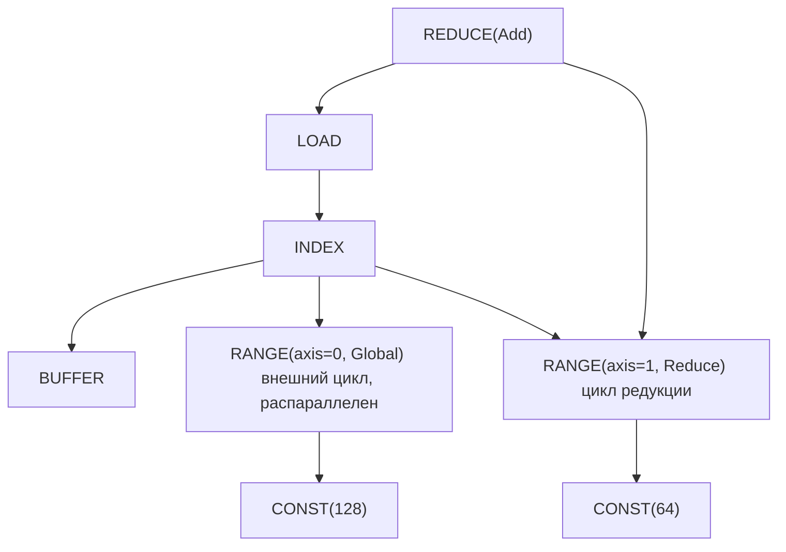
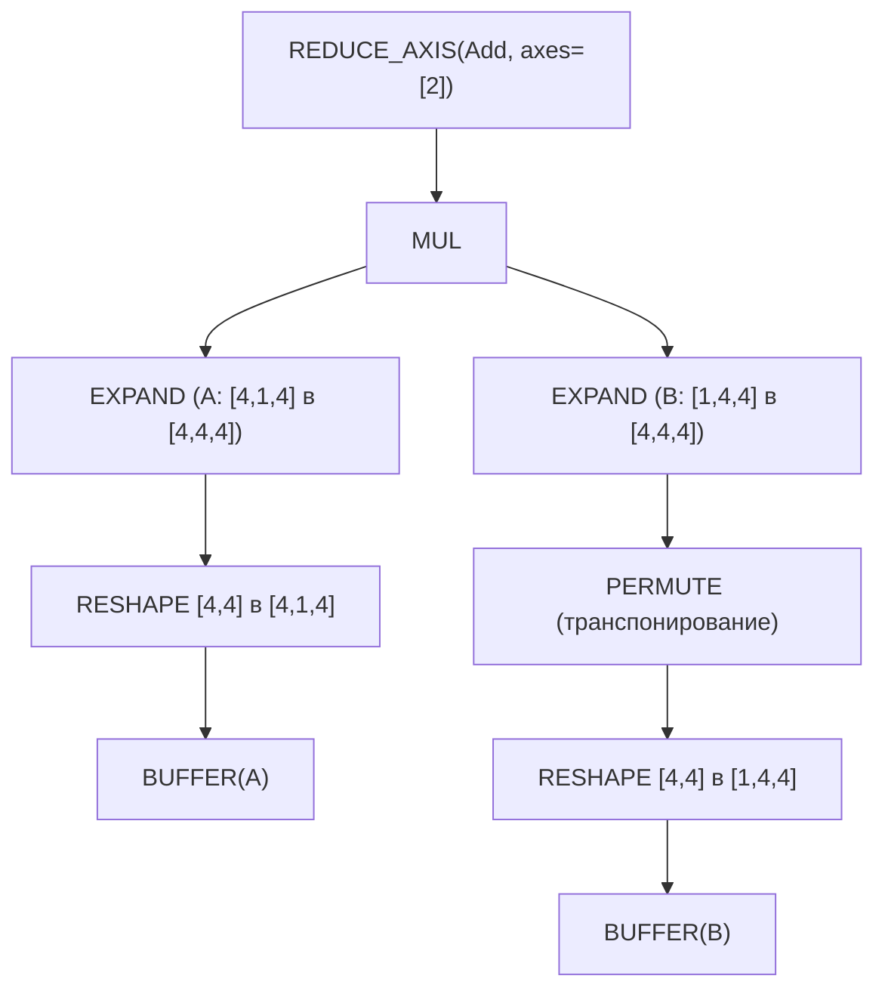
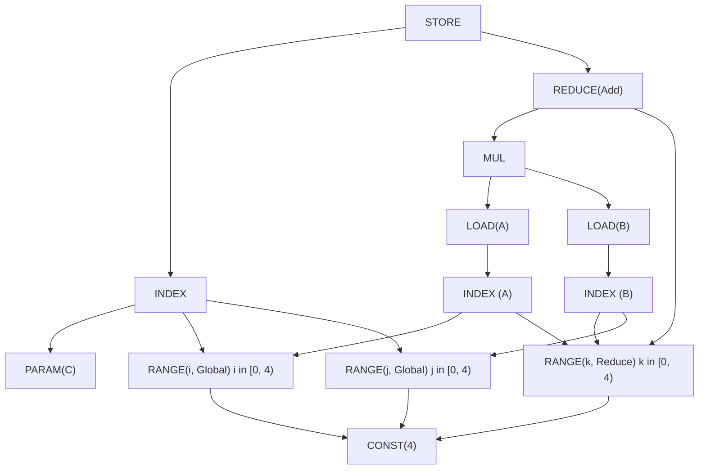

# Один IR, чтобы править всеми

Вы отлаживаете медленную модель. Профилировщик сообщает «ядро X занимает 200 мс», но вы понятия не имеете, что ядро X на самом деле *делает*. Вы проходите через диспетчер PyTorch, затем ATen, затем TorchInductor, затем Triton IR и наконец оказываетесь в LLVM IR. Пять разных представлений, пять разных ментальных моделей, пять разных инструментов отладки.

Такова реальность современной компиляции ML. У XLA из TensorFlow похожая история: Python → Graph → XLA HLO → MLIR → LLVM IR. Каждый слой добавлялся, чтобы решить реальную проблему, но накопленная сложность поражает.

Svod идёт другим путём, заимствованным у [Tinygrad](https://github.com/tinygrad/tinygrad): **один IR от тензоров до машинного кода**.



Самая простая архитектура часто побеждает. В этой главе объясняется, как один тщательно спроектированный IR может заменить целый стек компилятора.

---

## UOp: универсальный узел {#uop-the-universal-node}

**UOp** (микрооперация) — это узел графа вычислений. Но в отличие от узлов других IR, UOp может представлять операции на *любом* уровне абстракции — от высокоуровневых reshape тензоров до отдельных инструкций CPU.

Ключевая идея: вместо отдельных IR для «тензорных операций», «структуры циклов» и «доступа к памяти» мы помещаем всё это в одно перечисление (`ir/src/op.rs`):

```rust
pub enum Op {
    // High-level tensor operations
    Reshape { src: Arc<UOp>, new_shape: Arc<UOp> },
    Permute { src: Arc<UOp>, axes: Vec<usize> },
    ReduceAxis { src: Arc<UOp>, reduce_op: ReduceOp, axes: Vec<usize> },

    // Loop-level control flow
    Range { end: Arc<UOp>, axis_id: AxisId, axis_type: AxisType, deps: SmallVec<[Arc<UOp>; 2]> },
    End { computation: Arc<UOp>, ranges: SmallVec<[Arc<UOp>; 4]> },

    // Memory operations (the buffer is reached through the INDEX, not a field)
    Load { index: Arc<UOp>, alt: Option<Arc<UOp>>, gate: Option<Arc<UOp>> },
    Store { index: Arc<UOp>, value: Arc<UOp>, gate: Option<Arc<UOp>> },

    // ALU operations (grouped enums with many individual values)
    Binary(BinaryOp, Arc<UOp>, Arc<UOp>),  // Add, Mul, etc.
    Unary(UnaryOp, Arc<UOp>),              // Sqrt, Exp, etc.
    Ternary(TernaryOp, Arc<UOp>, Arc<UOp>, Arc<UOp>),  // Where, MulAcc, etc.

    // Compilation stages are nodes too
    Program { sink: Arc<UOp>, info: Box<ProgramInfo>, linear: Option<Arc<UOp>>, source: Option<Arc<UOp>>, binary: Option<Arc<UOp>> },
    // ... 60 variants in all
}
```

Перечисление содержит 60 вариантов, сгруппированных по уровню абстракции (около 100 операций, если считать отдельные виды `UnaryOp`/`BinaryOp`/`TernaryOp`); каждый описан в [бестиарии операций](./op-bestiary.md):

| Категория | Примеры | Что представляет |
|----------|----------|-------------------|
| **Перемещение** | `RESHAPE`, `PERMUTE`, `EXPAND`, `PAD` | Преобразования формы тензора |
| **Редукция** | `REDUCE_AXIS`, `REDUCE` | Математические агрегации |
| **Управление** | `RANGE`, `END`, `IF`, `BARRIER` | Структура циклов и ветвлений |
| **Память** | `LOAD`, `STORE`, `INDEX`, `BUFFER` | Аппаратный доступ к памяти |
| **ALU** | `ADD`, `MUL`, `SQRT`, `EXP`, `WHERE` | Инструкции CPU/GPU |
| **Вызовы** | `CALL`, `FUNCTION`, `PROGRAM`, `LINEAR`, `SOURCE` | Ядра и стадии их компиляции |
| **Продвинутые** | `WMMA` | Тензорные ядра и метаданные их развёртки |

Если напечатать граф UOp через `uop.tree()`, вы увидите его структуру в виде ASCII-дерева:



Текстовая форма использует символы `├── `, `│   ` и `└── `, подписывает каждый узел как `[id] NAME : dtype shape=[...]` и печатает уже встречавшийся узел как обратную ссылку. Самый маленький реальный пример, `1.0 + 1.0`:

```text
[1] Add : Scalar(Float32) shape=[]
├── [0] CONST(Float(1.0)) : Scalar(Float32) shape=[]
└── [0] → (see above)
```

Оба операнда — узел `[0]`. Это не просто красивая печать — это фундаментальное свойство, называемое **hash consing**.

---

## Hash consing: структурное разделение {#hash-consing-structural-sharing}

Когда вы дважды создаёте одно и то же выражение в Svod, вы получаете *тот же указатель*. Не равные значения — тот же адрес в памяти.

```rust
let a = x.try_add(&y)?;
let b = x.try_add(&y)?;

assert!(Arc::ptr_eq(&a.uop(), &b.uop()));  // Same pointer!
```

:::note[Происхождение входит в идентичность узла]
С `SVOD_ORIGIN=1` каждый узел также несёт `OriginScope`, в котором он был построен, и этот
scope входит в его хеш содержимого. Два одинаковых подграфа, построенные в разных scope,
становятся *разными* узлами и не разделяются, пока разрез на ядра не удалит происхождение.
Исключение — узлы, непрозрачные для происхождения: `CONST`, `VCONST`, `BUFFER`, `PARAM`,
`UNIQUE`, `LUNIQUE`, `STACK`, `BIND`, `DEFINE_VAR`, `NOOP` и всё с dtype `Index` — два scope
строят одну и ту же константу независимо, так что происхождение там лишь расщепило бы узел,
который разрез всё равно сольёт обратно. См.
[Происхождение ядер](./kernel-origins.md#costs-and-trade-offs).
:::

Таблица интернирования (`ir/src/uop/hash_consing.rs`) — это lock-free `papaya::HashMap`, ключи которой хранят заранее вычисленный структурный хеш и `Weak<UOp>`, поэтому узел без ссылок покидает таблицу, когда освобождается его последний `Arc`, а не утекает:

```rust
// Simplified from ir/src/uop/hash_consing.rs
struct InternKey { hash: u64, node: Weak<UOp> }
static UOPS: OnceLock<papaya::HashMap<InternKey, (), PrecomputedHash>>;

pub fn new(op: Op, dtype: DType) -> Arc<Self> {
    let hash = xxh64(&(dtype, &op, origin::current()));
    if let Some(existing) = UOPS.get_key_value(&Probe { hash, op: &op, dtype, .. })
        .and_then(|(key, _)| key.node.upgrade())
    {
        return existing;                       // same structure → same Arc
    }
    let node = Arc::new(UOp { op, dtype, .. });
    UOPS.compute(InternKey { hash, node: Arc::downgrade(&node) }, /* abort if a racing thread inserted first */);
    node
}
```

Почему это важно для ML-инженеров?

- **Равенство указателей — это семантическое равенство.** Чтобы проверить, идентичны ли два подвыражения, достаточно сравнить указатели: `Arc::ptr_eq(&a, &b)`. Обход дерева не нужен.

- **Сопоставление паттернов за O(1).** Когда оптимизатор спрашивает «видел ли я этот паттерн раньше?», сравнение указателей даёт мгновенный ответ.

- **Эффективность по памяти.** Общие подвыражения (например, разделяемые вычисления в attention, графы градиентов) хранятся один раз, а не дублируются.

- **Потокобезопасность.** Одно и то же вычисление из разных потоков даёт один и тот же объект — никаких ошибок синхронизации.

Вывод дерева это показывает: когда вы видите `[10] → (see above)`, это не копия — это *тот же узел*, на который ссылаются из нескольких мест.

---

## Явные циклы: операция `RANGE` {#explicit-loops-the-range-operation}

Большинство IR для ML прячут циклы внутри операций. В ONNX редукция выглядит так:

```python
ReduceSum(data, axes=[1], keepdims=0)
```

Где цикл? Он неявный — где-то внутри реализации `ReduceSum` в рантайме. Его нельзя увидеть, нельзя изменить, о нём нельзя рассуждать.

Svod делает циклы *явными* с помощью операций `RANGE`. Та же редукция превращается в:



У каждого `RANGE` есть **AxisType**, который сообщает оптимизатору и кодогенератору, как его компилировать:

| AxisType | Приоритет | Во что опускается | Смысл |
|----------|----------|------------|---------|
| **Placeholder** | -3 | — | Временный канонический range, используемый при кешировании опускания RESHAPE |
| **Device** | -2 | привязка к устройству при запуске | Ось устройств мультиустройственного тензора |
| **Weak** | -1 | последовательный цикл `for` | Нераспараллеленный range; значение по умолчанию после rangeify, из которого выбирает оптимизатор |
| **Loop** | -1 | последовательный цикл `for` | Явный обычный цикл |
| **Global** | 0 | `gidx` (`SPECIAL`) | Измерение сетки GPU |
| **Thread** | 0 | `gidx` (`SPECIAL`) по пулу потоков | Параллелизм на CPU |
| **Warp** | 1 | ведущее локальное измерение | Аппаратная линия (фрагменты тензорных ядер) |
| **Local** | 2 | `lidx` (`SPECIAL`) | Измерение рабочей группы GPU |
| **GroupReduce** | 2 | локальное измерение + стадия в разделяемой памяти | Двухстадийная редукция |
| **Upcast** | 3 | векторные линии (`STACK`) | Векторизация |
| **Reduce** | 4 | цикл аккумулятора | Измерение редукции |
| **Unroll** | 5 | развёрнутые копии | Развёртка цикла |

Приоритет задаёт порядок вложенности циклов — меньшие значения соответствуют внешним циклам. `RANGE` с `AxisType::Global` становится `blockIdx.x` на CUDA; `RANGE` с `AxisType::Local` становится `threadIdx.x`; тот же range `Global` на CPU был бы единицей работы, которую раздаёт пул потоков. Оптимизатор меняет тип range (`Weak` → `Upcast`, `Weak` → `Local`, …), и это единственное поле решает, как скомпилируется цикл.

Почему явные циклы важны:

- **Оптимизация видна.** Вы *видите*, какие циклы будут распараллелены, какие развёрнуты, какие используют SIMD.

- **Планирование — это перезапись графа.** Изменение порядка циклов, тайлинг или развёртка — просто преобразование паттернами, без отдельного «прохода планирования».

- **Один IR на каждой стадии.** `RANGE`, представляющий «итерацию по измерению батча» на уровне тензоров, — это *тот же* `RANGE`, который становится `for (int i = 0; i < N; i++)` в сгенерированном коде.

---

## Перезапись графа: один механизм преобразований {#graph-rewriting-one-transformation-mechanism}

В традиционных компиляторах десятки специализированных проходов: свёртка констант, удаление мёртвого кода, развёртка циклов, слияние операторов. У каждого прохода своя логика, свои структуры данных, свои баги.

Svod использует один механизм: **перезапись графа на основе паттернов**, записанную на DSL `patterns!` и применяемую функцией `graph_rewrite`:

```rust
patterns! {
    // Identity folding: x + 0 → x
    Add[x, @zero] => x,

    // Constant folding: 3 + 4 → 7
    Add(a @const(a_val), _b @const(b_val))
        => eval_add(a_val, b_val).map(|r| UOp::const_(a.dtype(), r)),

    // Self-folding: x // x → 1
    FloorDiv(x, x) => 1.into_uop(x.dtype()),

    // Dead code: if(true) { x } else { y } → x
    Where(Const(ConstValue::Bool(true)), t, _f) => t,
}
```

`[x, y]` — коммутативное сопоставление, `(x, y)` — упорядоченное, `@zero`/`@one` сопоставляются с константой любого dtype, `c @const(val)` связывает значение, повторённое имя (`x, x`) требует один и тот же узел, а правая часть возвращает `Arc<UOp>`, `Option<Arc<UOp>>` (`None` означает отказ) или `RewriteResult`. Рабочие правила выглядят так же, но содержат условия (настоящее правило `x + 0` отказывается для `-0.0`); полный синтаксис — в главе [Движок паттернов](./optimizations/pattern-system.md).

`graph_rewrite` сначала обходит дочерние узлы (post-order), применяет матчер к каждому перестроенному узлу и повторно применяет его к каждой замене, пока узел не достигнет неподвижной точки; результаты мемоизируются для каждого узла:

```text
Original:       Add(Mul(x, 1), 0)
After Mul:      Add(x, 0)         # Mul(x, 1) → x
After Add:      x                 # Add(x, 0) → x
```

(`graph_rewrite_bottom_up`, как ни странно, — это *другой* режим: он применяет паттерны до спуска, поэтому они видят исходные дочерние узлы — именование из Tinygrad.)

Этот единственный механизм отвечает за:

- **Алгебраическое упрощение** — свёртка констант, удаление тождеств
- **Преобразование rangeify** — операции перемещения → явные циклы
- **Оптимизацию ядер** — векторизация, развёртка, тензорные ядра
- **Кодогенерацию** — опускание до аппаратных примитивов

Те же паттерны, тот же движок, разные наборы паттернов для каждой стадии.

---

## Разбор на примере: путь matmul {#worked-example-matmul-journey}

Проследим `C = A @ B` (умножение матриц 4×4) через весь пайплайн.

### Стадия 1: Построение тензоров {#stage-1-tensor-construction}

Когда вы пишете `A.matmul(&B)?`, Svod приводит оба операнда к общему рангу через reshape, транспонирует `B`, перемножает (broadcast вставляет `EXPAND`) и суммирует по последней оси:



Это чистая математика: «расширить A и B, чтобы выровнять измерения, перемножить поэлементно, просуммировать по свёртываемой оси».

### Стадия 2: Rangeify {#stage-2-rangeify}

Проход rangeify превращает операции перемещения (`EXPAND`, `PERMUTE`, `RESHAPE`) в явные вычисления индексов с циклами `RANGE`:



Теперь видна структура циклов: `i` и `j` — выходные range (rangeify создаёт их как `Weak`; на GPU оптимизатор повышает их до `Global`), `k` — `Reduce` (накапливаемый).

### Стадия 3: Символьное упрощение {#stage-3-symbolic-simplification}

Перезаписи паттернами убирают избыточные операции, сворачивают константы и упрощают индексную арифметику.

### Стадия 4: Кодогенерация {#stage-4-code-generation}

Итоговый IR напрямую транслируется в циклы:

```c
// GPU kernel (conceptual)
__global__ void matmul(float* C, float* A, float* B) {
    int i = blockIdx.x;   // from RANGE(i, Global)
    int j = blockIdx.y;   // from RANGE(j, Global)
    float acc = 0.0f;
    for (int k = 0; k < 4; k++) {  // from RANGE(k, Reduce)
        acc += A[i*4 + k] * B[k*4 + j];
    }
    C[i*4 + j] = acc;
}
```

Главное наблюдение: **структура видна на каждой стадии**. Нет магического прохода слияния, который превращает три вложенных цикла в нечто неузнаваемое. Структура `RANGE`, которую вы видите на стадии 2, — это ровно то, что становится циклами на стадии 4. Страница [Пайплайн выполнения](./pipeline.md) прослеживает то же ядро через планирование, кеширование и выполнение.

---

## Сравнение: чем отличаются другие IR {#comparison-how-other-irs-differ}

Разные IR идут на разные компромиссы. Вот как они соотносятся:

| Аспект | ONNX | XLA HLO | Triton | **Svod** |
|--------|------|---------|--------|-----------|
| **Назначение** | Обмен моделями | Оптимизация бэкенда | DSL для ядер GPU | Полная компиляция |
| **Операторы** | ~200 высокоуровневых | ~100–150 высокоуровневых | Операции над тайлами | 60 многоуровневых |
| **Модель циклов** | Неявная | Неявная | На основе тайлов | **Явный `RANGE`** |
| **Память** | Чистые значения | Чистые значения → буферы | Явные указатели | **Явные `LOAD`/`STORE`** |
| **Оптимизация** | Нет | Специализированные проходы | Паттерны MLIR | **Единая перезапись** |
| **Цели** | Движки рантайма | CPU/GPU/TPU | Только GPU | CPU/GPU |

**ONNX** максимизирует переносимость. Операции вроде `Conv` и `MatMul` скрывают все детали реализации. Отлично для обмена моделями, но нельзя оптимизировать то, чего не видишь.

**XLA HLO** функционален и чист — никаких побочных эффектов, неизменяемые тензоры. Это открывает алгебраические оптимизации, но требует отдельной фазы «назначения буферов» перед кодогенерацией. Переход от HLO к LMHLO (на основе буферов) — фундаментальная граница.

**Triton** раскрывает больше, чем ONNX, но меньше, чем Svod. Вы пишете код «уровня тайлов» — операции над блоками данных, — а компилятор берёт на себя детали уровня потоков. Память явная (`tl.load`, `tl.store`), но параллелизм внутри тайлов неявный.

**Svod** раскрывает всё: циклы явные (`RANGE`), память явная (`LOAD`/`STORE`), параллелизм явный (`AxisType`). Это значит, что нужно больше изучить, но ничего не скрыто.

---

## Почему это важно: практическая польза {#why-this-matters-practical-benefits}

Прозрачный IR Svod даёт ML-инженерам практические преимущества:

**Отладка прямолинейна.** Напечатайте граф на любой стадии:

```rust
println!("{}", tensor.uop().tree());
```

Вы увидите, какие именно операции существуют, как они связаны и где происходят вычисления. Никаких загадок с «ядром X». `SVOD_DUMP_STAGE=<prefix>` вместо этого печатает ядро после каждой стадии оптимизатора; названия стадий перечислены в [разборе кодогенерации на примере](./codegen/worked-example.md).

**Настройка производительности осознанна.** Видно, какие циклы распараллелены:

```text
[31] RANGE(R0, Global) : Index    # parallelized across GPU blocks
[32] RANGE(R1, Local) : Index     # parallelized within a block
[33] RANGE(R2, Loop) : Index      # sequential — might be slow!
```

Если что-то должно быть параллельным, но не является, вы это увидите.

**Ментальная модель проста.** Один IR, один механизм преобразований, один набор операций. Не нужно изучать XLA HLO *и* MLIR *и* Triton *и* LLVM. Только UOp.

**Оптимизации композируемы.** Нужна своя перезапись? Добавьте паттерн:

```rust
patterns! {
    // Illustrative: x - x → 0 (op names must be real Op / ALU variants)
    Sub(x, x) => 0.into_uop(x.dtype()),
}
```

Он работает на том же движке, что и свёртка констант, слияние и всё остальное.

---

## Глубинная идея {#the-deeper-insight}

Svod/Tinygrad доказывают, что сложность компилятора часто *случайна*, а не неотъемлема. Многослойные стеки IR в TensorFlow и PyTorch росли органически — каждый слой решал реальную проблему, но система в целом понять труднее, чем любую её часть.

Один хорошо спроектированный IR, один механизм преобразований и принципиальная композиция могут заменить тысячи строк специализированных проходов. Это философия Unix, применённая к компиляторам: делай одно дело хорошо и комбинируй.

Цена — явность: вы видите циклы, обращения к памяти и подсказки параллелизма, которые другие IR прячут. Но видимость — это фича, а не баг. Когда модель медленная, вы хотите видеть, *почему*, а не надеяться, что компилятор разберётся сам.

На это и ставит Svod: прозрачная сложность лучше скрытой.
