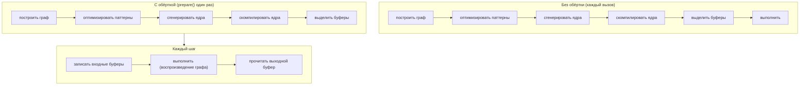

# JIT-графы

Стриминговый ASR-пайплайн вызывает один и тот же энкодер сотни раз.
Построение тензорного графа, его оптимизация, генерация исходного кода ядер,
компиляция через [JIT-загрузчик](../backends/jit-loader.md) бэкенда и
выделение буферов устройства на каждом вызове — это работа, которая не
зависит от входа и тратится впустую.

Макрос `jit_wrapper!` превращает этот паттерн «собрать один раз / выполнять
много раз» в **типизированную Rust-структуру**. Вы объявляете входы и граф;
макрос генерирует обёртку, которая компилирует граф один раз во время
`prepare()` и воспроизводит его на каждом `execute()`, удерживая буферы
устройства на месте.



Обёртка — тонкий слой над `Tensor::prepare_batch_with` и возвращаемым им
`ExecutionPlan` (см. [Пайплайн выполнения](./pipeline.md));
[движок паттернов](./optimizations/pattern-system.md) работает во время
`prepare()`, а [JIT-загрузчик](../backends/jit-loader.md) превращает ядра в
машинный код. Эта страница описывает обёртку и то, что воспроизводит
`execute()`.

---

## DSL `jit_wrapper!`

Объявление обёртки задаёт имя структуры, тип модели, который получает
замыкание сборки, входы, которые обёртка предоставляет, опциональные
символические переменные форм и блок `build`, строящий граф:

```rust
jit_wrapper! {
    MyModelJit(MyModel) {
        input1: Tensor,
        input2: Tensor,

        vars {
            b: (1, model.config.max_batch),
            t: (1, model.config.max_time),
        }

        build(input1, input2, b, t) {
            model.forward(input1, input2, &b, &t)
        }
    }
}
```

| Секция | Значение | Обязательна |
|---|---|---|
| `WrapperName<generics>(ModelType) { ... }` | имя генерируемой структуры (допускаются обобщённые параметры, например `RnntBlockJit<const W: usize>`) и тип модели, который получает замыкание сборки | да |
| строки `name: Tensor` / `name: [Tensor; N]` | по одной на каждый вход, предоставляемый обёрткой; аннотация типа информационная, `N > 0` | опционально (обычно один или более) |
| `inputs { ... }` | те же слоты внутри блока, где также допускается `#[unbatched]` | опционально |
| `vars { name: (min, max), ... }` | символические переменные форм с границами; выражения границ вычисляются внутри `new(model)` и могут читать `model` | опционально |
| `batch_var name: (min, max)` | переменная, до которой также сужается измерение 0 каждого батчевого входа | опционально |
| `state { name, ... }` | входы, которые план также записывает и переиспользует на месте между вызовами; требует блока `outputs` | опционально |
| `outputs { name, ... }` | по одному именованному аксессору буфера на выход; замыкание `build` тогда возвращает кортеж из стольких же тензоров в этом порядке | опционально |
| `build(args...) { ... }` | замыкание, строящее выходной тензор (тензоры) из входов, состояния и переменных; `model` находится в области видимости | да |

Макрос ещё на этапе раскрытия отвергает аргумент `build`, не соответствующий
ни одному объявлению, повторяющиеся имена среди входов / состояния / выходов /
переменных, выход, названный так же, как генерируемый метод, `#[unbatched]` на
состоянии или без `batch_var`, а также `state` без `outputs`. Внутри блока
каждый слот входа или состояния — это `&Tensor` (или `[&Tensor; N]` для
слота-массива), за которым стоит заполненный нулями плейсхолдер, выделяемый
макросом на устройстве по умолчанию при запуске `prepare()`; каждая
переменная — это `svod_tensor::BoundVariable`, уже привязанная к своей верхней
границе, — передавайте её дальше как `&name`; а `model` — разделяемая ссылка
на значение модели, которым владеет обёртка. Замыкание возвращает
`Result<Tensor, E>` для любого `E: std::error::Error + Send + Sync + 'static`;
ошибки проявляются как `JitError::Build`. Вся сборка выполняется под
`OriginScope::label("WrapperName")`, поэтому профили приписывают её ядра имени
обёртки.

Без блока `outputs` замыкание возвращает один `Tensor`, доступный через
`output()`. С ним оно возвращает кортеж ровно из стольких тензоров, и каждый
получает собственный именованный аксессор `&Buffer`, упорядоченный по порядку
объявления. Если бы планировщик слил или удалил один из них, позиционные
аксессоры молча съехали бы, поэтому `prepare()` вместо этого завершается
ошибкой `JitError::OutputCountMismatch`.

---

## Слоты-массивы, батчевые переменные и состояние

Блочные формы объявления добавляют три вещи, нужные стриминговой модели. Все
они опциональны; обёртка, написанная в старой плоской форме, продолжает
работать без изменений.

```rust
jit_wrapper! {
    StepJit(StepModel) {
        inputs {
            x: Tensor,
            #[unbatched] bias: Tensor,
            taps: [Tensor; 3],
        }
        batch_var b: (1, 4),
        state { h: Tensor, tail: [Tensor; 2] }
        outputs { emitted }

        // returns (emitted, h, tail): declared outputs first, then state
        build(x, bias, taps, h, tail) {
            model.step(x, bias, taps, h, tail)
        }
    }
}
```

**Слоты `[Tensor; N]`** размещают N буферов под одним именем: `prepare`
принимает `[InputSpec; N]`, замыкание сборки получает `[&Tensor; N]`, а
генерируемые аксессоры принимают индекс элемента — `jit.taps_view_mut::<f32>(1)?`.
Выходы тоже могут быть массивами. Индекс входа вне диапазона даёт
`JitError::InputBufferNotFound`; индекс выхода вне диапазона вызывает панику.

**`batch_var b: (min, max)`** объявляет символическую переменную *и* сужает до
неё измерение 0 каждого батчевого входа после материализации плейсхолдеров,
так что один план обслуживает диапазон размеров батча. `#[unbatched]`
исключает вход — общий bias или таблицу, ведущая ось которой не является
батчем, — а слоты состояния никогда не сужаются. Привязывайте её на каждом
вызове через генерируемый `execute_bound(4)`.

**Слоты `state { ... }`** — это входы, которые план также записывает. Кортеж
сборки несёт новое значение для каждого из них, макрос присваивает его прямо
обратно в собственный device-local буфер этого слота, и следующий `execute()`
читает его оттуда — рекуррентность, которая никогда не ходит через хост.
Слоты состояния получают собственный `InputSpec` в `prepare()` (после входов),
имеют аксессор `<state>_mut()`, но не типизированное представление, не
экспонируются как выходы, а `reset()` обнуляет их все для новой
последовательности.

Кортеж сборки содержит по одному элементу на каждый объявленный слот выхода
плюс по одному на каждый слот состояния — и вовсе не является кортежем, когда
такой элемент ровно один.

---

## Символические переменные

Блок `vars { ... }` объявляет значения, которые участвуют в графе как
выражения форм или индексов, но точное значение которых передаётся во время
выполнения. Они позволяют одному подготовленному плану обслуживать диапазон
форм входа без перекомпиляции.

Каждая запись `name: (min, max)` генерирует на обёртке три сеттера
конфигурации:

| Сеттер | Эффект |
|---|---|
| `with_<name>_bound(max)` | переопределяет только верхнюю границу; паникует, если `max < min` |
| `with_<name>_min_bound(min)` | переопределяет только нижнюю границу; паникует, если `min > max` |
| `with_<name>_fixed(value)` | фиксирует обе границы на `value`, превращая переменную в JIT-константу; паникует при `value == 0` |

Все три возвращают `Self` (в стиле builder) и должны вызываться до
`prepare()`, поскольку замыкание сборки захватывает границы в момент запуска.

Более широкий диапазон порождает более общее ядро, обязанное обрабатывать
любую форму в диапазоне; более узкий позволяет оптимизатору специализировать
код. Фиксируйте переменную через `with_<name>_fixed`, когда значение никогда
не меняется, и сужайте верхнюю границу, когда внешний вызывающий код объявляет
меньший максимум, чем жёсткий потолок модели.

Во время выполнения передавайте фактические значения через
`execute_with_vars` или через `execute_bound`, который принимает по одному
`i64` на каждую объявленную переменную в порядке объявления и делегирует
первому:

```rust
jit.execute_with_vars(&[("b", batch as i64), ("t", time as i64)])?;
jit.execute_bound(batch as i64, time as i64)?;   // same thing, positionally
```

Каждая пара привязывает одну переменную; не перечисленные сохраняют то, что в
них было, — верхнюю границу времени `prepare()` или значение, оставленное
предыдущим `execute_with_vars`. Привязки «липкие», а не на один вызов. План
проверяет каждое значение по объявленному `[min, max]` переменной и отвергает
значение вне диапазона с `JitError::Runtime`, ещё ничего не отправив на
устройство. Имена, неизвестные плану, игнорируются.

---

## Генерируемый runtime API

Макрос выдаёт по группе методов на каждую фазу жизненного цикла обёртки:

| Метод | Фаза | Примечания |
|---|---|---|
| `new(model)` | конструирование | принимает модель по значению; вычисляет границы переменных; ядра ещё не скомпилированы |
| `with_<var>_bound` / `with_<var>_min_bound` / `with_<var>_fixed` | между `new` и `prepare` | настройка диапазона форм |
| `prepare(input1: InputSpec, ..., state1: InputSpec, ...)` | однократно | построить граф, применить паттерны, скомпилировать ядра, выделить буферы; читает `PrepareConfig::from_env()` |
| `prepare_with_config(..., &PrepareConfig)` | однократно | то же, что `prepare`, с явной конфигурацией |
| `<input>_mut([i]) -> Result<&mut Buffer>` | каждый шаг | сырой буфер для каждого объявленного слота входа или состояния (`i` для слотов-массивов) |
| `<input>_view_mut::<T>([i]) -> Result<ArrayViewMutD<T>>` | каждый шаг | типизированное представление для записи во входной буфер с проверкой dtype |
| `output() -> Result<&Buffer>` | каждый шаг | первый выход плана |
| `<output>([i])` / `<output>_shape()` / `_view::<T>()` / `_to_vec::<T>()` | каждый шаг | именованный выходной буфер, его актуальная форма и чтения, вычисленные по текущим привязкам переменных |
| `reset() -> Result<()>` | каждый шаг | обнулить каждый слот `state` (генерируется только при наличии `state`) |
| `execute() -> Result<()>` | каждый шаг | воспроизведение с текущими входными буферами |
| `execute_bound(v1, v2, ...) -> Result<()>` | каждый шаг | воспроизведение с позиционной привязкой каждой объявленной переменной (генерируется только при наличии vars) |
| `execute_with_vars(&[(name, value)]) -> Result<()>` | каждый шаг | воспроизведение с перепривязкой одной или нескольких символических переменных |
| `execute_profiled` / `execute_with_vars_profiled` | опционально | то же, что непрофилируемые варианты, но возвращают `Vec<KernelProfile>` |
| `execute_profiled_static()` | опционально | один профилируемый прогон через `ExecutionPlan::profile`, возвращающий ядра последней стадии |
| `copy_output_to_<input>([i,] out_pos, dst_off, src_off, len)` | каждый шаг | копирование области выхода обратно во входной буфер на устройстве; без обращения к хосту; завершается ошибкой, если у них общее хранилище |
| `replicate() -> Result<Self>` | опционально | глубокая копия подготовленного JIT для конкурентного выполнения (см. ниже) |

Четыре низкоуровневых аксессора раскрывают детали плана для инструментов:

| Аксессор | Возвращает |
|---|---|
| `buffers()` | все буферы, которыми владеет план |
| `output_buffers()` | объявленные выходные буферы плана |
| `input_buffer_ids()` | id буферов устройства, в которые пишет обёртка |
| `prepared_kernels()` | скомпилированные ядра |

Большинству вызывающих они не нужны. Вызов любого пошагового метода до
`prepare()` возвращает `JitError::NotPrepared`.

`replicate()` разделяет модель (`Arc`) и скомпилированные ядра, снимает снимок
байтов каждого буфера входа и состояния, форкает хранилище, в которое пишет
план (промежуточные значения, выходы), не копируя его, заново создаёт
представления арены, чтобы сохранить алиасинг, и выдаёт реплике свежие
очередь, граф и таймлайны. Реплицируйте, пока исходный план простаивает:
снимок не синхронизирован с выполняющейся работой.

---

## `InputSpec`

`InputSpec`, `JitError` и вспомогательные функции для буферов, в которые
раскрывается макрос, находятся в `svod_tensor::jit`, поэтому крейту с
`jit_wrapper!` нужна только эта зависимость (`svod_model::jit` реэкспортирует
их для исторических путей).

`prepare()` принимает по одному `InputSpec` на каждый объявленный слот входа и
состояния — или по одному `[InputSpec; N]` на слот-массив:

```rust
pub struct InputSpec {
    pub shape: Vec<usize>,
    pub dtype: DType,
    /// Allocate the input device-local (no host mapping).
    pub device_local: bool,
}

impl InputSpec {
    pub fn new(shape: &[usize], dtype: DType) -> Self { ... }
    pub fn f32(shape: &[usize]) -> Self { ... }
    pub fn i32(shape: &[usize]) -> Self { ... }
    pub fn i64(shape: &[usize]) -> Self { ... }
    pub fn device_local(mut self) -> Self { ... }
    pub fn numel(&self) -> usize { ... }
}
```

Макрос использует форму и dtype, чтобы выделить заполненный нулями
тензор-плейсхолдер на устройстве по умолчанию перед вызовом замыкания сборки.
Вызывающему не нужно самому создавать плейсхолдеры
`Tensor::zeros(...).realize()`. Форма становится максимальным размером входа;
символические переменные сужают её во время выполнения через операции вроде
`try_shrink` — это паттерн написания кода, а не runtime-контракт, который
обеспечивает обёртка. `InputSpec::device_local()` убирает отображение на хост
для входов, которые хост только записывает через `copyin` / `copy_from` или
которые заполняются на устройстве; слоты `state` выделяются так
автоматически. Со стороны выходов `PrepareConfig::device_local()` — та же идея
для выходов плана: это `from_env()` с установленным `device_local_outputs`.

---

## Захват и воспроизведение графа {#graph-capture-and-replay}

`execute()` — это `ExecutionPlan::execute()`. На GPU план не обходит свои ядра
заново при каждом вызове: первый `execute()` **захватывает** последовательность
запусков в граф устройства, а каждый следующий вызов **воспроизводит** его,
обновляя только те аргументы ядер, которые изменились с момента захвата
(адреса буферов, значения переменных). Захват ленивый и выполняется для
каждого плана отдельно; `replicate()` начинает со свежего.

План захватывается, только если каждая операция — это скомпилированное ядро на
устройстве плана без непривязанных символических переменных. Runtime-переменные,
копирования буферов и пользовательские функции отключают захват — поэтому
каждая обёртка с `batch_var` / `vars` идёт по резервному пути ниже, тогда как
обёртка с фиксированной формой (энкодер GigaAM, фронтенд Silero, шаг декодера
Whisper) воспроизводит граф. Зависимости внутри графа — это конфликты
чтения/записи по **диапазонам байтов**, поскольку планировщик памяти
упаковывает промежуточные значения в пересекающиеся представления арены.

| Бэкенд | Механизм | Примечания |
|---|---|---|
| CUDA | DAG из `cuGraphAddKernelNode`, `cuGraphInstantiate`, `cuGraphLaunch` | включено по умолчанию; `cuGraphExecKernelNodeSetParams` обновляет только узлы с изменившимися аргументами; изменение алиасинга буферов вызывает повторный захват |
| AMD | один связанный командный поток HCQ/PM4 с принадлежащим графу хранилищем kernarg, воспроизводимый одним doorbell | очереди AQL (многоXCC-чипы или `SVOD_AMD_AQL=1`) захватываются по умолчанию; захват PM4 включается через `SVOD_PM4_GRAPH=1` |
| Metal | `MTLIndirectCommandBuffer` с барьерами на каждую команду, один `executeCommandsInBuffer` на воспроизведение | отказывается, если какое-либо ядро принимает скалярные аргументы или GPU виртуализирован; ждёт предыдущее воспроизведение перед перепривязкой |
| CPU | — | фабрики графов нет; ядра вызываются напрямую |

**Резервные пути.** Когда граф не используется, планы AMD — включая планы с
динамическими формами — захватываются как *связанный план*: один командный
поток, аргументы ядер и размерности запуска которого переупаковываются при
каждом воспроизведении. Во всех остальных случаях план обходит свои уровни по
порядку и отправляет каждое ядро в собственную очередь плана (асинхронно на
GPU; `wait` только в конце). `execute_profiled` использует профилируемый
вариант графа, если он есть, иначе — временные метки на каждый запуск.

---

## Рекуррентное выполнение

Состояние рекуррентной модели остаётся на устройстве: объявите его в
`state { ... }`, и каждый шаг — это один `execute()`, без обращения к хосту и
без вспомогательной упаковки.

```rust
jit.reset()?;                                    // zero the state, new sequence
for chunk in chunks {
    for (slot, v) in jit.x_view_mut::<f32>()?.iter_mut().zip(chunk) {
        *slot = v;                               // per-step input, written in place
    }
    jit.execute()?;                              // reads state, writes it back
    let frame = jit.emitted_to_vec::<f32>()?;    // only the emitted head crosses
}
```

:::tip[Порядок «чтение перед записью»]
Каждый буфер состояния переиспользуется на месте, поэтому слот не должен
зависеть от *нового* значения другого слота внутри одного `build`: порядок по
буферам однозначен только тогда, когда каждый слот продвигается от значений, с
которыми шаг был начат. Выводите новые значения из входов и старого состояния,
затем возвращайте их все в кортеже сборки.
:::

Буферы состояния выделяются device-local, поэтому ничто не отображает их на
хост. Считывайте только то, что действительно нужно вызывающему, — объявленные
выходы — через `<output>_to_vec` или `<output>_view`. Примеры в репозитории:
`RnntBlockJit<const W: usize>` (`state { time, prev, symbols, h, c }`),
`FireRedVadStreamJit` (`state { caches: [Tensor; 8] }`) и `GtcrnStreamJit`.

---

## Пример: энкодер GigaAM

Conformer-энкодер GigaAM подготавливается с постоянной формой. Границы батча и
числа mel-кадров вычисляются один раз при конструировании и вшиваются в план;
более короткие фрагменты дополняются нулями в те же буферы:

```rust
jit_wrapper! {
    GigaAmEncoderJit(GigaAm) {
        mel: Tensor,
        lengths: Tensor,

        outputs { frames },

        build(mel, lengths) {
            let out = model.encoder.forward_batch(mel, lengths)?;
            // Permute [B, d_model, T_sub] → [B, T_sub, d_model] on-device: the
            // RN-T decoder consumes frame-major rows, and doing it here turns
            // the host-side strided transpose over the slow mapping into one
            // contiguous copyout.
            Ok::<_, super::error::Error>(out.cast(svod_dtype::DType::Float32).try_permute(&[0, 2, 1])?)
        }
    }
}
```

Обёртка принимает на вход mel-спектрограмму и вектор длин по батчу и выдаёт
`frames: [B, T_sub, d_model]`, которые декодер RN-T читает через
`frames()?.copyout_prefix(..)`. (CTC-голова использует родственную обёртку
`GigaAmCtcJit`, единственный выход которой — `log_probs`.) `GigaAmTranscriber`
задаёт размеры плана один раз: длина mel округляется вверх до следующей
степени двойки, чтобы кодогенерация видела чистую факторизацию, и
ограничивается `config.max_mel_frames`, а батч ограничивается так, чтобы
живые тайлы оценок SDPA укладывались в `max_scores_mib` (`SVOD_MAX_SCORES_MIB`,
по умолчанию 256). Вход mel — это `InputSpec::f32(..).device_local()`, и он
заполняется на устройстве из выхода mel-JIT через `mel_mut()?.copy_from(..)`;
план подготавливается с `PrepareConfig::device_local()`. Затем каждый фрагмент
воспроизводит тот же план через `execute()`.

`cast` не может завершиться ошибкой, поэтому ему не нужен `?`, а тип ошибки
модели поглощает ошибку тензора обычным `?` — замыкание сборки возвращает
`Result<_, E>` для любого `E: std::error::Error + Send + Sync + 'static`.

`out.cast(DType::Float32)` — это граница fp32 между энкодером и любой
последующей головой. Энкодер может работать в fp16 или bf16 ради скорости, но
каждый потребитель (log-softmax CTC, предиктор и joint RN-T) видит единообразный
вход fp32. Размещение приведения внутри JIT позволяет слить его с хвостовыми
ядрами энкодера.

---

## Пример: Silero VAD

Silero V5 — рекуррентная сеть, но её рекуррентность слишком мала, чтобы
окупать запуск на каждое окно. Поэтому JIT покрывает только батчевый
свёрточный фронтенд плюс входную проекцию LSTM; сам проход по
последовательности остаётся на хосте:

```rust
jit_wrapper! {
    SileroVadFeatureJit(SileroVad) {
        chunks: Tensor,

        build(chunks) {
            // [FEATURE_BATCH, CHUNK_LEN] -> [FEATURE_BATCH, 4*HIDDEN] LSTM gate
            // pre-activations (conv features + input projection, biases folded).
            // Fixed batch (not a runtime var): the front-end is row-independent,
            // so partial batches just fill fewer rows and ignore the rest — and
            // a symbolic leading dim trips the reflect-pad lowering.
            model.forward_gates(chunks)
        }
    }
}
```

Ведущее измерение — фиксированный `FEATURE_BATCH` (4096), а не переменная:
фронтенд независим по строкам, поэтому неполный батч просто заполняет меньше
строк, а символическое ведущее измерение ломает понижение reflect-pad.
Подготовка запрашивает device-local выход, поскольку считывание гейтов
объёмом 8 MiB должно идти через copy engine, а не через отображение на хост:

```rust
let mut jit = SileroVadFeatureJit::new(vad);
jit.prepare_with_config(
    InputSpec::f32(&[FEATURE_BATCH, CHUNK_LEN]),
    &svod_tensor::PrepareConfig::device_local(),
)?;
```

Затем `VadInference::probs` проходит по сигналу запусками размером
`FEATURE_BATCH` — упаковать `chunks_view_mut::<f32>()`, `execute()`,
`copyout_prefix` для валидных строк — и передаёт гейты в `VadHead::scan`, LSTM
с сигмоидной головой, векторизованную на самую широкую SIMD-ширину,
доступную CPU хоста. Такое разделение заменило путь с одним крошечным
запуском на окно, задержка обращений которого доминировала над всей моделью.

---

## Контракт независимости от данных

Обёртка компилирует граф один раз и воспроизводит его много раз. Это работает,
только если топология графа зафиксирована к моменту `prepare()`. Всё, что
может меняться во время выполнения, должно проходить через входные буферы
(через `*_mut`) или символические переменные (через `execute_with_vars`).
Ветвление по значению тензора внутри замыкания сборки специализирует граф под
эту ветку; это решение времени сборки, а не времени выполнения.

:::note[Подводные камни]
- `Tensor::full(value).realize()` внутри замыкания сборки вшивает это значение
  в единственный подготовленный план. Любое изменение от вызова к вызову
  требует повторного `prepare()` с нуля — полное построение графа плюс
  компиляция ядер. Для пошаговой подготовки, которую JIT видеть не нужно,
  правильный выбор — буферы на стороне хоста (например, `ndarray::Array3`).
- Идиоматичный способ обработать динамический батч — `batch_var`, который сам
  сужает измерение 0 каждого батчевого входа; привязывайте его на каждом
  вызове через `execute_bound`. ResNet и YOLO26 — это по одному входу
  `images`, одному `batch_var b: (1, model.config.max_batch_size)` и одному
  выходу. Для любой другой динамической оси ручной эквивалент — `try_shrink`
  входа максимального размера на длину, привязанную к переменной, плюс
  `execute_with_vars` в месте вызова.
- Динамическая переменная стоит воспроизведения графа: план откатывается к
  запуску на каждый вызов (или к связанному плану AMD). Фиксируйте переменные
  через `with_<var>_fixed`, когда в развёртывании они никогда не меняются.
:::

Нарушение контракта приводит к одному из двух видов сбоев: неверным
результатам, потому что закэшированный план воспроизводится с устаревшим
предположением о значении, которое на деле менялось; или незаметному
замедлению, потому что каждый вызов попадает на путь перекомпиляции.
Диагностируйте их, перечитывая замыкание сборки; вывод ядер помогает редко.

---

## Ошибки

`JitError` покрывает runtime-сбои, которые может выдать обёртка. Большинство
из них неисправимы и указывают на ошибку использования, а не на временное
состояние.

| Вариант | Причина |
|---|---|
| `NotPrepared` | пошаговый метод вызван до `prepare` или выходной буфер недоступен |
| `InputBufferNotFound` | не удалось разрешить индекс входа внутри подготовленного плана или индекс слота-массива вне диапазона |
| `DuplicateInputBuffer` | два объявленных входа отображаются на один буфер устройства во время `prepare` |
| `InputAliased` | вход разрешился в буфер чужого плана — конкурентный `prepare` испортил идентичность его графа |
| `Build` | замыкание сборки вернуло `Err`; внутренняя ошибка сохраняется как `Box<dyn Error + Send + Sync>` |
| `Tensor` | тензорная операция завершилась ошибкой во время `prepare` или в замыкании сборки |
| `Device` | операция с устройством или буфером завершилась ошибкой |
| `OutputCountMismatch` | обёртка объявила N слотов выходов плюс состояния, но скомпилированный план сохранил другое число |
| `DtypeMismatch` | типизированное представление или чтение запросило dtype, которого нет в буфере |
| `ViewOutOfBounds` | актуальной форме выхода нужно больше байтов, чем вмещает его буфер, — привязанные переменные превышают то, под что скомпилирован план |
| `InferredOutputDim` | форма выхода содержала измерение `-1`, для которого нет актуального значения для подстановки |
| `Runtime` | выполнение ядра завершилось ошибкой или переменная привязана вне своего `[min, max]` |

Ошибки конфигурации в сеттерах символических переменных (`with_<var>_*`)
вызывают панику в месте вызова, а не возвращают ошибку, поскольку происходят
до того, как появляется какой-либо план.

---

## Почему это важно

**Жизненный цикл явный.** `prepare` — единственный путь в подготовленное
состояние, и каждый пошаговый аксессор проходит через него. Обёртка хранит
план за `Option`, поэтому вызов не по порядку сразу завершается
`JitError::NotPrepared`, а не читает наполовину построенный план.

**Воспроизведение дёшево.** Одно построение графа, одна компиляция ядер, один
набор выделений памяти — оплачиваются один раз. Каждый последующий вызов —
это запись в буферы плюс запуск графа.

**Контракт локален.** Правило независимости от данных — единственный
инвариант, который позволяет обёртке безопасно пропускать работу на каждом
вызове. Все остальные гарантии следуют из него.

**Ошибки явные.** Runtime-сбои проявляются как варианты `JitError`; паникует
только неправильное использование сеттеров переменных на этапе конфигурации.

Обёртка не изобретает новых примитивов. Она берёт цикл сборка / подготовка /
выполнение и придаёт ему форму, которую может удержать система типов, так что
стриминговый инференс работает со скоростью однократного вычисления без
накладных расходов на каждый вызов.
