# Бестиарий операций: справочник по UOp

При отладке IR-дампов Svod вы встретите операции, назначение которых не очевидно из названия. Эта глава документирует нетривиальные операции с их точными полями (как они объявлены в `ir/src/op.rs`), структурами метаданных, которые они несут (`ir/src/types.rs`), и примерами.

**Что покрыто:** операции, требующие пояснений, — управление циклами, редукции, работа с памятью, структура ядер, векторизация, тензорные ядра.

**Что НЕ покрыто:** тривиальные ALU-операции (`Add`, `Mul`, `Sqrt` и т.д.), которые работают ровно так, как вы ожидаете. У `Op` 60 вариантов; три из них (`Unary`, `Binary`, `Ternary`) несут вид операции, так что если считать по видам, операций около 100.

Метки узлов в примерах используют написание `UOp::tree()`: `[id] NAME : dtype`, так что `RANGE(R0, Global)` — это перенумерованная ось `R0` типа `Global`, а `[10] → (see above)` — разделяемый узел, напечатанный ранее.

---

## Управление циклами: RANGE и END

### RANGE — открытие скоупа цикла

```rust
Range {
    end: Arc<UOp>,           // loop bound (exclusive)
    axis_id: AxisId,         // identifier for deduplication
    axis_type: AxisType,     // scheduling behavior
    deps: SmallVec<[Arc<UOp>; 2]>,  // range dependencies
}
```

**Поля:**

| Поле | Тип | Назначение |
|------|-----|------------|
| `end` | `Arc<UOp>` | Верхняя граница (исключительно), обычно `CONST` или символьное выражение |
| `axis_id` | `AxisId` | `Unrenumbered(n)` (печатается `U<n>`) до разделения ядер, `Renumbered(n)` (`R<n>`) после; формы `UnrenumberedPath` / `RenumberedPath` (`U0_1`) обозначают range, структурно выведенный из родительского range |
| `axis_type` | `AxisType` | Определяет способ планирования цикла (см. ниже) |
| `deps` | `SmallVec<[Arc<UOp>; 2]>` | Другие range, от которых зависит этот |

**Иерархия AxisType** (`AxisType::priority()`; `Ord` сравнивает по нему, меньшие значения — внешние циклы):

| Тип | Приоритет | Буква | Во что понижается | Назначение |
|-----|-----------|-------|-------------------|------------|
| `Placeholder` | -3 | `P` | — | Временный канонический range, используемый при кэшировании RESHAPE |
| `Device` | -2 | `d` | привязка к устройству при запуске | Ось выбора устройства для мультиустройственного тензора |
| `Weak` | -1 | `L` | последовательный цикл `for` | Непараллелизованный range, порождаемый rangeify; из них выбирает оптимизатор |
| `Loop` | -1 | `L` | последовательный цикл `for` | Явный обычный цикл; обёртки уровня schedule в паре с `END(CALL)` |
| `Global` | 0 | `g` | `gidx` (`SPECIAL`) | Измерение GPU-грида |
| `Thread` | 0 | `t` | `gidx` (`SPECIAL`) | Измерение рабочих элементов CPU, распределяемых по пулу потоков |
| `Warp` | 1 | `w` | ведущее локальное измерение | Аппаратная линия (lane); по ней адресуются фрагменты `mma.sync` |
| `Local` | 2 | `l` | `lidx` (`SPECIAL`) | Измерение воркгруппы GPU |
| `GroupReduce` | 2 | `G` | локальное измерение + этап в shared memory | Двухэтапная редукция |
| `Upcast` | 3 | `u` | векторные линии (`STACK`) | Векторизация |
| `Reduce` | 4 | `R` | цикл-аккумулятор | Ось редукции |
| `Unroll` | 5 | `r` | развёрнутые копии | Развёртка цикла |

`is_parallel()` — это `Global | Thread | Local | Warp`; `is_reduce()` — это `Reduce | GroupReduce | Unroll`. `pm_add_gpudims` превращает range `Global`/`Thread` в глобальные `SPECIAL`, а range `Local`/`Warp`/`GroupReduce` — в локальные; у CPU-рендерера есть `has_threads`, но нет `has_local`, поэтому он видит только `Thread`. Границы ядер выражаются структурно через `CALL`/`FUNCTION`, а не отдельным типом оси. Из этих букв строятся имена ядер вроде `r_128_3_32_4…`.

**Пример:**
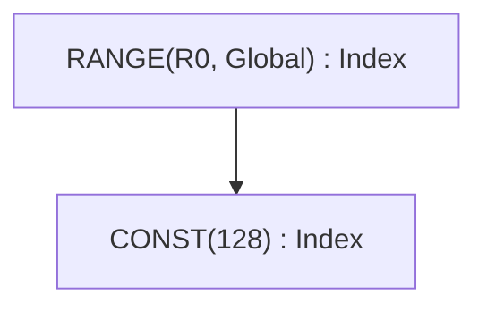

### END — закрытие скоупа цикла

```rust
End {
    computation: Arc<UOp>,              // value computed inside loop
    ranges: SmallVec<[Arc<UOp>; 4]>,    // ranges being closed
}
```

END закрывает один или несколько скоупов RANGE и удаляет их из активного множества. Несколько range можно закрыть одновременно.

**Пример:**
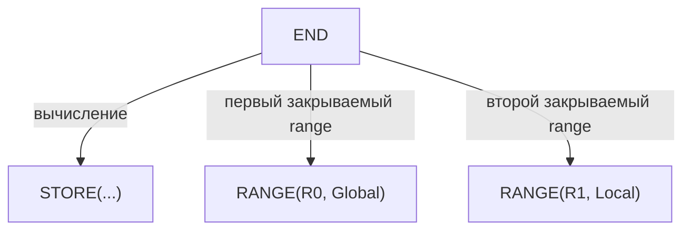

---

## Редукция: REDUCE и REDUCE_AXIS

Две операции с похожими именами служат разным целям.

### REDUCE_AXIS — редукция по измерению тензора (высокий уровень)

```rust
ReduceAxis {
    src: Arc<UOp>,           // input tensor
    reduce_op: ReduceOp,     // Add, Mul, Max, Min
    axes: Vec<usize>,        // axes to reduce
}
```

Используется **до** rangeify. Работает с измерениями тензора, как `.sum(axis=0)` в NumPy.

**Пример:**
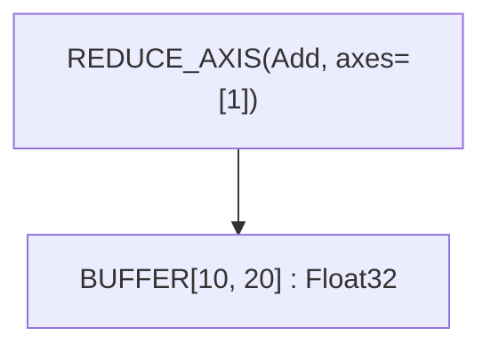

Это сводит тензор `[10, 20]` к `[10]` суммированием вдоль оси 1.

### REDUCE — редукция по итерациям range (низкий уровень)

```rust
Reduce {
    src: Arc<UOp>,                      // value to accumulate
    ranges: SmallVec<[Arc<UOp>; 4]>,    // ranges being reduced
    reduce_op: ReduceOp,                // Add, Mul, Max, Min
    num_axes: usize,                    // reduced axes of the shaped source
}
```

Используется **после** rangeify. Накапливает значения по итерациям RANGE и закрывает указанные range. Дерево печатает её как `REDUCE(Add, num_axes=1, ranges=[30])` с id закрываемых range.

**Варианты ReduceOp:**

| Операция | Нейтральный элемент | Действие | Tinygrad |
|----|----------|-----------|----------|
| `Add` | 0 | `acc + value` | ✓ |
| `Mul` | 1 | `acc * value` | ✓ |
| `Max` | -∞ | `max(acc, value)` | ✓ |
| `Min` | +∞ | `min(acc, value)` | только Svod |

> **Совместимость:** спецификация Tinygrad ограничивает REDUCE_AXIS множеством `{Add, Mul, Max}`. Svod расширяет его операцией `Min`.

**Пример:**
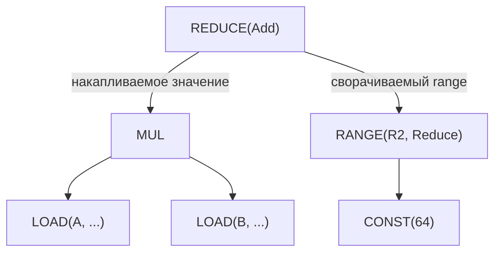

### ALLREDUCE — редукция между устройствами

```rust
AllReduce {
    src: Arc<UOp>,           // local partial result
    device: DeviceSpec,      // device specification
    reduce_op: ReduceOp,     // reduction operation
}
```

Выполняет распределённую редукцию по нескольким устройствам. Используется при обучении на нескольких GPU.

---

## Операции с буферами

### BUFFER — объявление буфера

```rust
Buffer {
    shape: Arc<UOp>,         // flat storage shape (one element count)
    arg: Box<ParamArg>,      // slot, dtype, address space, device
}
```

Объявляет буфер для хранения тензора. `ParamArg` общий с `PARAM`:

| Поле | Тип | Назначение |
|------|-----|------------|
| `slot` | `usize` | Различает буферы одинакового размера/устройства; для `PARAM` — позиция аргумента ядра |
| `dtype` | `DType` | Тип элемента |
| `addrspace` | `Option<AddrSpace>` | `Global` — память устройства, `Local` — shared memory GPU (LDS), `Reg` — регистровая/scratch-аллокация; `None` для скалярного параметра |
| `device` | `Option<DeviceSpec>` | Устройство, на котором живёт буфер; `None` для `Local`/`Reg` |
| `name`, `vmin_vmax`, `multiple_of` | `Option<_>` | Метаданные скалярного параметра: имя и границы значения (`UOp::scalar_param`) |
| `axis` | `Option<usize>` | Ось шардирования мультиустройственного буфера |
| `volatile` | `bool` | Чтения нельзя выносить из цикла или объединять |

### STAGE — маркер материализации

```rust
Stage {
    compute: Arc<UOp>,                  // computation to materialize
    ranges: SmallVec<[Arc<UOp>; 4]>,    // output dimensions
    opts: Box<BufferizeOpts>,           // address space, device
}
```

Отмечает, где вычисление должно материализоваться в память. Запускает разделение на ядра.

**BufferizeOpts:**

| Поле | Тип | Назначение |
|------|-----|------------|
| `device` | `Option<DeviceSpec>` | Целевое устройство, `None` для локального |
| `local_axis` | `Option<AxisId>` | Ось `GroupReduce`, которой принадлежит промежуточный LOCAL-буфер |
| `addrspace` | `AddrSpace` | `Global` (устройство) или `Local` (shared) |
| `removable` | `bool` | Если `false`, `buffer_removal` запрещено инлайнить этот STAGE — используется на границах realize с несколькими потребителями, чтобы буфер оставался фиксированным между итерациями неподвижной точки мега-прохода |

**Пример:**
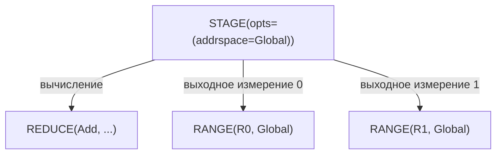

### INDEX — многомерный доступ к буферу

```rust
Index {
    buffer: Arc<UOp>,                   // BUFFER, PARAM or STACK
    indices: SmallVec<[Arc<UOp>; 4]>,   // index per dimension
}
```

Вычисляет адрес в памяти по многомерным индексам. Возвращает dtype элемента (не указатель). Индекс можно сделать условным через `idx.valid(cond)`, что оборачивает его в `WHERE(cond, idx, INVALID)` — `INVALID` это «ядовитая» константа `CONST(Invalid)` с dtype `Bool`, которую дерево печатает как `INVALID`. INDEX над `STACK` выбирает линию, а не адрес: константный скалярный индекс сворачивается прямо в соответствующий источник стека.

**Пример:**
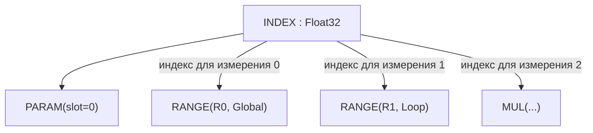

### LOAD — чтение из памяти

```rust
Load {
    index: Arc<UOp>,         // INDEX op (buffer accessed via the INDEX)
    alt: Option<Arc<UOp>>,   // alternative value for gated loads
    gate: Option<Arc<UOp>>,  // predicate for gated loads
}
```

Читает значение из буфера по индексу; отдельного поля `buffer` нет, буфер достигается через узел INDEX. Для загрузок с предикатом `alt` задаёт значение, когда `gate` ложен (обращения к памяти при этом не происходит вовсе). `alt` и `gate` всегда задаются вместе: загрузка несёт либо оба, либо ни одного, предикат имеет тип `Bool`, а `alt` может быть маркером `INVALID`. Рендереры требуют одноосный `INDEX`, поэтому многоиндексные обращения должны быть уплощены до того, как загрузка дойдёт до кодогенерации.

**Пример:**
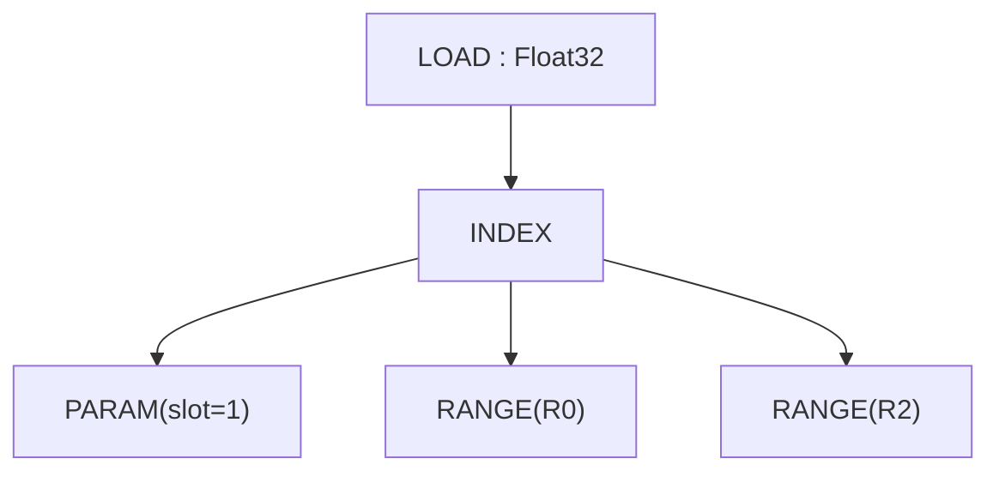

### STORE — запись в память

```rust
Store {
    index: Arc<UOp>,                    // INDEX op (buffer accessed via index.src[0])
    value: Arc<UOp>,                    // value to write
    gate: Option<Arc<UOp>>,             // predicate for gated stores
}
```

Записывает значение в буфер. Буфер достигается через узел INDEX (через `index.src[0]`), а не через отдельное поле. `Upcast` и `Unroll` остаются типами осей range на протяжении расширения (expansion).

Для записей с предикатом `store_gated` устанавливает `gate`; переносом предиката с адресного выражения на LOAD/STORE занимается `pm_move_gates_from_index`.

> **Совместимость:** у STORE в Svod нет отдельного поля `buffer` — источники такие: index=0, value=1. В отличие от STAGE или REDUCE, STORE не закрывает range.

**Пример:**
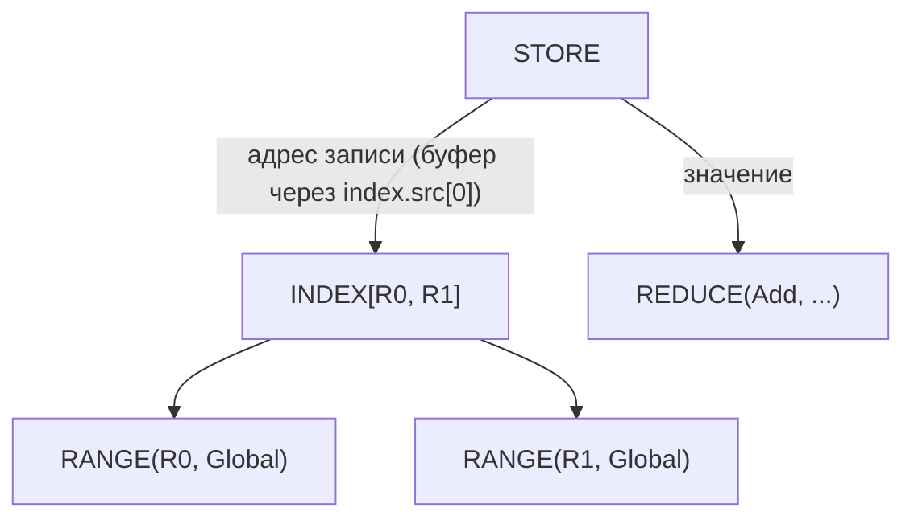

---

## Структура ядер и вызываемый IR

Работа уровня schedule выражается вызываемым IR, повторяющим модель
`CALL`/`FUNCTION`/`PROGRAM` из tinygrad: `Function` определяет тело (обычно
`Sink` из записей), параметризованное аргументами, `Call` вызывает его с
конкретными аргументами, а `Program` проводит тело через строгую
последовательность этапов компиляции `SINK → LINEAR → SOURCE → BINARY`. Операции `KERNEL`
нет: ядро — это `CALL`, телом которого является `SINK[KERNEL]` (SINK, несущий
`KernelInfo`).

### CALL — вызов тела функции

```rust
Call {
    body: Arc<UOp>,                     // FUNCTION (or its body)
    args: SmallVec<[Arc<UOp>; 4]>,      // concrete argument values
    info: Box<CallInfo>,                // annotations (name, origin, ...)
}
```

Вызывает вызываемое тело с аргументами. Закрывает range: закрывает все операции
`Range` в `args` (range_start_index = 1; `body=0`, `args=1+`).

`CallInfo` несёт аннотации, безопасные для ключа кэша:

| Поле | Тип | Назначение |
|------|-----|------------|
| `name` | `Option<String>` | Человекочитаемое имя вызываемого объекта |
| `grad_tag` | `Option<String>` | Зарезервировано для идентичности gradient-callback |
| `origin` | `Option<OriginId>` | Происхождение корня сохраняемого значения — на что списывается ядро |
| `origins` | `OriginSet` | Все происхождения, достижимые в теле до его очистки |
| `precompile` / `precompile_backward` | `bool` | Подсказки для eager-компиляции |

Именно в CALL ядра диспатч хранит атрибуцию, которую читают сводки профайлера; см.
[Происхождение ядер](./kernel-origins.md).

### FUNCTION — переиспользуемое тело

```rust
Function {
    body: Arc<UOp>,                     // computation
    args: SmallVec<[Arc<UOp>; 4]>,      // formal parameters
    info: Box<CallInfo>,
}
```

Переиспользуемый вызываемый объект. Его dtype всегда `Void`; тела, возвращающие
несколько значений, оборачиваются в `Tuple`, чтобы граница функции оставалась Void.
Та же форма закрытия range, что и у `Call`.

### TUPLE / GET_TUPLE — возврат нескольких значений

```rust
Tuple { src: SmallVec<[Arc<UOp>; 4]> }
GetTuple { src: Arc<UOp>, index: usize }
```

`Tuple` упаковывает разнородные значения; его dtype всегда `Void`. `GetTuple`
извлекает элемент `index` из `Tuple` (или из `Function`, тело которой —
`Tuple`); его dtype совпадает с dtype внутреннего элемента. Используется, чтобы провести
несколько выходов через границу функции, которая иначе была бы Void.

### PROGRAM — контейнер пайплайна компиляции

```rust
Program {
    sink: Arc<UOp>,                     // root SINK
    info: Box<ProgramInfo>,             // name, launch dims, ABI slots, target
    linear: Option<Arc<UOp>>,           // LINEAR (after linearize)
    source: Option<Arc<UOp>>,           // SOURCE (after render)
    binary: Option<Arc<UOp>>,           // PROGRAM_BINARY (after compile)
}
```

Проводит ядро через этапы `SINK → LINEAR → SOURCE → PROGRAM_BINARY`,
порядок которых обеспечивает `codegen/src/program_pipeline.rs`
(`do_linearize`/`do_render`/`do_compile`/`get_program`). Каждый этап заполняет
следующее поле. `ProgramInfo` хранит `name`, символьные `global_size` /
`local_size`, принимаемые ядром `vars`, слоты буферов `globals` / `outs` / `ins`
и целевое устройство `target`. Рендереры C/LLVM ожидают на входе `Op::Linear`
и сообщают `Error::InvalidGraph` через `pending_error` своего контекста, а не
паникуют; многоиндексный `INDEX`, дошедший до рендерера, отвергается так же,
поэтому индексы к этому моменту уже должны быть уплощены до одной оси.

### LINEAR — линеаризованный поток операций

```rust
Linear { ops: SmallVec<[Arc<UOp>; 8]> }
```

Плоская последовательность операций, получаемая при линеаризации. Потребители итерируют `ops`
напрямую, не обходя граф заново.

### SOURCE / PROGRAM_BINARY — артефакты компиляции

```rust
Source { code: String, identity: Option<Box<SourceStageIdentity>> }
ProgramBinary { bytes: Vec<u8>, identity: Option<Box<BinaryStageIdentity>> }
```

Терминальные этапы пайплайна программы. Оба — листья (без потомков).
Необязательное поле `identity` — семантическое доказательство, привязывающее этап к
точно определённому предыдущему (`SourceStageIdentity` несёт ABI, цель, имя точки входа и
дайджесты LINEAR/SOURCE; `BinaryStageIdentity` оборачивает его вместе с ключом компилятора
и дайджестом бинарника), поэтому закэшированный артефакт нельзя переиспользовать для изменившегося
графа. Дерево печатает бинарник как `BINARY(len=…, identity=…)`.

### SINK — сборщик нескольких корней

```rust
Sink {
    sources: SmallVec<[Arc<UOp>; 4]>,
    info: Option<Box<KernelInfo>>,      // structural marker for kernel ASTs
}
```

Собирает несколько выходов в один корень. Тело `Function` обычно —
`Sink` из записей. Поле `info` — хэш-консируемый структурный
маркер, отличающий SINK с AST ядра (печатается `SINK[KERNEL]`) от
в остальном идентичных «голых» SINK. `KernelInfo` несёт `opts_to_apply`
(`None`: выбирает оптимизатор; `Some([])`: понижено вручную, не трогать;
`Some(opts)`: применить ровно эти), `applied_opts`, `dont_use_locals` и
`name` ядра.

**Пример:**
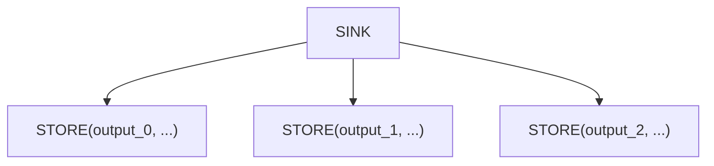

### AFTER — маркер зависимости

```rust
After {
    passthrough: Arc<UOp>,              // value that flows through
    deps: SmallVec<[Arc<UOp>; 4]>,      // operations that must complete
}
```

Выражает зависимости выполнения между ядрами без зависимости по данным. Значение `passthrough` возвращается без изменений, но только после завершения всех `deps`.

**Пример:**
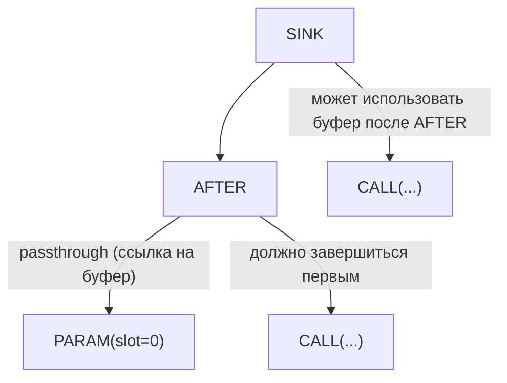

### BARRIER — барьер синхронизации

```rust
Barrier {
    src: Arc<UOp>,                      // value passing through
    deps: SmallVec<[Arc<UOp>; 4]>,      // operations to wait for
}
```

Синхронизация воркгруппы GPU. Гарантирует, что все потоки воркгруппы дошли до барьера, прежде чем продолжить.

---

## Векторные операции

### STACK — сборка значения формы из линий

```rust
Stack {
    sources: SmallVec<[Arc<UOp>; 4]>,
}
```

Объединяет N значений в одно значение формы из N линий. Dtype элемента остаётся
скалярным — число линий несёт сам STACK, а не расширенный
dtype, — и при построении источники приводятся к повышенному dtype.

**Пример:**
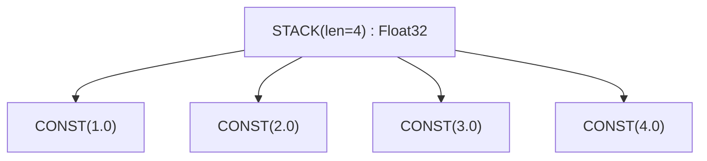

### Выбор линии — INDEX над STACK

Отдельной операции извлечения нет. `INDEX` выбирает линию из `STACK`
точно так же, как выбирает адрес из буфера, а константный индекс сворачивается
прямо в соответствующий источник стека уже при построении.

**Пример:**
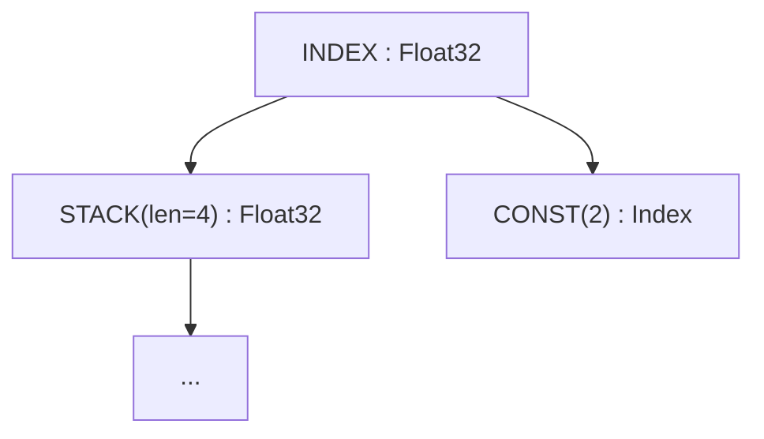

### VConst — векторная константа

```rust
VConst {
    values: Vec<ConstValue>,
}
```

Вектор констант времени компиляции. Эффективнее, чем `STACK` из узлов `CONST`.

Агрегация линий выполняется через `STACK`; выбор линии и адреса — через `INDEX`. Развёртка
циклов представляется `Range` с `AxisType::Unroll`, а не отдельной
операцией. Оси расширения тензорных ядер хранятся в `WmmaMetadata`.

---

## Тензорные ядра: WMMA

### WMMA — матричное умножение с накоплением на уровне warp

```rust
Wmma {
    a: Arc<UOp>,             // matrix A fragment
    b: Arc<UOp>,             // matrix B fragment
    c: Arc<UOp>,                 // accumulator C fragment
    metadata: Box<WmmaMetadata>, // hardware configuration
}
```

Аппаратная операция тензорного ядра: `D = A × B + C`. Требует определённых форм матриц и раскладок данных.

**Поля WmmaMetadata:**

| Поле | Тип | Назначение |
|------|-----|------------|
| `name` | `String` | Имя инструкции (например, `"__hmma..."`) |
| `dims` | `(N, M, K)` | Размеры матриц (например, `(16, 16, 16)`) |
| `dtype_in` | `DType` | Точность входных матриц (например, `Float16`) |
| `dtype_out` | `DType` | Точность выхода (например, `Float32`) |
| `device` | `RendererDevice` | Рендерер / TC-бэкенд, создавший этот WMMA (`CudaSm80`, `AmdRdna3`, `Metal`, …) |
| `threads` | `usize` | Потоков на warp (обычно 32) |
| `upcast_axes` | `Option<WmmaUpcastAxes>` | Оси расширения для каждого источника (поля: `a`, `b`, `c`); очищаются, как только `expander2` придал форму источникам и выходу |
| `reduce_axes` | `Vec<AxisId>` | ID осей редукции TC, используются как `exclude_args` при расширении |

**Пример:**
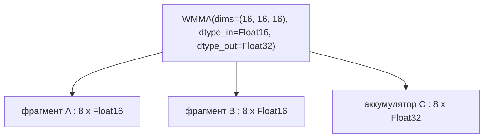

---

## Управление потоком

### IF / ENDIF — условное выполнение

```rust
If {
    condition: Arc<UOp>,                // boolean predicate
    body: SmallVec<[Arc<UOp>; 4]>,      // operations to execute
}

EndIf {
    if_op: Arc<UOp>,         // corresponding IF op
}
```

Выполняет тело, только если условие истинно. Используется для проверок границ и разреженных операций.

**Пример:**
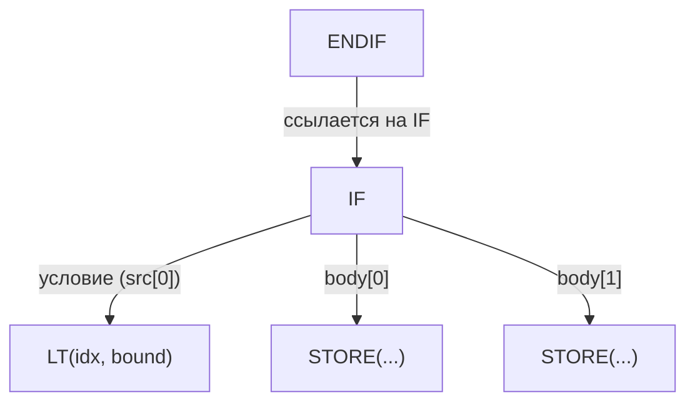

---

## Операции определения

### CONST — литерал

```rust
Const(ConstValueHash)        // Int(i64), UInt(u64), Float(f64), Bool(bool), Invalid
```

Скаляр времени компиляции. `Invalid` — «ядовитое» значение, к которому откатывается
каждый предикат `valid()`; его dtype всегда `Bool`. Константы, как и буферы и параметры, никогда
не несут происхождения (origin).

### PARAM — параметр-буфер

```rust
Param { shape: Arc<UOp>, arg: Box<ParamArg> }
```

Нормализованный параметр-буфер — позиционная ссылка на входной/выходной буфер.
Создаётся нормализацией перед планированием (BUFFER→PARAM), чтобы стереть идентичность буфера,
что позволяет структурно дедуплицировать одинаковые вычисления над разными буферами.
`arg.slot` — позиция в списке аргументов ядра, `shape` несёт
число элементов. `ParamArg` также покрывает скалярные параметры (`UOp::scalar_param`),
у которых есть необязательное имя и границы значения, но нет адресного пространства.

### Shared memory и регистры

Отдельных операций `DefineLocal` или `DefineReg` нет. Shared memory GPU
(LDS) и регистровые/scratch-аллокации — это узлы `Buffer`, у которых
`arg.addrspace` равен `AddrSpace::Local` или `AddrSpace::Reg`; они не привязаны к устройству
и видны только внутри воркгруппы (LOCAL) или потока (REG).

### DEFINE_VAR — символьная переменная времени выполнения

```rust
DefineVar {
    name: String,            // variable name
    min_val: i64,            // minimum bound
    max_val: i64,            // maximum bound
}
```

Переменная времени выполнения с известными границами. Используется для динамических форм с известными границами.

**Пример:**
```text
DEFINE_VAR('batch_size', min=1, max=128) : Index
```

### BIND — привязка переменной

```rust
Bind {
    var: Arc<UOp>,           // DEFINE_VAR
    value: Arc<UOp>,         // concrete value
}
```

Привязывает символьную переменную к конкретному значению во время выполнения.

---

## Специальные операции

### SPECIAL — значения, предоставляемые железом

```rust
Special {
    end: Arc<UOp>,           // upper bound for this dimension
    name: String,            // e.g., "gidx0", "lidx1"
}
```

Даёт доступ к значениям, предоставляемым железом (индексам потоков/блоков). Это не цикл — значение напрямую выдаёт железо.

**Пример:**
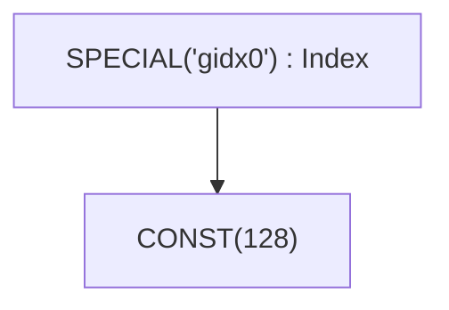

### UNIQUE / LUNIQUE — маркеры идентичности

```rust
Unique(usize)                // global identity counter
LUnique(usize)               // local-scope identity counter
```

Создаёт уникальную идентичность для различения буферов. Два буфера с
разными значениями `Unique` различны, даже если в остальном идентичны. `LUnique`
обеспечивает то же различение внутри локального скоупа (например, внутри тела
`Function`), не конфликтуя с глобальным счётчиком, так что тела вызываемых объектов
могут хэш-консироваться независимо от места вызова.

Устройства не являются отдельными узлами: цель — это поле `DeviceSpec` у
операций, которым оно нужно (`Copy`, `GetAddr`, `AllReduce`, `ParamArg.device`,
`BufferizeOpts.device`, `ProgramInfo.target`).

---

## Операции перемещения

Высокоуровневые преобразования формы тензора. При rangeify они превращаются в явные операции INDEX.

| Операция | Сигнатура | Назначение |
|----------|-----------|------------|
| `Reshape` | `{ src, new_shape }` | Изменить форму при тех же элементах |
| `Permute` | `{ src, axes: Vec<usize> }` | Транспонировать/переупорядочить оси |
| `Expand` | `{ src, new_shape }` | Бродкаст до большей формы |
| `Pad` | `{ src, begin_pads, end_pads }` | Добавить паддинг |
| `Shrink` | `{ src, offsets, sizes }` | Извлечь подобласть |
| `Flip` | `{ src, axes: Vec<bool> }` | Развернуть вдоль осей |

**Пример:** RESHAPE
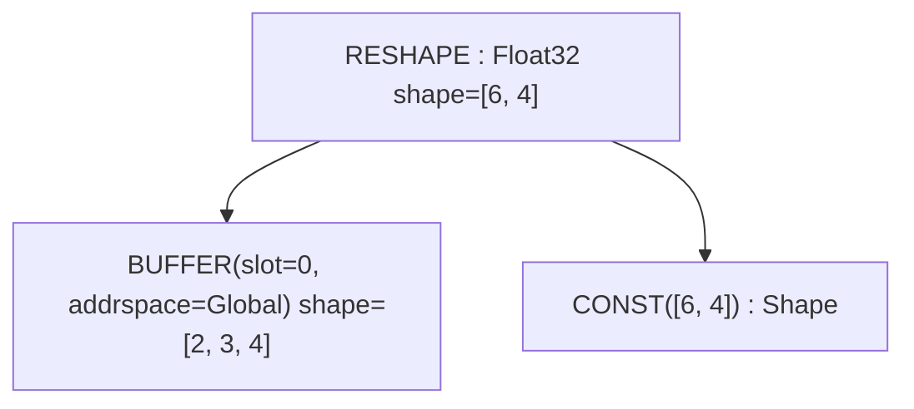

---

## Прочие операции

Следующие операции есть в перечислении `Op`, но они либо внутренние, либо редко встречаются при отладке:

| Операция | Назначение |
|----------|------------|
| `Copy` | `{ src, device }` — явное копирование значения на другое устройство; закрывает все range своего источника |
| `Slice` | `{ buffer, offset, size }` — метаданные непрерывного типизированного среза буфера (смещение в элементах источника); закрывает все range своего источника |
| `GetAddr` | `{ src, device }` — адрес `UInt64` буфероподобного источника |
| `MStack` | `{ buffers }` — по-устройственные буферы мультиустройственного тензора |
| `MSelect` | `{ buffer, device_index }` — буфер одного устройства из мультиустройственного тензора |
| `Multi` | `{ src, axis }` — маркер шардирования: ось, по которой разбит мультиустройственный тензор |
| `Group` | `{ sources }` — группирует операции для планирования |
| `Noop` | Заглушка без операндов и без эффекта |
| `Detach` | Отсоединение от графа (запрещает оптимизацию сквозь узел) |
| `Contiguous` | `{ src, opts: Vec<ContiguousHint> }` — принудительная материализация в собственный буфер с необязательными подсказками оптимизатору; именно в него `realize()` оборачивает свой корень |
| `ContiguousBackward` | Обратный проход для подсказки contiguous |
| `Precast` | Предварительное приведение для преобразования типа |
| `Custom` / `CustomI` | `{ deps, code }` — встроенный код бэкенда (C или LLVM IR), рендерится обоими рендерерами |
| `CustomFunction` | `{ kind, attrs }` — хук пользовательской функции времени выполнения; виды: `EncDec`, `Graph`, `AllReduce { reduce_op }` |
| `Ins` | `{ sources, arg: InsArg }` — инструкция целевой архитектуры (`opcode` плюс отсортированные атрибуты), выбранная ISA-рендерером |

---

## Краткий справочник

### По категориям

| Категория | Операции |
|-----------|----------|
| **Нульарные** | `CONST`, `VCONST`, `UNIQUE`, `LUNIQUE`, `NOOP`, `DEFINE_VAR` |
| **Управление циклами** | `RANGE`, `END` |
| **Редукция** | `REDUCE_AXIS`, `REDUCE`, `ALLREDUCE` |
| **Память** | `BUFFER`, `SLICE`, `STAGE`, `INDEX`, `LOAD`, `STORE`, `GETADDR`, `COPY` |
| **Несколько устройств** | `MSTACK`, `MSELECT`, `MULTI` |
| **Ядра и вызовы** | `SINK`, `GROUP`, `CALL`, `FUNCTION`, `TUPLE`, `GET_TUPLE`, `PROGRAM`, `LINEAR`, `SOURCE`, `PROGRAM_BINARY`, `AFTER`, `BARRIER` |
| **Векторные** | `STACK`, `INDEX`, `VCONST` |
| **Расширение** | `RANGE` с `AxisType::Upcast` или `AxisType::Unroll` |
| **Аппаратные** | `WMMA`, `SPECIAL`, `INS` |
| **Управление** | `IF`, `ENDIF` |
| **Определения** | `PARAM`, `DEFINE_VAR`, `BIND`, `UNIQUE`, `LUNIQUE` |
| **Перемещение** | `RESHAPE`, `PERMUTE`, `EXPAND`, `PAD`, `SHRINK`, `FLIP` |
| **Подсказки графу** | `CONTIGUOUS`, `CONTIGUOUS_BACKWARD`, `DETACH`, `PRECAST` |
| **Расширения** | `CUSTOM`, `CUSTOMI`, `CUSTOM_FUNCTION` |
| **ALU** | `Unary(...)`, `Binary(...)`, `Ternary(...)`, `Cast`, `BitCast` |

### Операции, закрывающие range

Операции, закрывающие скоупы RANGE (`Op::range_ending_src_index`):

| Операция | Индекс начала range |
|----------|---------------------|
| `STAGE` | 1 (compute=0, ranges=1+) |
| `REDUCE` | 1 (src=0, ranges=1+) |
| `WMMA` | 3 (a=0, b=1, c=2) |
| `END` | 1 (computation=0, ranges=1+) |
| `CALL` / `FUNCTION` | 1 (body=0, args=1+) |

`Op::ended_ranges()` добавляет два косвенных случая: `AFTER` закрывает всё, что закрывают его `deps`, а `COPY` / `SLICE` закрывают все range, находящиеся в скоупе у их источника.

### Расширяемые операции

Операции, распространяющие расширенные линии по графу вычислений (`Op::is_expandable`):

- ALU: `Unary`, `Binary`, `Ternary`
- Типы: `Cast`, `BitCast`
- Значения формы: `Stack`
- Память: `Load`, `Store`, `Index`
- Управление: `Reduce`, `End`, `After`
- Буферы: `Stage`
- Аппаратные: `Wmma`
