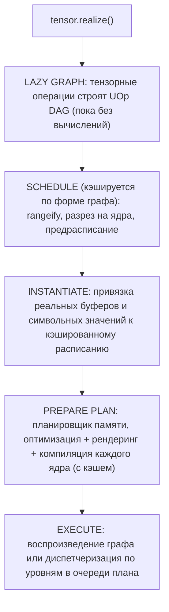
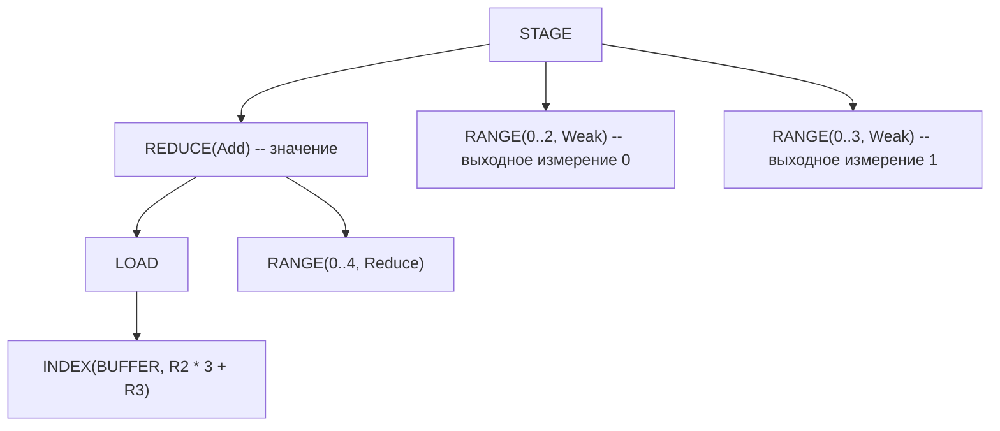
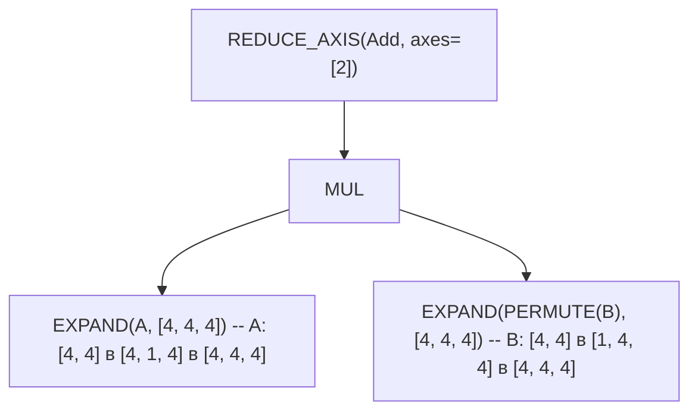
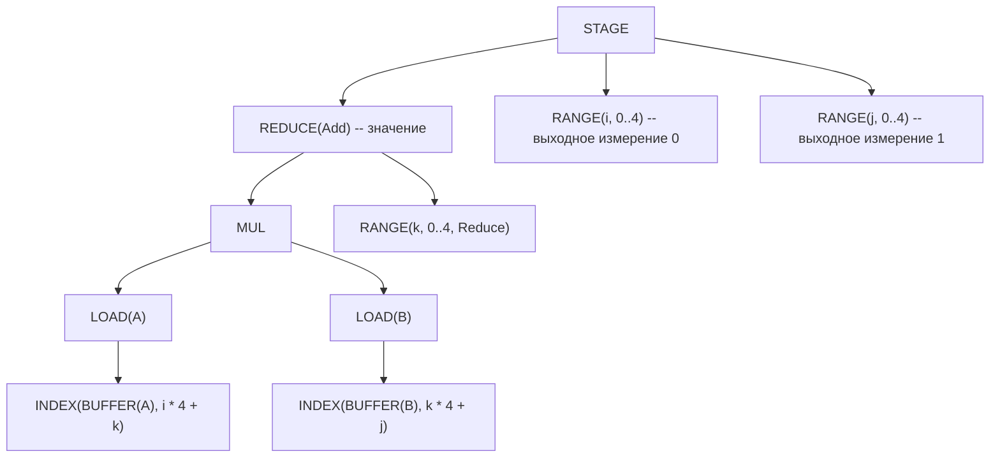
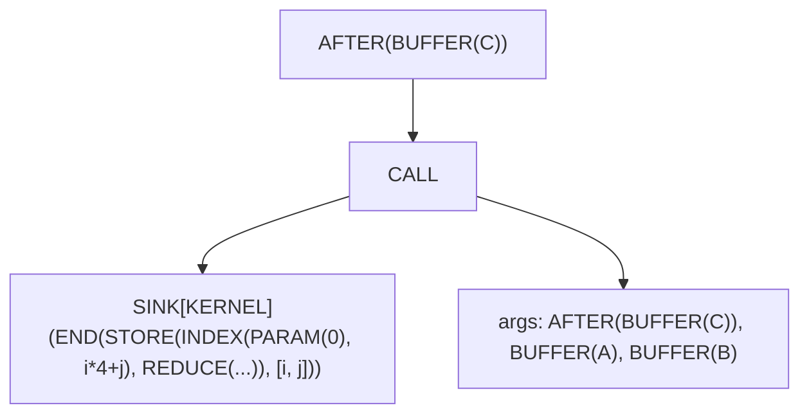

# От тензора до машинного кода

В большинстве ML-фреймворков вычисления происходят немедленно. Напишите `a + b` в PyTorch — и он выполнится *сейчас*: GPU перемалывает числа ещё до того, как вы успеете заглянуть в результат. Такое eager-выполнение просто для понимания, но упускает возможности для оптимизации. Как компилятор может оптимизировать вычисление, которое он ещё не видел?

Svod использует противоположный подход: **ленивые вычисления**. Когда вы пишете `a.try_add(&b)?`, ничего не вычисляется. Svod строит граф, описывающий *что* вычислить, а не *когда*. Работа выполняется при вызове `realize()` — этот единственный метод запускает весь пайплайн компиляции, от высокоуровневых тензорных операций до JIT-скомпилированного машинного кода.

Эта глава прослеживает этот путь. Страница [о дизайне IR](./ir-design.md) объясняет тип узла, общий для всех стадий; [главы о кодогенерации](./codegen/overview.md) проходят по оптимизатору ядра проход за проходом; эта страница — карта, связывающая их.



---

## Ленивые вычисления: построение графа

`Tensor` в Svod — это хендл:

```rust
pub struct Tensor {
    entry: Arc<TensorEntry>,
}

pub struct TensorEntry {
    pub id: u64,
    pub uop: RwLock<Arc<UOp>>,     // the computation this tensor represents
    buffer: OnceLock<Arc<Buffer>>, // filled by realization
}
```

UOp находится за `RwLock`, чтобы граф можно было подменять на месте (см. реестр ниже), а буфер живёт в общей записи, а не в хендле, поэтому клонирование тензора разделяет и его реализацию. Именно поэтому `realize()`, `prepare()` и `profile()` принимают `&self`.

### Три способа создать тензор

**1. Входные тензоры** — буфер выделяется и заполняется сразу:

```rust
let a = Tensor::from_slice([1.0f32, 2.0, 3.0]);
// a.buffer() is Some(..): device memory allocated, bytes copied in
```

`from_slice` (и `from_ndarray`, который копирует один раз для C-непрерывного входа) выделяет `Buffer` на устройстве, копирует ваши байты через `copyin` и строит граф `BUFFER.reshape(shape)`. Отложенного копирования с хоста нет.

**2. Ленивые операции** — никакого буфера, только граф:

```rust
let b = a.try_add(&a)?;   // b.buffer() is None
let c = b.try_mul(&a)?;   // c.buffer() is None
```

Арифметические операции ничего не вычисляют. Они строят UOp-граф: `Binary(Add, a.uop, a.uop)`. Тензор существует исключительно как описание будущей работы.

**3. Movement-операции** — представления поверх исходного хранилища:

```rust
let d = a.try_reshape(&[1, 3])?;  // d.buffer() resolves to a's storage
```

Reshape, permute и подобные операции создают новую ленивую запись, чей граф — `RESHAPE(a.uop)`. Запись не владеет буфером; `buffer()` спускается до базового узла `BUFFER` и находит хранилище `a` через реестр.

### Глобальный реестр

`tensor/src/tensor_registry.rs` хранит две lock-free карты `papaya`:

| Карта | Ключ → значение | Назначение |
|-----|-------------|---------|
| `TENSORS` | id тензора → `Weak<TensorEntry>` | Все живые тензоры, для подстановки в графе |
| `BUFFERS` | id UOp `BUFFER` → `Arc<Buffer>` | Поиск памяти устройства при планировании и в `buffer()` |

Реестр делает возможной **глобальную подстановку в графе**: когда `realize()` завершается, реализованный подграф заменяется своим `BUFFER` во всех тензорах, которые на него ссылались (`apply_map_to_tensors_realized`), так что последующий `realize()` зависимого тензора читает результат, а не вычисляет его заново. Записи `BUFFERS` удаляются через хук удаления UOp, когда удаляется сам узел `BUFFER`.

### Hash consing в действии

Поскольку UOp подвергаются hash consing (интернированию по содержимому), идентичные вычисления разделяют память:

```rust
let x = a.try_add(&b)?;
let y = a.try_add(&b)?;
// x.uop() and y.uop() are the SAME Arc<UOp>
```

Именно это делает описанные ниже кэши дешёвыми: два тензора с одинаковой формой вычисления приходят в планировщик одним и тем же узлом, а каждый ключ кэша — структурный `content_hash` графа, поэтому попадание случается даже для графов, построенных по отдельности (или в другом запуске процесса).

---

## Что делает `realize()`

`Tensor::realize` (`tensor/src/realize.rs`) короткий:

```rust
pub fn realize(&self) -> Result<()> {
    if self.uop().has_buffer_identity() { self.ensure_buffer(); return Ok(()); }
    if is_any_const(&self.uop()) { self.set_uop(self.uop().contiguous()); }  // force a buffer
    if self.has_zero_elements() { return Ok(()); }

    let old_uop = self.uop();
    let plan = self.prepare_plan_with(&PrepareConfig::from_env())?;  // schedule + compile
    plan.execute()?;
    self.finalize_realize(&plan, &old_uop)?;      // tensor ← BUFFER.reshape(shape)
    apply_map_to_tensors_realized(&{old_uop => realized_uop});
    Ok(())
}
```

`prepare_plan_with` оборачивает граф в `SINK(CONTIGUOUS(uop))` и выполняет два шага: `schedule_result_from_sink_with_cache` (следующий раздел) и `prepare_execution_plan` (раздел за ним). `prepare()` выполняет те же два шага и отдаёт вам `ExecutionPlan`, чтобы вы запускали его сами; `realize_batch` / `prepare_batch` делают то же для нескольких тензоров через один `SINK(CONTIGUOUS(t1), …, CONTIGUOUS(tN))`, так что ядра, питающие больше одного выхода, разделяются. `PrepareConfig::from_env()` читает из окружения стратегию оптимизатора, бюджет потоков и режим планировщика памяти (таблица в конце); `realize_with` / `prepare_with` принимают явную конфигурацию.

---

## Планирование: от графа к ядрам

### Кэш расписаний

Планирование (rangeify плюс разрез на ядра) — самый дорогой шаг компиляции, и он зависит только от *формы* графа, а не от того, какие буферы тот читает. Поэтому `schedule_result_from_sink_with_cache` сначала **нормализует** sink — каждый `BUFFER` становится позиционным `PARAM`, каждый `BIND(DEFINE_VAR, CONST)` теряет своё значение времени выполнения — и ищет результат в общем для процесса кэше с ключом `(content_hash(normalized sink), compiler identity)`. При попадании сразу переходим к инстанцированию; при промахе rangeify выполняется один раз на ключ, даже если несколько потоков соревнуются (single-flight). `SVOD_DISABLE_SCHEDULE_CACHE=1` отключает кэш.

Промах кэша выполняет по порядку: `rangeify_with_map` → `try_get_kernel_graph` → `wrap_scan_loops` (циклы уровня расписания для scan-операций) → `create_pre_schedule`.

### Rangeify: делаем циклы явными

Когда вы пишете `tensor.reshape([2, 3]).expand([4, 2, 3]).sum(axis=0)`, эти movement-операции — высокоуровневые описания. Чтобы сгенерировать циклы, итерация должна стать явной. **Rangeify** (`rangeify_with_map`, `schedule/src/rangeify/transforms.rs`) превращает movement-операции в циклы `RANGE` и арифметику `INDEX`:

| Шаг | Код | Назначение |
|------|------|---------|
| Мультиустройство | `multi_pm()`, `lower_allreduce_pm()` | Разрешение шардирования тензоров на нескольких устройствах, понижение `ALLREDUCE` |
| Теги | `add_tags_patterns()` | Нумерация каждого узла, чтобы идентичность тензоров пережила переписывания |
| Вызовы | `resolve_calls()` | Встраивание непредкомпилированных `FUNCTION`, свёртка `GETTUPLE(TUPLE)` |
| Ранние переписывания | `movement_op_patterns() + early_rewrites() + split_reduceop_patterns()` | Очистка movement-операций; разбиение больших редукций на две стадии |
| Назначение диапазонов | `indexing::run_rangeify` | Решить, что материализуется (`pm_generate_realize_map`), назначить `RANGE` на каждую выходную ось, затем понизить `REDUCE_AXIS` → `REDUCE`, `PAD` → `WHERE`, `STACK` → `WHERE` и вставить `STAGE` + `INDEX` там, где значения материализуются |
| Мега-проход | `symbolic() + pm_reduce_simplify() + movement_op_patterns() + buffer_folding() + dead_axis_removal() + pm_remove_bufferize()` | Один цикл до неподвижной точки: алгебра, упрощение редукций, свёртка буферов, удаление мёртвых осей, удаление `STAGE`, которые можно слить |
| Выходы | перестройка `SINK` | Оставить только публичные выходы |
| Лимит буферов | `buffer_limit_patterns(limit)` | Разбить ядра, которые превысили бы лимит аргументов устройства |

Каждый шаг — переписывание на основе паттернов (см. [Движок паттернов](./optimizations/pattern-system.md)). Проходы над отдельными ядрами, которые [глава о Rangeify](./codegen/rangeify.md) описывает как стадии 1–7 (ранние movement-операции, свёртка загрузок, разбиение диапазонов, начальная символьная оптимизация, упрощение диапазонов), выполняются позже, в `apply_pre_optimization()`, когда граф уже разрезан на ядра.

Каждая movement-операция понижается в конкретное преобразование индекса (`apply_movement_op`, `schedule/src/rangeify/indexing.rs`):

| Операция | Преобразование |
|-----------|----------------|
| **RESHAPE** | Свернуть по выходным шагам, разложить обратно через `/` и `%` по входной форме |
| **PERMUTE** | Переупорядочить диапазоны по обратной перестановке |
| **EXPAND** | Индекс расширенной оси становится `0` (диапазон больше не влияет на адрес) |
| **PAD** | Индекс становится `WHERE(valid, rng - begin, INVALID)`; дополненное значение — `WHERE(valid, src, 0)` |
| **SHRINK** | `rng + begin` |
| **FLIP** | `(size - 1) - rng` |

После rangeify movement-операций не остаётся — только арифметика над индексами. До и после для выражения выше:

```text
Before: BUFFER.reshape([2, 3]).expand([4, 2, 3]).sum(axis=0)
```



`EXPAND` превратился в `RANGE(0..4)`, который не входит в индекс буфера, — это и есть broadcasting. `RESHAPE` стал индексной арифметикой. `SUM` стал `REDUCE(Add)`, закрывающим диапазон `Reduce`. Выходные диапазоны здесь `Weak`: оптимизатор позже решит, какие из них станут `Global`, `Local` или `Upcast`.

### Разрез на ядра

`try_get_kernel_graph` (`schedule/src/rangeify/kernel.rs`) разбивает граф после rangeify на ядра:

**Шаг 1: STAGE → STORE** (`pm_add_buffers_patterns`, `bufferize_to_store`). Каждый `STAGE` получает свежий узел `BUFFER` (пока без памяти устройства) и становится записью под своими диапазонами, обёрнутой в `AFTER` над этим буфером:

```text
Before: STAGE(compute, ranges)
After:  AFTER(BUFFER, [END(STORE(INDEX(BUFFER, flat_idx), compute), ranges)])
```

**Шаг 2: разбиение записей на ядра** (`split_all_stores` → `split_store`). Каждая запись становится вызываемым объектом. Внутри тела глобальные `BUFFER` превращаются в `PARAM(slot = N)` в порядке сопоставления паттернов (счётчик `LocalAddBufferContext.param_slot`), тело запечатывается как `SINK` с `KernelInfo`, а ядро — это `CALL`, аргументы которого — буферы (в виде `AFTER`) и нужные ему `BIND`:

```text
After:  AFTER(BUFFER, [CALL(SINK[KERNEL](END(STORE(...), ranges)), args = [AFTER(BUFFER..), BIND..])])
```

Операции `KERNEL` не существует: ядро — это `CALL` от `SINK[KERNEL]`. Также при разрезе на `CALL` собирается атрибуция происхождения (см. [Происхождение ядер](./kernel-origins.md)).

**Шаг 3: исправление присваиваний** (`fix_assign`). Когда ядро B читает буфер, который пишет ядро A, `AFTER` ядра B добавляется в зависимости `AFTER` ядра A, так что запись-после-чтения в один и тот же буфер сохраняет порядок. Зависимости живут в узлах `AFTER`; отдельного графа зависимостей не существует, пока не построено расписание.

### Предрасписание и инстанцирование

`create_pre_schedule` (`tensor/src/schedule.rs`) обходит граф ядер, сортирует вызываемые объекты по Кану по их зависимостям `AFTER` и записывает для каждого ядра AST и *идентичности* буферов, которых оно касается, — но не сами буферы. Именно это хранит кэш. Затем `instantiate_schedule` восстанавливает реальные `BUFFER`, выделяет хендлы `Buffer` для промежуточных значений и выходов (выходы остаются видимыми с хоста, если не задан `PrepareConfig::device_local_outputs`), привязывает символьные значения и выдаёт:

```rust
pub struct ScheduleResult {
    pub items: Vec<ScheduleItem>,
    pub output_uop_ids: Vec<u64>,
    pub alias_output_buffers: HashMap<u64, Buffer>,  // outputs that alias an input
}

pub struct ScheduleItem {
    pub kernel: Arc<UOp>,              // the CALL: dependency identity
    pub ast: Arc<UOp>,                 // the SINK[KERNEL] body (for codegen)
    pub buffers: Vec<Buffer>,          // device buffers, in CALL argument order
    pub buffer_uop_ids: Vec<u64>,      // their BUFFER UOp ids
    pub fixedvars: HashMap<String, i64>,  // bound symbolic variables
    pub loop_var_names: HashSet<String>,  // fixedvars fed by schedule-loop counters
    pub dependencies: Vec<u64>,        // producer CALL ids
    pub instance_dependencies: Vec<usize>, // producer schedule-item indices
}
```

---

## Подготовка плана

`prepare_execution_plan` (`tensor/src/realize.rs`) превращает элементы расписания в `ExecutionPlan`. Он выполняется вне какой-либо области происхождения и сначала задаёт размер общего пула потоков из `PrepareConfig::threads`.

### Планировщик памяти

До того как что-либо выделено, планировщик (`tensor/src/memory_planner/`) решает, какие промежуточные буферы могут разделять память. Время жизни измеряется в **уровнях выполнения** — волнах Кана по DAG ядер (`compute_topological_levels`, общая с рантаймом), — и буфер, последний раз использованный на уровне *L*, может переиспользовать память, впервые используемую на уровне после *L*. Планировщик не добавляет рёбер упорядочивания; безопасность обеспечивает барьер между уровнями, который исполнитель и так соблюдает.

| `SVOD_MEMORY_PLANNER` | Режим | Эффект |
|---|---|---|
| не задано, `1`, `arena` | `Arena` (по умолчанию) | Упаковать планируемые буферы в одну TLSF-арену на устройство; каждый логический буфер становится `Buffer::view` в неё |
| `remap`, `pool` | `Remap` | Объединять целые буферы в пулы по `(device, dtype, size rounded to 256 B)` и подменять `Arc<Buffer>` |
| `0`, `off`, `none`, `disabled` | `Disabled` | Каждый буфер сохраняет собственное выделение |

Входы, выходы, память с алиасами, дисковые буферы и операнды копирований/пользовательских функций никогда не планируются.

### Компиляция ядер и кэши

Каждый элемент, не являющийся копированием, разрешается в `KernelSite`: его устройство, рендерер и `OptKey`. Ядра, отсутствующие в кэше, оптимизируются параллельно, именуются в порядке расписания (суффиксы `n1`, `n2` входят в текст исходника, поэтому именование не должно зависеть от таймингов потоков), затем рендерятся и компилируются:

```text
ast ──► apply_pre_optimization ──► heuristics | BEAM ──► post-optimization ──► PROGRAM ──► LINEAR ──► SOURCE ──► BINARY
```

- `apply_pre_optimization()`: очистка movement-операций, `pm_load_collapse`, `pm_split_ranges + pm_flatten_range`, `sym + pm_fold_cast_const`, `pm_simplify_ranges`.
- Оптимизатор выбирает типы осей и тайлинг: по умолчанию [эвристики](./optimizations/kernel-search.md), [BEAM-поиск](./optimizations/kernel-search.md) при `BEAM=N` или явный список `opts_to_apply` для ядер, пониженных вручную.
- Пост-оптимизация понижает ядро через стадии, которые [обзор кодогенерации](./codegen/overview.md) обозначает метками 08–20: символьная оптимизация после opt, экспандер (диапазоны `Upcast`/`Unroll` → линии), локальные буферы, `pm_add_gpudims` (диапазоны `Global`/`Local` → `SPECIAL`), `pm_add_loads`, девекторизатор (с `bool_storage_patterns`), коалесцирование доступа к памяти, понижение dtype индексов, декомпозиции dtype (`pm_float_decomp`, `pm_long_decomp`), поздние переписывания (`pm_fma_decomposition`, когда у цели есть `MulAcc`, быстрое деление, …), `pm_move_gates_from_index` и финальное переписывание (`pm_split_ends`, неявные барьеры). `SVOD_DUMP_STAGE=<prefix>` печатает ядро после любой из них.
- `program_from_sink_with_renderer` добавляет поток управления, нумерует оставшиеся слоты `PARAM` и строит узел `PROGRAM`; `do_linearize` / `do_render` / `do_compile` заполняют его поля `LINEAR`, `SOURCE` и `BINARY` (`codegen/src/program_pipeline.rs`).

Три кэша в процессе и один на диске делают повторную работу бесплатной:

| Кэш | Ключ | Охват |
|-------|-----|-------|
| Кэш расписаний | `content_hash(normalized SINK)` + идентичность компилятора | rangeify + разрез на ядра |
| `OPT_CACHE` | `content_hash(kernel AST)` + устройство + ключ компилятора + отпечаток рендерера + отпечаток оптимизатора | оптимизированный AST и скомпилированная программа; FIFO, ограничен `SVOD_OPT_CACHE_MAX` (4096) |
| Кэш скомпилированных программ | `content_hash(PROGRAM)` + ключ компилятора | `CachedKernel`: хендл программы, исходник, точка входа, ABI-слоты; живёт всё время процесса |
| Кэш объектов (CPU) | SHA-256 исходника + `CompilerIdentity` (бэкенд, цель, тулчейн, флаги, ABI) | перемещаемые объекты в `~/.cache/svod/objects` (`SVOD_OBJECT_CACHE_DIR`, `SVOD_OBJECT_CACHE=0` для отключения) |

Все ключи — структурные хэши, а не id UOp, поэтому граф, перестроенный с нуля — или в другом процессе, — всё равно попадает в кэш. У результатов BEAM свой дисковый кэш (`SVOD_BEAM_CACHE_DIR`).

### ExecutionPlan

Результат (`runtime/src/execution_plan.rs`):

```rust
pub struct ExecutionPlan {
    ops: Vec<PreparedOp>,               // CompiledProgram | BufferCopy | CustomFunction
    op_order: Vec<usize>,               // topological order
    op_levels: Vec<Vec<usize>>,         // Kahn levels: ops in one level are independent
    buffers: Vec<Buffer>,
    ast_to_buffer: HashMap<u64, usize>, // BUFFER UOp id -> buffer index
    output_buffer_indices: Vec<usize>,  // plan outputs, in SINK source order
    device: DeviceSpec,
    runtime_var_vals: HashMap<String, i64>,
    graph: OnceLock<Option<Box<dyn Graph>>>,          // captured on first execute (GPU)
    plan_ctx: OnceLock<Option<Box<dyn PlanContext>>>, // the plan's own queue
    // ... HCQ executor state elided
}
```

| Метод | Назначение |
|--------|---------|
| `execute()` | Выполнить каждую операцию один раз с текущими буферами и значениями переменных |
| `execute_with_vars(&[(name, value)])` | Перепривязать символьные переменные (с проверкой по их `[min, max]`), затем выполнить — без перекомпиляции |
| `output_buffer()` / `output_buffer_at(i)` / `num_outputs()` | Выходы плана (`i` следует порядку источников SINK) |
| `profile(&ProfileOptions)` | Воспроизведённый запуск с временными метками, возвращающий `RunProfile` |
| `declare_input(idx)` / `replicate()` | То, на чём строится [JIT-обёртка](./jit-graphs.md) |

План **переиспользуем**: компилируем один раз, выполняем много раз с разными данными в тех же буферах.

---

## Кодогенерация

Два рендерера (`svod_codegen::Renderer`) покрывают четыре бэкенда устройств; выбор делает устройство:

| Бэкенд устройства | Рендерер | Выход |
|----------------|----------|--------|
| **CPU** | `LlvmTextRenderer` (по умолчанию) или `CRenderer` (`SVOD_CPU_BACKEND=clang`) | Текст LLVM IR или исходник на C |
| **CUDA** | `LlvmTextRenderer::nvptx(arch)` | LLVM IR, ABI `ptx_kernel` |
| **AMD** | `LlvmTextRenderer::amd(arch)` | LLVM IR, ABI `amdgpu_kernel` |
| **Metal** | `CRenderer::metal()` | Metal Shading Language |

```rust
pub trait Renderer {
    fn render(&self, uop: &Arc<UOp>, name: Option<&str>) -> Result<RenderedKernel>;
    fn backend_name(&self) -> &str;
    fn decompositor(&self) -> Option<TypedPatternMatcher<()>>;
}
```

Рантайм оборачивает каждый из них в `svod_device::device::Renderer` уровня устройства, который добавляет возможности цели (`supported_ops`, `gpu_arch`, дополнительные и ISA-матчеры) и возвращает `ProgramSpec`: исходник, точку входа, имена переменных и слоты буферов `globals` / `outs` / `ins`, через которые план привязывает аргументы.

LLVM-рендерер (`codegen/src/llvm/text/`) обходит поток операций `LINEAR` и выдаёт по одной функции на ядро. Каждый буфер — прямой параметр `ptr noalias align 32 %dataN`, без массива аргументов, а символьные переменные (плюс `core_id` для многопоточности на CPU) — типизированные скалярные параметры:

```llvm
define void @E_128(ptr noalias align 32 %data0, ptr noalias align 32 %data1, i32 %N) #0 {
entry:
  br label %loop_0

loop_0:
  %i = phi i32 [ 0, %entry ], [ %i.next, %loop_0 ]
  ; ... computation ...
  %i.next = add nsw i32 %i, 1
  %cond = icmp slt i32 %i.next, 128
  br i1 %cond, label %loop_0, label %exit

exit:
  ret void
}
```

---

## Компиляция и загрузка

На CPU текст IR превращается в перемещаемый объект и загружается в процесс; нет ни LLVM `ExecutionEngine`, ни временной разделяемой библиотеки:

1. **Компиляция** с `-O2` — через libLLVM, привязанную в процессе с помощью `libloading`, если она доступна (`SVOD_LLVM_INPROCESS=0` отключает это, `SVOD_LLVM_LIB` указывает на библиотеку), иначе `clang -x ir -c -O2 … -o -` через stdin/stdout.
2. **Переиспользование** объекта из дискового кэша, если исходник и идентичность компилятора совпадают.
3. **Загрузка** ELF-загрузчиком: секции в анонимный mmap, применение релокаций, страницы переключаются в исполняемые (`runtime/src/jit_loader.rs`; см. [JIT-компилятор](../backends/jit-loader.md)).

```rust
let object = cache.get_or_compile(key, validate_relocatable_object, |ir| producer.compile(ir))?;
let (fn_ptr, _mmap) = jit_load(&object, &entry_point)?;  // ELF loader, no linker
```

GPU-бэкенды вместо этого отдают тот же LLVM IR драйверу: PTX JIT-компилируется драйвером CUDA (или `ptxas`, если он установлен), объекты кода AMDGPU загружаются через KFD, исходник Metal компилируется фреймворком Metal.

---

## Выполнение

`ExecutionPlan::execute()` выбирает один из трёх путей, все под блокировкой исполнителя плана:

1. **Воспроизведение графа.** Если каждая операция — скомпилированное ядро на устройстве плана без непривязанных символьных переменных и у устройства есть фабрика графов (CUDA Graphs, граф AMD PM4/AQL, indirect command buffer в Metal), план захватывает всю последовательность диспетчеризации при первом `execute()` и затем воспроизводит её, исправляя только изменившиеся аргументы ядер. Страница [JIT-графы](./jit-graphs.md#graph-capture-and-replay) описывает бэкенды и их переключатели.
2. **Нативный связанный план** (AMD). Планы, которые граф захватить не может, — с переменными времени выполнения, копированиями или пользовательскими функциями, — захватываются как один связанный поток команд HCQ, аргументы ядер в котором переупаковываются при каждом воспроизведении.
3. **Диспетчеризация по операциям.** Иначе план проходит `op_levels` уровень за уровнем и отправляет каждую операцию в собственную очередь плана (`PlanContext::dispatch`, асинхронно на GPU) или напрямую вызывает программу на CPU.

Внутри одного плана операции одного уровня *не* выполняются на отдельных потоках хоста: уровни служат барьером переиспользования для планировщика памяти и порядком захвата графа. Параллелизм на CPU — внутри ядра (оси `Thread` распределяются по пулу rayon) и между разными планами. Каждый `PreparedKernel` несёт своё устройство, поэтому план может охватывать несколько устройств, а операции `BufferCopy` перемещают данные между ними.

---

## Разбор на примере: матричное умножение

Проследим `C = A.matmul(&B)?` через пайплайн для матриц 4×4.

### Стадия 1: построение ленивого графа

```rust
let a = Tensor::from_slice(a_data).try_reshape(&[4, 4])?;  // input buffer allocated
let b = Tensor::from_slice(b_data).try_reshape(&[4, 4])?;  // input buffer allocated
let c = a.matmul(&b)?;                                     // graph built, no computation
```

`matmul` преобразует `A` к форме `[4, 1, 4]`, а `B` — к `[1, 4, 4]`, транспонирует `B`, перемножает (broadcasting вставляет `EXPAND`) и суммирует по последней оси:



### Стадия 2: Rangeify

Movement-операции становятся явными циклами:



Диапазоны `i` и `j` — выходные измерения. Диапазон `k` — измерение редукции (свёртки).

### Стадия 3: разрез на ядра

Один `STAGE` → одна запись → один `CALL`:



### Стадия 4: расписание

Один `ScheduleItem`:
- `kernel`: `CALL`
- `ast`: `SINK[KERNEL]`
- `buffers`: `[C, A, B]` — `C` выделяется сейчас, `A` и `B` уже в памяти
- `dependencies`: `[]` (ядер-производителей нет)

### Стадия 5: оптимизация

Эвристический оптимизатор выбирает, например, `Upcast` по `j` на 4 (вектор `float4` на запись) и `Unroll` по `k`; на GPU `i` становится `Global`.

### Стадия 6: кодогенерация

Сгенерированный LLVM IR, в скалярной форме для читаемости:

```llvm
define void @r_4_4_4(ptr noalias align 32 %data0, ptr noalias align 32 %data1, ptr noalias align 32 %data2) #0 {
entry:
  br label %loop_i

loop_i:
  %i = phi i32 [ 0, %entry ], [ %i.next, %loop_i.end ]
  br label %loop_j

loop_j:
  %j = phi i32 [ 0, %loop_i ], [ %j.next, %loop_k.end ]
  br label %loop_k

loop_k:
  %k = phi i32 [ 0, %loop_j ], [ %k.next, %loop_k ]
  %acc = phi float [ 0.0, %loop_j ], [ %acc.new, %loop_k ]
  %a_val = load float, ptr ...  ; A[i, k]  (data1)
  %b_val = load float, ptr ...  ; B[k, j]  (data2)
  %prod = fmul float %a_val, %b_val
  %acc.new = fadd float %acc, %prod
  %k.next = add nsw i32 %k, 1
  %k.cond = icmp slt i32 %k.next, 4
  br i1 %k.cond, label %loop_k, label %loop_k.end

loop_k.end:
  store float %acc.new, ptr ...  ; C[i, j]  (data0)
  ; ... continue j, i loops
}
```

### Стадия 7: выполнение

1. Скомпилировать IR (или взять объект из кэша) и загрузить его.
2. `execute()`: один `PreparedKernel`, вызываемый с `[C_ptr, A_ptr, B_ptr]` в порядке `ProgramSpec.globals`.
3. `finalize_realize` перенаправляет `c` на `BUFFER(C).reshape([4, 4])`.

---

## Справочник переменных окружения

Переменные, управляющие этим пайплайном (параметры оптимизатора и бэкендов перечислены на их собственных страницах):

| Переменная | Эффект |
|----------|--------|
| `SVOD_DEVICE` | Устройство по умолчанию (`CPU`, `CUDA:0`, `AMD:0`, `METAL`); если не задано — Metal на macOS, CPU в остальных случаях |
| `SVOD_CPU_BACKEND` | `llvm` (по умолчанию) или `clang` |
| `SVOD_THREADS` | Бюджет потоков для компиляции и CPU-ядер (по умолчанию: доступный параллелизм) |
| `SVOD_NOOPT`, `BEAM=N` | Стратегия оптимизатора: никакой или beam search ширины N (по умолчанию: эвристики) |
| `SVOD_MEMORY_PLANNER` | `arena` (по умолчанию), `remap`, `off` |
| `SVOD_DISABLE_SCHEDULE_CACHE=1`, `SVOD_OPT_CACHE_MAX` | Отключение кэша расписаний; ёмкость кэша оптимизированных ядер |
| `SVOD_OBJECT_CACHE=0`, `SVOD_OBJECT_CACHE_DIR`, `SVOD_OBJECT_CACHE_MAX_BYTES` | Дисковый кэш объектов |
| `SVOD_LLVM_INPROCESS=0`, `SVOD_LLVM_LIB` | Принудительно использовать подпроцесс `clang`; выбрать libLLVM для привязки |
| `SVOD_PER_STAGE_UOPS=1`, `SVOD_DUMP_STAGE=<prefix>`, `SVOD_DUMP_LINEAR=<dir>`, `SVOD_DUMP_LLVM_IR=<dir>` | Дамп ядра после каждой или одной стадии оптимизатора, линеаризованного потока, отрендеренного IR |
| `SVOD_SPEC=1` | Проверять IR по спецификации графа ядер после каждой фазы |
| `SVOD_ORIGIN=1` | Привязывать ядра к коду модели ([Происхождение ядер](./kernel-origins.md)) |
| `RUST_LOG` | Фильтр `tracing`; `debug` печатает тайминги фаз, `trace` — отображения буферов |

---

## Глубинная идея

**Ленивые вычисления делают возможной глобальную оптимизацию.** Откладывая вычисления, планировщик видит весь граф до разреза на ядра; слияние — норма, а материализация — исключение.

**Явные циклы делают возможным планирование под конкретное железо.** Movement-операции — удобные абстракции, но железу нужны циклы. Rangeify перекидывает мост через этот разрыв, и оптимизатору остаётся лишь сменить `AxisType` диапазона.

**Структурное хэширование делает кэширование автоматическим.** Каждый кэш — расписаний, оптимизированных ядер, скомпилированных программ, объектных файлов — использует как ключ хэш содержимого UOp-графа, поэтому вторая модель той же формы стоит лишь выделения памяти и диспетчеризации, и ничего больше.

**Разделение ответственности делает каждую стадию простой.** Rangeify ничего не знает об LLVM. Кодогенерация ничего не знает о семантике тензоров. Каждая стадия делает одно дело — над одним и тем же IR.
