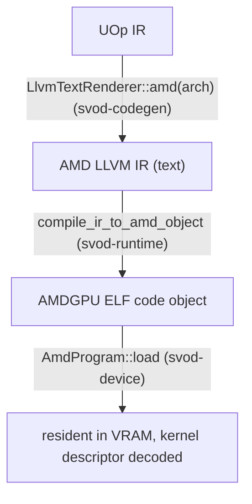

# Компиляция и граф

Эта страница прослеживает ядро от отрендеренного LLVM IR до работающей
диспетчеризации, а затем описывает, как целая цепочка ядер захватывается в один
переигрываемый командный поток. Машинерия диспетчеризации, на которой это
строится — кольца, вычислительные полосы, таймлайн — описана в
[Очередях и диспетчеризации](./queues-and-dispatch.md).

---

## От IR до загруженной программы

Путь компиляции — это **текст AMD LLVM IR → `clang` → ELF code object →
загрузка в VRAM**. Совместно работают три крейта, связанные вместе в
`runtime/src/devices/amd.rs`:



### Рендеринг

`AmdRendererWrapper` (`runtime/src/devices/amd.rs`) рендерит через
`LlvmTextRenderer::amd(arch)`. Его `supported_ops` исключает `Exp`, `Log`,
`Sin`, `Cos`, `Tan` и `Erf` (а также `Pow`, `Max` и `Threefry`, как у любого
GPU-рендерера), так что планировщик декомпозирует их до рендеринга: его
`decompositor` — это `svod_ir::decompositions::amd_decomposition_patterns()`,
который опускает `exp`, `log`, `cos`, `tan` и `pow` в полиномы в стиле SLEEF
поверх нативных `exp2`/`log2` для `f16`/`f32`/`f64` — операнды bf16, fp8 и
целочисленные приводятся к f32 вокруг полинома — и переписывает приведения
f32→bf16 в целочисленную форму round-to-nearest-even; `sin` по той же причине
идёт через общие трансцендентные паттерны (`v_sin_f32` точен только на малых
аргументах). Нативными интринсиками `@llvm.*` остаются только `exp2`, `log2` и
`sqrt` (~1 ulp на железе AMD). Локальный для рендерера `amd_extra_matcher()`
выполняется последним.

### Компиляция

`compile_ir_to_amd_object` (`runtime/src/amd/compile.rs`) запускает `clang`,
подавая IR на stdin и читая ELF обратно со stdout — без временных файлов, в том
же in-memory стиле, что и [JIT-загрузчик CPU](../jit-loader.md):

```text
clang -x ir -c -O3 --target=amdgcn-amd-amdhsa -mcpu=<arch> \
      -mcumode -nogpuinc -Wno-override-module -fno-math-errno [-nogpulib] - -o -
```

`-nogpulib` добавляется, только если IR не ссылается ни на одну точку входа
`@__ocml_*`: рендерер выдаёт интринсики `@llvm.*` для каждой унарной операции с
плавающей точкой, которую умеет выбрать бэкенд AMDGPU, так что библиотеки
устройства ROCm нужны лишь для унарных операций f64, кроме `sqrt`. IR входит в
ключ кэша объектов, поэтому вычислять флаг по нему безопасно. Результат
проверяется (`validate_amd_object`: ELF64-LE, `EM_AMDGPU`, арка в `e_flags`,
определённый `<name>.kd`), прежде чем он будет закэширован под идентичностью
`amd-clang` или загружен.

Для одной единицы трансляции `clang` внутри себя вызывает `lld`, так что
вывод — это напрямую загружаемый AMDGPU ELF, без отдельного шага линковки.
Мемоизированная на процесс проверка `ClangToolchain::has_target("amdgcn")`
(`clang --print-targets`) превращает clang без таргета AMDGPU в аккуратную
ошибку `JitCompilation`, а не в краш. Установка `SVOD_DUMP_AMD_IR=<dir>`
выгружает `.ll` каждого ядра для разбора.

### Загрузка и разбор дескриптора

`AmdProgram::load` (`device/src/amd/program.rs`) парсит ELF крейтом `object` и
раскладывает образ так, как это делает `elf_loader` из tinygrad: секции
`SHF_ALLOC` с ненулевым адресом идут по своему адресу; секции с адресом 0
дописываются с выравниванием. Он проверяет ELF64-LE + `EM_AMDGPU`, применяет
релокации `R_AMDGPU_ABS64` / `R_AMDGPU_REL64` / `R_AMDGPU_REL32`, которые
выдаёт clang (всё прочее — это аккуратная ошибка, а не тихая запись нулей), и
разрешает символ дескриптора ядра **`<name>.kd`**.

Из 64-байтного `AmdHsaKernelDescriptor` он выводит всё, что нужно
диспетчеризации:

| Выведенное | Из |
|---|---|
| `aql_prog_addr` | `code_gpu + kd_offset` (AQL `kernel_object`) |
| `pm4_prog_addr` | `aql_prog_addr + kernel_code_entry_byte_offset` (вход шейдера; регистры LO/HI несут `>> 8`) |
| `rsrc1 / rsrc2 / rsrc3` | `compute_pgm_rsrc{1,2,3}`; `rsrc1` получает бит cwsr-priv на gfx11, `rsrc2` — поле размера LDS, `rsrc3` используется как есть |
| `wave32` | `kernel_code_properties & 0x400` (дефолт RDNA3/4) |
| `target_major` | 9 / 11 / 12, из арки устройства |
| размеры kernarg / scratch / group | `kernarg_size`, `private_segment_fixed_size`, `group_segment_fixed_size` |

При загрузке выполняются две проверки безопасности: слишком большой
group-сегмент (LDS) сразу падает с `GroupSegmentTooLarge`, а ядро,
выставляющее `ENABLE_SGPR_DISPATCH_PTR` (которому потребовался бы HSA
dispatch-пакет рядом с kernarg'ами — ещё не подключено), отклоняется. Code
object копируется в видимый хосту `nolru` VRAM-буфер, удерживаемый на время
жизни программы.

---

## Диспетчеризация ядра

`AmdProgram::execute_on(owner, pool, buffers, vals, global_size, local_size,
wait, profile)` — это ограниченный полосой путь диспетчеризации, который
используют планы и графы: `owner` — это `OwnerCtx`, хранящий логическое
состояние плана, а `pool` — эксклюзивно арендованная `PoolQueue`. (Метод трейта
`Program::execute` собирает одноразовый `OwnerCtx`, который арендует полосу, и
делегирует сюда.) Он:

1. **Проверяет** число буферов и скаляров на соответствие ядру и убеждается,
   что упакованная раскладка kernarg помещается:
   `ClikeKernargLayout::from_abi(abi)` раскладывает параметры в порядке
   ABI-слотов с естественным выравниванием (указатели по 8 байт, скаляры по 4),
   и её `packed_size()` не должен превышать `kernarg_size` дескриптора.
2. **Заполняет слот kernarg**, продвигая (bump) 16-мегабайтную арену kernarg
   устройства (общую для всех полос, с выравниванием 16 байт; при переходе через
   край сначала дренируются все полосы), записывая каждый VA буфера как 8 байт, а каждый скаляр как 4-байтный `i32`. Упаковка в
   `i32` сделана намеренно — рендерер опускает `Index → i32`, так что
   `kernarg_size` дескриптора отражает 4-байтные переменные; упаковка по 8 байт
   переполнилась бы в следующий слот.
3. **Собирает отправку (submission)** — `hcq::Submission` из `MemoryBarrier`, а
   затем `Compute`, несущую VA kernarg'ов, тройку `rsrc` и адрес PM4-программы.
4. **Диспетчеризует** через `queue.submit_hcq_dispatch(pool, &submission, …)`.
   На PM4-очереди `lower_hcq_pm4` → `build_exec_pm4` выдаёт сырые dword'ы, а
   опциональный 4-dword'овый дескриптор scratch дописывается в начало
   `COMPUTE_USER_DATA_0` из того же снимка `scratch_address`, который
   записывается в `COMPUTE_DISPATCH_SCRATCH_BASE`, — так что параллельный
   scratch-realloc не может рассогласовать дескриптор и регистр. На AQL-очереди
   `lower_hcq_aql_submission_program` выдаёт ожидание/барьер как PM4-пакеты
   vendor-IB, 64-байтный пакет диспетчеризации (`build_dispatch_packet_barrier`)
   и запись таймлайна через vendor-IB, а управляющие байты размещаются в арене
   kernarg.
5. Удерживает code object, регистрирует финализатор как находящийся в полёте и
   записывает его как самое свежее завершение владельца. Если задан `wait`,
   дренирует через `synchronize()` владельца.

`Program::execute` (путь трейта на каждый вызов) идёт через
`PlanContext::dispatch`: он дожидается предыдущей эпохи, арендует полосу,
диспетчеризует, как описано выше, а при `wait = false` завершает эпоху и
записывает финализатор как неатрибутированный токен, который позже наблюдает
`wait_storage`.

---

## Захват и переигрывание графа: `AmdGraph`

Когда одна и та же цепочка ядер выполняется многократно (стриминговый
инференс), платить за круговой обход
`wait → barrier → exec → signal → doorbell` на каждое ядро N раз —
расточительство. `AmdGraph` (`device/src/amd/graph.rs`) — построенный по образцу
`HCQGraph` из tinygrad, но с одним барьером и без межъядерных сигналов —
захватывает всю цепочку в **один командный поток** (PM4
или AQL, смотря какой использует очередь), привязывает его к видимой хосту
странице и переигрывает **одним doorbell**.

### Структура

Граф — это один шаг таймлайна устройства:

```text
preamble:   Wait(timeline signal, timeline value)
            MemoryBarrier          ← one per graph, after the wait
per kernel: Compute(...)           ← no inter-kernel signal/wait; same-queue
                                     ordering is the acquire_mem +
                                     CS_PARTIAL_FLUSH that exec already emits
final:      Store(timeline signal, next timeline value)
```

Каждый адрес и каждое значение в этом потоке — это **заглушка (placeholder)**,
привязанная к `PatchSource`: `System(SystemField::TimelineSignal/TimelineValue)`
для концов таймлайна, `System(ScratchAddress)`/`System(ScratchTmpring)` для
PM4-scratch и записи `LinkAddress` для указателей на программу и kernarg'и — и
все они разрешаются при переигрывании относительно арендованной полосы, так что
граф композируется с обычной per-call диспетчеризацией и `synchronize`. Захват
размещает по одному фиксированному слоту kernarg на ядро в отдельной странице
`AllocTag::Kernarg` — именно владение этой страницей (а не использование общей
катящейся арены kernarg, которую параллельная per-call диспетчеризация могла бы
обогнать по кругу вплоть до устаревших VA) и делает переигрывание безопасным.

Переигрывание (`Graph::replay`) сериализует принадлежащую графу изменяемую
память, ждёт свой предыдущий финализатор, захватывает эксклюзивную
вычислительную полосу, обеспечивает полосе scratch, патчит текущие kernarg'и и
системные поля, а затем публикует резидентный PM4 IB или AQL-программу отправки.
При идентичных аргументах упаковка kernarg'ов пропускается целиком. Возврат
асинхронный; следующее переигрывание дождётся, прежде чем переиспользовать эту
память. `replay_profiled` выполняет вариант с отдельным слотом
`SystemField::Timestamp` на каждое ядро и синхронизируется, прежде чем вернуть
метки времени.

### Когда происходит захват

Захват ограничен несколькими условиями и откатывается к per-call
диспетчеризации — при `Ok(None)`, а также при ошибке захвата, которую план
поглощает, — если хоть одно из них не выполнено:

- Цепочка должна состоять **целиком из скомпилированных ядер без
  несвязанных переменных** — копии, view'ы и динамические размеры запуска
  оставляют хост в цикле; связанная переменная (скажем, счётчик цикла
  расписания) допустима и передаётся как `vals` при переигрывании.
- Цепочка должна быть **однодевайсной**, и каждый текущий буфер переигрывания
  должен быть подкреплён ровно тем же физическим владельцем выделения.
  `AmdGraph::capture` перепроверяет это ниже: каждое ядро должно быть
  `AmdProgram` на том же `Arc<AmdDevice>` (`Arc::ptr_eq`).
- Захват AQL-графа поддерживается. Захват PM4-графа включается явно через
  `SVOD_PM4_GRAPH=1`, потому что не на каждом GPU gfx11/12 он даёт выигрыш в
  производительности.

:::note[Владение очередью]
Графы не удерживают аппаратную очередь. Захват хранит неизменяемые шаблоны и
принадлежащую графу резидентную/управляющую память; каждое переигрывание
арендует полосу из ограниченного пула.
:::

---

## Почему это важно

Компиляция — это один подпроцесс `clang` и загрузка ELF в VRAM — без рантайма
ROCm, без временных файлов (кэш объектов сохраняет результат на диск), тот же
минимализм, что и на пути CPU. План сначала пробует граф, затем нативное
связанное переигрывание, затем прямую диспетчеризацию. Диспетчеризация
переиспользует всю механику полос и таймлайна из
[Очередей и диспетчеризации](./queues-and-dispatch.md), так что обещание
[JIT-графов](../../architecture/jit-graphs.md) «скомпилировать один раз /
переиграть много» воплощается на AMD с одним doorbell на переигрывание: на
AQL-железе — по умолчанию, а на PM4-железе — как только его явно включит
`SVOD_PM4_GRAPH=1`.
