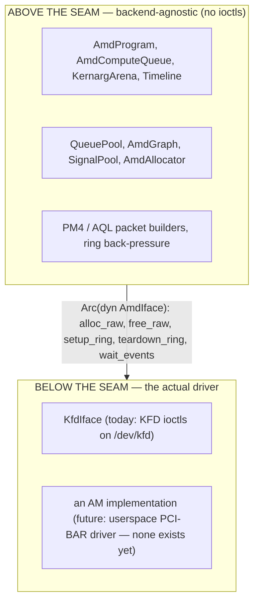
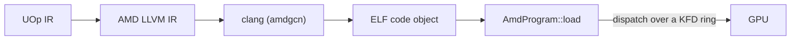

# AMD-бэкенд

Svod работает на GPU AMD, общаясь с драйвером ядра напрямую. Здесь нет ни HIP,
ни рантайма ROCr/HSA, ни `libamdhip64.so` — единственная внешняя зависимость —
это `clang` с таргетом AMDGPU (для компиляции). Всё остальное — выделение VRAM,
построение командных колец, диспетчеризация ядер, ожидание завершения —
делается сырыми вызовами `ioctl` к `/dev/kfd`, интерфейсу Linux **KFD**
(Kernel Fusion Driver), который поставляется внутри модуля ядра `amdgpu`.

Дизайн — это порт `ops_amd.py` из
[tinygrad](https://github.com/tinygrad/tinygrad), работающего напрямую через
KFD, и его модели HCQ (Hardware Command Queue); порт привязан к конкретному
коммиту tinygrad в `device/src/amd/mod.rs`, а раскладки пакетов и
последовательность инициализации следуют этому эталону.

Код находится в крейте `svod-device`, в `device/src/amd/`.

---

## Поддерживаемые GPU

Узел поддерживается, если его KFD `gfx_target_version` отображается в `AmdArch`
(`dtype/src/amd_arch.rs`; кодировка — `major*10000 + minor*100 + step`,
десятичная):

| `gfx_target_version` | `AmdArch` | Семейство | Размер волны | Матричные ядра |
|---|---|---|---|---|
| `90402` | `Gfx942` | CDNA3 (MI300) | 64 | MFMA |
| `90500` | `Gfx950` | CDNA (MI350) | 64 | MFMA |
| `110000` / `110001` / `110002` | `Gfx1100` / `Gfx1101` / `Gfx1102` | RDNA3 (Radeon 7000) | 32 | WMMA |
| `110501` | `Gfx1151` | RDNA3.5 (Strix Halo / Strix Point) | 32 | WMMA |
| `120000` / `120001` | `Gfx1200` / `Gfx1201` | RDNA4 (Radeon RX 9000) | 32 | WMMA |

У каждой поддерживаемой архитектуры есть матричные ядра; RDNA2 и более ранние
не поддерживаются, а `gfx90a` в списке нет. Размер волны следует архитектуре
(64 на CDNA, 32 в остальных случаях), передаётся в clang через `-mcpu` и входит
в строку ABI кэша объектов. Открытие неподдерживаемого узла завершается ошибкой
`DeviceUnavailable` с перечислением поддерживаемых семейств.

---

## Провайдер исполнения, определяемый во время выполнения

AMD-бэкенд всегда компилируется и никогда не прячется за cargo-фичей: модуль
`amd` объявлен безусловно, а всё, что касается ядра ОС (ioctl-обёртки,
аллокатор, очереди, программы, графы), находится под `cfg(unix)`, как и
зависимости `nix`, `libc` и `bindgen`. Парсер топологии и билдеры пакетов
компилируются везде. Доступность решается **во время выполнения**, в стиле
ORT: реестр устройств зондирует железо через
`svod_device::amd::has_devices()` — чтение топологии KFD только из sysfs, без
побочных эффектов — и регистрирует фабрику устройств `"AMD"` *только* тогда,
когда поддерживаемый GPU присутствует. На хосте без `/dev/kfd` тип устройства
`"AMD"` просто не появляется.

Смысл — в надёжности: поскольку бэкенд участвует в проверке типов каждой
Unix-сборки, изменение API в обобщённом ядре (скажем, в трейте `Program` или
`PlanContext`) отлавливается на каждой dev-машине на `cargo check`, а не только
на хосте с GPU. Цена — время компиляции, и мы на это идём. Шаг bindgen,
соответственно, **герметичен** — он работает на вендоренных заголовках и не
требует системных заголовков ядра (см. [Привязки KFD](./kfd-bindings.md)).

---

## Почему KFD-direct, а не HIP

«Здравомыслящий человек», пишущий AMD-бэкенд, тянется к HIP (рантайм, похожий
на CUDA) или к лежащему под ним рантайму HSA. Svod намеренно так не делает. Вот
почему:

- **Никакой зависимости от userspace-рантайма.** HIP/ROCr — это сотни мегабайт
  разделяемых библиотек, которые должны совпадать с версией драйвера ядра.
  KFD — это стабильный ядерный `ioctl`-ABI; бинарник Svod линкует `libc` +
  `nix` и вызывает `clang`, и больше ничего. Бэкенд работает на любом хосте с
  достаточно свежим `amdgpu` и таргетом `amdgcn` у `clang` — без установки ROCm
  (device-библиотеки ROCm линкуются только для трансцендентных функций f64, см.
  [Компиляция и графы](./compile-and-graph.md)).
- **Детерминированный контроль.** Мы сами владеем командным кольцом, doorbell,
  сигналом таймлайна, видимыми в таблице страниц выделениями и
  scratch-буфером. Между нами и железом нет рантайма, который переупорядочивал
  бы отправки или прятал состояние, а это важно для диспетчеризации на
  арендуемых полосах, вокруг которой построен бэкенд (см.
  [Очереди и диспетчеризация](./queues-and-dispatch.md)).
- **Проверенный эталон.** Модель HCQ из tinygrad работает напрямую через KFD и
  обкатана в бою. Портируя её, мы наследуем её точные раскладки пакетов и
  последовательность инициализации, а не реверсим собственные.

И HIP, и ROCr лежат *поверх* KFD — они открывают тот же `/dev/kfd` и выдают те
же ioctl, что и мы. Прямой доступ убирает промежуточные слои, а не
возможности.

:::note[Аналог на CPU]
KFD-direct — это AMD-аналог того, что [ELF JIT-загрузчик](../jit-loader.md)
делает на CPU: пропустить тяжеловесный вендорский тулчейн и приводить в
действие голый механизм прямо в процессе. Путь CPU `mmap`-ит перемещаемый
объект; AMD-бэкенд загружает code object в VRAM и диспетчеризует его через
KFD-кольцо.
:::

---

## Шов бэкенда

Бэкенд разделён на две половины трейтом **`AmdIface`**
(`device/src/amd/iface.rs`):



Всё, что *не* является вызовом ядра ОС — 16-мегабайтное командное кольцо,
построение пакетов PM4/AQL, bump-арена kernarg, счётчик таймлайна, загрузчик
программ, — живёт выше шва. Трейт намеренно крошечный: **пять обязательных
методов** (`alloc_raw`, `free_raw`, `setup_ring`, `teardown_ring`,
`wait_events`) плюс три хука, по умолчанию ничего не делающих
(`queue_event_mailbox`, `publication_checkpoint`, `update_queue_percentage`).
Ключевая идея, благодаря которой он остаётся малым, в том, что кольцо,
GART-страница, EOP-буфер и MQD — это *просто GPU-память*: они выделяются выше
шва через `alloc_raw`, и единственное, что драйвер действительно обязан делать
иначе, — это **активировать очередь** (замапить doorbell, сообщить
планировщику, что кольцо существует), то есть `setup_ring`. `KfdIface` —
единственная реализация за пределами тестового набора.

Реализация выбирается при открытии устройства по переменной окружения
`SVOD_AMD_BACKEND`:

| `SVOD_AMD_BACKEND` | Бэкенд | Статус |
|---|---|---|
| `kfd` (по умолчанию) | `KfdIface` — KFD-direct | В эксплуатации |
| любое другое значение | — | Отвергается: `unknown SVOD_AMD_BACKEND=... (only 'kfd' supported)` |

:::caution[Драйвер AM — это заготовка]
`device/src/amd/am/` содержит экспериментальный userspace-драйвер, который
общается с PCI BAR'ами GPU напрямую. Он не реализует `AmdIface`, не может быть
выбран и ни разу не выполнил ни одного ядра: его инициализация была опробована
один раз (июнь 2026) на виртуальной функции SR-IOV CDNA3 вплоть до
программирования контекста GMC, через отдельные примеры `am_*`. Что именно
существует, см. в [Драйвер AM](./am-driver.md).
:::

---

## Память устройства и очередь копирования SDMA

При открытии устройства бэкенд устанавливает **очередь копирования SDMA**
(`AmdCopyQueue`) на каждом поддерживаемом чипе, что переключает
`has_sdma_queue` в true; неудача при её создании пишет предупреждение и
оставляет буферы видимыми хосту, а `AMD_DISABLE_SDMA` (любое значение)
пропускает попытку. Раньше очередь была только на CDNA из-за опасений по
стабильности на RDNA, которые восходили к рукопожатию сброса HDP, с тех пор
исправленному. С ней промежуточные данные могут жить в **VRAM, доступной
только устройству** (`cpu_access = false`), а копирования хост↔устройство идут
через асинхронный DMA: `_copyin`/`_copyout` проходят через очередь SDMA, а
`_transfer` — это DMA устройство→устройство, если хотя бы одна сторона доступна
только устройству (два отображённых на хост буфера — это `memmove` хоста). Если
очереди копирования нет, аллокатор откатывается на более простую модель:
каждый буфер принудительно делается видимым хосту (VRAM, отображаемая на CPU,
или GTT), а копирования — это `memmove` хоста после `wait_storage`,
ограниченного хранилищем. Выделение и копирования описаны в
[Привязки KFD](./kfd-bindings.md).

---

## Запуск на AMD

GPU выбирается переменной окружения `SVOD_DEVICE`: `AMD:N` — это N-й GPU-узел
[топологии KFD](./kfd-bindings.md) в порядке узлов (просто `AMD` — это узел 0;
`HIP` — допустимый псевдоним; значение не зависит от регистра). Фабрика
регистрируется, если поддерживается *хоть один* узел, поэтому `AMD:0` всё равно
может завершиться ошибкой `DeviceUnavailable`, если сам узел 0 —
неподдерживаемый чип:

```bash
SVOD_DEVICE=AMD:0 cargo run --release -p svod-model --example gigaam_infer -- ./audio.wav
```

Единственное требование к хосту во время выполнения, помимо поддерживаемого
GPU AMD, — это `clang` с таргетом `amdgcn` в `PATH` (для компиляции ядер — см.
[Компиляция и графы](./compile-and-graph.md)); установка ROCm/HIP не нужна.
Для сборки крейта нужен `libclang` для bindgen. На странице
[Очереди и диспетчеризация](./queues-and-dispatch.md) перечислены все
переменные окружения.

---

## Место в конвейере

AMD-бэкенд — это аппаратная половина компилятора. Фронтенд понижает тензоры в
единый UOp IR; codegen отображает этот IR на индексы потоков GPU (стадия
["Add GPU Dims"](../../architecture/codegen/devectorizer.md) превращает
диапазоны в SPECIAL-индексы `gidxN`/`lidxN`, согласно
[Дизайну IR](../../architecture/ir-design.md)); рендерер выдаёт AMD LLVM IR; а
этот бэкенд компилирует и запускает его:



Слой [JIT-графов](../../architecture/jit-graphs.md) оборачивает это так, что
граф модели компилируется один раз и воспроизводится многократно.

---

## Путеводитель

| Страница | О чём она |
|---|---|
| [Привязки KFD](./kfd-bindings.md) | Как привязан ABI ядра (bindgen над вендоренным заголовком), какие именно ioctl используются, топология sysfs и поток выделения |
| [Очереди и диспетчеризация](./queues-and-dispatch.md) | Командное кольцо, PM4 против AQL, ограниченный пул вычислительных полос, публикация и дренирование всего устройства, таймлайн и все переменные окружения конфигурации |
| [Компиляция и графы](./compile-and-graph.md) | Как ядро проходит путь от LLVM IR до загруженной программы, как оно диспетчеризуется и как работают захват/воспроизведение графа (AQL по умолчанию, PM4 по запросу) |
| [Драйвер AM](./am-driver.md) | Экспериментальный userspace-драйвер: что построено, чего нет и как он подключился бы к шву |
| [Отладка](./debugging.md) | Реестр VA→выделение для разбора отказов, защёлка отравления и диагностика диспетчеризации/трассировки |
