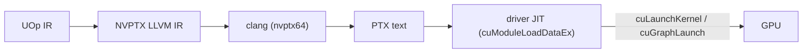

# CUDA-бэкенд

Svod работает на GPU NVIDIA через **CUDA driver API** (`libcuda.so.1`) и больше
ни через что из стека CUDA: ни тулкита, ни `nvcc`, ни NVRTC, ни `libcudart`.
Ядра рендерятся в NVPTX LLVM IR, опускаются в текст PTX хостовым `clang` и
JIT-компилируются в SASS драйвером при загрузке модуля. Дизайн следует
`ops_cuda.py` из tinygrad; код живёт в `device/src/cuda/` (драйвер, память,
программы, графы), `runtime/src/cuda/` и `runtime/src/devices/cuda.rs`
(компиляция и фабрика устройств) и `codegen/src/llvm/nvptx/` (рендерер).

---

## Требования

| Требование | Зачем |
|---|---|
| Драйвер NVIDIA, предоставляющий `libcuda.so.1` | Каждый вызов драйвера разрешается из неё во время выполнения через `libloading` |
| Драйвер **CUDA 12.0 (R525) или новее** | Точки входа CUDA-графов привязаны по версионированным именам (`cuGraphAddKernelNode_v2`, `cuGraphExecKernelNodeSetParams_v2`), появившимся в 12.0; PTX ISA зафиксирована на **7.8** (`--cuda-feature=+ptx78`), которую любой такой драйвер JIT-компилирует |
| `clang`, собранный с таргетом **NVPTX** | `clang -x ir --target=nvptx64-nvidia-cuda` превращает отрендеренный IR в PTX |

Проверить их на хосте:

```bash
ldconfig -p | grep libcuda.so.1          # библиотека драйвера
nvidia-smi | grep 'CUDA Version'         # уровень CUDA у драйвера (>= 12.0)
clang --print-targets | grep nvptx64     # бэкенд NVPTX
```

clang без NVPTX даёт аккуратную ошибку `JitCompilation`, называющую способ
исправления (`-DLLVM_TARGETS_TO_BUILD='X86;AArch64;NVPTX'`). Для запуска
CUDA-тулкит не нужен; `ptxas` и `compute-sanitizer` полезны только для
[отладки](./debugging.md).

---

## Провайдер исполнения, определяемый во время выполнения

Бэкенд **всегда компилируется**, на каждом хосте, и не прячется ни за какой
cargo-фичей (старой фичи `cuda` на основе `cudarc` больше нет). Доступность
решается во время выполнения: `svod_device::cuda::has_devices()` загружает
`libcuda.so.1`, разрешает каждую привязанную точку входа, вызывает `cuInit(0)`
и `cuDeviceGetCount` и мемоизирует ответ. Реестр устройств рантайма
регистрирует фабрику `"CUDA"` только тогда, когда это `true`; на хосте без
драйвера тип устройства `CUDA` просто не появляется, а аппаратные тесты сами
себя пропускают.

Это тот же контракт, что и у [AMD-бэкенда](../amd/overview.md): места вызова
драйвера проходят проверку типов в каждом `cargo check`, так что изменение API в
обобщённых трейтах `Program` / `PlanContext` / `Graph` отлавливается без GPU.

---

## Запуск на CUDA

Выберите GPU переменной `SVOD_DEVICE` (`CUDA:N`; `NV` и `GPU` принимаются как
алиасы, просто `CUDA` означает устройство 0):

```bash
SVOD_DEVICE=CUDA:0 cargo run --release -p svod-model --example gigaam_infer -- ./audio.wav
```

Открытие устройства логирует одну строку уровня `info` с его именем, `sm_XY`,
числом SM, поддержкой managed-памяти и версией драйвера
(`RUST_LOG=svod_device=info`).

Compute capability читается у драйвера при открытии и хранится как открытый
`CudaArch { major, minor }` (`sm_86`, `sm_120`, ...). Она выбирает
`clang -march`, входит в ключ кэша объектов и определяет профиль оптимизатора
(`OptimizerRenderer::for_cuda_arch`):

| Capability | Tensor cores в профиле |
|---|---|
| ниже `sm_75` | нет |
| `sm_75` | f16 `m16n8k8` |
| `sm_80`+ | f16 и bf16 `m16n8k16`, f16 `m16n8k8`; хранение в bf16. tf32 остаётся opt-in (`cuda_sm80(true)`) |
| `sm_89`+ | набор sm_80 плюс fp8 `m16n8k32`, который рендерер пока не может накормить (см. [Ограничения](./limitations.md)) |

---

## Где он находится в пайплайне



Скомпилированный PTX кэшируется на диске общим кэшем объектов; драйвер держит
собственный кэш SASS (`~/.nv/ComputeCache`), так что горячий старт пропускает и
clang, и `ptxas`.

---

## Тесты

Тесты, работающие только на хосте (таблица символов, раскладки структур,
упаковка kernarg, логика таймлайна, валидация PTX, эталонный NVPTX IR),
выполняются везде. Аппаратные тесты досрочно возвращаются через
`cuda_device_or_skip()`, когда устройства нет, так что на CUDA-хосте они
прогоняются по умолчанию:

```bash
cargo test -p svod-device cuda
cargo test -p svod-codegen nvptx
SVOD_DEVICE=CUDA:0 cargo test -p svod-tensor            # варианты `cuda` из codegen_tests!
SVOD_DEVICE=CUDA:0 cargo test -p svod-onnx              # варианты `cuda` из набора ONNX
```

---

## Путеводитель по чтению

| Страница | Что она покрывает |
|---|---|
| [Архитектура](./architecture.md) | Привязки драйвера, контекст и стримы, виды памяти, загрузка и запуск программ, таймлайны, CUDA-графы, идентичность кэша объектов |
| [Кодген](./codegen.md) | Рендерер NVPTX: интринсики, барьеры, трансцендентные функции, tensor cores `mma.sync`, launch bounds, вызов clang и валидация PTX |
| [Профилирование](./profiling.md) | Таймстампы GPU на основе событий, ресурсы через `cuFuncGetAttribute`, какие уровни профайлера существуют на CUDA |
| [Ограничения](./limitations.md) | Чего пока нет и дорожная карта |
| [Отладка](./debugging.md) | Переменные окружения, дампы IR, чтение ошибок драйвера и JIT, офлайн-проверки через `ptxas` |
