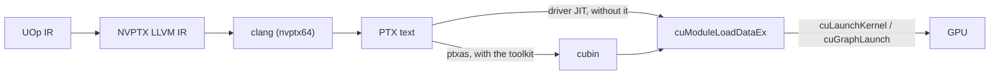

# CUDA-бэкенд

Svod работает на GPU NVIDIA через **CUDA driver API** (`libcuda.so.1`) и больше
ни через что из стека CUDA: ни тулкита, ни `nvcc`, ни NVRTC, ни `libcudart`.
Ядра рендерятся в NVPTX LLVM IR, опускаются в текст PTX хостовым `clang`,
ассемблируются в cubin через `ptxas`, когда установлен CUDA-тулкит, и иначе
JIT-компилируются в SASS драйвером при загрузке модуля. Дизайн следует
`ops_cuda.py` из tinygrad; код живёт в `device/src/cuda/` (драйвер, память,
программы, графы), `runtime/src/cuda/` и `runtime/src/devices/cuda.rs`
(компиляция и фабрика устройств) и `codegen/src/llvm/nvptx/` (рендерер).

---

## Требования

| Требование | Зачем |
|---|---|
| Драйвер NVIDIA, предоставляющий `libcuda.so.1` | Каждый вызов драйвера разрешается из неё во время выполнения через `libloading` |
| Драйвер **CUDA 12.0 (R525) или новее** | Точки входа CUDA-графов привязаны по версионированным именам (`cuGraphAddKernelNode_v2`, `cuGraphExecKernelNodeSetParams_v2`), появившимся в 12.0. Фиксация PTX ISA следует вычислительной способности: **7.8** вплоть до sm_88, **8.4** на sm_89 и sm_90 (ради их fp8-форм `mma.sync`; CUDA 12.4 / R550), **8.6** на sm_100 — sm_102 (CUDA 12.7), **8.7** на sm_120 (CUDA 12.8), **8.8** на sm_103, sm_121 и новее (CUDA 12.9) — карте Blackwell нужен драйвер той ISA, которая её ввела |
| `clang`, собранный с таргетом **NVPTX** | `clang -x ir --target=nvptx64-nvidia-cuda` превращает отрендеренный IR в PTX |

Проверить их на хосте:

```bash
ldconfig -p | grep libcuda.so.1          # библиотека драйвера
nvidia-smi | grep 'CUDA Version'         # уровень CUDA у драйвера (>= 12.0)
clang --print-targets | grep nvptx64     # бэкенд NVPTX
```

clang без NVPTX даёт аккуратную ошибку `JitCompilation`, называющую способ
исправления (`-DLLVM_TARGETS_TO_BUILD='X86;AArch64;NVPTX'`). Для запуска
CUDA-тулкит не нужен: `ptxas`, найденный в `PATH`, в `/opt/cuda/bin` или в
`$CUDA_PATH/bin`, используется для предассемблирования ядер, когда он там
оказался (`SVOD_CUDA_PTXAS=0` отключает это; при непригодном `ptxas`
логируется предупреждение и дело берёт на себя JIT драйвера), а
`compute-sanitizer` полезен для [отладки](./debugging.md), но обязательным не
является ни то, ни другое. Нижней границы вычислительной способности в коде
нет: `CudaArch` открыт, и работает то, что принимают драйвер и `-march` у clang.

---

## Провайдер исполнения, определяемый во время выполнения

Бэкенд **всегда компилируется**, на каждом хосте, и не прячется ни за какой
cargo-фичей (старой фичи `cuda` на основе `cudarc` больше нет). Доступность
решается во время выполнения: `svod_device::cuda::has_devices()` загружает
`libcuda.so.1`, разрешает каждую привязанную точку входа, вызывает `cuInit(0)`
и `cuDeviceGetCount` и мемоизирует ответ. Реестр устройств рантайма
регистрирует фабрику `"CUDA"` только тогда, когда это `true`; на хосте без
драйвера тип устройства `CUDA` просто не появляется, а аппаратные тесты сами
себя пропускают. Драйвер старше 12.0 приводит к тому же результату — одного из
`_v2`-символов графов нет, так что загрузка не удаётся и бэкенд остаётся
незарегистрированным без предупреждения.

Это тот же контракт, что и у [AMD-бэкенда](../amd/overview.md): места вызова
драйвера проходят проверку типов в каждом `cargo check`, так что изменение API в
обобщённых трейтах `Program` / `PlanContext` / `Graph` отлавливается без GPU.

---

## Запуск на CUDA

Выберите GPU переменной `SVOD_DEVICE` (`CUDA:N`, без учёта регистра; `GPU`
принимается как алиас,
просто `CUDA` означает устройство 0). `NV` намеренно **не** принимается — имя
остаётся зарезервированным под будущий бэкенд с userspace-драйвером:

```bash
SVOD_DEVICE=CUDA:0 cargo run --release -p svod-model --example gigaam_infer -- ./audio.wav
```

Открытие устройства логирует одну строку уровня `info` с его именем, `sm_XY`,
числом SM, поддержкой managed-памяти, версией драйвера и тем, включена ли
синхронизация с областью видимости (`RUST_LOG=svod_device=info`).

Compute capability читается у драйвера при открытии и хранится как открытый
`CudaArch { major, minor }` (`sm_86`, `sm_120`, ...). Она выбирает
`clang -march`, входит в ключ кэша объектов и определяет профиль оптимизатора
(`OptimizerRenderer::for_cuda_arch`):

| Capability | Tensor cores в профиле |
|---|---|
| ниже `sm_75` | нет (`mma.sync` Volta не используется); нет и типа хранения bf16 |
| `sm_75` | f16 `m16n8k8` с накоплением в f32 или f16 |
| `sm_80`+ | f16 и bf16 `m16n8k16`, f16 `m16n8k8`, int8 `m16n8k32` с накоплением в i32; хранение в bf16. Строка tf32 в рендерере есть, но `for_cuda_arch` её никогда не включает, и переключателя нет |
| `sm_89`+ | набор sm_80 без изменений: fp8-ядра `m16n8k32` существуют (`sm89_tensor_cores`), но `for_cuda_arch` придерживает их, пока рендерер не умеет опускать fp8-касты (см. [Ограничения](./limitations.md)) |

---

## Где он находится в пайплайне


```mermaid
flowchart LR
  A["UOp IR"] --> B["NVPTX LLVM IR"]
  B --> C["clang (nvptx64)"]
  C --> D["PTX text"]
  D -->|"ptxas, with the toolkit"| E["cubin"]
  D -->|"driver JIT, without it"| F["cuModuleLoadDataEx"]
  E --> F
  F -->|"cuLaunchKernel / cuGraphLaunch"| G["GPU"]
```

Скомпилированный объект кэшируется на диске общим кэшем объектов — cubin, когда
установлен `ptxas`, и текст PTX иначе, причём два формата никогда не делят одну
запись. На PTX-пути драйвер держит собственный кэш SASS (`~/.nv/ComputeCache`),
так что горячий старт пропускает clang и обычно ещё и JIT.

---

## Тесты

Тесты, работающие только на хосте (таблица символов, раскладки структур,
упаковка kernarg, логика таймлайна, валидация PTX, эталонный NVPTX IR),
выполняются везде. Аппаратные тесты досрочно возвращаются через
`cuda_device_or_skip()`, когда устройства нет, так что на CUDA-хосте они
прогоняются по умолчанию:

```bash
cargo test -p svod-device cuda
cargo test -p svod-codegen nvptx
SVOD_DEVICE=CUDA:0 cargo test -p svod-tensor            # варианты `cuda` из codegen_tests!
SVOD_DEVICE=CUDA:0 cargo test -p svod-onnx              # варианты `cuda` из набора ONNX
```

---

## Путеводитель по чтению

| Страница | Что она покрывает |
|---|---|
| [Архитектура](./architecture.md) | Привязки драйвера, контекст и стримы, виды памяти, загрузка и запуск программ, таймлайны, CUDA-графы, идентичность кэша объектов |
| [Кодген](./codegen.md) | Рендерер NVPTX: интринсики, барьеры, трансцендентные функции, tensor cores `mma.sync`, launch bounds, вызов clang и валидация PTX |
| [Профилирование](./profiling.md) | Таймстампы GPU на основе событий, ресурсы через `cuFuncGetAttribute`, какие уровни профайлера существуют на CUDA |
| [Ограничения](./limitations.md) | Чего пока нет и дорожная карта |
| [Отладка](./debugging.md) | Переменные окружения, дампы IR, чтение ошибок драйвера и JIT, офлайн-проверки через `ptxas` |
