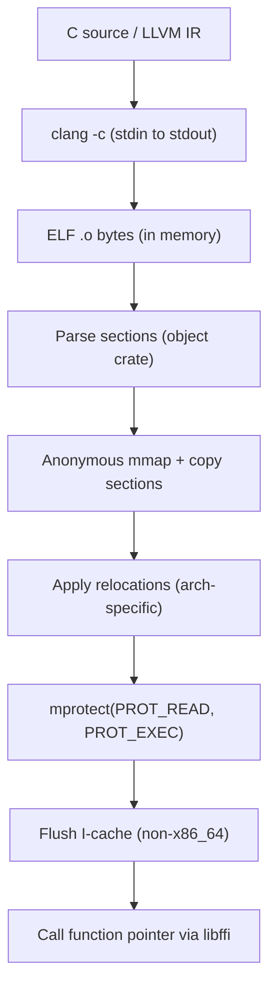

# JIT-компилятор

Большинство ML-компиляторов либо линкуют целый LLVM в бинарник — добавляя сотни мегабайт зависимостей — либо записывают временные файлы на диск и загружают результат через `dlopen`. Svod не делает ни того, ни другого.

Когда ядру нужно выполниться, Svod передаёт сгенерированный исходный код в `clang` через stdin, принимает перемещаемый ELF-объект из stdout, парсит его в процессе, копирует машинный код в анонимный mmap, применяет релокации, переключает права страниц на исполнение и вызывает функцию напрямую по указателю. Весь процесс происходит в памяти — никакие временные файлы не затрагивают диск, никакие разделяемые библиотеки не загружаются, и никакой установки LLVM не требуется кроме `clang` в PATH.

Эта глава описывает работу JIT-загрузчика для CPU. GPU-бэкенды прогоняют код через тот же `clang`, но диспетчеризуют через свои драйверы: см. [AMD-бэкенд](./amd/overview.md) (KFD-direct) и [CUDA-бэкенд](./cuda/overview.md) (driver API, PTX JIT).

## Пайплайн



И **Clang**-бэкенд (исходный код на C через `-x c`), и **LLVM**-бэкенд (текст LLVM IR через `-x ir`) используют общий загрузчик. Единственное отличие — флаг входного языка clang.

:::tip Режим совместимости
Для отладки или платформ, где пользовательский ELF-загрузчик не работает, Cargo-фича `dlopen-fallback` переключает на традиционный пайплайн: `clang -shared` записывает `.so` во временную директорию, которая загружается через `dlopen`. Это медленнее (дисковый I/O + оверхед динамического компоновщика), но более портабельно.
:::

## Поддерживаемые архитектуры

| Архитектура | Target triple | Флаг компиляции | I-cache | Примечания |
|---|---|---|---|---|
| **x86_64** | `x86_64-none-unknown-elf` | `-march=native` | Когерентный | AMD64, Intel 64 |
| **aarch64** | `aarch64-none-unknown-elf` | `-march=native` | `__clear_cache` | Apple Silicon, Ampere, Graviton |
| **riscv64** | `riscv64-none-unknown-elf` | `-march=rv64gc` | `__clear_cache` | RV64I + M + A + F + D + C расширения |
| **loongarch64** | `loongarch64-none-unknown-elf` | `-march=native` | `__clear_cache` | Loongson 3A5000+ |
| **ppc64le** | `powerpc64le-none-unknown-elf` | `-mcpu=native` | `__clear_cache` | ELFv2 ABI, только little-endian |

Архитектура определяется автоматически через `std::env::consts::ARCH` во время выполнения — никаких compile-time feature-флагов не требуется.

### Поддержка релокаций

Загрузчик реализует минимальный ELF-релокатор для каждой архитектуры. Он обрабатывает типы релокаций, которые `clang -c -O2` фактически генерирует для небольших самодостаточных вычислительных ядер — это не полноценный линкер.

**x86_64** — PC-relative (`R_X86_64_PC32`, `PLT32`, `GOTPCRELX`, `REX_GOTPCRELX`), абсолютные 32/64-бит (`R_X86_64_32`, `32S`, `64`).

**aarch64** — 26-битные ветвления (`CALL26`, `JUMP26`) с автоматической генерацией трамплинов при превышении диапазона ±128 МБ, страничная адресация ADRP (`ADR_PREL_PG_HI21`), 12-битные смещения страниц с учётом размера доступа (`ADD_ABS_LO12_NC`, `LDST8/16/32/64/128_ABS_LO12_NC`).

**riscv64** — пары вызовов (`CALL`, `CALL_PLT`), PC-relative раздельная адресация с отслеживанием состояния (`PCREL_HI20` + `PCREL_LO12_I/S`), абсолютная (`HI20`, `LO12_I/S`), ветвления (`BRANCH`, `JAL`), данные (`32`, `64`). Подсказки релаксации компоновщика (`RELAX`) пропускаются.

**loongarch64** — 26-битные ветвления (`B26`), страничная раздельная адресация (`PCALA_HI20`, `PCALA_LO12`), данные (`32`, `64`). Подсказки релаксации компоновщика (`RELAX`) пропускаются.

**ppc64le** — 24-битные ветвления (`REL24`), TOC-relative адресация с поиском символа `.TOC.` (`TOC16_HA`, `TOC16_LO`, `TOC16_LO_DS`, `TOC16`, `TOC16_HI`), PC-relative (`REL32`), абсолютная (`ADDR32`, `ADDR64`).

## Флаги компиляции

Загрузчик компилирует с bare-metal target для получения чистых, самодостаточных ELF-объектов без зависимостей от среды выполнения:

| Флаг | C-бэкенд | LLVM IR-бэкенд | Назначение |
|---|---|---|---|
| `-c` | да | да | Только компиляция (без линковки) |
| `-O2` | да | да | Уровень оптимизации |
| `-march=native` | да | да | Использовать возможности хост-CPU |
| `-fPIC` | да | да | Position-independent code |
| `-ffreestanding` | да | нет | Не предполагается hosted-окружение |
| `-fno-math-errno` | да | да | Math-builtins не устанавливают errno |
| `-fno-stack-protector` | да | да | Без накладных расходов на stack canary |
| `-nostdlib` | да | нет | Без стандартной библиотеки |
| `-fno-ident` | да | нет | Подавить секцию `.comment` |
| `--target=<arch>-none-unknown-elf` | да | да | Bare-metal ELF target |
| `-ffixed-x18` | aarch64 macOS/Win | aarch64 macOS/Win | Резервирование платформенного регистра |
| `-funroll-loops` | нет | да | Агрессивное развёртывание циклов |
| `-fvectorize` | нет | да | Векторизация циклов |
| `-fslp-vectorize` | нет | да | SLP (straight-line) векторизация |

C-бэкенд использует `__builtin_*` функции (например, `__builtin_sqrtf`, `__builtin_fmaf`) вместо `#include <math.h>`, поэтому `-ffreestanding -nostdlib` работает без потери математической поддержки — это intrinsics компилятора, которые напрямую преобразуются в аппаратные инструкции.

## Разрешение внешних символов

Если clang генерирует вызов внешней функции (редко — большинство математики обрабатывается builtins), загрузчик разрешает его через `dlsym(RTLD_DEFAULT, name)` во время загрузки. Это покрывает случаи вроде `memcpy` или специфичных для платформы символов libm, которые clang может сгенерировать вместо инлайнинга.

### Трамплины переходов (aarch64)

На aarch64 релокации `CALL26`/`JUMP26` кодируют PC-relative смещение в 26 битах, что даёт диапазон ±128 МБ. На macOS с ASLR анонимная область mmap обычно находится на ~2 ГБ от системных библиотек вроде libm — далеко за пределами этого диапазона.

Когда загрузчик обнаруживает выход `CALL26`/`JUMP26` за пределы диапазона, он генерирует **трамплин** (veneer) в зарезервированной области в конце mmap:

```text
LDR X16, [PC, #8]   // загрузить 64-битный целевой адрес
BR  X16              // непрямой переход
.quad <address>      // полный 64-битный адрес
```

Трамплины предварительно подсчитываются (перед выделением mmap) и дедуплицируются — если несколько точек вызова ссылаются на один и тот же внешний символ, они используют общий трамплин.

### Платформенный регистр (aarch64)

На macOS и Windows ARM регистр `x18` зарезервирован как платформенный. Поскольку мы компилируем с `--target=aarch64-none-unknown-elf` (bare-metal), компилятор без дополнительных указаний использовал бы `x18` как свободный GPR. Флаг `-ffixed-x18` предотвращает это, избегая крашей при выполнении JIT-кода в процессе macOS/Windows.

## Когерентность кеша инструкций

На x86_64 кеш инструкций и данных когерентен — запись машинного кода в память и переход к нему работает без дополнительных шагов. На всех остальных архитектурах загрузчик вызывает `__clear_cache(start, end)` после `mprotect`, чтобы кеш инструкций увидел новый код.
