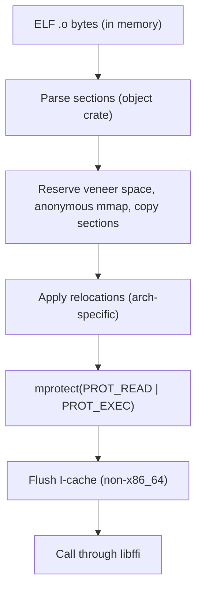

# ELF JIT-загрузчик

Оба пути кода [CPU](./cpu.md) заканчиваются перемещаемым ELF-объектом в
памяти — из libLLVM в процессе или из подпроцесса `clang -c` через
stdin/stdout. Загрузчик (`runtime/src/jit_loader.rs`) превращает эти байты в
вызываемую функцию, не трогая диск: он разбирает секции, копирует их в
анонимное отображение, применяет релокации, переключает страницы в исполняемые
и возвращает указатель на точку входа. Никакого временного файла, никакого
`dlopen`, никакого линкера.


```mermaid
flowchart TD
  A["ELF .o bytes (in memory)"] --> B["Parse sections (object crate)"]
  B --> C["Reserve veneer space, anonymous mmap, copy sections"]
  C --> D["Apply relocations (arch-specific)"]
  D --> E["mprotect(PROT_READ | PROT_EXEC)"]
  E --> F["Flush I-cache (non-x86_64)"]
  F --> G["Call through libffi"]
```

Точка входа — `jit_load(object, name) -> (fn_ptr, mapping)`; символ точки входа —
`name` или `_name`. Отображение живёт столько же, сколько владеющий им
`JitKernel` / `LlvmKernel`.

:::tip[Запасной режим]
Cargo-фича `dlopen-fallback` крейта `svod-runtime` обходит загрузчик для пути
C: `clang -shared` пишет `.so` во временный каталог, который открывает
`libloading`. Это медленнее (дисковый I/O, динамический линкер), зато
переносимо, и CI прогоняет это как проверку `test-dlopen-fallback`. Путь LLVM
всегда использует загрузчик в памяти.
:::

## Поддерживаемые архитектуры

| Архитектура | Target triple | I-cache | Примечания |
|---|---|---|---|
| **x86_64** | `x86_64-none-unknown-elf` | Когерентен | AMD64, Intel 64 |
| **aarch64** | `aarch64-none-unknown-elf` | `__clear_cache` | Apple Silicon, Ampere, Graviton |
| **riscv64** | `riscv64-none-unknown-elf` | `__clear_cache` | RV64I + M + A + F + D (`-march=rv64g`) |
| **loongarch64** | `loongarch64-none-unknown-elf` | `__clear_cache` | Loongson 3A5000+ |
| **ppc64le** | `powerpc64le-none-unknown-elf` | `__clear_cache` | ABI ELFv2; патчинг инструкций предполагает little-endian |

Архитектура определяется через `std::env::consts::ARCH` во время выполнения;
флагов фич времени компиляции нет. Объекты компилируются под bare-metal таргет
`<arch>-none-unknown-elf`, поэтому не несут зависимостей рантайма, с
PIC-релокациями. Флаги компиляции для каждого пути описаны на
[странице CPU](./cpu.md).

### Поддержка релокаций

Загрузчик реализует минимальный ELF-релокатор для каждой архитектуры. Он
обрабатывает те типы релокаций, которые реально содержит `-O2`-объект
небольшого самодостаточного вычислительного ядра, — это не полноценный
линкер. Всё остальное — чистая ошибка, а не молчаливая запись нуля.

**x86_64** — PC-относительные (`R_X86_64_PC32`, `PLT32`, `GOTPCRELX`,
`REX_GOTPCRELX`, патчатся как `S + A - P` без GOT), абсолютные 32/64-битные
(`R_X86_64_32`, `32S`, `64`).

**aarch64** — 26-битные переходы (`CALL26`, `JUMP26`) с автоматической
генерацией veneer'ов, когда цель дальше ±128 MiB, страничный ADRP
(`ADR_PREL_PG_HI21`), 12-битные смещения в странице со сдвигами по размеру
доступа (`ADD_ABS_LO12_NC`, `LDST8/16/32/64/128_ABS_LO12_NC`).

**riscv64** — пары вызовов (`CALL`, `CALL_PLT`), PC-относительная раздельная
адресация с отслеживанием состояния (`PCREL_HI20` + `PCREL_LO12_I/S`),
абсолютная (`HI20`, `LO12_I/S`), переходы (`BRANCH`, `JAL`), данные (`32`,
`64`). Подсказки релаксации линкера (`RELAX`) пропускаются.

**loongarch64** — 26-битные переходы (`B26`), постраничная раздельная адресация
(`PCALA_HI20`, `PCALA_LO12`), данные (`32`, `64`). Подсказки релаксации линкера
(`RELAX`) пропускаются.

**ppc64le** — 24-битные переходы (`REL24`), TOC-относительная адресация с
поиском символа `.TOC.` (`TOC16_HA`, `TOC16_LO`, `TOC16_LO_DS`, `TOC16`,
`TOC16_HI`), PC-относительные (`REL32`), абсолютные (`ADDR32`, `ADDR64`).

## Разрешение внешних символов

Неопределённые символы разрешаются через `dlsym(RTLD_DEFAULT, name)` во время
загрузки. Это рядовой путь, а не редкий: `sqrt`, `fma`, `floor` и `rint`
понижаются в инструкции, но `exp`, `log`, `sin`, `cos`, `tan`, `pow`, `fmod` и
`erf` попадают в объект как вызовы `libm` — независимо от того, были ли они
отрендерены как `__builtin_*` в C или как интринсики `@llvm.*` в IR. Символ,
который процесс не экспортирует, — это ошибка загрузки с его именем.

### Veneer'ы переходов (aarch64, x86_64)

На aarch64 `CALL26`/`JUMP26` кодируют PC-относительное смещение в 26 битах, что
даёт диапазон ±128 MiB; на x86_64 `PC32`/`PLT32` дают ±2 GiB. Долгоживущий
процесс заполняет область mmap сверху вниз, поэтому анонимное JIT-отображение
рано или поздно оказывается вне досягаемости `libm` и компании.

Когда прямой переход не дотягивается, загрузчик направляет его через
**veneer** (трамплин перехода) в зарезервированной области в конце
отображения:

```text
LDR X16, [PC, #8]   // load 64-bit target address
BR  X16              // indirect branch
.quad <address>      // full 64-bit address
```

Форма для x86_64 — `MOVABS $target, %r11` + `JMP *%r11`, и она применяется
только тогда, когда байт перед местом патча — настоящий опкод `call` (`E8`)
или `jmp` (`E9`); недотягивающаяся RIP-относительная ссылка на данные вместо
этого громко падает. Место под veneer'ы резервируется для каждого уникального
неопределённого символа прямого перехода до выделения отображения, а
veneer'ы дедуплицируются по адресу цели, так что места вызова одного символа
делят один трамплин.

### Платформенный регистр (aarch64)

На macOS ARM регистр `x18` зарезервирован как платформенный, и ядро ОС
затирает его при переключении контекста. Поскольку объекты компилируются под
bare-metal таргет `aarch64-none-unknown-elf`, компилятор иначе считал бы `x18`
свободным регистром общего назначения. Пути через clang передают
`-ffixed-x18`, а путь в процессе добавляет `+reserve-x18` к строке фич. Linux
ARM считает `x18` обычным регистром общего назначения, а Windows ARM не входит
в число платформ, которые поддерживает Svod.

## Когерентность кэша инструкций

На x86_64 кэши инструкций и данных когерентны — запись машинного кода в память
и переход на него работают без дополнительных шагов. На всех остальных
архитектурах загрузчик вызывает `__clear_cache(start, end)` после `mprotect`,
чтобы кэш инструкций увидел новый код.

## Вызов ядра

Указатель на точку входа вызывается через **libffi** с `KernelCif`
(`runtime/src/dispatch.rs`), построенным из дескрипторов ABI ядра: указатель на
каждый параметр хранилища, `i32` на каждый скаляр, возврат `void`. Значения
`i64` исполнителя усекаются до `i32` при вызове. Именно один CIF на ядро
позволяет каждому ядру иметь собственную арность без transmute на каждую
сигнатуру.

## Тесты

`runtime/src/test/unit/jit_loader.rs` компилирует небольшие C-ядра через clang
на любом хосте (no-op, буферы и переменные, `__builtin_sqrtf`). Тесты
veneer'ов — маршрутизация дальше 2 GiB, общий veneer, ошибка на
недотягивающейся релокации, не являющейся переходом, — только для x86_64, а
тест исполнения дальнего вызова дополнительно требует Linux. Для остальных
релокаторов отдельных тестов нет, кроме прогона набора на соответствующем
железе.
