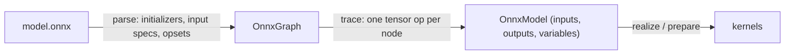

# ONNX-инференс

`svod-onnx` превращает файл `.onnx` в такой же ленивый тензорный граф, какой
строит модель, написанная вручную: каждый оператор раскладывается на операции
`svod-tensor`, поэтому импортированный граф проходит через весь планировщик,
оптимизатор и генератор кода и выполняется на любом бэкенде. ONNX Runtime под
капотом нет.

| Возможность | Статус |
|---|---|
| Прямой инференс | Поддерживается |
| Операторы | 162 из 200 стандартных операторов ([таблица соответствия](https://github.com/npatsakula/svod/blob/main/onnx/PARITY.md)) |
| Соответствие стандарту | 1357 тестов узлов из ONNX backend test suite проходят на обоих CPU-бэкендах (Clang, LLVM); набор также запускается на AMD и CUDA, если `SVOD_DEVICE` выбирает одно из этих устройств |
| Динамические размерности | Привязываются при импорте (см. [Динамические размерности](#dynamic-dimensions)) |
| Contrib-операторы Microsoft | `Attention`, `RotaryEmbedding`, `SkipLayerNormalization`, `EmbedLayerNormalization`, `BiasGelu`, `FastGelu` |
| Обучение / обратный проход | Не поддерживается |

Для операторов вне этой таблицы спецификацию целиком покрывает `ort` (обёртка
над ONNX Runtime на C++).

---

## Быстрый старт

```toml
[dependencies]
svod-onnx   = "0.2"
svod-tensor = "0.2"
prost       = "0.14"            # ModelProto::decode
```

У импортёра три точки входа:

| Вызов | Веса | Входы |
|---|---|---|
| `import(path, dim_bindings)` | Инициализаторы с плавающей точкой лениво отображаются из файла в память; `data_location = EXTERNAL` разрешается относительно каталога файла | Невыделенные заглушки, которым вы делаете `assign` |
| `import_model_with_inputs(proto, inputs, dim_bindings)` | Читаются из декодированного `ModelProto` | Ваши собственные тензоры, трассируемые прямо в граф |
| `import_model(proto, dim_bindings)` | Читаются из декодированного `ModelProto` | Заглушки, как в `import` |

Все три возвращают `OnnxModel`:

```rust
pub struct OnnxModel {
    pub inputs: HashMap<String, Tensor>,      // graph inputs that are not initializers
    pub outputs: HashMap<String, Tensor>,     // lazy; nothing has run yet
    pub variables: HashMap<String, Variable>, // one per named dim_param
}
```

### Входы во время выполнения

Создайте входные тензоры сами и передайте их импортёру. Граф трассируется на
них, поэтому тензоры, которые вы держите, — это и есть буферы, из которых читают
ядра:

```rust
use std::collections::HashMap;

use prost::Message;
use svod_onnx::parser::onnx::ModelProto;
use svod_onnx::{OnnxImporter, OnnxModel};
use svod_tensor::Tensor;

fn main() -> Result<(), Box<dyn std::error::Error>> {
    let proto = ModelProto::decode(std::fs::read("model.onnx")?.as_slice())?;

    // Same shape and dtype as the graph input "input"
    let image = Tensor::from_ndarray(&load_image_nchw());    // [1, 3, 224, 224] f32

    let OnnxModel { outputs, .. } = OnnxImporter::new().import_model_with_inputs(
        proto,
        HashMap::from([("input".to_string(), image.clone())]),
        &[("batch", 1)],
    )?;

    // Schedule every output together, run once
    Tensor::realize_batch(outputs.values())?;
    for (name, tensor) in &outputs {
        println!("{name}: {:?}", tensor.as_ndarray::<f32>()?);
    }
    Ok(())
}
```

`Tensor::from_ndarray` и `Tensor::from_raw_bytes(bytes, &dims, dtype)` дают
тензор, владеющий буфером объявленной формы; `Tensor::from_slice` всегда
одномерный, поэтому меняйте форму только через один из этих конструкторов.

### Скомпилировать один раз, запускать повторно

Для многократного инференса скомпилируйте выходы в план и между запусками
записывайте новые данные прямо во входной буфер:

```rust
let plan = Tensor::prepare_batch(outputs.values())?;   // schedule + compile, once
plan.execute()?;

for batch in batches {
    image.array_view_mut::<f32>()?.as_slice_mut().unwrap().copy_from_slice(&batch);
    plan.execute()?;                                   // replay: no tracing, no compilation
    let logits = outputs["output"].as_vec::<f32>()?;
}
```

`array_view_mut` — представление `ndarray` без копирования поверх отображения
входа на хост; `prepare_batch` связывает каждый выходной тензор с буфером
плана, поэтому `as_vec` / `as_ndarray` читают результат последнего запуска.

### Входы-заглушки

`import(path)` — точка входа, которая отображает веса в память и разрешает
внешние данные. Её входы — заглушки: сделайте `assign` значения той же формы и
выполните (realize) вход *до* выходов. Заглушка сохраняет один буфер во всех
планах, поэтому подготовленный план видит и последующие `assign` + `realize`,
и записи через `array_view_mut`.

```rust
let OnnxModel { mut inputs, outputs, .. } = OnnxImporter::new().import("model.onnx", &[])?;

let input = inputs.remove("input").unwrap();
input.assign(&Tensor::from_ndarray(&image));
input.realize()?;
Tensor::realize_batch(outputs.values())?;
```

Модели, у которой все входы — инициализаторы, ничего из этого не нужно:
её запускает `Tensor::realize_batch(model.outputs.values())?`.

---

## Динамические размерности {#dynamic-dimensions}

Именованный `dim_param` (`"batch"`, `"sequence_length"`) становится `Variable`
с границами `(1, default_max_dim)`; `default_max_dim` — публичное поле
`OnnxImporter`, по умолчанию равное 32767. Безымянная размерность или
размерность нулевого размера становится равной 1.

Привязывайте все динамические размерности при импорте. Привязанная размерность
становится обычной константой в трассированном графе, поэтому ядра
специализируются под неё:

```rust
let model = importer.import("model.onnx", &[("batch", 8), ("sequence_length", 512)])?;
println!("{:?}", model.inputs["input_ids"]);   // Tensor { shape: [8, 512], dtype: Scalar(Int64), .. }
```

Непривязанная размерность остаётся символьной: её буфер выделяется под верхнюю
границу, а `dims()` завершается ошибкой `SymbolicShape` (вывод `Debug`
показывает `shape: symbolic`). Перепривязка через
`ExecutionPlan::execute_with_vars` для импортированных графов не
поддерживается — привязанная размерность уже стала константой, а для
непривязанной компилируется ядро, которое игнорирует значение во время
выполнения. Чтобы обслуживать несколько размеров батча, импортируйте модель
отдельно для каждого размера или уменьшите `default_max_dim`, чтобы буферы
непривязанных размерностей оставались небольшими. Привязки вне допустимого
диапазона завершаются ошибкой `IrConstruction` при импорте; привязка для имени,
которое модель не объявляет, игнорируется.

---

## Как работает импортёр



**Разбор.** Protobuf декодируется, инициализаторы становятся тензорами, входы
графа — спецификациями форм, а для каждого домена записывается версия opset.
При импорте через `import` каждый инициализатор с плавающей точкой, в котором
больше одного элемента, становится ленивым представлением файла
(`SHRINK → BITCAST → RESHAPE → COPY` на устройство по умолчанию), поэтому
большая модель не требует копирования на хосте; скаляры сворачиваются в
константы.

**Трассировка.** Узлы обходятся в топологическом порядке, и каждый
диспетчеризуется в свою тензорную реализацию. Результат — набор ленивых
выходных тензоров. Некоторые операторы читают *данные* входа во время
трассировки — форму у `Reshape`, число повторов у `Tile`, k у `TopK`, `Range`,
`ConstantOfShape` и вход `axes` у редукций начиная с opset 13 (`ReduceSum`) или
18 (остальные), — поэтому эти небольшие тензоры выполняются (realize) во время
импорта. Если один из них является входом графа, передайте его через
`import_model_with_inputs`.

### Декомпозиция операторов

Около пятидесяти операторов один к одному отображаются на метод тензора:

```rust
"Add"     => x.try_add(y)?
"Relu"    => x.relu()?
"Sigmoid" => x.sigmoid()?
"Equal"   => x.try_eq(y)?
```

Операторы с множеством необязательных атрибутов используют builder-методы
тензорного крейта:

```rust
x.conv()
    .weight(w)
    .maybe_bias(bias)
    .auto_pad(AutoPad::SameLower)
    .group(32)
    .maybe_dilations(Some(&[2, 2]))
    .call()?
```

Остальные раскладываются в несколько шагов. `Mod`, например, выбирает одну из
четырёх форм по атрибуту `fmod` и dtype входа; ветка для чисел с плавающей
точкой с семантикой Python — `x - floor(x / y) * y`:

```rust
let div = x.try_div(y)?;
x.try_sub(&div.floor().try_mul(y)?)?
```

После `floor()` нет `?`: операции округления, `cast`, `neg`, `abs`, `square`
и `sign` не могут завершиться ошибкой. Побитовые операторы, стоящие за
`BitwiseAnd`/`Or`/`Xor` и `BitShift`, — это `try_bitand`, `try_bitor`,
`try_bitxor`, `try_shl` и `try_shr`.

### Атрибуты и opset

Атрибуты извлекаются по мере чтения — `attrs.int("axis", -1)`,
`attrs.float("epsilon", 1e-5)`, — а `attrs.done()` возвращает
`UnhandledAttributes`, если какие-то остались, поэтому атрибут, забытый в
реализации, приводит к ошибке импорта, а не к молча неверному результату.

Операторы меняют поведение в зависимости от версии opset, которую импортирует их
домен: `Softmax` и `LogSoftmax` по умолчанию используют ось `1` до opset 13 и
`-1` начиная с 13; `ReduceSum` принимает оси как вход начиная с opset 13, а
остальные редукции — начиная с 18. Домены `""` и `ai.onnx` используют общую
версию opset.

### Операторы трансформеров

Contrib-операторы `com.microsoft`, которые экспортирует ONNX Runtime:

| Оператор | Примечания |
|---|---|
| `Attention` | Упакованный QKV с `mask_index` (1-D, 2-D или n-D), `unidirectional`, `qkv_hidden_sizes` и KV-кешем прошлых шагов |
| `RotaryEmbedding` | Чередующийся и нечередующийся варианты |
| `SkipLayerNormalization` | Residual + LayerNorm; необязательные выходы среднего / обратного стандартного отклонения заполнены нулями |
| `EmbedLayerNormalization` | Эмбеддинги токенов + позиций + сегментов → LayerNorm; вход маски игнорируется |
| `BiasGelu`, `FastGelu` | Слитые смещение + GELU |

Стандартный `Attention` из `ai.onnx` поддерживает grouped-query attention,
каузальную маску, KV-кеш прошлых шагов, softcap, все варианты
`qk_matmul_output_mode`, `softmax_precision`, `nonpad_kv_seqlen` и трёхмерные
входы; его выходы — `[output, present_key, present_value, qk]`.

---

## Управление потоком и ограничения

### `If` трассирует обе ветви

Во время трассировки ничего не выполняется, поэтому условие узла `If`
неизвестно. Импортёр трассирует *обе* ветви и объединяет их через `where_`:

```text
ONNX:   if condition { then_branch } else { else_branch }
Svod:   then_result.where_(&condition, else_result)
```

`where_` читается как «оставить `self` там, где условие выполняется»;
`condition.select(&a, &b)` — та же операция, записанная со стороны маски.
Скомпилированный граф затем обрабатывает любое значение условия с одним
ограничением: обе ветви должны давать одинаковые формы и dtype. `If` с
полиморфными по форме ветвями отклоняется при импорте.

### Не реализовано

- `Loop` и `Scan`: итеративное управление потоком требует повторной
  трассировки или развёртки. `RNN`, `GRU` и `LSTM` вместо этого реализованы как
  нативные операции; их `direction` выводится из ведущей размерности `W`
  (`bidirectional` работает, `reverse` выполняется в прямом направлении), а
  атрибуты `activations` и `clip` игнорируются.
- Обучение: нет обратного прохода, градиентов и оптимизаторов.

| Категория | Примеры | Причина |
|---|---|---|
| Динамическое квантование | `QuantizeLinear`, `DequantizeLinear`, `DynamicQuantizeLinear` (`QLinearConv`, `QLinearMatMul`, `ConvInteger` и `MatMulInteger` реализованы) | Ещё не портированы |
| Операции над последовательностями | `SequenceConstruct`, `SequenceAt` | Нетензорные типы не входят в систему типов |
| Случайные числа | `RandomNormal`, `RandomUniform`, `Bernoulli` | В графе нет ГСЧ с состоянием |
| Обработка сигналов | `DFT`, `STFT`, `MelWeightMatrix` | Не подключены к импортёру (в тензорном крейте есть `stft` / `istft` / `mel_spectrogram`) |
| Текст | `StringNormalizer`, `TfIdfVectorizer` | Нет строкового типа |

---

## Отладка

**Трассировка по узлам.** На уровне `trace` импортёр выполняет (realize) выход
каждого узла по мере трассировки и записывает в лог его форму и первые пять
значений — инструмент численной бисекции для модели, которая выдаёт неверные
результаты. Это ломает слияние ядер, поэтому используйте его только для
отладки и установите в своём бинарнике `tracing-subscriber` с `EnvFilter`:

```bash
RUST_LOG=svod_onnx::importer=trace cargo run
```

Трассировка происходит внутри вызова импорта, поэтому реальные значения входов
видны, только если входы переданы через `import_model_with_inputs`;
входы-заглушки трассируются как пустые буферы.

**Просмотр графа.** `Debug` для `Tensor` выводит форму, dtype, устройство и
состояние выполнения, но никогда не данные:

```rust
let model = importer.import("model.onnx", &[])?;
for (name, tensor) in &model.inputs {
    println!("input {name}: {tensor:?}");
}
println!("outputs:   {:?}", model.outputs.keys().collect::<Vec<_>>());
println!("variables: {:?}", model.variables);
```

**Атрибуция ядер.** Каждое ядро, созданное импортёром, записывает свой узел
ONNX как источник происхождения, поэтому профилировщик показывает время на
устройстве по каждому узлу — см. [Происхождение ядер](./architecture/kernel-origins).

---

## Итоги

| Аспект | Подробности |
|---|---|
| **Точки входа** | `import(path, dims)`, `import_model_with_inputs(proto, inputs, dims)`, `import_model(proto, dims)` |
| **Входы во время выполнения** | Создайте тензоры, передайте их в `import_model_with_inputs`, между запусками пишите через `array_view_mut` |
| **Динамические размерности** | Привязка при импорте: `&[("batch", 8)]`; один импорт на каждый размер батча |
| **Операторы** | 162 из 200 ([таблица соответствия](https://github.com/npatsakula/svod/blob/main/onnx/PARITY.md)) |
| **Соответствие стандарту** | 1357 тестов узлов на Clang и LLVM; AMD и CUDA через `SVOD_DEVICE` |
| **Расширения** | com.microsoft `Attention`, `RotaryEmbedding`, `SkipLayerNormalization`, `EmbedLayerNormalization`, `BiasGelu`, `FastGelu` |
| **Ограничения** | Нет обучения, нет `Loop` / `Scan`, нет `If` с полиморфными по форме ветвями, нет перепривязки динамических размерностей во время выполнения |

**Далее:** [Тензорный API](./examples) — граф, в который попадают эти модели, или
[Запуск моделей](./models) — нативные порты моделей.
