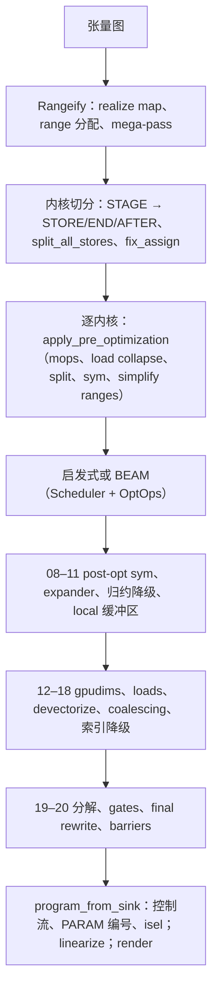

# 代码生成流水线

一个张量表达式要经过四段代码才能到达硬件，除最后一步外都位于 `svod-schedule` crate 中：

| 环节 | 入口 | 输入 → 输出 |
|-------|-------------|----------------|
| Rangeify | `rangeify_with_map`（`rangeify/transforms.rs`） | 含 movement 算子的张量图 → 由 `STAGE` / `INDEX` / `REDUCE` 构成、带显式 `RANGE` 的图 |
| 内核切分 | `try_get_kernel_graph`（`rangeify/kernel.rs`） | `STAGE` → `STORE`/`END`/`AFTER`，并按内核拆分为每个内核一个 `CALL` |
| 单内核优化 | `optimize_kernel_with_naming` / `beam_search_cached_remote`（`optimizer/`） | 内核 AST → 优化后的内核 AST（`apply_pre_optimization`、启发式或 BEAM、`apply_post_optimization_configured_with_capture`） |
| 程序边界 | `program_from_sink` + `do_linearize`（`svod-codegen`，`program_pipeline.rs`） | 内核 AST → 控制流边 → 线性指令列表 → 源码 / 二进制 |

`tensor/src/realize.rs` 把它们串联起来：`rangeify_with_map` → `try_get_kernel_graph` → 对每个内核执行 `optimize_kernel_with_naming`（或 BEAM）→ `program_from_sink` → `do_linearize` → `do_render` → 编译。

每个 pass 都是基于 `patterns!` 匹配器的一次 `graph_rewrite`（参见[模式引擎](../optimizations/pattern-system.md)）；少数例外（`memory_coalescing`、`merge_register_read_ends`、`linearize`）是普通的图遍历。匹配器运行到不动点后，再开始下一个 pass。

## 术语

- **UOp** —— 一个哈希共享（hash-consed）的节点（`Arc<UOp>`）：包含一个算子、一个 dtype 和若干源。相同的子树就是同一个指针，因此 `Arc::ptr_eq` 即结构相等。
- **RANGE** —— 取值范围为 `[0, end)` 的循环变量。它的 `AxisType` 说明其执行方式：`Weak`（尚未分类）、`Loop`、`Global`/`Thread`（网格 / CPU 核心）、`Warp`、`Local`（工作组）、`GroupReduce`、`Reduce`、`Upcast`、`Unroll`、`Device`（在启动时绑定）。`AxisType::priority()` 按由外到内排序：Device −2、Weak/Loop −1、Global/Thread 0、Warp 1、Local/GroupReduce 2、Upcast 3、Reduce 4、Unroll 5（`ir/src/types.rs`）。
- **END(x, ranges)** 关闭 range；**AFTER(buf, deps)** 让一次缓冲区读取排在 `deps` 之后；**STAGE(compute, ranges, opts)** 表示“把它物化到缓冲区中”，在内核切分决定是否真的物化之前使用。
- **STACK** 把若干 lane 收集成一个带形状的值；**INDEX(STACK(..), c)** 从中选出一个。没有单独的向量算子。
- **WeakInt** 是索引的 dtype，直到 `pm_lower_index_dtype` 将其确定为 `i32`/`i64`。
- **Invalid**（`UOp::invalid_marker()`）是越界哨兵值；有效性以 `WHERE(valid, idx, Invalid)` 的形式藏在索引内部，直到后期的 gate pass 把它移到 LOAD/STORE 上。

## Pass 地图

编号是 `apply_post_optimization_configured_with_capture` 在 `SVOD_PER_STAGE_UOPS=1` 下打印的标签；它们与 `SVOD_DUMP_STAGE=<prefix>` 相对应。优化器之前的 pass 没有编号 —— 它们出现在 `tracing` 输出和 `scripts/extract-ir.sh` 中。

| 标签 | 匹配器 / 函数 | 页面 |
|-------|--------------------|------|
| — | `multi_pm`、`add_tags_patterns`、`resolve_calls`、`movement_op_patterns + early_rewrites + split_reduceop_patterns`（自底向上） | [Rangeify](./rangeify.md) |
| — | `run_rangeify`（`pm_generate_realize_map`、`assign_ranges`、`apply_rangeify_patterns`） | [Rangeify](./rangeify.md) |
| — | mega-pass：`symbolic + pm_reduce_simplify + movement_op_patterns + buffer_folding + dead_axis_removal + pm_remove_bufferize` | [Rangeify](./rangeify.md) |
| — | `kernel_graph_pre_cut`（`pm_add_buffers_patterns`、`pm_flatten_range`）、`split_all_stores`、`fix_assign` | [Rangeify](./rangeify.md) |
| — | `apply_pre_optimization`：`movement_op_patterns`（自底向上）、`pm_load_collapse`、`pm_split_ranges + pm_flatten_range`、`sym + pm_fold_cast_const + pm_flatten_range`、`pm_flatten_range + pm_simplify_ranges` | [Rangeify](./rangeify.md) |
| — | `hand_coded_optimizations` 或 BEAM | [内核搜索](../optimizations/kernel-search.md) |
| `08-post_opt_sym` | `POST_OPT_SYM = sym + pm_move_where_on_load + pm_flatten_range + pm_reduce_unparented` | [Expander](./expander.md) |
| `09-pre_expand` | `expander2 + pm_flatten_range + mop_cleanup_patterns` | [Expander](./expander.md) |
| `10-pm_reduce` | `movement_cleanup_patterns + pm_reduce_local` | [Expander](./expander.md) |
| `11-local_buffers` | `pm_add_local_buffers` | [Expander](./expander.md) |
| `12-pm_add_gpudims` | `pm_lower_device_ranges`，若 `has_local || has_threads` 则再执行 `pm_add_gpudims` | [Devectorizer](./devectorizer.md) |
| `13-pm_add_loads` | `symbolic_simple + pm_expand_broadcast + pm_add_loads` | [Devectorizer](./devectorizer.md) |
| `14-devectorize` | `symbolic_simple + devectorize_patterns + bool_storage_patterns + indexing_simplify` | [Devectorizer](./devectorizer.md) |
| `15-early_symbolic` | `sym` | [Devectorizer](./devectorizer.md) |
| `16-memory_coalescing` | `memory_coalescing`（图遍历） | [Devectorizer](./devectorizer.md) |
| `17-bottom_up_ew_image` | `symbolic_simple + no_vectorized_alu + pm_simplify_add_image`（自底向上） | [Devectorizer](./devectorizer.md) |
| `16-extra_symbolic` | `sym + indexing_simplify` | [Devectorizer](./devectorizer.md) |
| `17-pm_lower_index_dtype` | `symbolic_simple + pm_fold_cast_const + pm_lower_index_dtype + indexing_simplify` | [Devectorizer](./devectorizer.md) |
| `18-final_symbolic` | `symbolic` | [Devectorizer](./devectorizer.md) |
| `19-cast_float_alu` | `pm_cast_float_alu` | [Linearizer](./linearizer.md) |
| `19b-early_decompositions` | `early_decomposition_patterns(supported_ops)` | [Linearizer](./linearizer.md) |
| `19c-dtype_decompositions` | `pm_dtype_decomp_commit`（FP8 / f16 / bf16 / i64 模拟） | [Linearizer](./linearizer.md) |
| `19d-late_decompositions` | `early + get_late_rewrite_patterns + get_transcendental_patterns (+ renderer.decomposition_matcher)` | [Linearizer](./linearizer.md)、[强度削减](../optimizations/strength-reduction.md) |
| `19e-move_gates_from_index` | `pm_move_gates_from_index`、`pm_scalarize_register_stack_index_preserve_deps`、`merge_register_read_ends`、`demote_unsupported_floats` | [Linearizer](./linearizer.md) |
| `20-final_rewrite` | `pm_commit_weak + pm_cast_weak + pm_decomp (+ extra_matcher) + pm_split_ends`，然后是 `pm_remove_invalid`、`add_implicit_barriers` | [Linearizer](./linearizer.md) |
| — | `add_control_flow`、`number_params`、`pre_isel_matcher`/`isel_matcher`、`linearize`、`line_rewrite_cleanups` | [Linearizer](./linearizer.md) |

有两个标签重复（`16`、`17`）：诊断输出原样使用上面的名称，所以 `SVOD_DUMP_STAGE=16` 会同时打印 `16-memory_coalescing` 和 `16-extra_symbolic`。

:::tip[阶段编号从何而来]
这些标签沿用 Tinygrad `codegen/__init__.py` 中的阶段列表，便于对照。它们不连续，也不对应本文档各页的顺序：`10-pm_reduce` 在 `11-local_buffers` *之前*降级归约，而索引降级是 `17`，不是 `15`。
:::

## 导出 IR

| 开关 | 作用 |
|--------|--------|
| `SVOD_PER_STAGE_UOPS=1` | 在每个 post-opt 阶段之后打印 `[per-stage] <label> : node_count=N` |
| `SVOD_DUMP_STAGE=<prefix>` | 同时为每个以该前缀开头的标签打印 `UOp::tree()`（`09`、`19`，留空则打印全部） |
| `SVOD_DUMP_CANONICAL_STAGE=<prefix>` | 同样的前缀匹配，输出与内存分配无关的规范化 JSON（用于一致性对比工具） |
| `SVOD_DUMP_LINEAR=<dir>` | 由 `do_linearize` 写出 `tree_<id>.txt` / `linear_<id>.txt` |
| `RUST_LOG=svod_schedule::optimizer=debug`（JSON subscriber） | 以 `tracing` 字段输出相同的树；`scripts/extract-ir.sh <test> -p <crate>` 把 rangeify、pre-opt 和 post-opt 的树汇总到一个文件 |
| `SVOD_SPEC=0` | 跳过 pre-opt、final-symbolic 和程序边界处的 `spec` 类型校验 |

`UOp::tree()` 以 `[id] OP : dtype shape=[..]` 的格式打印，使用 `├── `/`│   `/`└── ` 字形，已打印过的节点显示为 `[id] → (see above)` —— 哈希共享让共享子树一目了然。[完整示例](./worked-example.md)展示了一个内核的完整输出。
