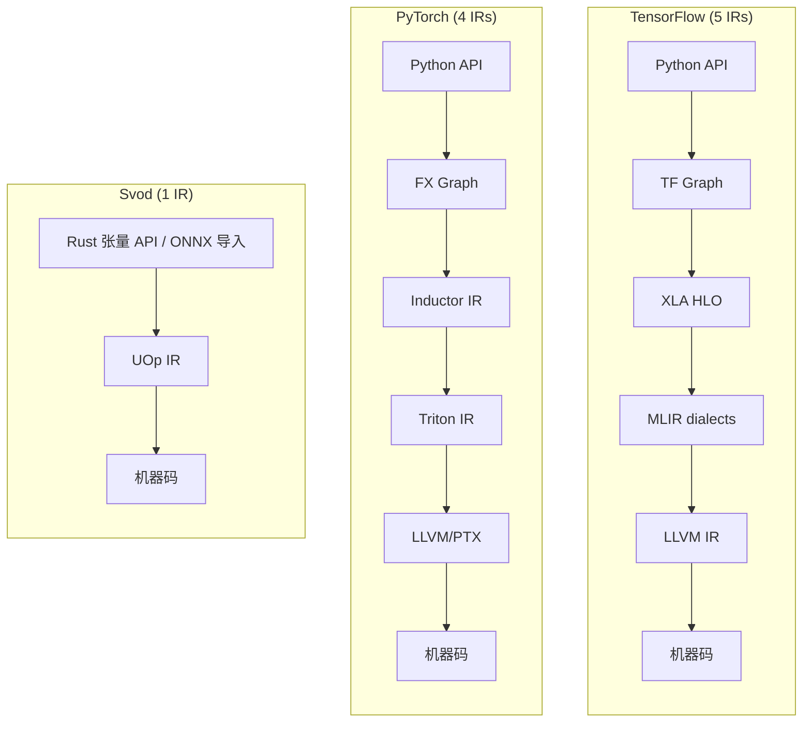
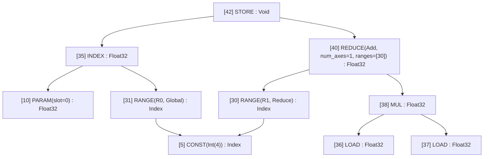
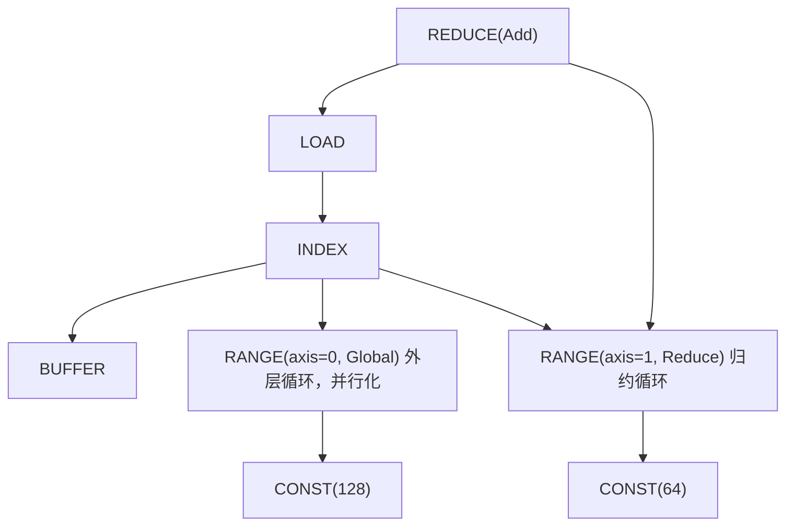
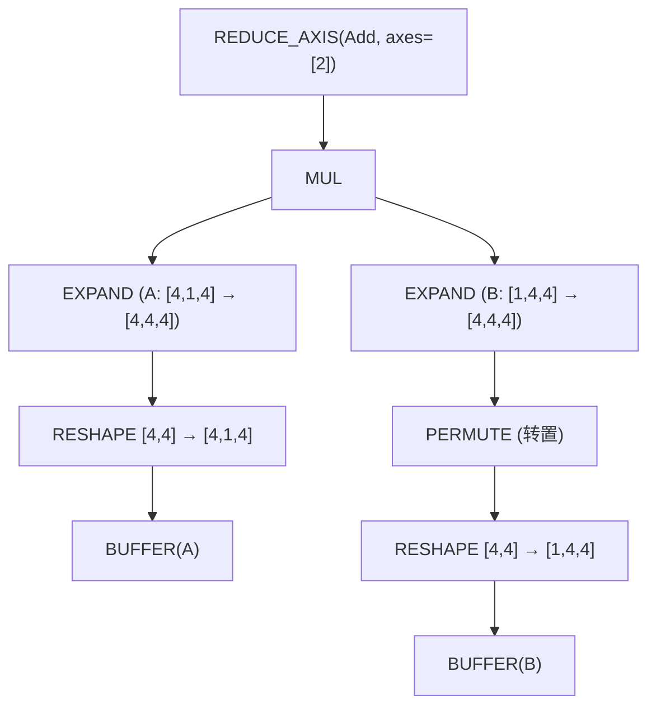
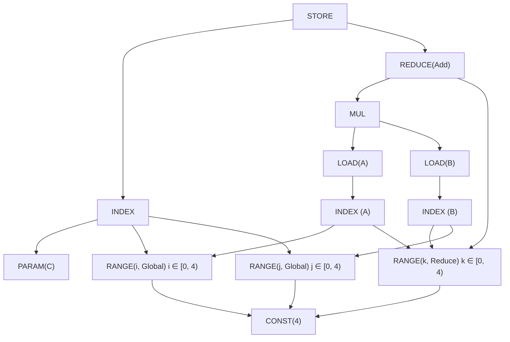

# 一个 IR 统治一切

你正在调试一个很慢的模型。profiler 告诉你“内核 X 耗时 200ms”，可你完全不知道内核 X 实际上*做*了什么。你一路追踪 PyTorch 的 dispatcher，然后是 ATen，然后是 TorchInductor，再到 Triton IR，最后落到 LLVM IR。五种不同的表示，五种不同的心智模型，五套不同的调试工具。

这就是现代 ML 编译的现实。TensorFlow 的 XLA 情况类似：Python → Graph → XLA HLO → MLIR → LLVM IR。每一层的加入都是为了解决一个真实的问题，但累积起来的复杂度令人咋舌。

Svod 采取了一种不同的方式，借鉴自 [Tinygrad](https://github.com/tinygrad/tinygrad)：**从张量到机器码只用一个 IR**。



最简单的架构往往胜出。本章解释一个精心设计的 IR 如何取代整个编译器栈。

---

## UOp：通用节点 {#uop-the-universal-node}

**UOp**（micro-operation，微操作）是计算图中的一个节点。但与其他 IR 中的节点不同，UOp 可以表示*任意*抽象层级的操作——从高层的张量 reshape 一直到单条 CPU 指令。

关键洞察在于：我们不为“张量操作”、“循环结构”和“内存访问”分别设立 IR，而是把它们全部放进同一个枚举（`ir/src/op.rs`）：

```rust
pub enum Op {
    // High-level tensor operations
    Reshape { src: Arc<UOp>, new_shape: Arc<UOp> },
    Permute { src: Arc<UOp>, axes: Vec<usize> },
    ReduceAxis { src: Arc<UOp>, reduce_op: ReduceOp, axes: Vec<usize> },

    // Loop-level control flow
    Range { end: Arc<UOp>, axis_id: AxisId, axis_type: AxisType, deps: SmallVec<[Arc<UOp>; 2]> },
    End { computation: Arc<UOp>, ranges: SmallVec<[Arc<UOp>; 4]> },

    // Memory operations (the buffer is reached through the INDEX, not a field)
    Load { index: Arc<UOp>, alt: Option<Arc<UOp>>, gate: Option<Arc<UOp>> },
    Store { index: Arc<UOp>, value: Arc<UOp>, gate: Option<Arc<UOp>> },

    // ALU operations (grouped enums with many individual values)
    Binary(BinaryOp, Arc<UOp>, Arc<UOp>),  // Add, Mul, etc.
    Unary(UnaryOp, Arc<UOp>),              // Sqrt, Exp, etc.
    Ternary(TernaryOp, Arc<UOp>, Arc<UOp>, Arc<UOp>),  // Where, MulAcc, etc.

    // Compilation stages are nodes too
    Program { sink: Arc<UOp>, info: Box<ProgramInfo>, linear: Option<Arc<UOp>>, source: Option<Arc<UOp>>, binary: Option<Arc<UOp>> },
    // ... 60 variants in all
}
```

该枚举共有 60 个变体，按抽象层级组织（把各个 `UnaryOp`/`BinaryOp`/`TernaryOp` 种类都算上，约有 100 种操作）；[操作图鉴](./op-bestiary.md)逐一记录了它们：

| 类别 | 示例 | 表示什么 |
|----------|----------|-------------------|
| **移动** | `RESHAPE`, `PERMUTE`, `EXPAND`, `PAD` | 张量形状变换 |
| **归约** | `REDUCE_AXIS`, `REDUCE` | 数学聚合 |
| **控制** | `RANGE`, `END`, `IF`, `BARRIER` | 循环与分支结构 |
| **内存** | `LOAD`, `STORE`, `INDEX`, `BUFFER` | 硬件内存访问 |
| **ALU** | `ADD`, `MUL`, `SQRT`, `EXP`, `WHERE` | CPU/GPU 指令 |
| **可调用** | `CALL`, `FUNCTION`, `PROGRAM`, `LINEAR`, `SOURCE` | 内核及其编译阶段 |
| **高级** | `WMMA` | 张量核心及其展开元数据 |

用 `uop.tree()` 打印 UOp 图时，你会看到以 ASCII 树呈现的结构：



文本形式使用 `├── `、`│   ` 和 `└── ` 字形，把每个节点标为 `[id] NAME : dtype shape=[...]`，并把已经出现过的节点打印为回引。最小的真实示例 `1.0 + 1.0`：

```text
[1] Add : Scalar(Float32) shape=[]
├── [0] CONST(Float(1.0)) : Scalar(Float32) shape=[]
└── [0] → (see above)
```

两个操作数都是节点 `[0]`。这不只是排版上的美化——而是一种被称为 **hash consing** 的基本性质。

---

## Hash Consing：结构共享 {#hash-consing-structural-sharing}

在 Svod 中把同一个表达式创建两次，你得到的是*同一个指针*。不是相等的值，而是同一个内存地址。

```rust
let a = x.try_add(&y)?;
let b = x.try_add(&y)?;

assert!(Arc::ptr_eq(&a.uop(), &b.uop()));  // Same pointer!
```

:::note[来源是节点身份的一部分]
在 `SVOD_ORIGIN=1` 下，每个节点还携带构建它时所处的 `OriginScope`，并将其折入内容哈希。于是在不同作用域下构建的两个相同子图就成了*不同*的节点，在内核切分剥除来源之前都不会共享。不透明于来源的节点是例外：`CONST`、`VCONST`、`BUFFER`、`PARAM`、`UNIQUE`、`LUNIQUE`、`STACK`、`BIND`、`DEFINE_VAR`、`NOOP` 以及任何 dtype 为 `Index` 的节点——两个作用域会各自独立地构建同一个常量，在这些节点上带来源只会拆开一个切分处又会合并回来的节点。参见[内核来源](./kernel-origins.md#costs-and-trade-offs)。
:::

intern 表（`ir/src/uop/hash_consing.rs`）是一个无锁的 `papaya::HashMap`，其键保存预先计算好的结构哈希和一个 `Weak<UOp>`，因此不再被引用的节点会在最后一个 `Arc` 释放时离开该表，而不会泄漏：

```rust
// Simplified from ir/src/uop/hash_consing.rs
struct InternKey { hash: u64, node: Weak<UOp> }
static UOPS: OnceLock<papaya::HashMap<InternKey, (), PrecomputedHash>>;

pub fn new(op: Op, dtype: DType) -> Arc<Self> {
    let hash = xxh64(&(dtype, &op, origin::current()));
    if let Some(existing) = UOPS.get_key_value(&Probe { hash, op: &op, dtype, .. })
        .and_then(|(key, _)| key.node.upgrade())
    {
        return existing;                       // same structure → same Arc
    }
    let node = Arc::new(UOp { op, dtype, .. });
    UOPS.compute(InternKey { hash, node: Arc::downgrade(&node) }, /* abort if a racing thread inserted first */);
    node
}
```

这对 ML 工程师为什么重要？

- **指针相等即语义相等。** 要检查两个子表达式是否相同，只需比较指针：`Arc::ptr_eq(&a, &b)`。无需遍历树。

- **模式匹配是 O(1) 的。** 当优化器问“这个模式我以前见过吗？”时，指针比较能立刻给出答案。

- **内存高效。** 公共子表达式（比如注意力中的共享计算、梯度图）只存一份，不会重复。

- **线程安全。** 不同线程上的同一计算产生同一个对象——不会有同步 bug。

树形打印正体现了这一点：当你看到 `[10] → (see above)` 时，那不是副本——而是从多处引用的*同一个节点*。

---

## 显式循环：`RANGE` 操作 {#explicit-loops-the-range-operation}

大多数 ML IR 把循环藏在操作内部。在 ONNX 中，一次归约长这样：

```python
ReduceSum(data, axes=[1], keepdims=0)
```

循环在哪里？它是隐式的——藏在运行时对 `ReduceSum` 的实现里某处。你看不到它，改不了它，也无法对它进行推理。

Svod 用 `RANGE` 操作让循环变得*显式*。同样的归约变成：



每个 `RANGE` 都有一个 **AxisType**，告诉优化器和代码生成器如何编译它：

| AxisType | 优先级 | 降级为 | 含义 |
|----------|----------|------------|---------|
| **Placeholder** | -3 | — | 缓存 RESHAPE 降级时使用的临时规范 range |
| **Device** | -2 | 启动时按设备绑定 | 多设备张量的设备轴 |
| **Weak** | -1 | 串行 `for` 循环 | 未并行化的 range；rangeify 的默认值，优化器从中挑选 |
| **Loop** | -1 | 串行 `for` 循环 | 显式的普通循环 |
| **Global** | 0 | `gidx`（`SPECIAL`） | GPU 网格维度 |
| **Thread** | 0 | 线程池上的 `gidx`（`SPECIAL`） | CPU 并行 |
| **Warp** | 1 | 最前面的 local 维度 | 硬件 lane（张量核心 fragment） |
| **Local** | 2 | `lidx`（`SPECIAL`） | GPU workgroup 维度 |
| **GroupReduce** | 2 | local 维度 + 共享内存阶段 | 两阶段归约 |
| **Upcast** | 3 | 向量 lane（`STACK`） | 向量化 |
| **Reduce** | 4 | 累加器循环 | 归约维度 |
| **Unroll** | 5 | 展开的副本 | 循环展开 |

优先级就是循环嵌套顺序——值越小越靠外层。`AxisType::Global` 的 `RANGE` 在 CUDA 上变成 `blockIdx.x`；`AxisType::Local` 的 `RANGE` 变成 `threadIdx.x`；同样的 `Global` range 在 CPU 上则是线程池分发出去的一个工作项。优化器改变 range 的类型（`Weak` → `Upcast`、`Weak` → `Local`、…），而这一个字段就决定了循环如何编译。

显式循环为何重要：

- **优化是可见的。** 你能*看到*哪些循环会被并行化，哪些会被展开，哪些会使用 SIMD。

- **调度就是图重写。** 改变循环顺序、分块或展开只是一次模式变换——不需要专门的“调度 pass”。

- **每个阶段都是同一个 IR。** 在张量层表示“遍历 batch 维度”的那个 `RANGE`，正是在生成代码中变成 `for (int i = 0; i < N; i++)` 的*同一个* `RANGE`。

---

## 图重写：统一的变换机制 {#graph-rewriting-one-transformation-mechanism}

传统编译器有几十个专门的 pass：常量折叠、死代码消除、循环展开、算子融合。每个 pass 都有自定义的逻辑、自定义的数据结构、自定义的 bug。

Svod 只用一种机制：**基于模式的图重写**，用 `patterns!` DSL 编写，由 `graph_rewrite` 应用：

```rust
patterns! {
    // Identity folding: x + 0 → x
    Add[x, @zero] => x,

    // Constant folding: 3 + 4 → 7
    Add(a @const(a_val), _b @const(b_val))
        => eval_add(a_val, b_val).map(|r| UOp::const_(a.dtype(), r)),

    // Self-folding: x // x → 1
    FloorDiv(x, x) => 1.into_uop(x.dtype()),

    // Dead code: if(true) { x } else { y } → x
    Where(Const(ConstValue::Bool(true)), t, _f) => t,
}
```

`[x, y]` 表示可交换，`(x, y)` 表示有序，`@zero`/`@one` 匹配任意 dtype 的常量，`c @const(val)` 绑定其值，重复的名字（`x, x`）要求是同一个节点，右侧返回 `Arc<UOp>`、`Option<Arc<UOp>>`（`None` 表示放弃）或 `RewriteResult`。生产中的规则与这些相似，但带有守卫条件（真正的 `x + 0` 规则会对 `-0.0` 放弃）；完整语法见[模式引擎](./optimizations/pattern-system.md)一章。

`graph_rewrite` 先访问子节点（后序），对每个重建后的节点应用匹配器，并对每个替换结果重复应用，直到该节点达到不动点；结果按节点做记忆化：

```text
Original:       Add(Mul(x, 1), 0)
After Mul:      Add(x, 0)         # Mul(x, 1) → x
After Add:      x                 # Add(x, 0) → x
```

（容易混淆的是，`graph_rewrite_bottom_up` 是*另一种*模式：它在下降之前就应用模式，因此模式看到的是原始的子节点——这是沿用 Tinygrad 的命名。）

这一种机制就能处理：

- **代数化简** —— 常量折叠、消除恒等运算
- **Rangeify 变换** —— 移动操作 → 显式循环
- **内核优化** —— 向量化、展开、张量核心
- **代码生成** —— 降级到硬件原语

同样的模式、同样的引擎，每个阶段用不同的模式集合。

---

## 完整示例：矩阵乘法之旅 {#worked-example-matmul-journey}

我们来跟踪 `C = A @ B`（一个 4×4 矩阵乘法）走完整个流水线的过程。

### 阶段 1：张量构建 {#stage-1-tensor-construction}

当你写下 `A.matmul(&B)?` 时，Svod 把两个操作数 reshape 到相同的秩，对 `B` 转置，相乘（广播会插入 `EXPAND`），再对最后一个轴求和：



这是纯粹的数学：“扩展 A 和 B 以对齐维度，逐元素相乘，沿收缩轴求和。”

### 阶段 2：Rangeify {#stage-2-rangeify}

rangeify pass 把移动操作（`EXPAND`、`PERMUTE`、`RESHAPE`）转换为带 `RANGE` 循环的显式索引计算：



现在循环结构清晰可见：`i` 和 `j` 是输出 range（rangeify 将它们生成为 `Weak`；在 GPU 上优化器会把它们提升为 `Global`），`k` 是 `Reduce`（被累加）。

### 阶段 3：符号化简 {#stage-3-symbolic-simplification}

模式重写会清理冗余操作、折叠常量并化简索引运算。

### 阶段 4：代码生成 {#stage-4-code-generation}

最终的 IR 直接翻译成循环：

```c
// GPU kernel (conceptual)
__global__ void matmul(float* C, float* A, float* B) {
    int i = blockIdx.x;   // from RANGE(i, Global)
    int j = blockIdx.y;   // from RANGE(j, Global)
    float acc = 0.0f;
    for (int k = 0; k < 4; k++) {  // from RANGE(k, Reduce)
        acc += A[i*4 + k] * B[k*4 + j];
    }
    C[i*4 + j] = acc;
}
```

关键的观察是：**结构在每个阶段都是可见的**。没有什么神奇的融合 pass 会把三层嵌套循环变成面目全非的东西。你在阶段 2 中看到的 `RANGE` 结构，正是在阶段 4 中变成循环的那个结构。[执行流水线](./pipeline.md)一页会继续跟随同一个内核，经过调度、缓存和执行。

---

## 对比：其他 IR 的差异 {#comparison-how-other-irs-differ}

不同的 IR 做出不同的权衡。它们的对比如下：

| 方面 | ONNX | XLA HLO | Triton | **Svod** |
|--------|------|---------|--------|-----------|
| **目的** | 模型交换 | 后端优化 | GPU 内核 DSL | 完整编译 |
| **算子** | 约 200 个高层算子 | 约 100–150 个高层算子 | tile 操作 | 60 个，多层级 |
| **循环模型** | 隐式 | 隐式 | 基于 tile | **显式 `RANGE`** |
| **内存** | 纯值 | 纯值 → 缓冲区 | 显式指针 | **显式 `LOAD`/`STORE`** |
| **优化** | 无 | 专门的 pass | MLIR 模式 | **统一的重写** |
| **目标** | 运行时引擎 | CPU/GPU/TPU | 仅 GPU | CPU/GPU |

**ONNX** 追求最大的可移植性。`Conv` 和 `MatMul` 这样的操作隐藏了所有实现细节。非常适合模型交换，但你无法优化你看不到的东西。

**XLA HLO** 是函数式且纯的——没有副作用，张量不可变。这使代数优化成为可能，但在代码生成之前需要一个单独的“缓冲区分配”阶段。从 HLO 到 LMHLO（基于缓冲区）的转换是一道根本性的边界。

**Triton** 暴露的比 ONNX 多，但比 Svod 少。你编写“tile 级”代码——对数据块的操作——由编译器处理线程级细节。内存是显式的（`tl.load`、`tl.store`），但 tile 内部的并行化是隐式的。

**Svod** 暴露一切：循环是显式的（`RANGE`），内存是显式的（`LOAD`/`STORE`），并行化是显式的（`AxisType`）。这意味着要学的更多，但没有任何东西是隐藏的。

---

## 为什么这很重要：实际好处 {#why-this-matters-practical-benefits}

Svod 透明的 IR 为 ML 工程师带来了实际的好处：

**调试是直接的。** 在任意阶段打印图：

```rust
println!("{}", tensor.uop().tree());
```

你会确切地看到有哪些操作、它们如何连接、计算发生在哪里。没有“内核 X”之谜。`SVOD_DUMP_STAGE=<prefix>` 则会在每个优化器阶段之后打印内核；[代码生成完整示例](./codegen/worked-example.md)列出了各阶段的名称。

**性能调优有据可依。** 查看哪些循环被并行化：

```text
[31] RANGE(R0, Global) : Index    # parallelized across GPU blocks
[32] RANGE(R1, Local) : Index     # parallelized within a block
[33] RANGE(R2, Loop) : Index      # sequential — might be slow!
```

如果某处本该并行却没有，你能看出来。

**心智模型很简单。** 只有一个 IR、一种变换机制、一套操作。你不需要先学 XLA HLO，*再*学 MLIR，*再*学 Triton，*再*学 LLVM。只需要 UOp。

**优化是可组合的。** 想要自定义重写？加一个模式：

```rust
patterns! {
    // Illustrative: x - x → 0 (op names must be real Op / ALU variants)
    Sub(x, x) => 0.into_uop(x.dtype()),
}
```

它与常量折叠、融合以及其他一切使用同一个引擎。

---

## 更深层的洞察 {#the-deeper-insight}

Svod/Tinygrad 证明了编译器的复杂度往往是*偶然的*，而非本质的。TensorFlow 和 PyTorch 中的多层 IR 栈是自然累积起来的——每一层都解决了一个真实的问题，但组合起来的系统比任何单独的部分都更难理解。

一个设计良好的 IR、一种变换机制，再加上有原则的组合，就能取代成千上万行专门的 pass。这是把 Unix 哲学应用到编译器上：把一件事做好，然后组合。

代价是显式性——你会看到其他 IR 所隐藏的循环、内存访问和并行化提示。但可见性是特性，而不是缺陷。当你的模型很慢时，你想看到的是*为什么*，而不是寄希望于编译器自己搞定。

这正是 Svod 下的赌注：透明的复杂度胜过隐藏的复杂度。
