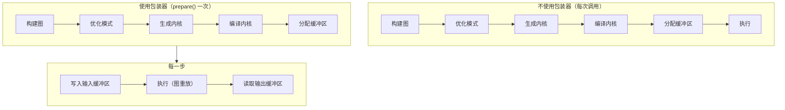

# JIT 图

一个流式 ASR 流水线会数百次调用同一个 encoder。每次调用都构建张量图、优化它、生成内核源码、通过后端的 [JIT 加载器](../backends/jit-loader.md) 编译，再分配设备缓冲区——这些工作并不依赖输入，纯属浪费。

`jit_wrapper!` 宏把这种"构建一次 / 多次运行"的模式变成**一个带类型的 Rust 结构体**。你声明输入和图；宏生成的包装器在 `prepare()` 期间编译图一次，并在每次 `execute()` 时保持设备缓冲区就位、重放该图。



包装器是 `Tensor::prepare_batch_with` 及其返回的 `ExecutionPlan` 之上的一层薄封装（参见[执行流水线](./pipeline.md)）；[模式引擎](./optimizations/pattern-system.md)在 `prepare()` 时运行，[JIT 加载器](../backends/jit-loader.md)把内核转换为机器码。本页介绍包装器本身以及 `execute()` 重放的内容。

---

## `jit_wrapper!` DSL

一个包装器声明给出结构体名、build 闭包接收的模型类型、包装器对外暴露的输入、可选的符号化形状变量，以及一个用于构造图的 `build` 块：

```rust
jit_wrapper! {
    MyModelJit(MyModel) {
        input1: Tensor,
        input2: Tensor,

        vars {
            b: (1, model.config.max_batch),
            t: (1, model.config.max_time),
        }

        build(input1, input2, b, t) {
            model.forward(input1, input2, &b, &t)
        }
    }
}
```

| 区段 | 含义 | 是否必需 |
|---|---|---|
| `WrapperName<generics>(ModelType) { ... }` | 生成的结构体名（允许泛型参数，例如 `RnntBlockJit<const W: usize>`）以及 build 闭包接收的模型类型 | 是 |
| `name: Tensor` / `name: [Tensor; N]` 行 | 包装器暴露的每个输入各一行；类型标注仅作说明，`N > 0` | 可选（通常一个或多个） |
| `inputs { ... }` | 放在块内的同样的槽位，块内还允许使用 `#[unbatched]` | 可选 |
| `vars { name: (min, max), ... }` | 带边界的符号化形状变量；边界表达式在 `new(model)` 内求值，可以读取 `model` | 可选 |
| `batch_var name: (min, max)` | 一个变量，同时把每个批处理输入的第 0 维收缩到该变量 | 可选 |
| `state { name, ... }` | 计划同时会写入的输入，在调用之间就地复用；需要 `outputs` 块 | 可选 |
| `outputs { name, ... }` | 每个输出对应一个具名缓冲区访问器；此时 `build` 闭包按此顺序返回同样数量张量组成的元组 | 可选 |
| `build(args...) { ... }` | 由输入、状态和变量构建输出张量的闭包；`model` 在作用域内 | 是 |

宏会在展开时拒绝以下情况：`build` 参数引用了未声明的名字、输入 / 状态 / 输出 / 变量之间存在重名、输出与某个生成方法同名、在状态上或没有 `batch_var` 时使用 `#[unbatched]`，以及有 `state` 却没有 `outputs`。在块内，每个输入或状态槽位都是一个 `&Tensor`（数组槽位则为 `[&Tensor; N]`），背后是宏在 `prepare()` 运行时于默认设备上分配的零初始化占位张量；每个变量是一个已绑定到其上界的 `svod_tensor::BoundVariable`——以 `&name` 的形式传递即可；`model` 是对包装器所拥有模型值的共享引用。闭包对任意 `E: std::error::Error + Send + Sync + 'static` 返回 `Result<Tensor, E>`；失败以 `JitError::Build` 的形式呈现。整个构建在 `OriginScope::label("WrapperName")` 下运行，因此性能剖析会把其内核归属到包装器的名字下。

没有 `outputs` 块时，闭包返回单个 `Tensor`，通过 `output()` 访问。有该块时，闭包返回恰好那么多张量组成的元组，每个张量按声明顺序获得各自的具名 `&Buffer` 访问器。如果调度器融合或省略了其中某个输出，按位置的访问器就会悄无声息地错位，因此 `prepare()` 会改为以 `JitError::OutputCountMismatch` 失败。

---

## 数组槽位、批变量与状态

声明的块形式增加了流式模型所需的三样东西。它们都是可选的；按旧的扁平形式编写的包装器无需修改即可继续工作。

```rust
jit_wrapper! {
    StepJit(StepModel) {
        inputs {
            x: Tensor,
            #[unbatched] bias: Tensor,
            taps: [Tensor; 3],
        }
        batch_var b: (1, 4),
        state { h: Tensor, tail: [Tensor; 2] }
        outputs { emitted }

        // returns (emitted, h, tail): declared outputs first, then state
        build(x, bias, taps, h, tail) {
            model.step(x, bias, taps, h, tail)
        }
    }
}
```

**`[Tensor; N]` 槽位**把 N 个缓冲区放在一个名字之下：`prepare` 接收 `[InputSpec; N]`，build 闭包接收 `[&Tensor; N]`，生成的访问器接收一个叶子索引——`jit.taps_view_mut::<f32>(1)?`。输出同样可以是数组。输入索引越界会返回 `JitError::InputBufferNotFound`；输出索引越界则会 panic。

**`batch_var b: (min, max)`** 声明一个符号变量，*并且*在占位张量实体化后把每个批处理输入的第 0 维收缩到它，从而让一个计划服务一系列批大小。`#[unbatched]` 让某个输入退出这一行为——例如共享的 bias，或首轴不是批维的表——而状态槽位从不收缩。每次调用通过生成的 `execute_bound(4)` 绑定它。

**`state { ... }`** 槽位是计划同时会写入的输入。build 元组为每个状态携带一个新值，宏把它直接赋回该槽位自己的设备本地缓冲区，下一次 `execute()` 就在那里读取——这是一种从不经过主机往返的递推。状态槽位在 `prepare()` 中接收各自的 `InputSpec`（位于输入之后），拥有 `<state>_mut()` 访问器但没有类型化视图，不作为输出暴露，`reset()` 会在开始新序列时将它们全部清零。

build 元组中每个声明的输出槽位对应一个元素，每个状态槽位再对应一个元素——如果两者合计恰好只有一个，则完全不用元组。

---

## 符号变量

`vars { ... }` 块声明的值以形状或索引表达式的形式参与图，但其确切值在执行时才提供。它们让一个已准备好的计划无需重新编译即可服务一系列输入形状。

每个条目 `name: (min, max)` 会在包装器上生成三个配置 setter：

| Setter | 作用 |
|---|---|
| `with_<name>_bound(max)` | 只覆盖上界；若 `max < min` 则 panic |
| `with_<name>_min_bound(min)` | 只覆盖下界；若 `min > max` 则 panic |
| `with_<name>_fixed(value)` | 把上下界都固定为 `value`，使该变量成为 JIT 时常量；`value == 0` 时 panic |

三者都返回 `Self`（builder 风格），并且必须在 `prepare()` 之前调用，因为 build 闭包在运行时捕获边界。

更宽的范围会生成更通用的内核，需要处理范围内的每种形状；更窄的范围让优化器得以特化。当值从不改变时，用 `with_<name>_fixed` 固定变量；当外部调用方声明的最大值小于模型的硬上限时，收缩上界。

执行时，通过 `execute_with_vars` 传入实际值，或通过 `execute_bound`——它按声明顺序为每个变量接收一个 `i64` 并转发给前者：

```rust
jit.execute_with_vars(&[("b", batch as i64), ("t", time as i64)])?;
jit.execute_bound(batch as i64, time as i64)?;   // same thing, positionally
```

每个键值对绑定一个变量；未列出的变量保持原值——即其 `prepare()` 时的上界，或上一次 `execute_with_vars` 留下的值。绑定是持久的，而不是每次调用独立的。计划会对照变量声明的 `[min, max]` 检查每个值，并在派发任何内容之前以 `JitError::Runtime` 拒绝越界的值。计划不认识的名字会被忽略。

---

## 生成的运行时 API

宏为包装器生命周期的每个阶段生成一组方法：

| 方法 | 阶段 | 说明 |
|---|---|---|
| `new(model)` | 构造 | 按值接收模型；求值变量边界；尚未编译任何内核 |
| `with_<var>_bound` / `with_<var>_min_bound` / `with_<var>_fixed` | 介于 `new` 与 `prepare` 之间 | 配置形状包络 |
| `prepare(input1: InputSpec, ..., state1: InputSpec, ...)` | 一次性 | 构建图、运行模式、编译内核、分配缓冲区；读取 `PrepareConfig::from_env()` |
| `prepare_with_config(..., &PrepareConfig)` | 一次性 | 与 `prepare` 相同，但使用显式配置 |
| `<input>_mut([i]) -> Result<&mut Buffer>` | 每步 | 每个声明的输入或状态槽位的原始缓冲区（数组槽位需 `i`） |
| `<input>_view_mut::<T>([i]) -> Result<ArrayViewMutD<T>>` | 每步 | 输入缓冲区上的类型化写视图，带 dtype 检查 |
| `output() -> Result<&Buffer>` | 每步 | 计划的第一个输出 |
| `<output>([i])` / `<output>_shape()` / `_view::<T>()` / `_to_vec::<T>()` | 每步 | 具名输出缓冲区、其实时形状及读取，按当前变量绑定解析 |
| `reset() -> Result<()>` | 每步 | 将每个 `state` 槽位清零（仅在有 `state` 时生成） |
| `execute() -> Result<()>` | 每步 | 用当前输入缓冲区重放 |
| `execute_bound(v1, v2, ...) -> Result<()>` | 每步 | 重放，并按位置绑定每个声明的变量（仅在有 vars 时生成） |
| `execute_with_vars(&[(name, value)]) -> Result<()>` | 每步 | 重放并重新绑定一个或多个符号变量 |
| `execute_profiled` / `execute_with_vars_profiled` | 可选 | 与非剖析版本相同，但返回 `Vec<KernelProfile>` |
| `execute_profiled_static()` | 可选 | 通过 `ExecutionPlan::profile` 进行一次剖析运行，返回最后一个阶段的内核 |
| `copy_output_to_<input>([i,] out_pos, dst_off, src_off, len)` | 每步 | 在设备上把输出区域复制回输入缓冲区；无主机往返；若两者共享存储则失败 |
| `replicate() -> Result<Self>` | 可选 | 深拷贝一个已准备好的 JIT 以供并发执行（见下文） |

另有四个底层访问器为工具暴露计划细节：

| 访问器 | 返回 |
|---|---|
| `buffers()` | 计划拥有的所有缓冲区 |
| `output_buffers()` | 计划声明的输出缓冲区 |
| `input_buffer_ids()` | 包装器写入的设备缓冲区 id |
| `prepared_kernels()` | 已编译的内核 |

大多数调用方不需要它们。在 `prepare()` 之前调用任何每步方法都会返回 `JitError::NotPrepared`。

`replicate()` 共享模型（`Arc`）和已编译内核，对每个输入和状态缓冲区的字节做快照，对计划写入的存储（中间结果、输出）进行分叉而不复制，重新生成 arena 视图以保留别名关系，并为副本提供全新的队列、图和时间线。请在源计划空闲时调用 replicate：快照不会与正在进行的工作同步。

---

## `InputSpec`

`InputSpec`、`JitError` 以及宏展开所用的缓冲区辅助函数都位于 `svod_tensor::jit`，因此承载 `jit_wrapper!` 的 crate 只需这一个依赖（`svod_model::jit` 为历史路径重新导出了它们）。

`prepare()` 为每个声明的输入和状态槽位接收一个 `InputSpec`——数组槽位则接收一个 `[InputSpec; N]`：

```rust
pub struct InputSpec {
    pub shape: Vec<usize>,
    pub dtype: DType,
    /// Allocate the input device-local (no host mapping).
    pub device_local: bool,
}

impl InputSpec {
    pub fn new(shape: &[usize], dtype: DType) -> Self { ... }
    pub fn f32(shape: &[usize]) -> Self { ... }
    pub fn i32(shape: &[usize]) -> Self { ... }
    pub fn i64(shape: &[usize]) -> Self { ... }
    pub fn device_local(mut self) -> Self { ... }
    pub fn numel(&self) -> usize { ... }
}
```

宏在调用 build 闭包之前，用该形状和 dtype 在默认设备上分配一个零初始化的占位张量。调用方无需自己构造 `Tensor::zeros(...).realize()` 占位张量。该形状即最大输入尺寸；符号变量在执行时通过 `try_shrink` 之类的操作收缩它——这是一种编码模式，而不是包装器强制执行的运行时契约。对于主机只通过 `copyin` / `copy_from` 写入、或在设备上重新填充的输入，`InputSpec::device_local()` 会去掉主机映射；`state` 槽位会自动以这种方式分配。在输出一侧，`PrepareConfig::device_local()` 对计划的输出采用同样的思路——它就是设置了 `device_local_outputs` 的 `from_env()`。

---

## 图捕获与重放 {#graph-capture-and-replay}

`execute()` 就是 `ExecutionPlan::execute()`。在 GPU 上，计划不会在每次调用时重新遍历其内核：第一次 `execute()` 会把派发序列**捕获**为设备图，之后的每次调用都**重放**它，只修补自捕获以来发生变化的内核参数（缓冲区地址、变量值）。捕获是惰性的、按计划进行的；`replicate()` 从一个全新的图开始。

只有当每个操作都是计划设备上的已编译内核、且不含未绑定的符号变量时，计划才会被捕获。运行时变量、缓冲区复制和自定义函数都会禁用捕获——因此每个带 `batch_var` / `vars` 的包装器都走下面的回退路径，而固定形状的包装器（GigaAM encoder、Silero 前端、Whisper decoder 单步）会重放图。图内的依赖是基于**字节范围**的读写冒险，因为内存规划器会把中间结果打包进相互别名的 arena 视图。

| 后端 | 机制 | 说明 |
|---|---|---|
| CUDA | `cuGraphAddKernelNode` DAG, `cuGraphInstantiate`, `cuGraphLaunch` | 默认开启；`cuGraphExecKernelNodeSetParams` 只修补参数发生变化的节点；缓冲区别名关系的变化会触发重新捕获 |
| AMD | 一条链接起来的 HCQ/PM4 命令流，内核参数存储归图所有，通过单次 doorbell 重放 | AQL 队列（多 XCC 型号，或 `SVOD_AMD_AQL=1`）默认捕获；PM4 捕获需通过 `SVOD_PM4_GRAPH=1` 显式开启 |
| Metal | 带逐命令屏障的 `MTLIndirectCommandBuffer`，每次重放一次 `executeCommandsInBuffer` | 任一内核接收标量参数或处于虚拟化 GPU 上时放弃捕获；重新绑定前等待上一次重放完成 |
| CPU | — | 没有图工厂；直接调用内核 |

**回退路径。** 不使用图时，AMD 计划——包括动态形状的计划——会被捕获为*链接计划*：一条命令流，其内核参数和启动维度在每次重放时重新打包。在其他所有情况下，计划按层级顺序遍历，并把每个内核提交到计划自己的队列（在 GPU 上是异步的；只在结尾 `wait`）。`execute_profiled` 在存在图时使用图的剖析变体，否则使用逐次派发的时间戳。

---

## 循环执行

循环模型的状态留在设备上：在 `state { ... }` 中声明它，每一步就是一次 `execute()`，没有主机往返，也不需要打包辅助函数。

```rust
jit.reset()?;                                    // zero the state, new sequence
for chunk in chunks {
    for (slot, v) in jit.x_view_mut::<f32>()?.iter_mut().zip(chunk) {
        *slot = v;                               // per-step input, written in place
    }
    jit.execute()?;                              // reads state, writes it back
    let frame = jit.emitted_to_vec::<f32>()?;    // only the emitted head crosses
}
```

:::tip[先读后写的顺序]
每个状态缓冲区都是就地复用的，因此在同一个 `build` 内，一个槽位不能依赖另一个槽位的*新*值：只有当每个槽位都从进入该步时的值推进时，逐缓冲区的顺序才是无歧义的。请从输入和旧状态推导出新值，然后把它们全部放进 build 元组返回。
:::

状态缓冲区以设备本地方式分配，因此不会映射到主机。只读回调用方真正需要的内容——即声明的输出——通过 `<output>_to_vec` 或 `<output>_view`。代码树内的示例：`RnntBlockJit<const W: usize>`（`state { time, prev, symbols, h, c }`）、`FireRedVadStreamJit`（`state { caches: [Tensor; 8] }`）和 `GtcrnStreamJit`。

---

## 示例：GigaAM encoder

GigaAM Conformer encoder 以常量形状准备。批大小和 mel 帧数的边界在构造时计算一次并固化进计划；较短的分块以零填充放入同样的缓冲区：

```rust
jit_wrapper! {
    GigaAmEncoderJit(GigaAm) {
        mel: Tensor,
        lengths: Tensor,

        outputs { frames },

        build(mel, lengths) {
            let out = model.encoder.forward_batch(mel, lengths)?;
            // Permute [B, d_model, T_sub] → [B, T_sub, d_model] on-device: the
            // RN-T decoder consumes frame-major rows, and doing it here turns
            // the host-side strided transpose over the slow mapping into one
            // contiguous copyout.
            Ok::<_, super::error::Error>(out.cast(svod_dtype::DType::Float32).try_permute(&[0, 2, 1])?)
        }
    }
}
```

该包装器接收一个 mel 频谱输入和一个逐批的长度向量，产出 `frames: [B, T_sub, d_model]`，RN-T decoder 通过 `frames()?.copyout_prefix(..)` 读取它。（CTC 头使用一个兄弟包装器 `GigaAmCtcJit`，其唯一输出是 `log_probs`。）`GigaAmTranscriber` 只为计划确定一次尺寸：mel 长度向上取整到下一个 2 的幂，使代码生成看到干净的因式分解，并被钳制在 `config.max_mel_frames` 以内；批大小被设置上限，使存活的 SDPA 分数块保持在 `max_scores_mib`（`SVOD_MAX_SCORES_MIB`，默认 256）以内。mel 输入是 `InputSpec::f32(..).device_local()`，通过 `mel_mut()?.copy_from(..)` 在设备上用 mel JIT 的输出填充；计划以 `PrepareConfig::device_local()` 准备。之后每个分块都通过 `execute()` 重放同一个计划。

`cast` 不会失败，因此不需要 `?`；模型的错误类型通过一个普通的 `?` 吸收张量错误——build 闭包对任意 `E: std::error::Error + Send + Sync + 'static` 返回 `Result<_, E>`。

`out.cast(DType::Float32)` 是 encoder 与任何下游头之间的 fp32 边界。encoder 可以为了速度以 fp16 或 bf16 运行，但每个消费者（CTC log-softmax、RN-T predictor 和 joint）看到的都是统一的 fp32 输入。把 cast 放在 JIT 内部，可以让它融合进 encoder 的尾部内核。

---

## 示例：Silero VAD

Silero V5 是一个循环网络，但它的递推太小，不值得为每个窗口付出一次启动的代价。因此 JIT 只覆盖批处理的卷积前端以及 LSTM 输入投影；扫描本身留在主机上：

```rust
jit_wrapper! {
    SileroVadFeatureJit(SileroVad) {
        chunks: Tensor,

        build(chunks) {
            // [FEATURE_BATCH, CHUNK_LEN] -> [FEATURE_BATCH, 4*HIDDEN] LSTM gate
            // pre-activations (conv features + input projection, biases folded).
            // Fixed batch (not a runtime var): the front-end is row-independent,
            // so partial batches just fill fewer rows and ignore the rest — and
            // a symbolic leading dim trips the reflect-pad lowering.
            model.forward_gates(chunks)
        }
    }
}
```

首维是固定的 `FEATURE_BATCH`（4096）而不是变量：前端各行相互独立，因此不满的批只是填充较少的行；而符号化的首维会让 reflect-pad 的 lowering 出错。准备时请求设备本地输出，因为 8 MiB 的门值回读应当交给复制引擎，而不是走主机映射：

```rust
let mut jit = SileroVadFeatureJit::new(vad);
jit.prepare_with_config(
    InputSpec::f32(&[FEATURE_BATCH, CHUNK_LEN]),
    &svod_tensor::PrepareConfig::device_local(),
)?;
```

随后 `VadInference::probs` 以 `FEATURE_BATCH` 大小的派发遍历波形——打包 `chunks_view_mut::<f32>()`、`execute()`、对有效行执行 `copyout_prefix`——并把门值交给 `VadHead::scan`，这是一个以主机 CPU 所具备的最宽 SIMD 宽度向量化的 LSTM 加 sigmoid 头。这种拆分取代了原先每个窗口一次微小派发的路径，后者的往返延迟主导了整个模型。

---

## 数据无关性契约

包装器编译图一次并多次重放。这只有在图拓扑于 `prepare()` 时固定的情况下才成立。任何可能在执行时变化的东西都必须通过输入缓冲区（经由 `*_mut`）或符号变量（经由 `execute_with_vars`）流入。在 build 闭包内对张量值进行分支会把图特化到该分支；这是构建时决策，而非运行时决策。

:::note[常见陷阱]
- 在 build 闭包内调用 `Tensor::full(value).realize()` 会把该值固化进唯一的已准备计划。任何逐次调用的变化都需要从头重新运行 `prepare()`——完整的图构建加内核编译。对于 JIT 不需要看到的逐步准备工作，主机侧的临时缓冲区（例如 `ndarray::Array3`）才是正确选择。
- 处理动态批大小的惯用方式是 `batch_var`，它会替你收缩每个批处理输入的第 0 维；每次调用通过 `execute_bound` 绑定它。ResNet 和 YOLO26 都是一个 `images` 输入、一个 `batch_var b: (1, model.config.max_batch_size)` 和一个输出。对于其他任何动态轴，手动的等价做法是：对最大尺寸的输入以变量绑定的长度调用 `try_shrink`，并在调用处使用 `execute_with_vars`。
- 动态变量的代价是失去图重放：计划会回退到逐次调用派发（或 AMD 的链接计划）。当某次部署从不改变某些变量时，用 `with_<var>_fixed` 固定它们。
:::

违反契约会导致两种失败模式之一：结果错误，因为缓存的计划带着对某个值的陈旧假设重放，而该值实际上会变化；或者悄无声息地变慢，因为每次调用都落入重新编译路径。诊断这类问题要重新审读 build 闭包；内核输出很少有帮助。

---

## 错误

`JitError` 涵盖包装器可能抛出的运行时失败。大多数不可恢复，表示的是用法错误而非暂时状况。

| 变体 | 触发条件 |
|---|---|
| `NotPrepared` | 在 `prepare` 之前调用了每步方法，或输出缓冲区不可用 |
| `InputBufferNotFound` | 在已准备的计划中解析输入索引失败，或数组槽位索引越界 |
| `DuplicateInputBuffer` | 两个声明的输入在 `prepare` 时映射到同一个设备缓冲区 |
| `InputAliased` | 某个输入解析到了另一个计划的缓冲区——并发的 `prepare` 破坏了其图标识 |
| `Build` | build 闭包返回了 `Err`；内部错误以 `Box<dyn Error + Send + Sync>` 形式保留 |
| `Tensor` | 张量操作在 `prepare` 期间或 build 闭包中失败 |
| `Device` | 设备或缓冲区操作失败 |
| `OutputCountMismatch` | 包装器声明了 N 个输出加状态槽位，但编译后的计划保留的数量不同 |
| `DtypeMismatch` | 类型化视图或读取请求的 dtype 与缓冲区实际持有的不符 |
| `ViewOutOfBounds` | 某个输出的实时形状所需字节数超过其缓冲区容量——绑定的变量超出了计划编译时的范围 |
| `InferredOutputDim` | 某个输出形状带有 `-1` 维度，没有可替换的实时值 |
| `Runtime` | 内核执行失败，或某个变量被绑定到其 `[min, max]` 之外 |

符号变量 setter（`with_<var>_*`）上的配置错误会在调用处直接 panic 而不是返回错误，因为它们发生在任何计划存在之前。

---

## 为什么这很重要

**生命周期是显式的。** `prepare` 是进入已准备状态的唯一途径，每个每步访问器都要经过它。包装器把计划放在一个 `Option` 后面，因此调用顺序错误会立即以 `JitError::NotPrepared` 失败，而不是读取一个半成品计划。

**重放很廉价。** 一次图构建、一次内核编译、一组分配——只付出一次。之后的每次调用只是缓冲区写入加一次图启动。

**契约是局部的。** 数据无关性规则是让包装器能够安全跳过逐次调用流程的唯一不变量。其他所有保证都由它推出。

**错误是显式的。** 运行时失败以 `JitError` 变体的形式呈现；只有变量 setter 上配置期的误用仍会 panic。

包装器并没有发明新的原语。它把 build / prepare / execute 循环赋予一种类型系统能够承载的形态，使流式推理以一次性求值的速度运行，而没有逐次调用的开销。
