# 操作图鉴：UOp 操作速查手册

调试 Svod 的 IR 转储时，你会遇到一些从名字上看不出含义的操作。本章记录这些非平凡操作的确切字段（以 `ir/src/op.rs` 中的声明为准）、它们携带的元数据结构（`ir/src/types.rs`）以及示例。

**涵盖范围：** 需要额外解释的操作——循环控制、规约、内存操作、内核结构、向量化、张量核心。

**不涵盖：** 行为与预期完全一致的平凡 ALU 操作（`Add`、`Mul`、`Sqrt` 等）。`Op` 有 60 个变体；其中三个（`Unary`、`Binary`、`Ternary`）携带一个操作种类，按种类计数共约 100 个操作。

示例中的节点标签采用 `UOp::tree()` 的写法：`[id] NAME : dtype`，因此 `RANGE(R0, Global)` 表示类型为 `Global` 的重编号轴 `R0`，而 `[10] → (see above)` 表示前面已经打印过的共享节点。

---

## 循环控制：RANGE 和 END

### RANGE — 循环作用域开启

```rust
Range {
    end: Arc<UOp>,           // loop bound (exclusive)
    axis_id: AxisId,         // identifier for deduplication
    axis_type: AxisType,     // scheduling behavior
    deps: SmallVec<[Arc<UOp>; 2]>,  // range dependencies
}
```

**字段：**

| 字段 | 类型 | 用途 |
|-------|------|---------|
| `end` | `Arc<UOp>` | 上界（不含），通常是 `CONST` 或符号表达式 |
| `axis_id` | `AxisId` | 内核拆分前为 `Unrenumbered(n)`（打印为 `U<n>`），拆分后为 `Renumbered(n)`（`R<n>`）；`UnrenumberedPath` / `RenumberedPath` 形式（`U0_1`）标识从父 range 结构性派生出的 range |
| `axis_type` | `AxisType` | 决定循环如何调度（见下文） |
| `deps` | `SmallVec<[Arc<UOp>; 2]>` | 该 range 所依赖的其他 range |

**AxisType 层级**（`AxisType::priority()`；`Ord` 按它比较，数值越小越是外层循环）：

| 类型 | 优先级 | 字母 | 降级为 | 用途 |
|------|----------|--------|------------|---------|
| `Placeholder` | -3 | `P` | — | RESHAPE 缓存期间使用的临时规范 range |
| `Device` | -2 | `d` | 启动时按设备绑定 | 多设备张量的设备选择维度 |
| `Weak` | -1 | `L` | 串行 `for` 循环 | rangeify 产生的未并行化 range；优化器从中挑选 |
| `Loop` | -1 | `L` | 串行 `for` 循环 | 显式的普通循环；与 `END(CALL)` 配对的调度级包装 |
| `Global` | 0 | `g` | `gidx`（`SPECIAL`） | GPU 网格维度 |
| `Thread` | 0 | `t` | `gidx`（`SPECIAL`） | CPU 工作项维度，在线程池上分派 |
| `Warp` | 1 | `w` | 最前面的 local 维度 | 硬件通道；`mma.sync` 片段按它寻址 |
| `Local` | 2 | `l` | `lidx`（`SPECIAL`） | GPU 工作组维度 |
| `GroupReduce` | 2 | `G` | local 维度 + 共享内存阶段 | 两阶段规约 |
| `Upcast` | 3 | `u` | 向量通道（`STACK`） | 向量化 |
| `Reduce` | 4 | `R` | 累加器循环 | 规约维度 |
| `Unroll` | 5 | `r` | 展开后的副本 | 循环展开 |

`is_parallel()` 为 `Global | Thread | Local | Warp`；`is_reduce()` 为 `Reduce | GroupReduce | Unroll`。`pm_add_gpudims` 把 `Global`/`Thread` range 变成全局 `SPECIAL`，把 `Local`/`Warp`/`GroupReduce` range 变成 local `SPECIAL`；CPU 渲染器有 `has_threads` 但没有 `has_local`，所以它只会看到 `Thread`。内核边界的划分通过 `CALL`/`FUNCTION` 在结构上表达，而不是依靠专门的轴类型。`r_128_3_32_4…` 这样的内核名正是由这些字母拼成的。

**示例：**
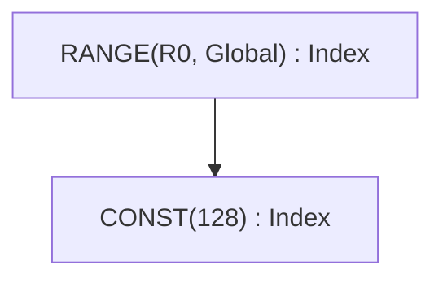

### END — 循环作用域关闭

```rust
End {
    computation: Arc<UOp>,              // value computed inside loop
    ranges: SmallVec<[Arc<UOp>; 4]>,    // ranges being closed
}
```

END 关闭一个或多个 RANGE 作用域，并将它们从活动集合中移除。可以同时关闭多个 range。

**示例：**
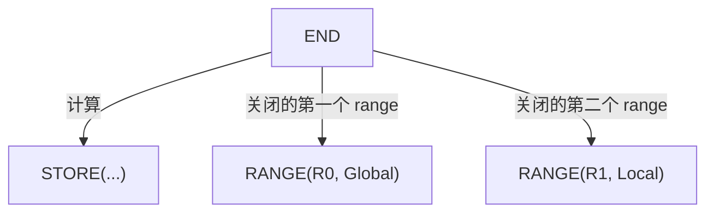

---

## 规约：REDUCE 与 REDUCE_AXIS

两个名字相近的操作用途不同。

### REDUCE_AXIS — 张量维度规约（高层）

```rust
ReduceAxis {
    src: Arc<UOp>,           // input tensor
    reduce_op: ReduceOp,     // Add, Mul, Max, Min
    axes: Vec<usize>,        // axes to reduce
}
```

在 rangeify **之前**使用。作用于张量维度，类似 NumPy 的 `.sum(axis=0)`。

**示例：**
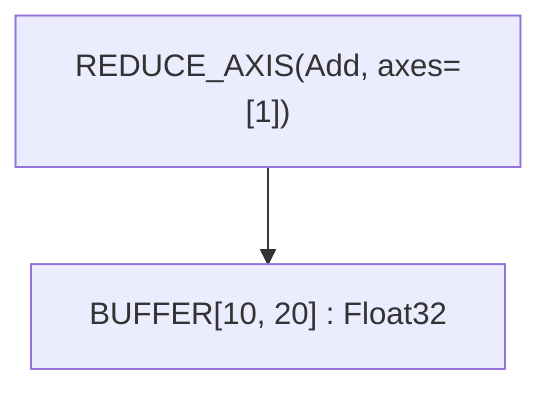

这会沿轴 1 求和，把 `[10, 20]` 张量规约为 `[10]`。

### REDUCE — Range 迭代规约（底层）

```rust
Reduce {
    src: Arc<UOp>,                      // value to accumulate
    ranges: SmallVec<[Arc<UOp>; 4]>,    // ranges being reduced
    reduce_op: ReduceOp,                // Add, Mul, Max, Min
    num_axes: usize,                    // reduced axes of the shaped source
}
```

在 rangeify **之后**使用。跨 RANGE 迭代累加值，并关闭指定的 range。树形打印为 `REDUCE(Add, num_axes=1, ranges=[30])`，其中带有它所关闭的 range 的 id。

**ReduceOp 变体：**

| 操作 | 单位元 | 运算 | Tinygrad |
|----|----------|-----------|----------|
| `Add` | 0 | `acc + value` | ✓ |
| `Mul` | 1 | `acc * value` | ✓ |
| `Max` | -∞ | `max(acc, value)` | ✓ |
| `Min` | +∞ | `min(acc, value)` | 仅 Svod |

> **兼容性：** Tinygrad 的规范将 REDUCE_AXIS 限制为 `{Add, Mul, Max}`。Svod 在此基础上增加了 `Min`。

**示例：**
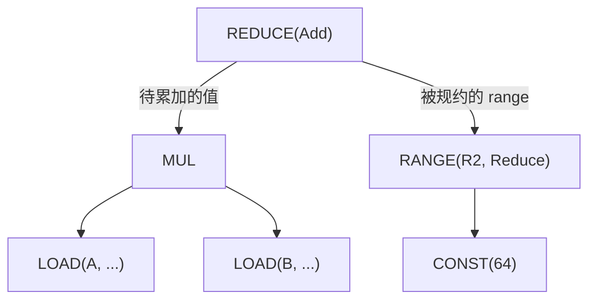

### ALLREDUCE — 跨设备规约

```rust
AllReduce {
    src: Arc<UOp>,           // local partial result
    device: DeviceSpec,      // device specification
    reduce_op: ReduceOp,     // reduction operation
}
```

在多个设备之间执行分布式规约。用于多 GPU 训练。

---

## Buffer 操作

### BUFFER — Buffer 声明

```rust
Buffer {
    shape: Arc<UOp>,         // flat storage shape (one element count)
    arg: Box<ParamArg>,      // slot, dtype, address space, device
}
```

声明用于张量存储的 buffer。`ParamArg` 与 `PARAM` 共用：

| 字段 | 类型 | 用途 |
|-------|------|---------|
| `slot` | `usize` | 区分大小/设备相同的 buffer；对 `PARAM` 而言是内核参数位置 |
| `dtype` | `DType` | 元素类型 |
| `addrspace` | `Option<AddrSpace>` | `Global` 表示设备内存，`Local` 表示 GPU 共享内存（LDS），`Reg` 表示寄存器/scratch 分配；标量参数为 `None` |
| `device` | `Option<DeviceSpec>` | buffer 所在的设备；`Local`/`Reg` 为 `None` |
| `name`, `vmin_vmax`, `multiple_of` | `Option<_>` | 标量参数元数据：名称与取值范围（`UOp::scalar_param`） |
| `axis` | `Option<usize>` | 多设备 buffer 的分片轴 |
| `volatile` | `bool` | 读取不得被提升或合并 |

### STAGE — 物化标记

```rust
Stage {
    compute: Arc<UOp>,                  // computation to materialize
    ranges: SmallVec<[Arc<UOp>; 4]>,    // output dimensions
    opts: Box<BufferizeOpts>,           // address space, device
}
```

标记计算应当物化到内存的位置。会触发内核拆分。

**BufferizeOpts：**

| 字段 | 类型 | 用途 |
|-------|------|---------|
| `device` | `Option<DeviceSpec>` | 目标设备，local 时为 `None` |
| `local_axis` | `Option<AxisId>` | 拥有 LOCAL 暂存 buffer 的 `GroupReduce` 轴 |
| `addrspace` | `AddrSpace` | `Global`（设备）或 `Local`（共享） |
| `removable` | `bool` | 为 `false` 时禁止 `buffer_removal` 内联此 STAGE——用于多消费者的 realize 边界，使 buffer 在 mega-pass 不动点迭代之间保持固定 |

**示例：**
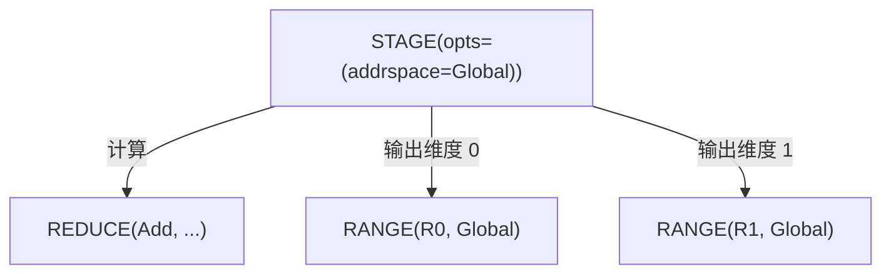

### INDEX — 多维 Buffer 访问

```rust
Index {
    buffer: Arc<UOp>,                   // BUFFER, PARAM or STACK
    indices: SmallVec<[Arc<UOp>; 4]>,   // index per dimension
}
```

根据多维索引计算内存地址。返回元素 dtype（而不是指针）。可以用 `idx.valid(cond)` 让索引变为条件性的，它会把索引包装为 `WHERE(cond, idx, INVALID)`——`INVALID` 是 dtype 为 `Bool` 的毒值常量 `CONST(Invalid)`，树形打印为 `INVALID`。对 `STACK` 使用 INDEX 选择的是通道而不是地址：常量标量索引会直接折叠为被堆叠的源。

**示例：**
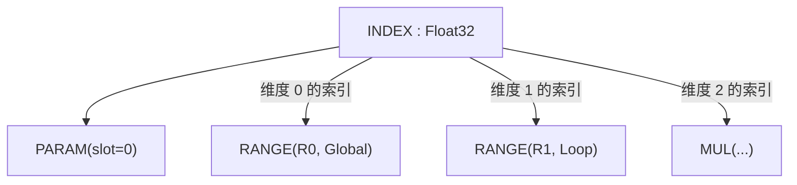

### LOAD — 内存读取

```rust
Load {
    index: Arc<UOp>,         // INDEX op (buffer accessed via the INDEX)
    alt: Option<Arc<UOp>>,   // alternative value for gated loads
    gate: Option<Arc<UOp>>,  // predicate for gated loads
}
```

从 buffer 的指定索引处读取值；没有单独的 `buffer` 字段，buffer 通过 INDEX 节点访问。对于带门控的加载，当 `gate` 为 false 时由 `alt` 提供值（完全避免内存访问）。`alt` 和 `gate` 总是同时设置：一个加载要么两者都有，要么都没有，gate 为 `Bool`，`alt` 可以是 `INVALID` 标记。渲染器要求单轴 `INDEX`，因此多索引访问必须在加载到达代码生成之前被展平。

**示例：**
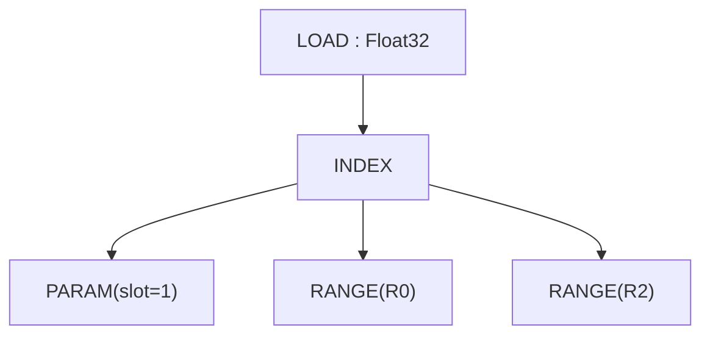

### STORE — 内存写入

```rust
Store {
    index: Arc<UOp>,                    // INDEX op (buffer accessed via index.src[0])
    value: Arc<UOp>,                    // value to write
    gate: Option<Arc<UOp>>,             // predicate for gated stores
}
```

向 buffer 写入值。buffer 通过 INDEX 节点（经由 `index.src[0]`）访问，而不是单独的字段。在展开过程中，`Upcast` 和 `Unroll` 仍然是 range 的轴类型。

对于带门控的存储，`store_gated` 会设置 `gate`；`pm_move_gates_from_index` 负责把门控从地址表达式上提升到 LOAD/STORE 上。

> **兼容性：** Svod 的 STORE 没有单独的 `buffer` 字段——源为：index=0，value=1。与 STAGE 或 REDUCE 不同，STORE 不会关闭 range。

**示例：**
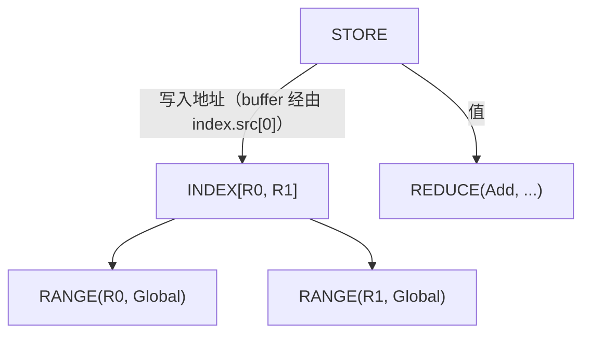

---

## 内核结构与可调用 IR

调度级的工作用一种可调用 IR 表达，它对应 tinygrad 的
`CALL`/`FUNCTION`/`PROGRAM` 模型：`Function` 定义一个由参数参数化的体（通常是
由若干 store 组成的 `Sink`），`Call` 用具体实参调用它，`Program` 则携带该体走完严格的
`SINK → LINEAR → SOURCE → BINARY` 编译阶段。不存在 `KERNEL`
操作：内核就是一个体为 `SINK[KERNEL]`（携带
`KernelInfo` 的 SINK）的 `CALL`。

### CALL — 调用函数体

```rust
Call {
    body: Arc<UOp>,                     // FUNCTION (or its body)
    args: SmallVec<[Arc<UOp>; 4]>,      // concrete argument values
    info: Box<CallInfo>,                // annotations (name, origin, ...)
}
```

用实参调用一个可调用体。属于 range 终止操作：关闭 `args` 中的所有 `Range`
操作（range_start_index = 1；`body=0`，`args=1+`）。

`CallInfo` 携带可安全参与缓存键的注解：

| 字段 | 类型 | 用途 |
|-------|------|---------|
| `name` | `Option<String>` | 人类可读的可调用对象名称 |
| `grad_tag` | `Option<String>` | 为梯度回调标识预留 |
| `origin` | `Option<OriginId>` | 被存储值的根的来源——内核的开销归属于它 |
| `origins` | `OriginSet` | 体被剥离之前其中可达的所有来源 |
| `precompile` / `precompile_backward` | `bool` | 提前编译提示 |

内核 CALL 是一次分派保存归属信息的地方，profiler 汇总读取的就是它；参见
[内核来源](./kernel-origins.md)。

### FUNCTION — 可重用的体

```rust
Function {
    body: Arc<UOp>,                     // computation
    args: SmallVec<[Arc<UOp>; 4]>,      // formal parameters
    info: Box<CallInfo>,
}
```

可重用的可调用对象。其 dtype 始终为 `Void`；返回多个值的体会被包装进
`Tuple`，以保持函数边界为 Void。range 终止的形态与 `Call` 相同。

### TUPLE / GET_TUPLE — 多值返回

```rust
Tuple { src: SmallVec<[Arc<UOp>; 4]> }
GetTuple { src: Arc<UOp>, index: usize }
```

`Tuple` 打包异构的值；其 dtype 始终为 `Void`。`GetTuple`
从 `Tuple`（或体为 `Tuple` 的 `Function`）中取出第 `index` 个元素；其 dtype
与内部元素一致。用于让多个输出穿过原本为 Void 的函数边界。

### PROGRAM — 编译流水线容器

```rust
Program {
    sink: Arc<UOp>,                     // root SINK
    info: Box<ProgramInfo>,             // name, launch dims, ABI slots, target
    linear: Option<Arc<UOp>>,           // LINEAR (after linearize)
    source: Option<Arc<UOp>>,           // SOURCE (after render)
    binary: Option<Arc<UOp>>,           // PROGRAM_BINARY (after compile)
}
```

携带内核走完由 `codegen/src/program_pipeline.rs`
（`do_linearize`/`do_render`/`do_compile`/`get_program`）强制执行的
`SINK → LINEAR → SOURCE → PROGRAM_BINARY` 阶段。每个阶段填充下一个字段。
`ProgramInfo` 包含 `name`、符号化的 `global_size` /
`local_size`、内核接收的 `vars`、`globals` / `outs` / `ins`
buffer 槽位以及 `target` 设备。C/LLVM 渲染器期望输入为 `Op::Linear`，
并通过每个上下文的 `pending_error` 报告 `Error::InvalidGraph`，而不是
panic；到达渲染器的多索引 `INDEX` 也以同样方式被拒绝，因此索引必须已被展平为单轴。

### LINEAR — 线性化的操作流

```rust
Linear { ops: SmallVec<[Arc<UOp>; 8]> }
```

线性化产生的扁平操作序列。使用者直接遍历 `ops`，
无需重新遍历图。

### SOURCE / PROGRAM_BINARY — 编译产物

```rust
Source { code: String, identity: Option<Box<SourceStageIdentity>> }
ProgramBinary { bytes: Vec<u8>, identity: Option<Box<BinaryStageIdentity>> }
```

程序流水线的终止阶段。两者都是叶子节点（没有子节点）。可选的
`identity` 是把某一阶段与其确切前一阶段绑定起来的语义证明（`SourceStageIdentity` 携带 ABI、目标、入口名以及
LINEAR/SOURCE 摘要；`BinaryStageIdentity` 在其外包装编译器键和
二进制摘要），因此缓存的产物不会在图发生变化后被复用。树形打印将二进制显示为 `BINARY(len=…, identity=…)`。

### SINK — 多根收集器

```rust
Sink {
    sources: SmallVec<[Arc<UOp>; 4]>,
    info: Option<Box<KernelInfo>>,      // structural marker for kernel ASTs
}
```

把多个输出收集到单个根中。`Function` 的体通常是由若干 store 组成的 `Sink`。
`info` 字段是经过哈希合并（hash-consed）的结构标记，用于区分内核 AST 的 SINK（打印为 `SINK[KERNEL]`）与
其他方面完全相同的裸 SINK。`KernelInfo` 携带 `opts_to_apply`
（`None`：由优化器选择；`Some([])`：手工降级，保持不动；
`Some(opts)`：严格应用这些选项）、`applied_opts`、`dont_use_locals` 以及
内核 `name`。

**示例：**
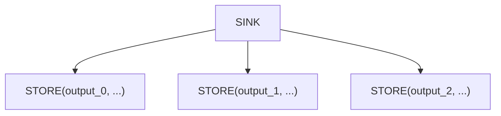

### AFTER — 依赖标记

```rust
After {
    passthrough: Arc<UOp>,              // value that flows through
    deps: SmallVec<[Arc<UOp>; 4]>,      // operations that must complete
}
```

在没有数据依赖的情况下表达内核之间的执行依赖。`passthrough` 值原样返回，但只有在所有 `deps` 完成之后才返回。

**示例：**
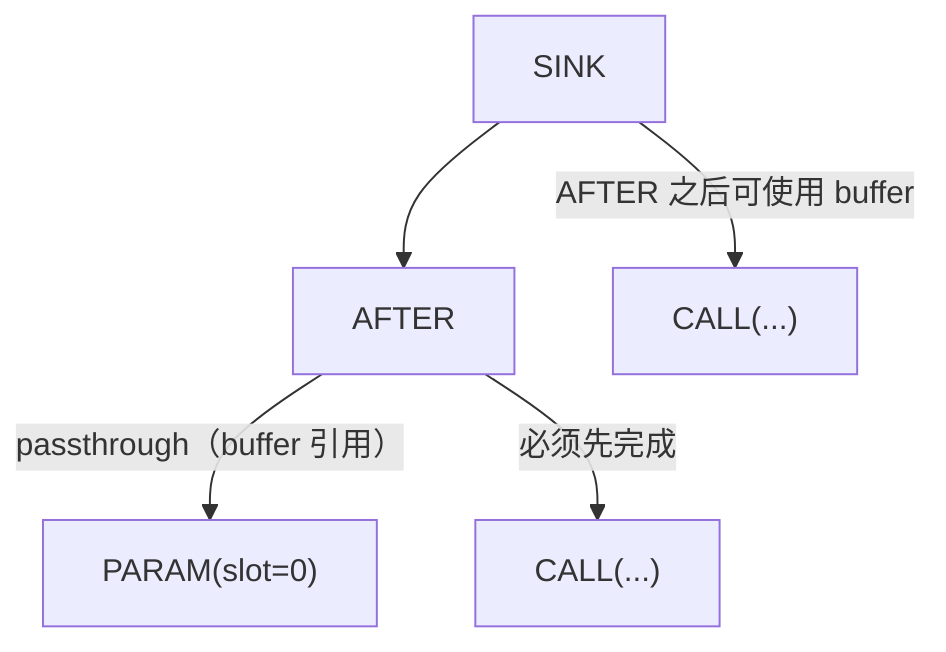

### BARRIER — 同步栅栏

```rust
Barrier {
    src: Arc<UOp>,                      // value passing through
    deps: SmallVec<[Arc<UOp>; 4]>,      // operations to wait for
}
```

GPU 工作组同步。确保工作组内的所有线程都到达屏障后才继续执行。

---

## 向量操作

### STACK — 用通道构建带形状的值

```rust
Stack {
    sources: SmallVec<[Arc<UOp>; 4]>,
}
```

把 N 个值组合成一个有 N 个通道的带形状的值。元素 dtype 保持为
标量——通道数由 STACK 自身携带，而不是通过加宽 dtype 来表示——构造时各个源会被转换为提升后的 dtype。

**示例：**
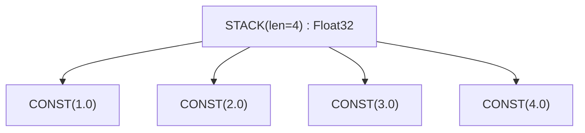

### 通道选择 — 对 STACK 使用 INDEX

不存在单独的提取操作。`INDEX` 从 `STACK` 中选择通道，
与从 buffer 中选择地址的方式完全相同，常量索引在构造时就会直接折叠为被堆叠的源。

**示例：**
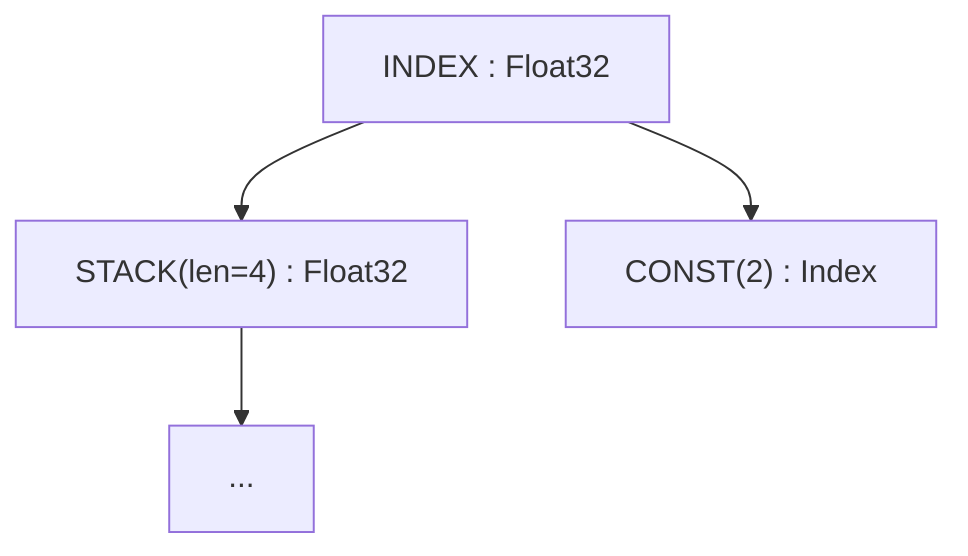

### VConst — 向量常量

```rust
VConst {
    values: Vec<ConstValue>,
}
```

编译期常量组成的向量。比由 `CONST` 节点组成的 `STACK` 更高效。

通道聚合使用 `STACK`；通道选择与地址选择使用 `INDEX`。循环
展开由 `AxisType::Unroll` 的 `Range` 表示，而不是单独的
操作。张量核心的展开轴保存在 `WmmaMetadata` 中。

---

## 张量核心：WMMA

### WMMA — Warp 矩阵乘累加

```rust
Wmma {
    a: Arc<UOp>,             // matrix A fragment
    b: Arc<UOp>,             // matrix B fragment
    c: Arc<UOp>,                 // accumulator C fragment
    metadata: Box<WmmaMetadata>, // hardware configuration
}
```

硬件张量核心操作：`D = A × B + C`。需要特定的矩阵形状和数据布局。

**WmmaMetadata 字段：**

| 字段 | 类型 | 用途 |
|-------|------|---------|
| `name` | `String` | 指令名称（例如 `"__hmma..."`） |
| `dims` | `(N, M, K)` | 矩阵维度（例如 `(16, 16, 16)`） |
| `dtype_in` | `DType` | 输入矩阵精度（例如 `Float16`） |
| `dtype_out` | `DType` | 输出精度（例如 `Float32`） |
| `device` | `RendererDevice` | 产生此 WMMA 的渲染器 / TC 后端（`CudaSm80`、`AmdRdna3`、`Metal`……） |
| `threads` | `usize` | 每个 warp 的线程数（通常为 32） |
| `upcast_axes` | `Option<WmmaUpcastAxes>` | 每个源的展开轴（字段：`a`、`b`、`c`）；在 `expander2` 为源和输出确定形状后被清除 |
| `reduce_axes` | `Vec<AxisId>` | TC 规约轴 ID，在展开期间用作 `exclude_args` |

**示例：**
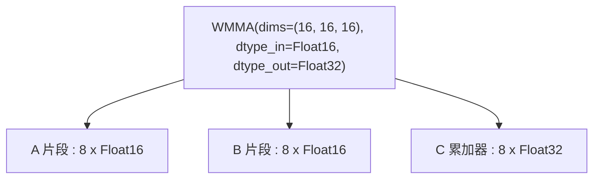

---

## 控制流

### IF / ENDIF — 条件执行

```rust
If {
    condition: Arc<UOp>,                // boolean predicate
    body: SmallVec<[Arc<UOp>; 4]>,      // operations to execute
}

EndIf {
    if_op: Arc<UOp>,         // corresponding IF op
}
```

仅当条件为真时执行体。用于边界检查和稀疏操作。

**示例：**
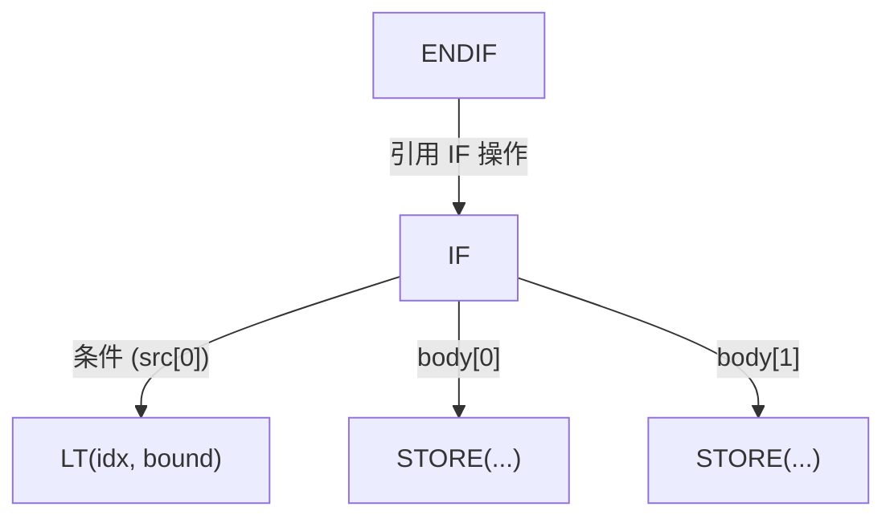

---

## 定义操作

### CONST — 字面量

```rust
Const(ConstValueHash)        // Int(i64), UInt(u64), Float(f64), Bool(bool), Invalid
```

编译期标量。`Invalid` 是所有 `valid()` 门控回退到的毒值；
其 dtype 始终为 `Bool`。常量与 buffer、param 一样，从不
携带来源。

### PARAM — Buffer 参数

```rust
Param { shape: Arc<UOp>, arg: Box<ParamArg> }
```

规范化的 buffer 参数——对输入/输出 buffer 的位置引用。
由调度前规范化（BUFFER→PARAM）创建，用于抹去 buffer 的身份，
从而能够对作用于不同 buffer 的相同计算进行结构去重。
`arg.slot` 是内核参数列表中的位置，`shape` 携带
元素数量。`ParamArg` 也涵盖标量参数（`UOp::scalar_param`），
它们携带可选的名称和取值范围，没有地址空间。

### 共享内存与寄存器

不存在专门的 `DefineLocal` 或 `DefineReg` 操作。GPU 共享内存
（LDS）和寄存器/scratch 分配都是 `Buffer` 节点，其
`arg.addrspace` 为 `AddrSpace::Local` 或 `AddrSpace::Reg`；它们不携带设备，
仅在工作组内（LOCAL）或线程内（REG）可见。

### DEFINE_VAR — 符号运行时变量

```rust
DefineVar {
    name: String,            // variable name
    min_val: i64,            // minimum bound
    max_val: i64,            // maximum bound
}
```

具有已知范围的运行时变量。用于范围已知的动态形状。

**示例：**
```text
DEFINE_VAR('batch_size', min=1, max=128) : Index
```

### BIND — 变量绑定

```rust
Bind {
    var: Arc<UOp>,           // DEFINE_VAR
    value: Arc<UOp>,         // concrete value
}
```

在运行时将符号变量绑定到具体值。

---

## 特殊操作

### SPECIAL — 硬件提供的值

```rust
Special {
    end: Arc<UOp>,           // upper bound for this dimension
    name: String,            // e.g., "gidx0", "lidx1"
}
```

访问硬件提供的值（线程/块索引）。它不是循环——值由硬件直接提供。

**示例：**
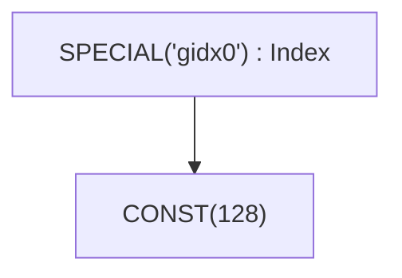

### UNIQUE / LUNIQUE — 标识标记

```rust
Unique(usize)                // global identity counter
LUnique(usize)               // local-scope identity counter
```

为 buffer 消歧创建唯一标识。两个 `Unique` 值不同的 buffer
即使其他方面完全相同，也是不同的 buffer。`LUnique`
在局部作用域内（例如在 `Function` 体内）提供同样的消歧，而不会与全局计数器冲突，
因此可调用体可以独立于其调用位置进行哈希合并。

设备本身不是节点：目标是需要它的操作上的一个 `DeviceSpec` 字段
（`Copy`、`GetAddr`、`AllReduce`、`ParamArg.device`、
`BufferizeOpts.device`、`ProgramInfo.target`）。

---

## 移动操作

高层的张量形状变换。它们在 rangeify 期间被转换为显式的 INDEX 操作。

| 操作 | 签名 | 用途 |
|-----------|-----------|---------|
| `Reshape` | `{ src, new_shape }` | 改变形状，元素不变 |
| `Permute` | `{ src, axes: Vec<usize> }` | 转置/重排轴 |
| `Expand` | `{ src, new_shape }` | 广播到更大的形状 |
| `Pad` | `{ src, begin_pads, end_pads }` | 添加填充 |
| `Shrink` | `{ src, offsets, sizes }` | 提取子区域 |
| `Flip` | `{ src, axes: Vec<bool> }` | 沿轴反转 |

**示例：** RESHAPE
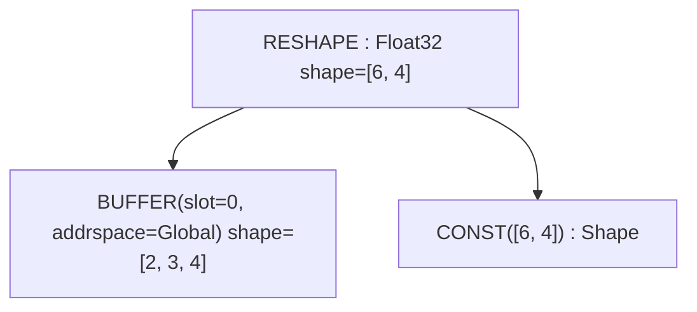

---

## 其他操作

以下操作存在于 `Op` 枚举中，但要么是内部操作，要么在调试中很少遇到：

| 操作 | 用途 |
|-----------|---------|
| `Copy` | `{ src, device }` - 将值显式复制到另一个设备；关闭其源的所有 range |
| `Slice` | `{ buffer, offset, size }` - buffer 上连续的带类型切片元数据（偏移以源元素计）；关闭其源的所有 range |
| `GetAddr` | `{ src, device }` - 类 buffer 源的 `UInt64` 地址 |
| `MStack` | `{ buffers }` - 多设备张量在各设备上的 buffer |
| `MSelect` | `{ buffer, device_index }` - 从多设备张量中取出某一设备的 buffer |
| `Multi` | `{ src, axis }` - 分片标记：多设备张量沿其拆分的轴 |
| `Group` | `{ sources }` - 为调度将操作分组 |
| `Noop` | 没有操作数、没有效果的占位符 |
| `Detach` | 从图中分离（阻止跨越它的优化） |
| `Contiguous` | `{ src, opts: Vec<ContiguousHint> }` - 强制物化到独立 buffer，可附带优化器提示；`realize()` 用它包装根节点 |
| `ContiguousBackward` | contiguous 提示的反向传播 |
| `Precast` | 用于类型转换的预转换 |
| `Custom` / `CustomI` | `{ deps, code }` - 内联后端代码（C 或 LLVM IR），两个渲染器均可渲染 |
| `CustomFunction` | `{ kind, attrs }` - 运行时自定义函数钩子；种类：`EncDec`、`Graph`、`AllReduce { reduce_op }` |
| `Ins` | `{ sources, arg: InsArg }` - 由 ISA 渲染器选出的目标指令（`opcode` 加排序后的属性） |

---

## 速查表

### 按类别

| 类别 | 操作 |
|----------|------------|
| **零元** | `CONST`, `VCONST`, `UNIQUE`, `LUNIQUE`, `NOOP`, `DEFINE_VAR` |
| **循环控制** | `RANGE`, `END` |
| **规约** | `REDUCE_AXIS`, `REDUCE`, `ALLREDUCE` |
| **内存** | `BUFFER`, `SLICE`, `STAGE`, `INDEX`, `LOAD`, `STORE`, `GETADDR`, `COPY` |
| **多设备** | `MSTACK`, `MSELECT`, `MULTI` |
| **内核与可调用** | `SINK`, `GROUP`, `CALL`, `FUNCTION`, `TUPLE`, `GET_TUPLE`, `PROGRAM`, `LINEAR`, `SOURCE`, `PROGRAM_BINARY`, `AFTER`, `BARRIER` |
| **向量** | `STACK`, `INDEX`, `VCONST` |
| **展开** | 带 `AxisType::Upcast` 或 `AxisType::Unroll` 的 `RANGE` |
| **硬件** | `WMMA`, `SPECIAL`, `INS` |
| **控制** | `IF`, `ENDIF` |
| **定义** | `PARAM`, `DEFINE_VAR`, `BIND`, `UNIQUE`, `LUNIQUE` |
| **移动** | `RESHAPE`, `PERMUTE`, `EXPAND`, `PAD`, `SHRINK`, `FLIP` |
| **图提示** | `CONTIGUOUS`, `CONTIGUOUS_BACKWARD`, `DETACH`, `PRECAST` |
| **扩展** | `CUSTOM`, `CUSTOMI`, `CUSTOM_FUNCTION` |
| **ALU** | `Unary(...)`, `Binary(...)`, `Ternary(...)`, `Cast`, `BitCast` |

### Range 终止操作

关闭 RANGE 作用域的操作（`Op::range_ending_src_index`）：

| 操作 | Range 起始索引 |
|-----------|-------------------|
| `STAGE` | 1 (compute=0, ranges=1+) |
| `REDUCE` | 1 (src=0, ranges=1+) |
| `WMMA` | 3 (a=0, b=1, c=2) |
| `END` | 1 (computation=0, ranges=1+) |
| `CALL` / `FUNCTION` | 1 (body=0, args=1+) |

`Op::ended_ranges()` 额外增加了两种间接情况：`AFTER` 终止其 `deps` 所终止的一切，`COPY` / `SLICE` 终止其源处作用域内的所有 range。

### 可展开操作

在计算图中传播展开通道的操作（`Op::is_expandable`）：

- ALU：`Unary`、`Binary`、`Ternary`
- 类型：`Cast`、`BitCast`
- 带形状的值：`Stack`
- 内存：`Load`、`Store`、`Index`
- 控制：`Reduce`、`End`、`After`
- Buffer：`Stage`
- 硬件：`Wmma`
