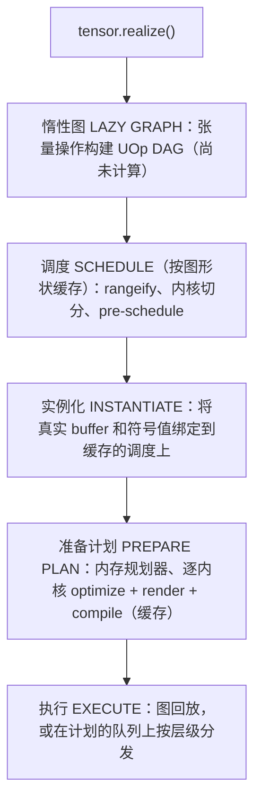
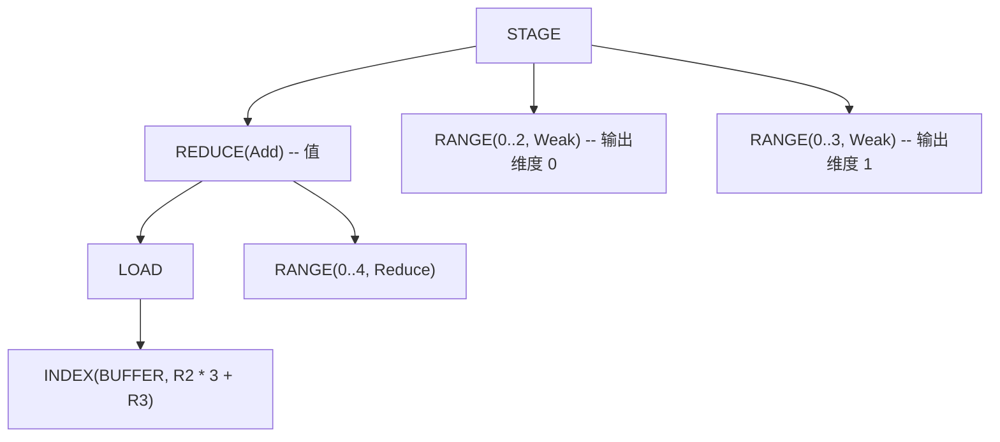
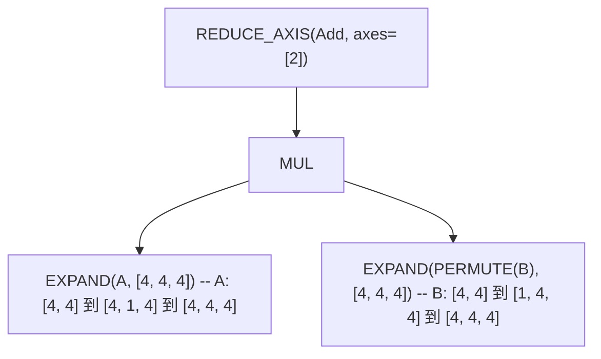
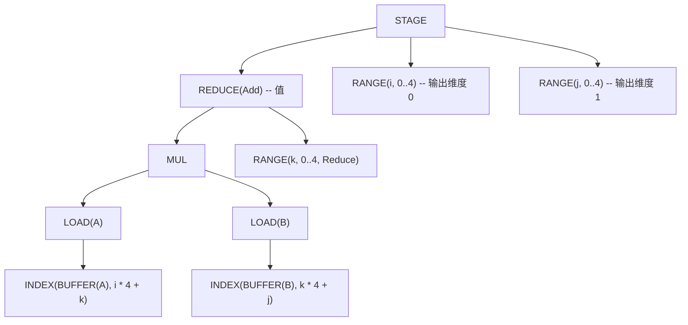
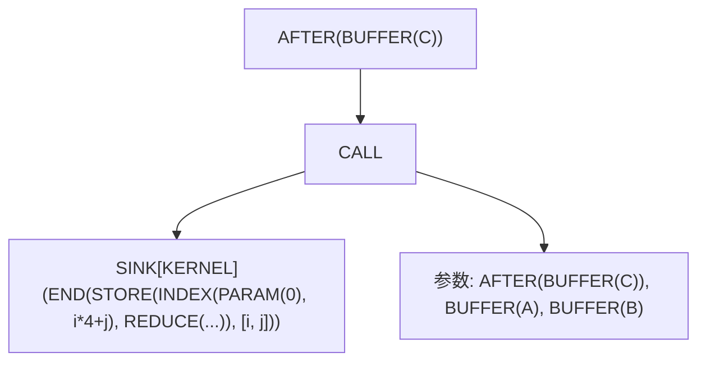

# 从 Tensor 到机器码

大多数 ML 框架中，计算是立即发生的。在 PyTorch 里写 `a + b`，它*马上*就执行了——GPU 在你能查看结果之前就已经算完了。这种即时求值方式容易理解，但会错过很多优化机会。编译器怎么优化一个它还没看到的计算呢？

Svod 走的是相反的路线：**惰性求值**。当你写 `a.try_add(&b)?` 时，什么都不会被计算。Svod 构建的是一个描述*做什么*的图，而不是*何时做*。工作发生在你调用 `realize()` 的时候——这一个方法触发整个编译流水线，从高层张量操作一路到 JIT 编译的机器码。

本章追踪这一过程。[IR 设计](./ir-design.md)页面解释了所有阶段共用的节点类型；[代码生成章节](./codegen/overview.md)逐个 pass 地讲解单内核优化器；本页则是连接两者的地图。



---

## 惰性求值：构建计算图

Svod 中的 `Tensor` 是一个句柄：

```rust
pub struct Tensor {
    entry: Arc<TensorEntry>,
}

pub struct TensorEntry {
    pub id: u64,
    pub uop: RwLock<Arc<UOp>>,     // the computation this tensor represents
    buffer: OnceLock<Arc<Buffer>>, // filled by realization
}
```

UOp 位于 `RwLock` 之后，因此图可以被原地替换（见下文的注册表）；buffer 存放在共享的 entry 中而不是句柄里，所以克隆一个张量也就共享了它的 realize 结果。这正是 `realize()`、`prepare()` 和 `profile()` 都接受 `&self` 的原因。

### 三种创建张量的方式

**1. 输入张量** — 立即分配并填充 buffer：

```rust
let a = Tensor::from_slice([1.0f32, 2.0, 3.0]);
// a.buffer() is Some(..): device memory allocated, bytes copied in
```

`from_slice`（以及 `from_ndarray`，对 C 连续输入只拷贝一次）分配一个设备 `Buffer`，用 `copyin` 拷贝你的字节，并构建图 `BUFFER.reshape(shape)`。不存在延迟的主机端拷贝。

**2. 惰性操作** — 没有 buffer，只有图：

```rust
let b = a.try_add(&a)?;   // b.buffer() is None
let c = b.try_mul(&a)?;   // c.buffer() is None
```

算术操作不执行任何计算。它们构建 UOp 图：`Binary(Add, a.uop, a.uop)`。张量纯粹作为未来工作的描述而存在。

**3. 变换操作** — 原始存储上的视图：

```rust
let d = a.try_reshape(&[1, 3])?;  // d.buffer() resolves to a's storage
```

Reshape、permute 及类似操作会创建一个新的惰性 entry，其图为 `RESHAPE(a.uop)`。该 entry 不拥有 buffer；`buffer()` 会走到基础 `BUFFER` 节点，并通过注册表找到 `a` 的存储。

### 全局注册表

`tensor/src/tensor_registry.rs` 维护两个无锁的 `papaya` 映射：

| 映射 | 键 → 值 | 用途 |
|-----|-------------|---------|
| `TENSORS` | tensor id → `Weak<TensorEntry>` | 所有存活的张量，用于图替换 |
| `BUFFERS` | `BUFFER` UOp id → `Arc<Buffer>` | 在调度和 `buffer()` 查找时定位设备存储 |

这个注册表实现了**全局图替换**：`realize()` 完成后，已 realize 的子图在所有引用它的张量中都被替换为它的 `BUFFER`（`apply_map_to_tensors_realized`），因此之后对依赖张量调用 `realize()` 会直接读取结果而不是重新计算。`BUFFERS` 条目通过 UOp 的 drop 钩子在 `BUFFER` 节点本身被释放时过期。

### 哈希一致化的实际效果

由于 UOp 是哈希一致化的（基于内容的驻留），相同的计算共享内存：

```rust
let x = a.try_add(&b)?;
let y = a.try_add(&b)?;
// x.uop() and y.uop() are the SAME Arc<UOp>
```

这正是下文各种缓存代价低廉的原因：计算形状相同的两个张量以同一个节点到达调度器，而且每个缓存键都是图的结构化 `content_hash`，因此即使是分别构建的图（甚至在另一次进程运行中构建的）也能命中。

---

## `realize()` 做了什么

`Tensor::realize`（`tensor/src/realize.rs`）很短：

```rust
pub fn realize(&self) -> Result<()> {
    if self.uop().has_buffer_identity() { self.ensure_buffer(); return Ok(()); }
    if is_any_const(&self.uop()) { self.set_uop(self.uop().contiguous()); }  // force a buffer
    if self.has_zero_elements() { return Ok(()); }

    let old_uop = self.uop();
    let plan = self.prepare_plan_with(&PrepareConfig::from_env())?;  // schedule + compile
    plan.execute()?;
    self.finalize_realize(&plan, &old_uop)?;      // tensor ← BUFFER.reshape(shape)
    apply_map_to_tensors_realized(&{old_uop => realized_uop});
    Ok(())
}
```

`prepare_plan_with` 把图包装成 `SINK(CONTIGUOUS(uop))` 并运行两步：`schedule_result_from_sink_with_cache`（下一节）和 `prepare_execution_plan`（再下一节）。`prepare()` 运行相同的两步，并把 `ExecutionPlan` 交给你自行执行；`realize_batch` / `prepare_batch` 通过一个 `SINK(CONTIGUOUS(t1), …, CONTIGUOUS(tN))` 对多个张量做同样的事，因此供给多个输出的内核会被共享。`PrepareConfig::from_env()` 从环境中读取优化器策略、线程预算和内存规划器模式（见文末表格）；`realize_with` / `prepare_with` 接受显式配置。

---

## 调度：从图到内核

### 调度缓存

调度（rangeify 加内核切分）是最昂贵的编译步骤，并且只依赖图的*形状*，而不依赖它读取哪些 buffer。因此 `schedule_result_from_sink_with_cache` 首先对 sink 进行**规范化**——每个 `BUFFER` 变成按位置编号的 `PARAM`，每个 `BIND(DEFINE_VAR, CONST)` 去掉其运行时值——然后在一个进程级缓存中查找结果，键为 `(content_hash(normalized sink), compiler identity)`。命中时直接跳到实例化；未命中时即使多个线程竞争，每个键也只运行一次 rangeify（single-flight）。`SVOD_DISABLE_SCHEDULE_CACHE=1` 关闭该缓存。

缓存未命中时依次运行：`rangeify_with_map` → `try_get_kernel_graph` → `wrap_scan_loops`（为 scan 操作生成调度级循环）→ `create_pre_schedule`。

### Rangeify：让循环显式化

当你写 `tensor.reshape([2, 3]).expand([4, 2, 3]).sum(axis=0)` 时，这些变换操作是高层描述。要生成循环，迭代必须是显式的。**Rangeify**（`rangeify_with_map`，`schedule/src/rangeify/transforms.rs`）将变换操作转换为 `RANGE` 循环和 `INDEX` 算术：

| 步骤 | 代码 | 用途 |
|------|------|---------|
| 多设备 | `multi_pm()`, `lower_allreduce_pm()` | 解析多设备张量的分片，降低 `ALLREDUCE` |
| 标签 | `add_tags_patterns()` | 给每个节点编号，使张量身份在重写后得以保留 |
| 调用 | `resolve_calls()` | 内联非预编译的 `FUNCTION`，折叠 `GETTUPLE(TUPLE)` |
| 早期重写 | `movement_op_patterns() + early_rewrites() + split_reduceop_patterns()` | 清理变换操作；将大型归约拆成两个阶段 |
| 范围分配 | `indexing::run_rangeify` | 决定哪些值物化（`pm_generate_realize_map`），为每个输出轴分配一个 `RANGE`，然后降低 `REDUCE_AXIS` → `REDUCE`、`PAD` → `WHERE`、`STACK` → `WHERE`，并在值物化处插入 `STAGE` + `INDEX` |
| 大合并 pass | `symbolic() + pm_reduce_simplify() + movement_op_patterns() + buffer_folding() + dead_axis_removal() + pm_remove_bufferize()` | 一个不动点循环：代数化简、归约化简、buffer 折叠、死轴消除、移除可融合的 `STAGE` |
| 输出 | 重建 `SINK` | 只保留公开的输出 |
| Buffer 上限 | `buffer_limit_patterns(limit)` | 拆分会超出设备参数上限的内核 |

每一步都是基于模式的重写（参见[模式引擎](./optimizations/pattern-system.md)）。[Rangeify 章节](./codegen/rangeify.md)中描述为第 1–7 阶段的逐内核 pass（早期变换操作、load 合并、拆分范围、初始符号化简、简化范围）会在图被切分为内核之后，于 `apply_pre_optimization()` 中运行。

每个变换操作都降低为一种特定的索引变换（`apply_movement_op`，`schedule/src/rangeify/indexing.rs`）：

| 操作 | 变换 |
|-----------|----------------|
| **RESHAPE** | 按输出步长展平，再按输入形状用 `/` 和 `%` 拆回 |
| **PERMUTE** | 按逆置换重排范围 |
| **EXPAND** | 被扩展轴的索引变为 `0`（该范围不再影响地址） |
| **PAD** | 索引变为 `WHERE(valid, rng - begin, INVALID)`；填充后的值为 `WHERE(valid, src, 0)` |
| **SHRINK** | `rng + begin` |
| **FLIP** | `(size - 1) - rng` |

Rangeify 之后不再有变换操作——只有索引上的算术。以上面的表达式为例，前后对比：

```text
Before: BUFFER.reshape([2, 3]).expand([4, 2, 3]).sum(axis=0)
```



`EXPAND` 变成了一个不出现在 buffer 索引中的 `RANGE(0..4)`——这就是广播。`RESHAPE` 变成了索引算术。`SUM` 变成了闭合一个 `Reduce` 范围的 `REDUCE(Add)`。这里的输出范围是 `Weak`：优化器稍后决定哪些变为 `Global`、`Local` 或 `Upcast`。

### 内核切分

`try_get_kernel_graph`（`schedule/src/rangeify/kernel.rs`）将 rangeify 后的图切分为内核：

**第 1 步：STAGE → STORE**（`pm_add_buffers_patterns`，`bufferize_to_store`）。每个 `STAGE` 获得一个新的 `BUFFER` 节点（尚无设备内存），并变成其范围下的一个 store，外面包一层作用于该 buffer 的 `AFTER`：

```text
Before: STAGE(compute, ranges)
After:  AFTER(BUFFER, [END(STORE(INDEX(BUFFER, flat_idx), compute), ranges)])
```

**第 2 步：将 store 拆分为内核**（`split_all_stores` → `split_store`）。每个 store 变成一个可调用体。在函数体内，全局 `BUFFER` 按模式匹配顺序变成 `PARAM(slot = N)`（`LocalAddBufferContext.param_slot` 计数器），函数体被封装为携带 `KernelInfo` 的 `SINK`，而内核本身是一个 `CALL`，其参数是这些 buffer（以 `AFTER` 形式）以及它所需的 `BIND`：

```text
After:  AFTER(BUFFER, [CALL(SINK[KERNEL](END(STORE(...), ranges)), args = [AFTER(BUFFER..), BIND..])])
```

不存在 `KERNEL` 操作：内核就是对 `SINK[KERNEL]` 的 `CALL`。内核切分也是把来源归属信息收集到 `CALL` 上的地方（参见[内核来源](./kernel-origins.md)）。

**第 3 步：修正赋值**（`fix_assign`）。当内核 B 读取内核 A 写入的 buffer 时，B 的 `AFTER` 会被追加到 A 的 `AFTER` 依赖中，从而保证同一 buffer 上读后写的顺序。依赖关系保存在 `AFTER` 节点中；在调度构建之前不存在独立的依赖图。

### Pre-schedule 与实例化

`create_pre_schedule`（`tensor/src/schedule.rs`）遍历内核图，按 `AFTER` 依赖对可调用体做 Kahn 排序，并为每个内核记录其 AST 及其触及的 buffer *身份*——但不记录 buffer 本身。这就是缓存所存储的内容。随后 `instantiate_schedule` 恢复真实的 `BUFFER`，为中间结果和输出分配 `Buffer` 句柄（除非设置了 `PrepareConfig::device_local_outputs`，输出保持主机可见），绑定符号值，并生成：

```rust
pub struct ScheduleResult {
    pub items: Vec<ScheduleItem>,
    pub output_uop_ids: Vec<u64>,
    pub alias_output_buffers: HashMap<u64, Buffer>,  // outputs that alias an input
}

pub struct ScheduleItem {
    pub kernel: Arc<UOp>,              // the CALL: dependency identity
    pub ast: Arc<UOp>,                 // the SINK[KERNEL] body (for codegen)
    pub buffers: Vec<Buffer>,          // device buffers, in CALL argument order
    pub buffer_uop_ids: Vec<u64>,      // their BUFFER UOp ids
    pub fixedvars: HashMap<String, i64>,  // bound symbolic variables
    pub loop_var_names: HashSet<String>,  // fixedvars fed by schedule-loop counters
    pub dependencies: Vec<u64>,        // producer CALL ids
    pub instance_dependencies: Vec<usize>, // producer schedule-item indices
}
```

---

## 准备执行计划

`prepare_execution_plan`（`tensor/src/realize.rs`）将调度项转换为 `ExecutionPlan`。它在任何来源作用域之外运行，并首先根据 `PrepareConfig::threads` 设置共享线程池的大小。

### 内存规划器

在分配任何东西之前，规划器（`tensor/src/memory_planner/`）决定哪些中间 buffer 可以共享存储。存活期以**执行层级**度量——即内核 DAG 的 Kahn 波次（`compute_topological_levels`，与运行时共用）——在层级 *L* 中最后一次使用的 buffer 可以复用在 *L* 之后的层级中首次使用的存储。规划器不注入任何排序边；安全性来自执行器本已强制的层级屏障。

| `SVOD_MEMORY_PLANNER` | 模式 | 效果 |
|---|---|---|
| 未设置、`1`、`arena` | `Arena`（默认） | 将可规划的 buffer 打包进每个设备一个的 TLSF arena；每个逻辑 buffer 成为其中的一个 `Buffer::view` |
| `remap`、`pool` | `Remap` | 按 `(device, dtype, size rounded to 256 B)` 池化整个 buffer，并交换 `Arc<Buffer>` |
| `0`、`off`、`none`、`disabled` | `Disabled` | 每个 buffer 保留自己的分配 |

输入、输出、别名存储、磁盘 buffer 以及拷贝/自定义函数的操作数从不参与规划。

### 逐内核编译与缓存

每个非拷贝项都解析为一个 `KernelSite`：它的设备、渲染器和一个 `OptKey`。缓存中缺失的内核会被并行优化，按调度顺序命名（`n1`、`n2` 后缀是源码文本的一部分，因此命名不能依赖线程时序），然后被渲染和编译：

```text
ast ──► apply_pre_optimization ──► heuristics | BEAM ──► post-optimization ──► PROGRAM ──► LINEAR ──► SOURCE ──► BINARY
```

- `apply_pre_optimization()`：变换操作清理、`pm_load_collapse`、`pm_split_ranges + pm_flatten_range`、`sym + pm_fold_cast_const`、`pm_simplify_ranges`。
- 优化器选择轴类型和分块方式：默认使用[启发式](./optimizations/kernel-search.md)，设置 `BEAM=N` 时使用 [BEAM 搜索](./optimizations/kernel-search.md)，对手写降低的内核则使用显式的 `opts_to_apply` 列表。
- 后优化通过[代码生成概览](./codegen/overview.md)标记为 08–20 的各阶段降低内核：后优化符号化简、展开器（`Upcast`/`Unroll` 范围 → lane）、局部 buffer、`pm_add_gpudims`（`Global`/`Local` 范围 → `SPECIAL`）、`pm_add_loads`、去向量化器（含 `bool_storage_patterns`）、内存合并访问、索引 dtype 降低、dtype 分解（`pm_float_decomp`、`pm_long_decomp`）、后期重写（目标支持 `MulAcc` 时的 `pm_fma_decomposition`、快速除法……）、`pm_move_gates_from_index`，以及最终重写（`pm_split_ends`、隐式屏障）。`SVOD_DUMP_STAGE=<prefix>` 会在其中任一阶段之后打印内核。
- `program_from_sink_with_renderer` 添加控制流，为剩余的 `PARAM` 槽编号并构建 `PROGRAM` 节点；`do_linearize` / `do_render` / `do_compile` 填充其 `LINEAR`、`SOURCE` 和 `BINARY` 字段（`codegen/src/program_pipeline.rs`）。

三个进程内缓存和一个磁盘缓存让重复工作几乎零成本：

| 缓存 | 键 | 范围 |
|-------|-----|-------|
| 调度缓存 | `content_hash(normalized SINK)` + 编译器身份 | rangeify + 内核切分 |
| `OPT_CACHE` | `content_hash(kernel AST)` + 设备 + 编译器键 + 渲染器指纹 + 优化器指纹 | 优化后的 AST 与编译后的程序；由 `SVOD_OPT_CACHE_MAX`（4096）限制的 FIFO |
| 已编译程序缓存 | `content_hash(PROGRAM)` + 编译器键 | `CachedKernel`：程序句柄、源码、入口点、ABI 槽；在进程生命周期内存在 |
| 目标文件缓存（CPU） | 源码的 SHA-256 + `CompilerIdentity`（后端、目标、工具链、标志、ABI） | `~/.cache/svod/objects` 下的可重定位目标文件（`SVOD_OBJECT_CACHE_DIR`，`SVOD_OBJECT_CACHE=0` 禁用） |

所有键都是结构化哈希而非 UOp id，因此从头重建的图——甚至在另一个进程中——仍然能命中。BEAM 结果有自己的磁盘缓存（`SVOD_BEAM_CACHE_DIR`）。

### ExecutionPlan

结果（`runtime/src/execution_plan.rs`）：

```rust
pub struct ExecutionPlan {
    ops: Vec<PreparedOp>,               // CompiledProgram | BufferCopy | CustomFunction
    op_order: Vec<usize>,               // topological order
    op_levels: Vec<Vec<usize>>,         // Kahn levels: ops in one level are independent
    buffers: Vec<Buffer>,
    ast_to_buffer: HashMap<u64, usize>, // BUFFER UOp id -> buffer index
    output_buffer_indices: Vec<usize>,  // plan outputs, in SINK source order
    device: DeviceSpec,
    runtime_var_vals: HashMap<String, i64>,
    graph: OnceLock<Option<Box<dyn Graph>>>,          // captured on first execute (GPU)
    plan_ctx: OnceLock<Option<Box<dyn PlanContext>>>, // the plan's own queue
    // ... HCQ executor state elided
}
```

| 方法 | 用途 |
|--------|---------|
| `execute()` | 用当前的 buffer 和变量值将每个操作运行一次 |
| `execute_with_vars(&[(name, value)])` | 重新绑定符号变量（按其 `[min, max]` 校验），然后执行——无需重新编译 |
| `output_buffer()` / `output_buffer_at(i)` / `num_outputs()` | 计划的输出（`i` 遵循 SINK 源顺序） |
| `profile(&ProfileOptions)` | 回放并打时间戳的运行，返回 `RunProfile` |
| `declare_input(idx)` / `replicate()` | [JIT 包装器](./jit-graphs.md)所依赖的基础 |

计划是**可复用的**：编译一次，用同一组 buffer 中的不同数据执行多次。

---

## 代码生成

两个渲染器（`svod_codegen::Renderer`）覆盖四个设备后端，由设备决定使用哪个：

| 设备后端 | 渲染器 | 输出 |
|----------------|----------|--------|
| **CPU** | `LlvmTextRenderer`（默认）或 `CRenderer`（`SVOD_CPU_BACKEND=clang`） | LLVM IR 文本，或 C 源码 |
| **CUDA** | `LlvmTextRenderer::nvptx(arch)` | LLVM IR，`ptx_kernel` ABI |
| **AMD** | `LlvmTextRenderer::amd(arch)` | LLVM IR，`amdgpu_kernel` ABI |
| **Metal** | `CRenderer::metal()` | Metal Shading Language |

```rust
pub trait Renderer {
    fn render(&self, uop: &Arc<UOp>, name: Option<&str>) -> Result<RenderedKernel>;
    fn backend_name(&self) -> &str;
    fn decompositor(&self) -> Option<TypedPatternMatcher<()>>;
}
```

运行时将每个渲染器包装进设备级的 `svod_device::device::Renderer`，后者添加目标的能力信息（`supported_ops`、`gpu_arch`、额外的和 ISA 匹配器），并返回一个 `ProgramSpec`：源码、入口点、变量名，以及计划用于绑定参数的 `globals` / `outs` / `ins` buffer 槽。

LLVM 渲染器（`codegen/src/llvm/text/`）遍历 `LINEAR` 操作流，为每个内核生成一个函数。每个 buffer 都是一个直接的 `ptr noalias align 32 %dataN` 参数——没有参数数组——而符号变量（以及 CPU 多线程所用的 `core_id`）是带类型的标量参数：

```llvm
define void @E_128(ptr noalias align 32 %data0, ptr noalias align 32 %data1, i32 %N) #0 {
entry:
  br label %loop_0

loop_0:
  %i = phi i32 [ 0, %entry ], [ %i.next, %loop_0 ]
  ; ... computation ...
  %i.next = add nsw i32 %i, 1
  %cond = icmp slt i32 %i.next, 128
  br i1 %cond, label %loop_0, label %exit

exit:
  ret void
}
```

---

## 编译与加载

在 CPU 上，IR 文本被编译为可重定位目标文件并在进程内加载；没有 LLVM `ExecutionEngine`，也没有临时共享库：

1. **编译**，使用 `-O2`——libLLVM 可用时通过 `libloading` 在进程内绑定（`SVOD_LLVM_INPROCESS=0` 可退出，`SVOD_LLVM_LIB` 指定库），否则通过 stdin/stdout 调用 `clang -x ir -c -O2 … -o -`。
2. **复用**：源码与编译器身份匹配时，从磁盘缓存中取出目标文件。
3. **加载**：用 ELF 加载器加载——各段映射到匿名 mmap，应用重定位，页面翻转为可执行（`runtime/src/jit_loader.rs`；参见 [JIT 编译器](../backends/jit-loader.md)）。

```rust
let object = cache.get_or_compile(key, validate_relocatable_object, |ir| producer.compile(ir))?;
let (fn_ptr, _mmap) = jit_load(&object, &entry_point)?;  // ELF loader, no linker
```

GPU 后端则把同样的 LLVM IR 交给驱动：PTX 由 CUDA 驱动 JIT 编译（安装了 `ptxas` 时用它），AMDGPU 代码对象通过 KFD 加载，Metal 源码由 Metal 框架编译。

---

## 执行

`ExecutionPlan::execute()` 在计划的执行器锁下从三条路径中选择一条：

1. **图回放。** 如果每个操作都是计划设备上的已编译内核、没有未绑定的符号变量，并且设备具有图工厂（CUDA Graphs、AMD PM4/AQL 图、Metal 间接命令缓冲区），计划会在第一次 `execute()` 时捕获整个分发序列，之后进行回放，只修补发生变化的内核参数。[JIT 图](./jit-graphs.md#graph-capture-and-replay)页面记录了各后端及其开关。
2. **原生链接计划**（AMD）。图无法捕获的计划——包含运行时变量、拷贝或自定义函数的计划——被捕获为一条链接的 HCQ 命令流，每次回放时重新打包其内核参数。
3. **逐操作分发。** 否则，计划按层级遍历 `op_levels`，将每个操作提交到计划自己的队列（`PlanContext::dispatch`，在 GPU 上是异步的），或直接调用 CPU 程序。

在同一个计划内，同一层级的操作*不会*在不同的主机线程上运行：层级既是内存规划器的复用屏障，也是图捕获的顺序。CPU 并行发生在内核内部（`Thread` 轴分布到 rayon 线程池上）以及不同计划之间。每个 `PreparedKernel` 携带自己的设备，因此一个计划可以跨越多个设备，由 `BufferCopy` 操作在它们之间移动数据。

---

## 完整示例：矩阵乘法

让我们以 4×4 矩阵为例，追踪 `C = A.matmul(&B)?` 在流水线中的过程。

### 阶段 1：惰性图构建

```rust
let a = Tensor::from_slice(a_data).try_reshape(&[4, 4])?;  // input buffer allocated
let b = Tensor::from_slice(b_data).try_reshape(&[4, 4])?;  // input buffer allocated
let c = a.matmul(&b)?;                                     // graph built, no computation
```

`matmul` 将 `A` reshape 为 `[4, 1, 4]`，将 `B` reshape 为 `[1, 4, 4]`，转置 `B`，相乘（广播插入 `EXPAND`），然后对最后一个轴求和：



### 阶段 2：Rangeify

变换操作变成显式循环：



`i` 和 `j` 范围是输出维度。`k` 范围是归约（收缩）维度。

### 阶段 3：内核切分

一个 `STAGE` → 一个 store → 一个 `CALL`：



### 阶段 4：调度

一个 `ScheduleItem`：
- `kernel`：那个 `CALL`
- `ast`：那个 `SINK[KERNEL]`
- `buffers`：`[C, A, B]`——`C` 此时分配，`A` 和 `B` 已驻留
- `dependencies`：`[]`（没有生产者内核）

### 阶段 5：优化

启发式优化器会选择，例如，对 `j` 做因子为 4 的 `Upcast`（每次 store 一个 `float4` 向量），对 `k` 做 `Unroll`；在 GPU 上 `i` 变为 `Global`。

### 阶段 6：代码生成

生成的 LLVM IR，为便于阅读采用标量形式：

```llvm
define void @r_4_4_4(ptr noalias align 32 %data0, ptr noalias align 32 %data1, ptr noalias align 32 %data2) #0 {
entry:
  br label %loop_i

loop_i:
  %i = phi i32 [ 0, %entry ], [ %i.next, %loop_i.end ]
  br label %loop_j

loop_j:
  %j = phi i32 [ 0, %loop_i ], [ %j.next, %loop_k.end ]
  br label %loop_k

loop_k:
  %k = phi i32 [ 0, %loop_j ], [ %k.next, %loop_k ]
  %acc = phi float [ 0.0, %loop_j ], [ %acc.new, %loop_k ]
  %a_val = load float, ptr ...  ; A[i, k]  (data1)
  %b_val = load float, ptr ...  ; B[k, j]  (data2)
  %prod = fmul float %a_val, %b_val
  %acc.new = fadd float %acc, %prod
  %k.next = add nsw i32 %k, 1
  %k.cond = icmp slt i32 %k.next, 4
  br i1 %k.cond, label %loop_k, label %loop_k.end

loop_k.end:
  store float %acc.new, ptr ...  ; C[i, j]  (data0)
  ; ... continue j, i loops
}
```

### 阶段 7：执行

1. 编译 IR（或取用缓存的目标文件）并加载。
2. `execute()`：一个 `PreparedKernel`，按 `ProgramSpec.globals` 顺序以 `[C_ptr, A_ptr, B_ptr]` 调用。
3. `finalize_realize` 将 `c` 重新指向 `BUFFER(C).reshape([4, 4])`。

---

## 环境变量参考

控制该流水线的变量（优化器和后端的开关列在各自的页面中）：

| 变量 | 效果 |
|----------|--------|
| `SVOD_DEVICE` | 默认设备（`CPU`、`CUDA:0`、`AMD:0`、`METAL`）；未设置时 macOS 上为 Metal，其他平台为 CPU |
| `SVOD_CPU_BACKEND` | `llvm`（默认）或 `clang` |
| `SVOD_THREADS` | 编译与 CPU 内核的线程预算（默认：可用并行度） |
| `SVOD_NOOPT`, `BEAM=N` | 优化器策略：不优化，或宽度为 N 的 beam 搜索（默认：启发式） |
| `SVOD_MEMORY_PLANNER` | `arena`（默认）、`remap`、`off` |
| `SVOD_DISABLE_SCHEDULE_CACHE=1`, `SVOD_OPT_CACHE_MAX` | 关闭调度缓存；优化内核缓存容量 |
| `SVOD_OBJECT_CACHE=0`, `SVOD_OBJECT_CACHE_DIR`, `SVOD_OBJECT_CACHE_MAX_BYTES` | 磁盘目标文件缓存 |
| `SVOD_LLVM_INPROCESS=0`, `SVOD_LLVM_LIB` | 强制使用 `clang` 子进程；选择要绑定的 libLLVM |
| `SVOD_PER_STAGE_UOPS=1`, `SVOD_DUMP_STAGE=<prefix>`, `SVOD_DUMP_LINEAR=<dir>`, `SVOD_DUMP_LLVM_IR=<dir>` | 在每个或某一个优化器阶段之后转储内核、线性化流、渲染出的 IR |
| `SVOD_SPEC=1` | 在每个阶段之后按内核图规范校验 IR |
| `SVOD_ORIGIN=1` | 将内核归属到模型代码（[内核来源](./kernel-origins.md)） |
| `RUST_LOG` | `tracing` 过滤器；`debug` 打印各阶段耗时，`trace` 打印 buffer 映射 |

---

## 更深层的洞见

**惰性求值使全局优化成为可能。** 通过推迟计算，调度器在切分内核之前就能看到整个图；融合是默认行为，物化才是例外。

**显式循环使面向硬件的调度成为可能。** 变换操作是方便的抽象，但硬件需要的是循环。Rangeify 弥合了这一鸿沟，而优化器只需修改范围的 `AxisType`。

**结构化哈希让缓存自动生效。** 每一种缓存——调度、优化后的内核、已编译程序、目标文件——都以 UOp 图的内容哈希为键，因此第二个形状相同的模型只需付出分配和分发的代价，别无其他。

**关注点分离让每个阶段保持简单。** Rangeify 不了解 LLVM。代码生成不了解张量语义。每个阶段只做一件事，且作用于同一个 IR。
