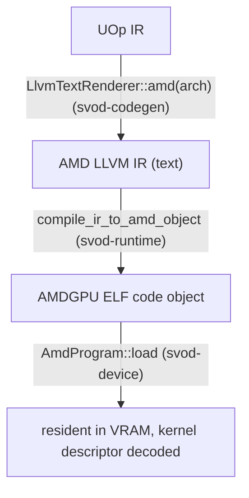

# 编译与图

本页跟随一个内核从已渲染的 LLVM IR 走到一次运行中的调度，然后
介绍如何把整条内核链捕获成单一可重放的命令流。
它所依托的调度机制——环、计算通道、timeline——
在 [队列与调度](./queues-and-dispatch.md) 中描述。

---

## 从 IR 到一个已加载的程序

编译路径是 **AMD LLVM IR 文本 → `clang` → ELF code object → VRAM 内
加载**。三个 crate 协作，在
`runtime/src/devices/amd.rs` 中接线在一起：



### 渲染

`AmdRendererWrapper`（`runtime/src/devices/amd.rs`）使用
`LlvmTextRenderer::amd(arch)` 进行渲染。它的 `supported_ops` 移除了 `Exp`、`Log`、
`Sin`、`Cos`、`Tan` 与 `Erf`（外加 `Pow`、`Max` 与 `Threefry`，与每一个
GPU 渲染器相同），因此调度器会在渲染之前分解它们：其
`decompositor` 是 `svod_ir::decompositions::amd_decomposition_patterns()`，
它针对 `f16`/`f32`/`f64` 把 `exp`、`log`、`cos`、`tan` 与 `pow` 降低为
基于原生 `exp2`/`log2` 的 SLEEF 风格多项式——bf16、fp8 与整数操作数会在
多项式前后转换为 f32——并把 f32→bf16 转换改写为整数的
round-to-nearest-even 形式；出于同样的原因，`sin` 走共享的超越函数模式
（`v_sin_f32` 只对小参数精确）。只有 `exp2`、`log2` 与 `sqrt` 保持为原生的
`@llvm.*` intrinsic（在 AMD 硬件上约 1 ulp）。渲染器本地的 `amd_extra_matcher()`
最后运行。

### 编译

`compile_ir_to_amd_object`（`runtime/src/amd/compile.rs`）外部调用 `clang`，
在 stdin 上灌入 IR，在 stdout 上读回 ELF——没有临时文件，
与 [CPU JIT 加载器](../jit-loader.md) 相同的内存内风格：

```text
clang -x ir -c -O3 --target=amdgcn-amd-amdhsa -mcpu=<arch> \
      -mcumode -nogpuinc -Wno-override-module -fno-math-errno [-nogpulib] - -o -
```

仅当 IR 没有引用任何 `@__ocml_*` 入口点时才会加上 `-nogpulib`：
渲染器为 AMDGPU 后端能够选择的每一个浮点一元运算都发出 `@llvm.*`
intrinsic，因此只有 f64 的非 `sqrt` 一元运算才需要 ROCm 设备库。IR 本身是
object 缓存键的一部分，所以据它来决定一个 flag 依然是可靠的。结果在以
`amd-clang` 身份缓存或被加载之前会先经过校验（`validate_amd_object`：ELF64-LE、
`EM_AMDGPU`、`e_flags` 中的 arch、一个已定义的 `<name>.kd`）。

`clang` 在内部为单个翻译单元调用 `lld`，因此输出是
一个可直接加载的 AMDGPU ELF——没有独立的链接步骤。一个按进程记忆化的
`ClangToolchain::has_target("amdgcn")` 探测（`clang --print-targets`）会把一个
缺少 AMDGPU target 的 clang 变成一个干净的 `JitCompilation` 错误，而非
崩溃。设置 `SVOD_DUMP_AMD_IR=<dir>` 会转储每个内核的 `.ll` 供
检视。

### 加载与描述符解析

`AmdProgram::load`（`device/src/amd/program.rs`）用 `object` crate 解析 ELF，
并按 tinygrad 的 `elf_loader` 那样布置镜像：
带有非零地址的 `SHF_ALLOC` section 放在其地址处；地址为 0 的
section 对齐追加。它校验 ELF64-LE + `EM_AMDGPU`，应用 clang 发出的
`R_AMDGPU_ABS64` / `R_AMDGPU_REL64` / `R_AMDGPU_REL32` 重定位
（其他任何东西都是干净的错误，绝不会静默地写零），并解析
内核描述符符号 **`<name>.kd`**。

从 64 字节的 `AmdHsaKernelDescriptor` 中，它推导出调度所需的一切：

| 推导出的 | 来自 |
|---|---|
| `aql_prog_addr` | `code_gpu + kd_offset`（即 AQL 的 `kernel_object`） |
| `pm4_prog_addr` | `aql_prog_addr + kernel_code_entry_byte_offset`（着色器入口；LO/HI 寄存器携带 `>> 8`） |
| `rsrc1 / rsrc2 / rsrc3` | `compute_pgm_rsrc{1,2,3}`；`rsrc1` 在 gfx11 上获得 cwsr-priv 位，`rsrc2` 获得 LDS-size 字段，`rsrc3` 原样使用 |
| `wave32` | `kernel_code_properties & 0x400`（RDNA3/4 默认） |
| `target_major` | 9 / 11 / 12，来自设备 arch |
| kernarg / scratch / group 尺寸 | `kernarg_size`、`private_segment_fixed_size`、`group_segment_fixed_size` |

加载时会发生两项安全检查：一个过大的 group（LDS）段会以
`GroupSegmentTooLarge` 快速失败，而一个设置了 `ENABLE_SGPR_DISPATCH_PTR`
（它会需要在 kernargs 旁边再带一个 HSA 调度数据包——尚未接线）的
内核会被拒绝。code object 被复制进一个宿主可见的 `nolru` VRAM 缓冲区，
在程序的整个生命周期中持有。

---

## 调度一个内核

`AmdProgram::execute_on(owner, pool, buffers, vals, global_size, local_size,
wait, profile)` 是 plan 与图使用的、以通道为范围的调度路径——`owner` 是
持有逻辑 plan 状态的 `OwnerCtx`，`pool` 则是被独占租用的 `PoolQueue`。
（`Program::execute` trait 方法会构造一个一次性的 `OwnerCtx`，由它租用一个
通道，再委托到这里。）它会：

1. **校验**针对内核的缓冲区与标量计数，并检查打包后的 kernarg
   布局是否容得下：`ClikeKernargLayout::from_abi(abi)` 按 ABI 槽位顺序、
   以自然对齐（8 字节指针、4 字节标量）布置参数，其 `packed_size()`
   不得超过描述符的 `kernarg_size`。
2. 通过 bump 设备的 16 MiB kernarg arena（由所有通道共享，16 字节对齐；
   回绕时会先排空所有通道）**填充一个 kernarg 槽**，将每个
   缓冲区 VA 写为 8 字节，将每个标量写为 4 字节的 `i32`。这种 `i32` 打包
   是刻意的——渲染器将 `Index → i32` 降低，因此描述符的
   `kernarg_size` 反映 4 字节的 var；打包 8 字节会溢出进
   下一个槽。
3. **构建一次提交**——一个先 `MemoryBarrier` 再 `Compute` 的
   `hcq::Submission`，携带 kernarg VA、`rsrc` 三元组以及 PM4 程序地址。
4. 经由 `queue.submit_hcq_dispatch(pool, &submission, …)` **调度**。
   在 PM4 队列上，`lower_hcq_pm4` → `build_exec_pm4` 发出原始 dword，可选的 4-dword
   scratch 描述符会被前置到 `COMPUTE_USER_DATA_0`，其取值与写入
   `COMPUTE_DISPATCH_SCRATCH_BASE` 的 `scratch_address` 快照出自同一份——
   这样一次并发的 scratch 重分配就不会让描述符与寄存器不一致。在 AQL 队列上，
   `lower_hcq_aql_submission_program` 把 wait/barrier 发出为厂商 IB 的 PM4
   数据包，再发出 64 字节的调度数据包（`build_dispatch_packet_barrier`）和一个
   厂商 IB 的 timeline 存储，控制字节暂存在 kernarg arena 中。
5. 持有 code object，将 finalizer 登记为在飞，并把它记录为 owner 最新的完成。
   若 `wait`，则经由 owner 的 `synchronize()` 排空。

`Program::execute`（每调用的 trait 路径）经由 `PlanContext::dispatch`：
它等待上一个 epoch，租用一条通道，按上述方式调度，并在 `wait = false` 时
结束该 epoch，把 finalizer 记录为一个无归属的 token，供 `wait_storage` 之后观测。

---

## 图捕获与重放：`AmdGraph`

当同一条内核链反复运行时（流式推理），把
每内核的 `wait → barrier → exec → signal → doorbell` 往返付出 N 次是
浪费。`AmdGraph`（`device/src/amd/graph.rs`）——以 tinygrad 的
`HCQGraph` 为蓝本，但只有一个 barrier 且没有内核间信号——把整条链捕获进**一个命令流**（PM4 或 AQL，
取决于队列用的是哪一种），将其绑定进一个宿主可见的页，并用
**一个 doorbell** 重放它。

### 结构

图是一个设备 timeline 步：

```text
preamble:   Wait(timeline signal, timeline value)
            MemoryBarrier          ← one per graph, after the wait
per kernel: Compute(...)           ← no inter-kernel signal/wait; same-queue
                                     ordering is the acquire_mem +
                                     CS_PARTIAL_FLUSH that exec already emits
final:      Store(timeline signal, next timeline value)
```

该流中的每一个地址和值都是一个绑定到 `PatchSource` 的**占位符**——
timeline 两端是 `System(SystemField::TimelineSignal/TimelineValue)`，PM4 的
scratch 是 `System(ScratchAddress)`/`System(ScratchTmpring)`，程序与 kernarg
指针则是 `LinkAddress` 条目——它们全都在重放时针对已租用的通道解析，
因此图能与普通的每调用调度和 `synchronize` 组合。捕获在一个专用的
`AllocTag::Kernarg` 页中为每个内核布置一个固定的 kernarg 槽——拥有那个页
（而不是共享滚动的 kernarg arena，并发的每调用调度可能套圈进入陈旧的 VA）
正是让重放安全的东西。

重放（`Graph::replay`）会串行化图自有的可变存储，等待它上一个
finalizer，获取一个独占的计算通道，确保通道 scratch 就绪，为当前的
kernarg 与系统字段打上补丁，然后发布常驻的 PM4 IB 或 AQL 提交程序。
参数完全相同时会整个跳过 kernarg 打包。它异步返回；下一次重放会在
复用那份存储之前先等待。`replay_profiled` 运行一个带有每内核
`SystemField::Timestamp` 槽位的变体，并在返回时间戳之前同步。

### 捕获何时发生

捕获以若干方式设门，若有任何一项失败则回退到每调用调度——在
`Ok(None)` 时如此，在捕获出错时也如此（plan 会吞掉该错误）：

- 该链必须是**全部已编译的内核且没有未绑定的 var**——复制、
  view 和动态 launch 维度会让宿主留在回路中；已绑定的变量
  （比如调度循环计数器）是允许的，并在重放时作为 `vals` 传入。
- 该链必须是**单设备**的，且当前每一个重放缓冲区都必须由那个确切的
  物理分配所有者支撑。`AmdGraph::capture` 会在下游再次核对这一点：
  每个内核都必须是同一个 `Arc<AmdDevice>` 上的 `AmdProgram`（`Arc::ptr_eq`）。
- AQL 图捕获受支持。PM4 图捕获则需经 `SVOD_PM4_GRAPH=1` 选择启用，
  因为它并非在每一块 gfx11/12 GPU 上都是性能收益。

:::note[队列所有权]
图不持有硬件队列。捕获保存的是不可变模板以及图自有的常驻/控制
内存；每一次重放都租用一个有界池中的通道。
:::

---

## 为什么这很重要

编译就是一个 `clang` 子进程加一次 VRAM 内 ELF 加载——没有 ROCm
运行时，没有临时文件（object 缓存会把结果持久化到磁盘），与 CPU 路径相同的
极简主义。plan 先尝试图，然后是原生的已链接重放，最后是直接调度。调度复用了来自
[队列与调度](./queues-and-dispatch.md) 的整套通道/timeline 机制，
因此 [JIT 图](../../architecture/jit-graphs.md) 层的"编译一次 / 重放多次"承诺
在 AMD 上每次重放只用一个 doorbell 即可落地：在 AQL 硬件上默认如此，
在 PM4 硬件上则需 `SVOD_PM4_GRAPH=1` 选择启用。
