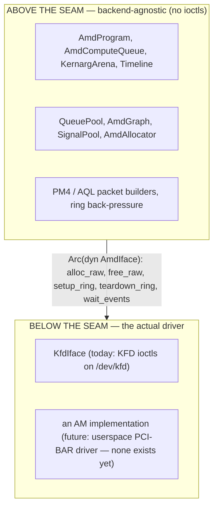
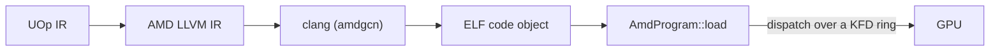

# AMD 后端

Svod 通过直接与内核驱动对话在 AMD GPU 上运行。没有 HIP，没有 ROCr/HSA 运行时，
没有 `libamdhip64.so`——唯一的外部依赖是带 AMDGPU 目标的 `clang`（用于编译）。其余
一切——分配 VRAM、构建命令环、派发内核、等待完成——都通过对 `/dev/kfd` 的原始
`ioctl` 调用完成，即随 `amdgpu` 内核模块一同发布的 Linux **KFD**（Kernel Fusion
Driver）接口。

该设计移植自 [tinygrad](https://github.com/tinygrad/tinygrad) 的 KFD 直连
`ops_amd.py` 及其 HCQ（Hardware Command Queue）模型；该移植固定在
`device/src/amd/mod.rs` 中记录的某个特定 tinygrad 提交上，数据包布局和初始化序列
都遵循该参考实现。

代码位于 `svod-device` crate 的 `device/src/amd/` 之下。

---

## 支持的 GPU

当一个节点的 KFD `gfx_target_version` 能映射到某个 `AmdArch` 时，该节点即受支持
（`dtype/src/amd_arch.rs`；编码为十进制的 `major*10000 + minor*100 + step`）：

| `gfx_target_version` | `AmdArch` | 系列 | Wave 大小 | 矩阵核心 |
|---|---|---|---|---|
| `90402` | `Gfx942` | CDNA3（MI300） | 64 | MFMA |
| `90500` | `Gfx950` | CDNA（MI350） | 64 | MFMA |
| `110000` / `110001` / `110002` | `Gfx1100` / `Gfx1101` / `Gfx1102` | RDNA3（Radeon 7000） | 32 | WMMA |
| `110501` | `Gfx1151` | RDNA3.5（Strix Halo / Strix Point） | 32 | WMMA |
| `120000` / `120001` | `Gfx1200` / `Gfx1201` | RDNA4（Radeon RX 9000） | 32 | WMMA |

每个受支持的架构都有矩阵核心；RDNA2 及更早的架构不受支持，`gfx90a` 也不在列表中。
Wave 大小随架构而定（CDNA 上为 64，其余为 32），通过 `-mcpu` 传给 clang，并且是
目标缓存 ABI 字符串的一部分。打开不受支持的节点会以 `DeviceUnavailable` 失败，
错误中列出受支持的系列。

---

## 一个运行时检测的执行提供者

AMD 后端总是被编译，从不藏在 cargo feature 之后：`amd` 模块被无条件声明，所有接触
内核的部分（ioctl 包装器、分配器、队列、程序、graph）都是 `cfg(unix)`，`nix`、
`libc` 和 `bindgen` 依赖也是如此。拓扑解析器和数据包构建器在任何地方都能编译。
可用性在**运行时**以 ORT 风格决定：设备注册表通过
`svod_device::amd::has_devices()` 探测硬件——一次只读 sysfs、无副作用的 KFD 拓扑
读取——并且*仅*在存在受支持 GPU 时注册 `"AMD"` 设备工厂。没有 `/dev/kfd` 的宿主
干净利落地没有 `"AMD"` 设备类型。

这样做是为了稳健：由于后端处于每次 Unix 构建的类型检查之中，通用核心中的 API 变更
（比如某个 `Program` 或 `PlanContext` trait）会在每台开发机的 `cargo check` 时被
发现，而不仅仅是在 GPU 宿主上。代价是编译时间，这是可以接受的。相应地，bindgen
步骤是**封闭自洽的**——它针对 vendored 头文件运行，不需要任何系统内核头文件
（见 [KFD 绑定](./kfd-bindings.md)）。

---

## 为什么是 KFD 直连而不是 HIP

一个“正常人”编写 AMD 后端时会选用 HIP（类 CUDA 的运行时）或其下层的 HSA 运行时。
Svod 刻意不这样做。理由如下：

- **没有用户态运行时依赖。** HIP/ROCr 是数百兆字节的共享库，必须与内核驱动版本
  匹配。KFD 是稳定的内核 `ioctl` ABI；Svod 二进制文件链接 `libc` + `nix` 并调用
  外部的 `clang`，别无其他。该后端可在任何具有足够新的 `amdgpu` 和 `clang` 的
  `amdgcn` 目标的宿主上运行——无需安装 ROCm（ROCm 设备库只为 f64 超越函数而链接，
  见 [编译与图](./compile-and-graph.md)）。
- **确定性的控制。** 命令环、doorbell、时间线信号、页表可见的分配以及 scratch
  缓冲区都由我们掌控。我们与硬件之间没有运行时会重排提交或隐藏状态，这对后端
  所围绕构建的租用通道派发很重要（见 [队列与调度](./queues-and-dispatch.md)）。
- **经过验证的参考实现。** tinygrad 的 HCQ 模型是 KFD 直连的，久经实战检验。移植
  它意味着我们继承其确切的数据包布局和初始化序列，而不必自己逆向工程。

HIP 和 ROCr 都位于 KFD *之上*——它们打开同一个 `/dev/kfd`，发出与我们相同的
ioctl。直连去掉的是中间层，而不是某种能力。

:::note[CPU 上的对应物]
KFD 直连是 [ELF JIT 加载器](../jit-loader.md) 在 CPU 上所做之事的 AMD 对应物：跳过
重量级的厂商工具链，在进程内直接驱动底层机制。CPU 路径 `mmap` 一个可重定位目标
文件；AMD 后端把代码对象加载进 VRAM，并通过 KFD 环派发它。
:::

---

## 后端接缝

后端被 **`AmdIface`** trait（`device/src/amd/iface.rs`）分成两半：



所有*不是*内核调用的东西——16 MiB 的命令环、PM4/AQL 数据包构造、kernarg 递增分配
arena、时间线计数器、程序加载器——都位于接缝之上。这个 trait 被刻意设计得很小：
**五个必需方法**（`alloc_raw`、`free_raw`、`setup_ring`、`teardown_ring`、
`wait_events`），外加三个默认为空操作的钩子
（`queue_event_mailbox`、`publication_checkpoint`、`update_queue_percentage`）。
让它保持精简的关键洞见是：环、GART 页、EOP 缓冲区和 MQD *只不过是 GPU 内存*——
它们通过 `alloc_raw` 在接缝之上分配，而驱动真正需要以不同方式完成的唯一一件事是
**激活队列**（映射 doorbell，告诉调度器该环存在）：这就是 `setup_ring`。
`KfdIface` 是测试套件之外唯一的实现。

实现者在打开设备时根据 `SVOD_AMD_BACKEND` 环境变量选择：

| `SVOD_AMD_BACKEND` | 后端 | 状态 |
|---|---|---|
| `kfd`（默认） | `KfdIface`——KFD 直连 | 生产可用 |
| 其他任何值 | — | 被拒绝：`unknown SVOD_AMD_BACKEND=... (only 'kfd' supported)` |

:::caution[AM 驱动只是脚手架]
`device/src/amd/am/` 存放一个直接与 GPU 的 PCI BAR 对话的实验性用户态驱动。它没有
实现 `AmdIface`，不可选择，也从未执行过任何内核：它的初始化流程曾经（2026 年 6 月）
通过独立的 `am_*` 示例，在一个 CDNA3 SR-IOV 虚拟功能上运行过一次，直到 GMC 上下文
编程为止。关于究竟有哪些内容，见 [AM 驱动](./am-driver.md)。
:::

---

## 设备本地内存与 SDMA 拷贝队列

打开设备时，后端会在每个受支持的部件上安装一个 **SDMA 拷贝队列**
（`AmdCopyQueue`），从而把 `has_sdma_queue` 置为 true；创建失败会记录一条警告并让
缓冲区保持宿主可见，`AMD_DISABLE_SDMA`（任意值）会跳过这一尝试。该队列过去仅限
CDNA，原因是对 RDNA 稳定性的担忧，后来追溯到 HDP 刷新握手，现已修复。有了它，
中间结果可以位于**仅设备可见的 VRAM**（`cpu_access = false`），宿主↔设备拷贝走
异步 DMA：`_copyin`/`_copyout` 经由 SDMA 队列中转，当任一侧为仅设备可见时
`_transfer` 是一次设备→设备 DMA（两个宿主映射的缓冲区之间则是宿主 `memmove`）。
没有拷贝队列时，分配器回退到更简单的模型——每个缓冲区都被强制设为宿主可见（CPU
可映射的 VRAM 或 GTT），拷贝是在按存储范围的 `wait_storage` 之后的宿主 memmove。
分配与拷贝在 [KFD 绑定](./kfd-bindings.md) 中介绍。

---

## 在 AMD 上运行

用 `SVOD_DEVICE` 环境变量选择 GPU：`AMD:N` 是 [KFD 拓扑](./kfd-bindings.md) 中按
节点顺序的第 N 个 GPU 节点（单独的 `AMD` 即节点 0；`HIP` 是可接受的别名；值不区分
大小写）。只要*任一*节点受支持，工厂就会被注册，因此如果节点 0 本身是不受支持的
部件，`AMD:0` 仍可能以 `DeviceUnavailable` 失败：

```bash
SVOD_DEVICE=AMD:0 cargo run --release -p svod-model --example gigaam_infer -- ./audio.wav
```

除受支持的 AMD GPU 外，运行时对宿主的唯一要求是 `PATH` 上有带 `amdgcn` 目标的
`clang`（用于编译内核——见 [编译与图](./compile-and-graph.md)）；无需安装
ROCm/HIP。构建该 crate 需要 `libclang` 供 bindgen 使用。
[队列与调度](./queues-and-dispatch.md) 页面列出了每一个环境变量开关。

---

## 它在流水线中的位置

AMD 后端是编译器的设备那一半。前端把张量降级为单一的 UOp IR；代码生成把该 IR
映射到 GPU 线程索引上（["Add GPU Dims"](../../architecture/codegen/devectorizer.md)
阶段把 range 变为 `gidxN`/`lidxN` SPECIAL 索引，见 [IR 设计](../../architecture/ir-design.md)）；
渲染器发出 AMD LLVM IR；而本后端编译并运行它：



[JIT 图](../../architecture/jit-graphs.md) 层对其进行包装，使模型图只编译一次即可
多次重放。

---

## 阅读指南

| 页面 | 内容 |
|---|---|
| [KFD 绑定](./kfd-bindings.md) | 内核 ABI 如何绑定（基于 vendored 头文件的 bindgen）、使用的确切 ioctl、sysfs 拓扑以及分配流程 |
| [队列与调度](./queues-and-dispatch.md) | 命令环、PM4 与 AQL、有界的计算通道池、发布与设备范围的排空、时间线，以及每一个配置环境变量 |
| [编译与图](./compile-and-graph.md) | 内核如何从 LLVM IR 变为已加载的程序、如何派发，以及 graph 捕获/重放如何工作（默认 AQL，PM4 需显式启用） |
| [AM 驱动](./am-driver.md) | 实验性用户态驱动：已构建了什么、还没有什么，以及它将如何接入接缝 |
| [调试](./debugging.md) | 用于故障分诊的 VA→分配注册表、毒化锁存，以及派发/追踪诊断 |
