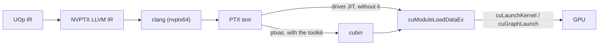

# CUDA 后端

Svod 通过 **CUDA 驱动 API**（`libcuda.so.1`）在 NVIDIA GPU 上运行，
除此之外不用 CUDA 栈中的任何东西：没有 toolkit，没有 `nvcc`，没有 NVRTC，
也没有 `libcudart`。内核被渲染为 NVPTX LLVM IR，由宿主的 `clang` 降低为
PTX 文本；装了 CUDA toolkit 时由 `ptxas` 汇编成 cubin，否则在模块加载时由
驱动 JIT 编译为 SASS。该设计遵循 tinygrad 的
`ops_cuda.py`；代码位于 `device/src/cuda/`（驱动、内存、程序、图）、
`runtime/src/cuda/` 与 `runtime/src/devices/cuda.rs`（编译与设备工厂），
以及 `codegen/src/llvm/nvptx/`（渲染器）。

---

## 要求

| 要求 | 为什么 |
|---|---|
| 一个暴露 `libcuda.so.1` 的 NVIDIA 驱动 | 每一次驱动调用都在运行时用 `libloading` 从中解析出来 |
| 驱动为 **CUDA 12.0（R525）或更新** | CUDA graph 的入口点按其版本化名称绑定（`cuGraphAddKernelNode_v2`、`cuGraphExecKernelNodeSetParams_v2`），它们始于 12.0。PTX ISA 的锁定随算力递增：sm_88 及更早为 **7.8**，sm_89 与 sm_90 为 **8.4**（为其 fp8 `mma.sync` 形状，需要 CUDA 12.4 / R550），sm_100 到 sm_102 为 **8.6**（CUDA 12.7），sm_120 为 **8.7**（CUDA 12.8），sm_103、sm_121 及更新为 **8.8**（CUDA 12.9）——一块 Blackwell 卡需要引入其 ISA 的那一版驱动 |
| 带 **NVPTX** target 构建的 `clang` | `clang -x ir --target=nvptx64-nvidia-cuda` 把渲染出的 IR 变成 PTX |

在宿主上检查它们：

```bash
ldconfig -p | grep libcuda.so.1          # the driver library
nvidia-smi | grep 'CUDA Version'         # the driver's CUDA level (>= 12.0)
clang --print-targets | grep nvptx64     # the NVPTX backend
```

一个不带 NVPTX 的 clang 会给出一个干净的 `JitCompilation` 错误，其中点名了
修复方式（`-DLLVM_TARGETS_TO_BUILD='X86;AArch64;NVPTX'`）。运行时不需要 CUDA
toolkit：在 `PATH`、`/opt/cuda/bin` 或 `$CUDA_PATH/bin` 中碰巧找到 `ptxas` 时
会拿它来预汇编内核（`SVOD_CUDA_PTXAS=0` 可以不用它；一个不可用的 `ptxas`
会记录一条警告，并改由驱动 JIT 接手），而 `compute-sanitizer` 对[调试](./debugging.md)
很有用，但两者都不是必需的。代码中没有计算能力的下限：`CudaArch` 是开放式的，
能运行什么取决于驱动和 clang 的 `-march` 接受什么。

---

## 一个运行时检测的执行提供者

后端在每一台宿主上都**始终编译**，不藏在任何 cargo feature 之后
（旧的基于 `cudarc` 的 `cuda` feature 已经没有了）。可用性在运行时决定：
`svod_device::cuda::has_devices()` 加载 `libcuda.so.1`，解析每一个被绑定的
入口点，调用 `cuInit(0)` 与 `cuDeviceGetCount`，并把答案记忆下来。运行时的
设备注册表仅在其为 `true` 时才注册 `"CUDA"` 工厂；一台没有该驱动的宿主
干脆就没有 `CUDA` 设备类型，而硬件测试会自行跳过。版本低于 12.0 的驱动
也落得同样结果——缺少某个 `_v2` graph 符号，于是加载失败，后端在没有任何
警告的情况下保持未注册。

这与 [AMD 后端](../amd/overview.md) 是同一套约定：驱动调用点在每一次
`cargo check` 中都会通过类型检查，因此通用的 `Program` / `PlanContext` /
`Graph` trait 中的一次 API 改动无需 GPU 就能被捕获。

---

## 在 CUDA 上运行

用 `SVOD_DEVICE` 选择 GPU（`CUDA:N`，不区分大小写；`GPU` 是被接受的别名，单独的 `CUDA`
表示设备 0）。`NV` 被刻意**不**接受——这个名字留给未来的用户态驱动后端：

```bash
SVOD_DEVICE=CUDA:0 cargo run --release -p svod-model --example gigaam_infer -- ./audio.wav
```

打开一个设备会记录一行 `info`，其中带有它的名称、`sm_XY`、SM 数量、
托管内存支持、驱动版本，以及带作用域的同步是否开启
（`RUST_LOG=svod_device=info`）。

计算能力在打开时从驱动读取，并保存为一个开放式的
`CudaArch { major, minor }`（`sm_86`、`sm_120`……）。它选择 `clang -march`、
充当对象缓存的键，并挑选优化器 profile
（`OptimizerRenderer::for_cuda_arch`）：

| 计算能力 | profile 中的 tensor core |
|---|---|
| 低于 `sm_75` | 无（不使用 Volta 的 `mma.sync`）；也没有 bf16 存储 dtype |
| `sm_75` | f16 `m16n8k8`，累加到 f32 或 f16 |
| `sm_80`+ | f16 与 bf16 `m16n8k16`、f16 `m16n8k8`、累加到 i32 的 int8 `m16n8k32`；bf16 存储。渲染器中存在 tf32 那一行，但 `for_cuda_arch` 从不启用它，也没有开关 |
| `sm_89`+ | 原封不动的 sm_80 那一组：fp8 `m16n8k32` 的核心是存在的（`sm89_tensor_cores`），但只要渲染器还降不了 fp8 的 cast，`for_cuda_arch` 就扣着不给（见[限制](./limitations.md)） |

---

## 它在流水线中的位置


```mermaid
flowchart LR
  A["UOp IR"] --> B["NVPTX LLVM IR"]
  B --> C["clang (nvptx64)"]
  C --> D["PTX text"]
  D -->|"ptxas, with the toolkit"| E["cubin"]
  D -->|"driver JIT, without it"| F["cuModuleLoadDataEx"]
  E --> F
  F -->|"cuLaunchKernel / cuGraphLaunch"| G["GPU"]
```

编译出的对象由共享的对象缓存缓存在磁盘上——装了 `ptxas` 时是一个 cubin，
否则是 PTX 文本，而这两种格式绝不会共用同一条缓存项。走 PTX 这条路时，驱动
保有它自己的 SASS 缓存（`~/.nv/ComputeCache`），因此一次热启动会跳过 clang，
通常连 JIT 也一并跳过。

---

## 测试

仅宿主的测试（符号表、结构体布局、kernarg 打包、timeline 逻辑、PTX 校验、
黄金 NVPTX IR）在任何地方都会运行。当没有设备存在时，硬件测试会经由
`cuda_device_or_skip()` 提前返回，因此一台 CUDA 宿主默认就会跑它们：

```bash
cargo test -p svod-device cuda
cargo test -p svod-codegen nvptx
SVOD_DEVICE=CUDA:0 cargo test -p svod-tensor            # codegen_tests! `cuda` variants
SVOD_DEVICE=CUDA:0 cargo test -p svod-onnx              # the ONNX suite's `cuda` variants
```

---

## 阅读指南

| 页面 | 涵盖内容 |
|---|---|
| [架构](./architecture.md) | 驱动绑定、上下文与流、内存种类、程序加载与启动、timeline、CUDA 图、对象缓存标识 |
| [代码生成](./codegen.md) | NVPTX 渲染器：intrinsic、barrier、超越函数、`mma.sync` tensor core、launch bound、clang 调用与 PTX 校验 |
| [剖析](./profiling.md) | 基于 event 的 GPU 时间戳、`cuFuncGetAttribute` 资源、CUDA 上存在哪些 profiler 层级 |
| [限制](./limitations.md) | 尚不具备什么，以及路线图 |
| [调试](./debugging.md) | 环境变量、IR 转储、读懂驱动与 JIT 错误、离线 `ptxas` 检查 |
