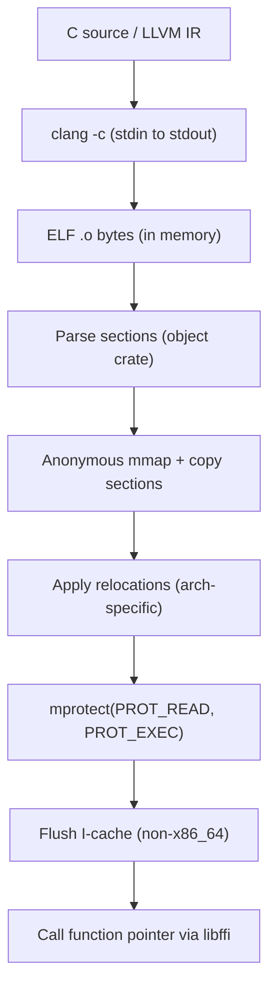

# JIT 编译器

大多数 ML 编译器要么将整个 LLVM 工具链链接到二进制文件中——增加数百兆字节的依赖——要么将临时文件写入磁盘再通过 `dlopen` 加载。Svod 两者都不需要。

当 kernel 需要执行时，Svod 通过 stdin 将生成的源代码传递给 `clang`，在 stdout 接收可重定位的 ELF 对象，在进程内解析，将机器码复制到匿名内存映射中，应用重定位，将页面权限切换为可执行，然后直接通过函数指针调用。整个过程在内存中完成——没有临时文件接触磁盘，没有加载共享库，除了 PATH 中的 `clang` 之外不需要任何 LLVM 安装。

本章描述 CPU JIT 加载器的工作原理。GPU 后端通过同一个 `clang` 传输，但经由各自的驱动调度：见 [AMD 后端](./amd/overview.md)（KFD 直连）与 [CUDA 后端](./cuda/overview.md)（驱动 API、PTX JIT）。

## 流水线



**Clang** 后端（C 源码，通过 `-x c`）和 **LLVM** 后端（LLVM IR 文本，通过 `-x ir`）共享同一个加载器。唯一区别是 clang 的输入语言标志。

:::tip 回退模式
用于调试或自定义 ELF 加载器不工作的平台，Cargo feature `dlopen-fallback` 切换到传统流水线：`clang -shared` 将 `.so` 写入临时目录，通过 `dlopen` 加载。这较慢（磁盘 I/O + 动态链接器开销），但更具可移植性。
:::

## 支持的架构

| 架构 | Target triple | 编译标志 | I-cache | 备注 |
|---|---|---|---|---|
| **x86_64** | `x86_64-none-unknown-elf` | `-march=native` | 自动一致 | AMD64, Intel 64 |
| **aarch64** | `aarch64-none-unknown-elf` | `-march=native` | `__clear_cache` | Apple Silicon, Ampere, Graviton |
| **riscv64** | `riscv64-none-unknown-elf` | `-march=rv64gc` | `__clear_cache` | RV64I + M + A + F + D + C 扩展 |
| **loongarch64** | `loongarch64-none-unknown-elf` | `-march=native` | `__clear_cache` | 龙芯 3A5000+ |
| **ppc64le** | `powerpc64le-none-unknown-elf` | `-mcpu=native` | `__clear_cache` | ELFv2 ABI, 仅小端 |

架构检测通过运行时 `std::env::consts::ARCH` 自动完成——无需编译时 feature flag。

### 重定位支持

加载器为每种架构实现了一个最小化的 ELF 重定位器。它处理 `clang -c -O2` 为小型自包含计算 kernel 实际生成的重定位类型——而非完整的链接器。

**x86_64** — PC 相对（`R_X86_64_PC32`、`PLT32`、`GOTPCRELX`、`REX_GOTPCRELX`），绝对 32/64 位（`R_X86_64_32`、`32S`、`64`）。

**aarch64** — 26 位分支（`CALL26`、`JUMP26`），当目标超出 ±128 MB 范围时自动生成跳板，页相对 ADRP（`ADR_PREL_PG_HI21`），带访问大小移位的 12 位页偏移（`ADD_ABS_LO12_NC`、`LDST8/16/32/64/128_ABS_LO12_NC`）。

**riscv64** — 调用对（`CALL`、`CALL_PLT`），带状态跟踪的 PC 相对分离寻址（`PCREL_HI20` + `PCREL_LO12_I/S`），绝对（`HI20`、`LO12_I/S`），分支（`BRANCH`、`JAL`），数据（`32`、`64`）。链接器松弛提示（`RELAX`）被跳过。

**loongarch64** — 26 位分支（`B26`），页对齐分离寻址（`PCALA_HI20`、`PCALA_LO12`），数据（`32`、`64`）。链接器松弛提示（`RELAX`）被跳过。

**ppc64le** — 24 位分支（`REL24`），带 `.TOC.` 符号查找的 TOC 相对寻址（`TOC16_HA`、`TOC16_LO`、`TOC16_LO_DS`、`TOC16`、`TOC16_HI`），PC 相对（`REL32`），绝对（`ADDR32`、`ADDR64`）。

## 编译标志

加载器使用裸机 target 编译，生成干净、自包含、无运行时依赖的 ELF 对象：

| 标志 | C 后端 | LLVM IR 后端 | 用途 |
|---|---|---|---|
| `-c` | 是 | 是 | 仅编译（不链接） |
| `-O2` | 是 | 是 | 优化级别 |
| `-march=native` | 是 | 是 | 使用宿主 CPU 特性 |
| `-fPIC` | 是 | 是 | 位置无关代码 |
| `-ffreestanding` | 是 | 否 | 不假设托管环境 |
| `-fno-math-errno` | 是 | 是 | 数学内建函数不设置 errno |
| `-fno-stack-protector` | 是 | 是 | 无栈保护开销 |
| `-nostdlib` | 是 | 否 | 无标准库 |
| `-fno-ident` | 是 | 否 | 抑制 `.comment` section |
| `--target=<arch>-none-unknown-elf` | 是 | 是 | 裸机 ELF target |
| `-ffixed-x18` | aarch64 macOS/Win | aarch64 macOS/Win | 保留平台寄存器 |
| `-funroll-loops` | 否 | 是 | 激进循环展开 |
| `-fvectorize` | 否 | 是 | 循环向量化 |
| `-fslp-vectorize` | 否 | 是 | SLP（直线代码）向量化 |

C 后端使用 `__builtin_*` 函数（如 `__builtin_sqrtf`、`__builtin_fmaf`）代替 `#include <math.h>`，因此 `-ffreestanding -nostdlib` 在不失去数学支持的情况下正常工作——这些是编译器内建函数，直接降低为硬件指令。

## 外部符号解析

如果 clang 生成了对外部函数的调用（很少——大部分数学由内建函数处理），加载器在加载时通过 `dlsym(RTLD_DEFAULT, name)` 解析。这涵盖了 `memcpy` 或平台特定的 libm 符号等情况。

### 分支跳板（aarch64）

在 aarch64 上，`CALL26`/`JUMP26` 重定位将 PC 相对偏移编码在 26 位中，范围为 ±128 MB。在启用 ASLR 的 macOS 上，匿名 mmap 区域通常距离 libm 等系统库约 2 GB——远超此范围。

当加载器检测到超出范围的 `CALL26`/`JUMP26` 时，会在 mmap 末尾的保留区域生成**跳板**（veneer）：

```text
LDR X16, [PC, #8]   // 加载 64 位目标地址
BR  X16              // 间接跳转
.quad <address>      // 完整 64 位地址
```

跳板在 mmap 分配前预先扫描计数，并进行去重——如果多个调用点引用同一外部符号，它们共享同一个跳板。

### 平台寄存器（aarch64）

在 macOS 和 Windows ARM 上，寄存器 `x18` 被保留为平台寄存器。由于我们使用 `--target=aarch64-none-unknown-elf`（裸机）编译，编译器通常会将 `x18` 视为自由 GPR。`-ffixed-x18` 标志阻止了这一行为，避免 JIT 代码在 macOS/Windows 进程中运行时崩溃。

## 指令缓存一致性

在 x86_64 上，指令缓存和数据缓存自动一致——将机器码写入内存并跳转执行无需额外步骤。在所有其他架构上，加载器在 `mprotect` 之后调用 `__clear_cache(start, end)` 以确保指令缓存看到新代码。
