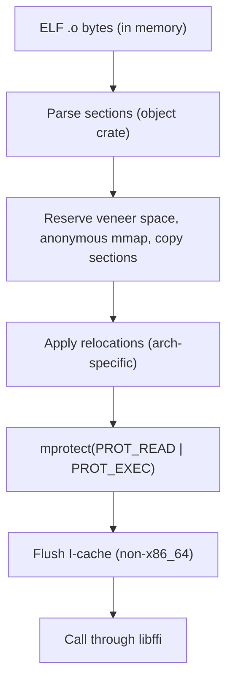

# ELF JIT 加载器

[CPU](./cpu.md) 的两条代码路径最终都得到内存中的一个可重定位 ELF 目标文件——要么
来自进程内的 libLLVM，要么来自经 stdin/stdout 交互的 `clang -c` 子进程。加载器
（`runtime/src/jit_loader.rs`）在不触碰磁盘的情况下把这些字节变成可调用的函数：
它解析各节，把它们复制进一个匿名映射，应用重定位，把页面切换为可执行，并返回入口
指针。没有临时文件，没有 `dlopen`，没有链接器。


```mermaid
flowchart TD
  A["ELF .o bytes (in memory)"] --> B["Parse sections (object crate)"]
  B --> C["Reserve veneer space, anonymous mmap, copy sections"]
  C --> D["Apply relocations (arch-specific)"]
  D --> E["mprotect(PROT_READ | PROT_EXEC)"]
  E --> F["Flush I-cache (non-x86_64)"]
  F --> G["Call through libffi"]
```

入口函数是 `jit_load(object, name) -> (fn_ptr, mapping)`；入口符号为 `name` 或
`_name`。映射的生命周期与拥有它的 `JitKernel` / `LlvmKernel` 相同。

:::tip[回退模式]
`svod-runtime` 的 `dlopen-fallback` cargo feature 为 C 路径绕过加载器：
`clang -shared` 把一个 `.so` 写入临时目录，再由 `libloading` 打开。它更慢（磁盘
I/O、动态链接器）但可移植，CI 以 `test-dlopen-fallback` 检查运行它。LLVM 路径
始终使用内存内加载器。
:::

## 支持的架构

| 架构 | 目标三元组 | 指令缓存 | 说明 |
|---|---|---|---|
| **x86_64** | `x86_64-none-unknown-elf` | 一致 | AMD64、Intel 64 |
| **aarch64** | `aarch64-none-unknown-elf` | `__clear_cache` | Apple Silicon、Ampere、Graviton |
| **riscv64** | `riscv64-none-unknown-elf` | `__clear_cache` | RV64I + M + A + F + D（`-march=rv64g`） |
| **loongarch64** | `loongarch64-none-unknown-elf` | `__clear_cache` | 龙芯 3A5000+ |
| **ppc64le** | `powerpc64le-none-unknown-elf` | `__clear_cache` | ELFv2 ABI；指令修补假定小端序 |

架构在运行时取自 `std::env::consts::ARCH`；没有编译期 feature 标志。目标文件针对
裸机 `<arch>-none-unknown-elf` 目标编译，因此不携带运行时依赖，并使用 PIC 重定位。
各路径的编译标志见 [CPU 页面](./cpu.md)。

### 重定位支持

加载器为每种架构实现了一个最小的 ELF 重定位器。它处理一个小型、自包含计算内核的
`-O2` 目标文件中实际会出现的重定位类型——而不是一个完整的链接器。其他任何类型都会
得到一个干净的错误，绝不会静默写入零。

**x86_64**——PC 相对（`R_X86_64_PC32`、`PLT32`、`GOTPCRELX`、
`REX_GOTPCRELX`，按 `S + A - P` 修补，不使用 GOT），32/64 位绝对
（`R_X86_64_32`、`32S`、`64`）。

**aarch64**——26 位分支（`CALL26`、`JUMP26`），目标超出 ±128 MiB 时自动生成
veneer；页相对 ADRP（`ADR_PREL_PG_HI21`）；带访问尺寸移位的 12 位页内偏移
（`ADD_ABS_LO12_NC`、`LDST8/16/32/64/128_ABS_LO12_NC`）。

**riscv64**——调用对（`CALL`、`CALL_PLT`），带状态跟踪的 PC 相对拆分寻址
（`PCREL_HI20` + `PCREL_LO12_I/S`），绝对（`HI20`、`LO12_I/S`），
分支（`BRANCH`、`JAL`），数据（`32`、`64`）。链接器松弛提示（`RELAX`）
被跳过。

**loongarch64**——26 位分支（`B26`），页对齐拆分寻址
（`PCALA_HI20`、`PCALA_LO12`），数据（`32`、`64`）。链接器松弛提示
（`RELAX`）被跳过。

**ppc64le**——24 位分支（`REL24`），带 `.TOC.` 符号查找的 TOC 相对寻址
（`TOC16_HA`、`TOC16_LO`、`TOC16_LO_DS`、`TOC16`、`TOC16_HI`），
PC 相对（`REL32`），绝对（`ADDR32`、`ADDR64`）。

## 外部符号解析

未定义符号在加载时用 `dlsym(RTLD_DEFAULT, name)` 解析。这是一条常规路径，而非罕见
情况：`sqrt`、`fma`、`floor` 和 `rint` 会降级为指令，但 `exp`、`log`、`sin`、`cos`、
`tan`、`pow`、`fmod` 和 `erf` 到达目标文件时是对 `libm` 的调用，无论它们在 C 中渲染为
`__builtin_*` 还是在 IR 中渲染为 `@llvm.*` 内建函数。进程未导出的符号会导致一个
指明该符号的加载错误。

### 分支 veneer（aarch64、x86_64）

在 aarch64 上，`CALL26`/`JUMP26` 用 26 位编码 PC 相对偏移，范围为 ±128 MiB；在
x86_64 上 `PC32`/`PLT32` 提供 ±2 GiB。长时间运行的进程自顶向下填充其 mmap 区域，
因此匿名 JIT 映射最终会落在 `libm` 等库的可达范围之外。

当直接分支无法到达时，加载器会把它经由映射末尾保留区域中的一个 **veneer**
（分支跳板）中转：

```text
LDR X16, [PC, #8]   // load 64-bit target address
BR  X16              // indirect branch
.quad <address>      // full 64-bit address
```

x86_64 上的形式是 `MOVABS $target, %r11` + `JMP *%r11`，并且只有当修补位置之前的
字节确实是 `call`（`E8`）或 `jmp`（`E9`）操作码时才采用——超出范围的 RIP 相对数据
引用则会明确报错。在分配映射之前，会为每个唯一的未定义直接分支符号预留 veneer
空间，并且 veneer 按目标地址去重，因此共享同一符号的调用点共享同一个跳板。

### 平台寄存器（aarch64）

在 macOS ARM 上，寄存器 `x18` 被保留为平台寄存器，内核会在上下文切换时破坏它。
由于目标文件是针对裸机 `aarch64-none-unknown-elf` 目标编译的，编译器否则会把
`x18` 当作空闲的通用寄存器。clang 路径传入 `-ffixed-x18`，进程内路径则在特性字符串
中加入 `+reserve-x18`。Linux ARM 把 `x18` 当作普通通用寄存器，而 Windows ARM 不是
Svod 支持的目标。

## 指令缓存一致性

在 x86_64 上，指令缓存与数据缓存是一致的——把机器码写入内存并跳转过去无需额外
步骤。在其他所有架构上，加载器会在 `mprotect` 之后调用
`__clear_cache(start, end)`，让指令缓存看到新代码。

## 调用内核

入口指针经由 **libffi** 调用，使用一个根据内核 ABI 描述符构建的 `KernelCif`
（`runtime/src/dispatch.rs`）：每个存储参数一个指针、每个标量一个 `i32`、返回
`void`。执行器的 `i64` 值在调用时被截断为 `i32`。每个内核一个 CIF，正是这一点让
每个内核可以有自己的参数个数，而无需为每种签名做一次 transmute。

## 测试

`runtime/src/test/unit/jit_loader.rs` 在任何宿主上通过 clang 编译小型 C 内核
（空操作、缓冲区与变量、`__builtin_sqrtf`）。veneer 测试——跨越 2 GiB 的路由、共享
veneer、超出范围的非分支重定位所报的错误——仅限 x86_64，而远调用执行测试还额外
要求 Linux。其他重定位器除了在对应硬件上运行测试套件外，没有专门的测试。
