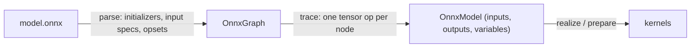

# ONNX 推理

`svod-onnx` 把一个 `.onnx` 文件变成与手写模型相同的惰性张量图：每个算子都被分解为
`svod-tensor` 操作，因此导入的图会经过完整的调度器、优化器和代码生成器，并在每个后端
上运行。底下没有 ONNX Runtime。

| 能力 | 状态 |
|---|---|
| 前向推理 | 支持 |
| 算子 | 162 / 200 个标准算子（[覆盖表](https://github.com/npatsakula/svod/blob/main/onnx/PARITY.md)） |
| 一致性 | 1357 个 ONNX 后端节点测试在两个 CPU 后端（Clang、LLVM）上通过；当 `SVOD_DEVICE` 选择 AMD 或 CUDA 时测试套件也在其上运行 |
| 动态维度 | 在导入时绑定（见[动态维度](#dynamic-dimensions)） |
| Microsoft contrib 算子 | `Attention`、`RotaryEmbedding`、`SkipLayerNormalization`、`EmbedLayerNormalization`、`BiasGelu`、`FastGelu` |
| 训练 / 反向传播 | 不支持 |

对于表外的算子，`ort`（C++ ONNX Runtime 的封装）覆盖完整规范。

---

## 快速开始

```toml
[dependencies]
svod-onnx   = "0.2"
svod-tensor = "0.2"
prost       = "0.14"            # ModelProto::decode
```

导入器有三个入口：

| 调用 | 权重 | 输入 |
|---|---|---|
| `import(path, dim_bindings)` | 浮点初始化器从文件惰性内存映射；`data_location = EXTERNAL` 相对文件所在目录解析 | 未分配的占位符，由你 `assign` |
| `import_model_with_inputs(proto, inputs, dim_bindings)` | 从解码后的 `ModelProto` 读取 | 你自己的张量，直接追踪进图 |
| `import_model(proto, dim_bindings)` | 从解码后的 `ModelProto` 读取 | 占位符，同 `import` |

三者都返回一个 `OnnxModel`：

```rust
pub struct OnnxModel {
    pub inputs: HashMap<String, Tensor>,      // graph inputs that are not initializers
    pub outputs: HashMap<String, Tensor>,     // lazy; nothing has run yet
    pub variables: HashMap<String, Variable>, // one per named dim_param
}
```

### 运行时输入

自己构建输入张量并交给导入器。图在这些张量上追踪，所以你持有的张量就是内核读取的
缓冲区：

```rust
use std::collections::HashMap;

use prost::Message;
use svod_onnx::parser::onnx::ModelProto;
use svod_onnx::{OnnxImporter, OnnxModel};
use svod_tensor::Tensor;

fn main() -> Result<(), Box<dyn std::error::Error>> {
    let proto = ModelProto::decode(std::fs::read("model.onnx")?.as_slice())?;

    // Same shape and dtype as the graph input "input"
    let image = Tensor::from_ndarray(&load_image_nchw());    // [1, 3, 224, 224] f32

    let OnnxModel { outputs, .. } = OnnxImporter::new().import_model_with_inputs(
        proto,
        HashMap::from([("input".to_string(), image.clone())]),
        &[("batch", 1)],
    )?;

    // Schedule every output together, run once
    Tensor::realize_batch(outputs.values())?;
    for (name, tensor) in &outputs {
        println!("{name}: {:?}", tensor.as_ndarray::<f32>()?);
    }
    Ok(())
}
```

`Tensor::from_ndarray` 和 `Tensor::from_raw_bytes(bytes, &dims, dtype)` 给出一个拥有
声明形状缓冲区的张量；`Tensor::from_slice` 始终是一维的，因此只能通过前两者之一
得到正确形状。

### 编译一次，重放

对于反复推理，把输出编译成一个计划，并在两次运行之间把新数据直接写进输入缓冲区：

```rust
let plan = Tensor::prepare_batch(outputs.values())?;   // schedule + compile, once
plan.execute()?;

for batch in batches {
    image.array_view_mut::<f32>()?.as_slice_mut().unwrap().copy_from_slice(&batch);
    plan.execute()?;                                   // replay: no tracing, no compilation
    let logits = outputs["output"].as_vec::<f32>()?;
}
```

`array_view_mut` 是输入宿主映射上的零拷贝 `ndarray` 视图；`prepare_batch` 把每个输出
张量接到计划的缓冲区上，所以 `as_vec` / `as_ndarray` 读到的是最近一次运行的结果。

### 占位符输入

`import(path)` 是会内存映射权重并解析外部数据的入口。它的输入是占位符：`assign`
一个相同形状的值，并在输出*之前*先执行输入。占位符在所有计划之间保持同一个 buffer，
因此已准备好的计划也能看到之后的 `assign` + `realize` 以及通过 `array_view_mut` 的写入。

```rust
let OnnxModel { mut inputs, outputs, .. } = OnnxImporter::new().import("model.onnx", &[])?;

let input = inputs.remove("input").unwrap();
input.assign(&Tensor::from_ndarray(&image));
input.realize()?;
Tensor::realize_batch(outputs.values())?;
```

输入全是初始化器的模型不需要这些：`Tensor::realize_batch(model.outputs.values())?`
即可运行它。

---

## 动态维度 {#dynamic-dimensions}

有名字的 `dim_param`（`"batch"`、`"sequence_length"`）会变成一个边界为
`(1, default_max_dim)` 的 `Variable`；`default_max_dim` 是 `OnnxImporter` 的公开字段，
默认 32767。没有名字或大小为零的维度变为 1。

在导入时绑定每一个动态维度。绑定后的维度在追踪出的图中是一个普通常量，因此内核会
针对它特化：

```rust
let model = importer.import("model.onnx", &[("batch", 8), ("sequence_length", 512)])?;
println!("{:?}", model.inputs["input_ids"]);   // Tensor { shape: [8, 512], dtype: Scalar(Int64), .. }
```

未绑定的维度保持符号化：其缓冲区按上界分配，`dims()` 以 `SymbolicShape` 失败
（`Debug` 输出打印 `shape: symbolic`）。导入的图不支持通过 `ExecutionPlan::execute_with_vars`
重新绑定——绑定过的维度已经是常量，而未绑定的维度编译出的内核会忽略运行时的值。
要服务多种批大小，就为每种大小导入一次，或者调低 `default_max_dim` 让未绑定的缓冲区
保持小巧。越界的绑定在导入时以 `IrConstruction` 失败；模型未声明的名字的绑定会被
忽略。

---

## 导入器如何工作



**解析。**解码 protobuf，初始化器变成张量，图输入变成形状规格，并记录每个域的
opset。通过 `import`，每个元素数大于一的浮点初始化器都是指向文件的惰性视图
（`SHRINK → BITCAST → RESHAPE → COPY` 到默认设备），因此大模型不花任何宿主拷贝；
标量被折叠为常量。

**追踪。**按拓扑序访问节点，每个节点分派到它的张量实现。结果是一组惰性输出张量。
少数算子在追踪时读取一个*数据*输入——`Reshape` 的 shape、`Tile` 的 repeats、`TopK`
的 k、`Range`、`ConstantOfShape`，以及从 opset 13（`ReduceSum`）或 18（其余）起归约的
`axes` 输入——因此这些小张量会在导入期间被执行。当其中一个是图输入时，通过
`import_model_with_inputs` 提供它。

### 算子分解

大约五十个算子 1:1 映射到张量方法：

```rust
"Add"     => x.try_add(y)?
"Relu"    => x.relu()?
"Sigmoid" => x.sigmoid()?
"Equal"   => x.try_eq(y)?
```

带有许多可选属性的算子使用张量 crate 的构建器：

```rust
x.conv()
    .weight(w)
    .maybe_bias(bias)
    .auto_pad(AutoPad::SameLower)
    .group(32)
    .maybe_dilations(Some(&[2, 2]))
    .call()?
```

其余的是多步分解。例如 `Mod` 根据 `fmod` 属性和输入 dtype 在四种形式中选一种；
浮点的 Python 风格分支是 `x - floor(x / y) * y`：

```rust
let div = x.try_div(y)?;
x.try_sub(&div.floor().try_mul(y)?)?
```

`floor()` 没有 `?`：取整操作、`cast`、`neg`、`abs`、`square` 和 `sign` 不会失败。
`BitwiseAnd`/`Or`/`Xor` 和 `BitShift` 背后的位运算符是 `try_bitand`、`try_bitor`、
`try_bitxor`、`try_shl` 和 `try_shr`。

### 属性与 opset

属性在读取时被弹出——`attrs.int("axis", -1)`、`attrs.float("epsilon", 1e-5)`——
如果还有剩余，`attrs.done()` 返回 `UnhandledAttributes`，因此实现遗漏的属性是导入错误，
而不是悄无声息的错误结果。

算子按其域导入的 opset 切换行为：`Softmax` 和 `LogSoftmax` 在 opset 13 之前默认轴为
`1`，从 13 起为 `-1`；`ReduceSum` 从 opset 13 起把 axes 作为输入，其他归约从 18 起。
`""` 和 `ai.onnx` 域共用一个 opset。

### Transformer 算子

ONNX Runtime 导出的 `com.microsoft` contrib 算子：

| 算子 | 说明 |
|---|---|
| `Attention` | 打包的 QKV，支持 `mask_index`（一维、二维或 n 维）、`unidirectional`、`qkv_hidden_sizes` 和 past KV 缓存 |
| `RotaryEmbedding` | 交错与非交错 |
| `SkipLayerNormalization` | 残差 + LayerNorm；可选的均值 / 逆标准差输出为零 |
| `EmbedLayerNormalization` | token + position + segment 嵌入 → LayerNorm；忽略 mask 输入 |
| `BiasGelu`、`FastGelu` | 融合的 bias + GELU |

标准 `ai.onnx` `Attention` 支持分组查询注意力、因果掩码、past KV 缓存、softcap、
所有 `qk_matmul_output_mode`、`softmax_precision`、`nonpad_kv_seqlen` 和三维输入；其
输出为 `[output, present_key, present_value, qk]`。

---

## 控制流与限制

### `If` 追踪两个分支

追踪时什么都不执行，所以 `If` 节点的条件是未知的。导入器追踪*两个*分支，并用 `where_`
合并：

```text
ONNX:   if condition { then_branch } else { else_branch }
Svod:   then_result.where_(&condition, else_result)
```

`where_` 读作"在条件成立处保留 `self`"；`condition.select(&a, &b)` 是从掩码一侧拼写的
同一操作。编译出的图随后可以处理任何条件值，只有一个约束：两个分支必须产生相同的形状
和 dtype。形状多态的 `If` 在导入时被拒绝。

### 未实现

- `Loop` 和 `Scan`：迭代控制流需要反复追踪或展开。`RNN`、`GRU` 和 `LSTM` 则是原生
  算子；它们的 `direction` 由 `W` 的首维推断（`bidirectional` 可用，`reverse` 会按前向
  运行），`activations` 和 `clip` 属性被忽略。
- 训练：没有反向传播、梯度或优化器。

| 类别 | 示例 | 原因 |
|---|---|---|
| 动态量化 | `QuantizeLinear`、`DequantizeLinear`、`DynamicQuantizeLinear`（`QLinearConv`、`QLinearMatMul`、`ConvInteger` 和 `MatMulInteger` 已实现） | 尚未移植 |
| 序列算子 | `SequenceConstruct`、`SequenceAt` | 非张量类型不在类型系统之内 |
| 随机 | `RandomNormal`、`RandomUniform`、`Bernoulli` | 图中没有有状态的 RNG |
| 信号处理 | `DFT`、`STFT`、`MelWeightMatrix` | 尚未接入导入器（张量 crate 有 `stft` / `istft` / `mel_spectrogram`） |
| 文本 | `StringNormalizer`、`TfIdfVectorizer` | 没有字符串类型 |

---

## 调试

**逐节点追踪。**在 `trace` 级别，导入器在追踪时执行每个节点的输出并记录其形状和
前五个值——这是模型输出错误时做数值二分的工具。它会破坏融合，所以只用于调试，并在
你的程序里安装带 `EnvFilter` 的 `tracing-subscriber`：

```bash
RUST_LOG=svod_onnx::importer=trace cargo run
```

追踪发生在导入调用内部，因此只有通过 `import_model_with_inputs` 提供输入时才会出现
真实的输入值；占位符输入追踪出来是空缓冲区。

**查看图。**`Tensor` 的 `Debug` 打印形状、dtype、设备和执行状态，从不打印数据：

```rust
let model = importer.import("model.onnx", &[])?;
for (name, tensor) in &model.inputs {
    println!("input {name}: {tensor:?}");
}
println!("outputs:   {:?}", model.outputs.keys().collect::<Vec<_>>());
println!("variables: {:?}", model.variables);
```

**内核归因。**导入器生成的每个内核都把它的 ONNX 节点记录为来源，因此性能分析器按
节点报告设备时间——见[内核来源](./architecture/kernel-origins)。

---

## 小结

| 方面 | 细节 |
|---|---|
| **入口** | `import(path, dims)`、`import_model_with_inputs(proto, inputs, dims)`、`import_model(proto, dims)` |
| **运行时输入** | 构建张量，传给 `import_model_with_inputs`，两次运行之间通过 `array_view_mut` 写入 |
| **动态维度** | 导入时绑定：`&[("batch", 8)]`；每种批大小导入一次 |
| **算子** | 162 / 200（[覆盖表](https://github.com/npatsakula/svod/blob/main/onnx/PARITY.md)） |
| **一致性** | 1357 个节点测试在 Clang 和 LLVM 上通过；AMD 和 CUDA 通过 `SVOD_DEVICE` |
| **扩展** | com.microsoft `Attention`、`RotaryEmbedding`、`SkipLayerNormalization`、`EmbedLayerNormalization`、`BiasGelu`、`FastGelu` |
| **限制** | 不支持训练、`Loop` / `Scan`、形状多态的 `If`，也不支持运行时重新绑定动态维度 |

**下一步：**[张量 API](./examples) 了解这些模型所落入的图，或 [运行模型](./models)
了解原生移植的模型。
